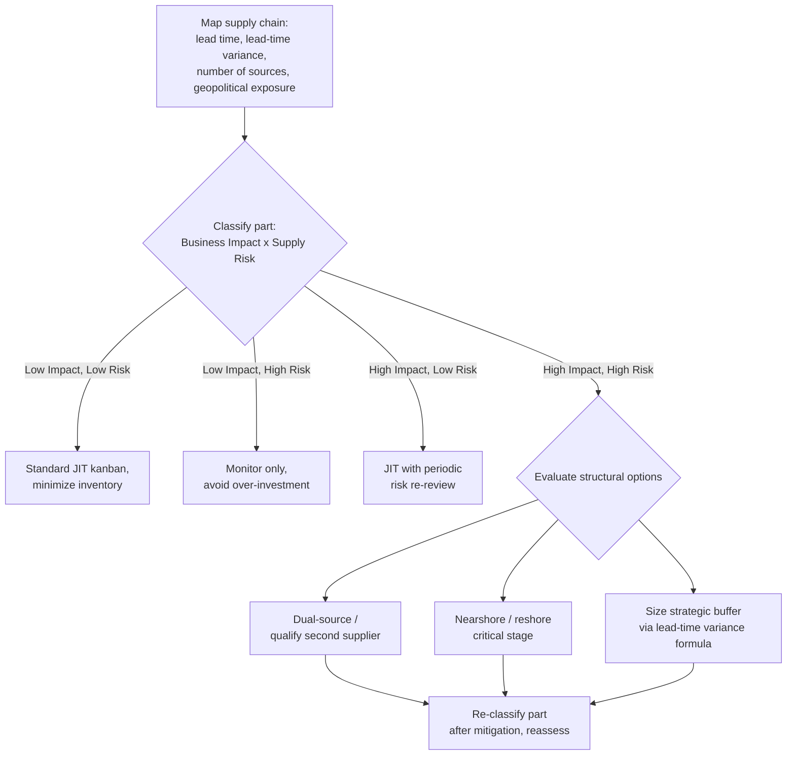

## Supply Chain Risk, Reshoring, and Adapting Lean Strategy

### Overview

This topic addresses how lean manufacturing strategy has evolved in response to heightened global supply chain volatility since roughly 2018–2023, driven by trade tensions, the COVID-19 pandemic, geopolitical conflict, and climate-related disruption. It covers the structural drivers of supply chain risk, the reshoring/nearshoring/friend-shoring response, and how lean practitioners are adapting core tools (supplier development, kanban, value stream mapping) to a higher-volatility operating environment rather than abandoning lean principles.

### Drivers of Elevated Supply Chain Risk

**Key Points**

- **Geographic concentration risk**: Decades of globalization concentrated production of certain categories (semiconductors, active pharmaceutical ingredients, rare earth elements, battery materials) in narrow geographic regions, creating systemic single-point-of-failure exposure at the *industry* level, not just the individual-firm level.
- **Geopolitical trade policy volatility**: Tariff regimes, export controls (e.g., on advanced semiconductors and semiconductor manufacturing equipment), and sanctions have introduced discontinuous, policy-driven cost and availability shocks that traditional lead-time/demand-variability models were not designed to anticipate.
- **Logistics chokepoints**: Events such as the 2021 Suez Canal blockage (Ever Given) and periodic Panama Canal drought-driven transit restrictions demonstrated that global just-in-time flows depend on a small number of physical chokepoints with no redundant capacity.
- **Climate and extreme weather**: Increasing frequency of climate-related disruption to production regions (flooding, drought affecting shipping canals, extreme heat affecting energy grids) adds a growing category of supply risk that is probabilistic but increasing in frequency. [Inference: the precise rate of increase and its attribution to specific climate trends versus historical baseline variability is a subject of ongoing scientific and economic analysis, not a settled point.]
- **Pandemic-scale demand/supply shocks**: COVID-19 demonstrated that demand and supply can both shift simultaneously and unpredictably across an entire economy (e.g., simultaneous collapse in some sectors and surge in others), a scenario outside the assumptions of typical statistical safety-stock models built on historically observed demand variability.

### Reshoring, Nearshoring, and Friend-Shoring: Definitions

| Term | Definition |
| --- | --- |
| **Reshoring** | Relocating production back to the company's home country/region after previously offshoring it |
| **Nearshoring** | Relocating production to a geographically closer country, even if not the home country (e.g., US firms moving production to Mexico) |
| **Friend-shoring** (or ally-shoring) | Relocating or diversifying production toward countries considered politically aligned or low-geopolitical-risk, independent of geographic proximity |
| **Multi-shoring / dual-sourcing** | Deliberately maintaining production or supply capability in more than one region for the same part or product, explicitly to reduce single-point-of-failure risk |

### Why This Intersects With Lean Strategy

**Key Points**

A common misconception is that reshoring/nearshoring is in tension with lean, because lean is associated with globally optimized, cost-minimized sourcing. In practice, the relationship is more nuanced:

- Classical JIT's logic (frequent, small-lot delivery from geographically close, tightly integrated suppliers) is *more* naturally compatible with nearshoring/reshoring than with long, multi-week ocean-freight global supply chains. Toyota's original supplier model (keiretsu-style, geographically clustered suppliers around assembly plants in Japan) was itself a *local*, high-visibility supply chain — the long, globally distributed supply chains that proved fragile in 2020–2022 arguably represent a departure from, not an expression of, classical JIT logic.
- Reshoring/nearshoring reduces lead time and lead-time variability, which directly supports smaller batch sizes, more frequent replenishment, and tighter kanban loops — core lean levers — rather than requiring larger safety stock to buffer long transit times.
- The trade-off is typically **higher unit labor/production cost** in exchange for **lower lead time, lower lead-time variability, and higher supply chain visibility** — a trade lean practitioners increasingly frame using **Total Cost of Ownership (TCO)** analysis rather than piece-price alone, incorporating carrying cost of in-transit and safety stock, expedited freight risk, and disruption-probability-weighted cost of stockouts.

### Adapting Core Lean Tools to Higher-Volatility Environments

**Value Stream Mapping with Risk Overlay**

Standard VSM is extended with a supply-risk data box per supplier/process step, capturing:

- Lead time and lead-time variability (not just average lead time)
- Number of qualified sources
- Geographic/geopolitical risk rating
- Single-tier vs. multi-tier visibility (is the sub-supplier known and monitored?)

**Supplier Segmentation (Kraljic-style Positioning)**

Suppliers and parts are segmented on two axes — **supply risk** (availability, lead time, number of sources, geopolitical exposure) and **business impact** (revenue/production impact of a stockout) — yielding four strategic postures:

$$\text{Strategic posture} = f(\text{Supply Risk}, \text{Business Impact})$$

|  | Low Business Impact | High Business Impact |
| --- | --- | --- |
| **Low Supply Risk** | Standard JIT kanban, minimize inventory | JIT with periodic risk review |
| **High Supply Risk** | Monitor, but do not over-invest in buffering | Strategic buffer stock, dual-sourcing, deep supplier partnership, possible reshoring/nearshoring priority |

**Kanban and Reorder Point Adjustment**

Where lead time and lead-time variability increase (e.g., due to a supplier remaining offshore with elevated logistics risk), the standard reorder-point formula is adjusted to reflect the wider distribution of possible lead times, rather than simply increasing a flat safety-stock buffer arbitrarily:

$$\text{Reorder Point} = (\text{Average Daily Demand} \times \text{Average Lead Time}) + \text{Safety Stock}$$

$$\text{Safety Stock} = Z \times \sigma_{LT} \times \bar{D}$$

where $Z$ is the service-level factor, $\sigma_{LT}$ is the standard deviation of lead time, and $\bar{D}$ is average daily demand — meaning that as lead-time *variability* (not just average lead time) rises, required safety stock rises correspondingly, which is precisely the mechanism by which volatile, distant supply chains force larger buffers even under an otherwise-lean kanban system.

### Illustrative Example

**Example**

A consumer electronics assembler sources a display module from a single supplier in a region subject to periodic logistics disruption, with a nominal 45-day lead time but historically observed lead times ranging from 30 to 120 days during disruption events.

1. **Risk assessment**: Applying the Kraljic-style matrix, the display module is classified high business impact (no substitute part fits the product design) and high supply risk (single source, high lead-time variance, single logistics corridor).
2. **Strategic response options evaluated**:
   - *Dual-sourcing*: qualify a second supplier in a different region — increases cost per unit but reduces single-point failure risk.
   - *Nearshoring a critical sub-assembly*: relocate final module assembly closer to the finished-goods plant, retaining upstream component sourcing globally but reducing the most volatile leg of the journey.
   - *Strategic buffer*: hold a calculated safety stock sized to the observed lead-time variance (using the formula above) rather than an arbitrary "extra month" heuristic.
3. **Decision**: The firm pursues dual-sourcing (long-term structural fix) while holding a calculated interim buffer (short-term mitigation) sized specifically to historical lead-time variance for this one part — leaving the remaining ~90% of the bill of materials, which is low-risk and multi-sourced, on standard JIT kanban replenishment unchanged.

This demonstrates the segmented approach: reshoring/dual-sourcing/buffering is applied surgically to the specific high-risk, high-impact nodes identified through structured analysis, not applied uniformly across the supply chain as a wholesale rejection of lean flow principles.

### Process Flow: Risk-Adapted Sourcing Decision

### Common Criticisms and Counterarguments

**Key Points**

- **Criticism**: "Reshoring is simply too expensive to be compatible with lean cost discipline."

  **Counter**: Total Cost of Ownership analysis, which incorporates disruption-probability-weighted stockout cost, expedited freight premiums, and carrying cost of in-transit inventory, frequently narrows or reverses the apparent cost advantage of distant low-labor-cost sourcing for high-risk, high-impact parts specifically — though this does not generalize to all parts, and low-risk commodity components typically remain most cost-effective under existing global sourcing. [Inference: the specific breakeven point between offshore unit-cost savings and TCO-inclusive reshoring cost is highly part- and industry-specific and cannot be stated as a universal rule.]
- **Criticism**: "Lean's emphasis on cost minimization inherently pushed firms toward risky, low-visibility global sourcing, so lean itself is partly responsible for pandemic-era fragility."

  **Counter**: This conflates *generic cost-minimization sourcing practice* (which is not unique to lean and predates widespread lean adoption in many industries) with *TPS's actual supplier philosophy*, which emphasized close, high-visibility, long-term supplier partnerships (keiretsu-style relationships) rather than arms-length low-cost-country sourcing chosen primarily on unit price.
- **Criticism**: "Multi-tier supply chain visibility is prohibitively difficult to achieve in practice."

  **Counter**: While genuinely difficult, Toyota's post-2011 RESCUE system demonstrated a working model — requiring suppliers to disclose sub-tier sourcing data — showing that the barrier is largely organizational commitment and supplier relationship depth rather than a fundamental technical impossibility, though [Unverified: comprehensive multi-tier visibility remains incomplete or aspirational at many firms even where formally adopted as policy].

### Practical Implementation Steps

**Next Steps**

1. Build or update a supply-risk-overlaid Value Stream Map identifying lead time, lead-time variance, and source count for each major component or supplier.
2. Apply a Kraljic-style segmentation to classify each part by business impact and supply risk, rather than treating all parts uniformly.
3. For parts classified high-risk/high-impact, evaluate dual-sourcing, nearshoring/reshoring, and calculated strategic buffering as distinct, non-mutually-exclusive mitigation options.
4. Recalculate safety stock and reorder points using lead-time variance (not just average lead time) for any part where recent disruption has widened the observed lead-time distribution.
5. Pursue deeper multi-tier supplier visibility for critical parts, prioritizing transparency into Tier 2/3 sub-suppliers where feasible, rather than assuming Tier 1 supplier assurances are sufficient.
6. Periodically re-run the risk classification, since geopolitical and logistics risk profiles shift over time and a part previously classified low-risk may migrate to high-risk (or vice versa).

**Related Topics**

- Kraljic Portfolio Purchasing Model and supplier segmentation
- Just-in-Time versus Just-in-Case resilience debate
- Toyota's RESCUE system and multi-tier supply chain visibility
- Total Cost of Ownership (TCO) analysis in sourcing decisions
- Safety stock and reorder point calculation under lead-time variability
- Keiretsu supplier relationship model
- Bullwhip effect and demand-signal distortion
- Geopolitical risk assessment frameworks in supply chain management