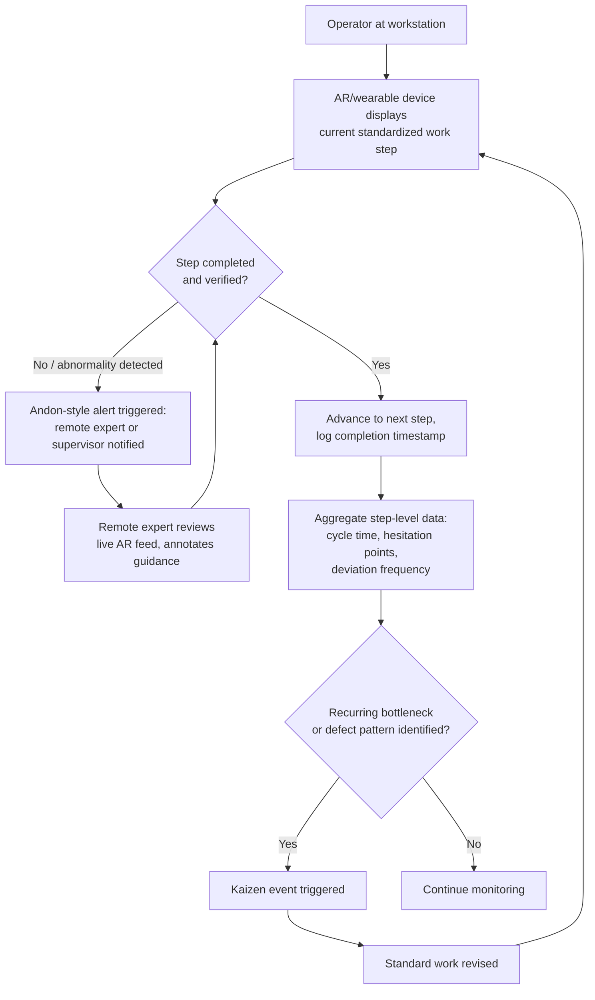

## Connected Workers and Augmented Reality on the Shop Floor

### Overview

Connected Worker platforms — often termed **Augmented Connected Worker (ACW)** platforms in current industry taxonomy — combine wearable and mobile hardware, augmented reality (AR) overlays, and cloud-based software to give frontline operators real-time digital work instructions, remote expert assistance, and closed-loop data capture directly at the point of work. Within a lean manufacturing context, these technologies are best understood as a digital extension of standardized work and visual management: they aim to make the "one best way" instantly accessible, verifiable, and improvable at the point of use (gemba), rather than as a standalone technology initiative disconnected from lean fundamentals.

### Market and Adoption Context

Connected worker technology provides real-time information to workers on the line, which reduces downtime, and step-by-step instructions for complex tasks via augmented reality is described as a cost-effective and efficient way to provide instruction. Over 40% of manufacturers are reported to be using or planning to use connected worker platforms as of 2026, according to industry surveys. A survey cited by trade press found more than two-thirds of manufacturers report some level of extended reality (XR) activity as of late 2024. [industrial software deep dive +2](https://hl.com/media/je2dhjoy/industrial-software-deep-dive.pdf)

Industry analysts have begun segmenting the market by architecture: AR-centric augmented connected worker platforms are those where AR technology forms the foundation of the platform, enabling hands-free digital work instructions, shop floor navigation, enhanced remote collaboration, and superimposition of product and asset data over the physical world. A parallel segment covers shop floor-centric ACW platforms that mainly address maintenance, safety, quality assurance, worker guidance, analytics, and performance optimization, using hardware and enterprise system integrations to help companies achieve operational excellence. [frost](https://store.frost.com/frost-radar-ar-centric-augmented-connected-worker-platforms-2026.html)[frost](https://store.frost.com/frost-radar-shop-floor-centric-augmented-connected-worker-platforms-2026.html)

[Unverified: specific market-size figures and year-over-year growth percentages circulating in vendor and analyst reports vary by source and methodology, and should be treated as directional industry estimates rather than precise figures.]

### Core Technology Components

**Key Points**

- **AR display hardware**: head-mounted displays (e.g., smart glasses, visor-style devices) or handheld/tablet-based AR that overlay digital instructions, part callouts, or quality-check annotations onto the operator's real-time view of the workpiece.
- **Digital work instructions**: step-by-step, often hands-free, procedure guidance replacing paper travelers or static PDF work instructions, typically with branching logic for variant products.
- **Remote expert assistance**: live video/AR annotation allowing a remote specialist to see what the frontline worker sees and draw directional cues or annotations directly into the worker's field of view, reducing the need for physical travel to the plant.
- **Computer vision / camera-based monitoring**: an emerging architectural alternative or complement to wearable AR — using existing security camera infrastructure to deliver continuous visibility into safety hazards and operational inefficiencies without requiring workers to wear new devices, positioned by some vendors as a faster-ROI path than device-dependent deployments. [voxelai](https://www.voxelai.com/industry-insights/connected-worker-platforms-manufacturing)
- **AI-driven capabilities**: emerging use cases include automated document digitization, task execution assistance through digital copilots, predictive upskilling, shift planning, root cause analysis, and metric monitoring and reporting, though not every AR-centric platform has widespread AI-driven features, since many vendors are still at a stage of needing to justify operational value, especially to mid-market manufacturers that have not undertaken broader digital transformation. [teamviewer](https://media.teamviewer.com/is/content/teamviewergmbh/teamviewer/central-image-hub/pdf/en/teamviewer-2026-frost-radar-ar-connected-worker-report-en.pdf)[teamviewer](https://media.teamviewer.com/is/content/teamviewergmbh/teamviewer/central-image-hub/pdf/en/teamviewer-2026-frost-radar-ar-connected-worker-report-en.pdf)
- **Skills/competency management**: digital tracking of operator certifications, cross-training status, and skills matrices, directly supporting the lean concept of shojinka (flexible, multi-skilled labor).

### Alignment With Lean Principles

**Key Points**

Connected worker/AR technology maps onto established lean concepts rather than replacing them:

| Lean Concept | Connected Worker / AR Application |
| --- | --- |
| Standardized work | Digital work instructions ensure the current approved standard is always displayed, version-controlled, and cannot be worked from an outdated paper copy |
| Jidoka (built-in quality) | AR-guided quality checks and computer-vision defect detection surface abnormalities at the point of occurrence rather than downstream |
| Visual management | Real-time dashboards and AR overlays extend andon-style visual signaling beyond fixed andon boards to wherever the worker is standing |
| Genchi genbutsu (go and see) | Remote expert assistance allows a specialist to effectively "go and see" a distant problem via live AR annotation without physical travel |
| Kaizen / continuous improvement | Digitized work instructions can be updated centrally and pushed instantly, shortening the PDCA cycle time for standard work revisions |
| Shojinka (flexible workforce) | Skills-matrix and training modules embedded in ACW platforms make operator cross-training status visible and actionable in real time |
| Poka-yoke (error-proofing) | AR step confirmation (e.g., requiring visual verification before advancing to the next assembly step) functions as a software-layer error-proofing mechanism |

Reported outcomes from real deployments illustrate this alignment: a mixed reality/AR system helped a client reduce human error significantly and increase quality, safety, and security of their products in an aerospace assembly context, Northrop Grumman uses augmented reality to help assemblers navigate complex work instructions for satellite assembly, and an AR-based system has been used to help workers with disabilities by guiding them step-by-step through assembly and kitting processes, preventing errors. [connected worker +2](https://www.infosys.com/industries/mining/documents/connected-worker.pdf)

### Illustrative Example

**Example**

A precision assembly line for a multi-variant electro-mechanical product implements an AR-centric connected worker platform to replace paper-based work instructions:

1. **Baseline problem**: New operators require an extended ramp-up period to reach full cycle-time performance; defect rates on complex variant configurations are elevated during the first weeks after a new hire or a product changeover.
2. **Solution**: A head-mounted or tablet AR display overlays step-by-step assembly guidance directly onto the workstation, automatically detecting which product variant is present (via barcode/RFID) and displaying the correct variant-specific instruction sequence, with each step requiring visual confirmation before advancing.
3. **Standardized work integration**: The AR instruction set *is* the standardized work document — it is version-controlled centrally, so a kaizen-driven change to the standard work sequence is pushed to every station simultaneously, eliminating the lag and inconsistency risk of manually reprinting and redistributing paper standard work sheets across shifts.
4. **Data capture as a byproduct**: Each confirmed step, and any deviation or hesitation captured by the system, becomes structured data feeding the plant's continuous improvement process — surfacing which specific steps most frequently cause new-hire slowdowns, directly informing future kaizen targets.

This demonstrates the core lean-aligned use case: AR is not deployed as a novelty but as a higher-fidelity, faster-updating replacement for the standardized work and visual management infrastructure lean already prescribes.

### Process Flow: Connected Worker Feedback Loop

### Deployment Considerations

**Key Points**

- **Architecture choice — wearable AR vs. fixed/camera-based**: Wearable head-mounted AR offers hands-free, mobile guidance well suited to complex assembly or field maintenance, but requires device provisioning, battery management, and operator acceptance. Camera/computer-vision-based approaches, as noted in current industry commentary, can leverage existing security camera infrastructure for continuous coverage without requiring workers to change behavior or carry new devices, trading off the ability to overlay guidance directly into the worker's field of view. [voxelai](https://www.voxelai.com/industry-insights/connected-worker-platforms-manufacturing)
- **Integration with enterprise systems**: Leading ACW vendors position their platforms as comprehensive suites spanning operations, maintenance, warehouse, and EHS (environment, health, safety) functions, meaning implementation typically requires integration with existing MES (Manufacturing Execution System), CMMS (maintenance management), and ERP systems rather than operating as an isolated point solution. [frost](https://www.frost.com/wp-content/uploads/2026/04/Innovapptive-Write-Up.pdf)
- **Time-to-value as a differentiator**: As ACW platforms become harder to differentiate from one another on features alone, time to value becomes a key differentiator, with robust implementation frameworks and detailed deployment processes considered essential — a caution directly relevant to lean practitioners, since a technology rollout that outpaces the organization's ability to embed it into daily standard work and kaizen routines risks becoming shelf-ware. [teamviewer](https://media.teamviewer.com/is/content/teamviewergmbh/teamviewer/central-image-hub/pdf/en/teamviewer-2026-frost-radar-ar-connected-worker-report-en.pdf)
- **Remote and hybrid work enablement**: connected worker technology is noted as supporting increasing prevalence of remote collaboration and training, with a substantial share of factory work projected to involve remote elements, extending genchi genbutsu-style problem-solving to distributed teams and multi-site operations. [hl](https://hl.com/media/je2dhjoy/industrial-software-deep-dive.pdf)
- **Training and VR**: Virtual reality is used alongside AR for training and ramp-up of new employees, complementing AR's real-time, on-the-job guidance role with pre-deployment simulated practice. VR wearables can provide simulated training and give workers access to manuals and technical documentation virtually. [3ds](https://experiential-stories.3ds.com/HT/MWC2025/page_837.html)[infosys](https://www.infosys.com/industries/mining/documents/connected-worker.pdf)

### Common Criticisms and Limitations

**Key Points**

- **Risk of "digital paper"**: If digital work instructions are simply a screen-based replica of a static paper document without structured data capture, branching logic, or integration into the kaizen feedback loop, the technology delivers little advantage over paper standard work while adding hardware cost and complexity — the value proposition depends on closing the loop back into continuous improvement, not merely digitizing display.
- **Change management and operator trust**: Wearable AR devices can be perceived as surveillance-oriented if deployed without transparent communication about data use, which can undermine the psychological safety needed for operators to flag abnormalities honestly — a direct tension with the jidoka principle that workers must feel safe stopping the line or reporting problems.
- **Vendor and platform fragmentation**: Most ACW vendors concentrate on a narrow set of core verticals, such as consumer packaged goods and food and beverage, meaning platform maturity and fit vary considerably by industry, and a solution proven in one sector may require substantial adaptation for another. [Inference: the degree of cross-industry transferability of specific ACW platforms is vendor- and use-case-dependent and should be validated through pilot deployment rather than assumed from vendor marketing.] [teamviewer](https://media.teamviewer.com/is/content/teamviewergmbh/teamviewer/central-image-hub/pdf/en/teamviewer-2026-frost-radar-ar-connected-worker-report-en.pdf)
- **Hardware ergonomics and fatigue**: Extended wear of head-mounted AR devices in physically demanding assembly or maintenance tasks can introduce ergonomic and fatigue considerations that must be evaluated against the productivity and quality gains claimed.

### Practical Implementation Steps

**Next Steps**

1. Identify a pilot process where standardized work exists but is difficult to keep current (frequent variant changes, high new-hire turnover, or complex multi-step assembly) as the initial connected worker use case.
2. Evaluate wearable AR versus fixed camera-based architecture based on the specific task (hands-free guidance needs versus passive safety/efficiency monitoring).
3. Ensure the platform is integrated into the existing kaizen and standard-work-revision process from day one, so instruction updates flow through the same PDCA discipline as any other standard work change.
4. Establish transparent communication with frontline operators about what data is captured and how it will be used, framing the system as a tool to support problem-solving (consistent with jidoka) rather than as a surveillance mechanism.
5. Track outcome metrics directly tied to lean objectives — new-hire ramp-up time, defect rate by process step, changeover time, and remote-assist resolution time — rather than adoption metrics alone (device usage hours), to validate that the technology is producing operational, not just technological, improvement.

**Related Topics**

- Standardized work and visual management in digital form
- Jidoka and poka-yoke error-proofing extended to software/AR layers
- Shojinka and digital skills-matrix management
- Andon systems and real-time escalation workflows
- Manufacturing Execution Systems (MES) integration with shop-floor digital tools
- Industry 4.0 / smart factory convergence with lean digital transformation
- Remote expert assistance and genchi genbutsu at distance
- Change management for frontline technology adoption