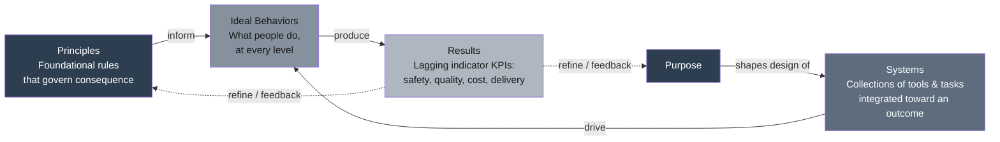

## The Three Insights of Organizational Excellence

<syllabot_broad_topic/>

### Overview

The Three Insights of Organizational Excellence are the conceptual foundation of the Shingo Model, developed by the Shingo Institute at Utah State University's Jon M. Huntsman School of Business, based on the teachings of Shigeo Shingo. While analyzing what excellent organizations had in common, the Shingo Institute identified three insights that explain why some organizations achieve sustainable operational excellence while others, despite deploying similar tools and methodologies, fail to sustain improvement. The insights form a logical causal chain: principles inform systems, systems drive behaviors, and behaviors produce results. This chain is the central diagnostic lens of the Shingo Model and helps leaders understand why improvement initiatives often fail despite using the right tools — because the initiative addressed the tool layer without addressing the systems and principles that drive sustainable behavior change underneath it.

### The Logical Chain

**Key Points**

The three insights are typically presented as a sequence, though the causal chain runs in the reverse direction of the usual numbering — principles are the deepest layer, and results are the most visible, outermost layer:

$$\text{Principles} \rightarrow \text{Systems} \rightarrow \text{Behaviors} \rightarrow \text{Results}$$

1. **Ideal Results Require Ideal Behaviors**
2. **Purpose and Systems Drive Behavior**
3. **Principles Inform Ideal Behaviors**

Read in the order most organizations actually experience them (starting from the visible outcome and working backward to the root cause), the insights answer: *what produces results?* → behavior. *What produces behavior?* → systems, shaped by purpose. *What should shape systems in the first place?* → principles.

### Insight One: Ideal Results Require Ideal Behaviors

**Key Points**

The results of an organization depend on the way its people behave. To achieve ideal results, leaders must do the hard work of creating a culture where ideal behaviors are expected and evident in every team member — not merely stated as an aspiration in a mission statement or a poster.

- This insight positions **results (KPIs)** as *lagging indicators* of behavior and culture, not as an independent lever leaders can pull directly. Attempting to improve results without addressing the behaviors that produce them (for example, through pressure, targets, or incentive schemes alone, absent supporting systems) tends to produce short-term, unsustainable gains or unintended behavioral distortions (e.g., gaming a metric rather than genuinely improving the underlying process).
- The insight implies that sustainable excellence requires the *entire organization*, not just leadership or a dedicated improvement team, to exhibit ideal behaviors consistently. A pocket of excellent behavior isolated to a single department or shift will not, by itself, produce enterprise-wide ideal results.
- "Ideal behaviors" are not defined arbitrarily; they are informed by the guiding principles (see Insight Three), meaning this first insight cannot be fully acted upon in isolation from the third.

### Insight Two: Purpose and Systems Drive Behavior

**Key Points**

Most systems are designed to create a specific business result without regard for the behavior that the system drives. Managers therefore face the substantial task of realigning management, improvement, and work systems to drive the ideal behavior required by all people to achieve ideal results.

- This insight identifies the mechanism connecting principles to behavior: people do not behave a certain way primarily because they are told to or because they hold a stated value — they behave a certain way because the systems surrounding them (measurement systems, reward systems, escalation systems, hiring systems, information systems) make that behavior the rational, reinforced, or path-of-least-resistance choice.
- A **system** in this context is understood as a collection of tools and tasks highly integrated to accomplish a specific outcome — meaning any system, whether explicitly designed or having emerged informally, is always driving *some* behavior, whether or not that behavior is the one leadership intends.
- Diagnostically, this insight means that when actual behavior does not match stated ideal behavior, the correct first response is to examine the system the person operates within — not to assume individual unwillingness or incompetence — consistent with the broader lean/Shingo principle of "Focus on Process" over blaming people.
- **Purpose** is included alongside systems in this insight because systems are themselves designed (deliberately or by default) to serve some purpose; if organizational purpose is unclear, poorly communicated, or inconsistent, the systems built to serve that purpose will tend to be misaligned or internally contradictory, producing inconsistent behavior even among well-intentioned people.

### Insight Three: Principles Inform Ideal Behaviors

**Key Points**

Principles are foundational rules that govern consequences. The more deeply one understands principles, the more clearly one understands ideal behavior; the more clearly one understands ideal behavior, the better one can design systems to drive that behavior to achieve ideal results.

- This insight is the deepest layer of the chain: it asserts that "ideal behavior" is not a matter of local convention, personal preference, or industry norm, but is *governed* by universal principles (such as Respect Every Individual, Assure Quality at the Source, or Think Systemically) that hold regardless of context, in the same way a natural law holds regardless of whether one believes in it.
- Because principles are treated as universal and timeless rather than tool-specific or industry-specific, this insight is what allows the Shingo Model to claim applicability across manufacturing, healthcare, government, finance, education, and other sectors — the specific tools and systems appropriate to each context will differ, but the underlying principles that should inform ideal behavior do not.
- This insight also explains the model's caution against tool-first implementation: a tool implemented without a clear understanding of the underlying principle it is meant to serve risks producing surface-level compliance (people performing the mechanics of the tool) without producing the ideal behavior the tool was actually designed to support.

### Diagram: The Causal Chain of the Three Insights

### Why the Chain Matters: Diagnosing Failed Improvement Initiatives

**Key Points**

The three insights collectively explain a common organizational failure pattern: an improvement initiative (e.g., a Lean or Six Sigma rollout) is implemented at the *tool* level, produces a temporary improvement in results, and then regresses once leadership attention or program funding moves elsewhere.

The Shingo diagnostic interpretation of this pattern:

- The tools were deployed correctly, but the **systems** surrounding daily work were never changed — meaning the same reward structures, escalation paths, and management routines that drove the *old* behavior remained in place, continuing to pull behavior back toward the pre-improvement state once the initiative's novelty or dedicated attention faded.
- Because the systems were not redesigned around the relevant **principles**, employees experienced the initiative as an add-on program rather than as a change to "how we actually do things here" — the initiative never became embedded in the operating system of the organization (culture), so it had no durable anchor once explicit reinforcement stopped.
- This is why the Shingo Model treats **culture** — the accumulated pattern of principle-informed, system-driven ideal behavior — as the foundation of sustainable results, rather than treating tools or even short-term result improvements as sufficient evidence of successful transformation.

### Illustrative Example

**Example**

A hospital launches an initiative to reduce patient-fall incidents (a Results-layer metric) by installing new bed-alarm technology (a Tool) and issuing a policy requiring hourly rounding (a System change on paper).

1. **Initial outcome**: Fall rates drop for several weeks after launch, coinciding with heightened attention from leadership and frequent audits.
2. **Regression**: Over the following months, fall rates gradually return toward the pre-initiative baseline, even though the bed alarms remain installed and the hourly-rounding policy is still officially in effect.
3. **Applying Insight One (Ideal Results Require Ideal Behaviors)**: The declining result indicates that ideal behavior (consistent, genuine hourly rounding, prompt alarm response) is not actually occurring consistently, regardless of what the policy states.
4. **Applying Insight Two (Purpose and Systems Drive Behavior)**: Investigation finds that nurse staffing ratios and the shift-handoff system were never adjusted to accommodate the added rounding workload — the system nurses actually operate within (chronic time pressure, competing documentation demands) continues to drive behavior toward skipping or rushing rounds, regardless of the stated policy.
5. **Applying Insight Three (Principles Inform Ideal Behaviors)**: Leadership reconnects the initiative explicitly to the principle of "Respect Every Individual" (both patients and the nursing staff being asked to absorb added workload without corresponding system support) and "Focus on Process" (examining the staffing and handoff process itself, rather than treating the falling compliance as an individual nurse performance issue).
6. **System redesign**: Staffing ratios and handoff protocols are restructured to make consistent rounding genuinely achievable within the existing workload, rather than relying on individual diligence to overcome a system working against the desired behavior.

This demonstrates the diagnostic value of the three insights: the tool (bed alarms) and the stated system (rounding policy) were both present, but the result regressed because the *actual* operating system driving nurse behavior was never realigned with the principle the initiative was meant to serve.

### Relationship to Other Elements of the Shingo Model

**Key Points**

- The three insights are the conceptual justification for the Shingo Model's broader "diamond" structure (Culture, Guiding Principles, Systems, Tools, Results) — the diamond is essentially a spatial/graphical representation of the same causal chain the three insights describe in words.
- The insights are the reason the Shingo Model's assessment methodology (used in the Shingo Challenge and Shingo Insight survey) emphasizes *observing behavior* and *evaluating whether systems align with ideal behaviors*, rather than auditing tool presence or results alone — examiners rate the frequency, duration, intensity, and scope of principle-based behavior specifically because behavior, not tool deployment, is the layer the insights identify as causally closest to results.
- The insights underpin the model's stated difference from frameworks like Baldrige or EFQM, which the Shingo Institute characterizes as primarily evaluating organizational performance criteria; the three insights are what allow the Shingo Model to additionally explain the "why" behind performance, rather than only measuring the performance itself.

### Common Misunderstandings

**Key Points**

- **Misconception**: "The three insights mean leaders should focus on changing employee behavior directly (e.g., through training or exhortation)." **Correction**: The insights explicitly locate the lever of behavior change in *systems*, not in direct behavioral appeals; training or communication alone, without corresponding system change, is treated as insufficient to produce sustained ideal behavior.
- **Misconception**: "Results and KPIs are not important under this model." **Correction**: The model states plainly that an organization must have performance results to succeed; the insights reframe results as a *lagging indicator* of behavior and culture rather than as unimportant, changing where leadership attention should be primarily directed, not eliminating the importance of measuring outcomes.
- **Misconception**: "Principles are the same as company values statements." **Correction**: The model distinguishes principles (universal, timeless rules that govern consequence, true independent of whether an organization formally adopts them) from values statements (organization-specific, potentially aspirational, and not necessarily grounded in a claim of universal validity).

### Practical Application Steps

**Next Steps**

1. When a result (KPI) is underperforming, resist the instinct to address it directly through a target, incentive, or exhortation; instead trace backward through the chain — examine the actual behavior occurring, then the system driving that behavior, then the principle the system should be reinforcing.
2. Before adopting a new tool, articulate explicitly which guiding principle the tool is intended to serve, and verify that the surrounding system (not just the tool itself) is designed to reinforce that principle.
3. Periodically audit whether existing management systems (reward structures, escalation paths, staffing models, reporting cadences) are actually driving the behavior leadership intends, rather than assuming stated policy and actual system-driven behavior are the same thing.
4. Use the three insights as a standard root-cause question set during post-mortem analysis of any improvement initiative that failed to sustain: Was the result driven by genuine behavior change? Was that behavior genuinely supported by system design? Was the system genuinely aligned with a clearly understood principle?

**Related Topics**

- The Shingo Model's guiding principles, systems, tools, and results (the "diamond")
- Systems thinking and the "Think Systemically" guiding principle
- Root cause analysis and "Focus on Process" versus blaming individuals
- Lagging versus leading indicators in performance measurement
- Culture change and sustainability of continuous improvement initiatives
- Improvement kata and scientific thinking as behavioral expressions of principle
- Hoshin kanri and the alignment of purpose across organizational levels