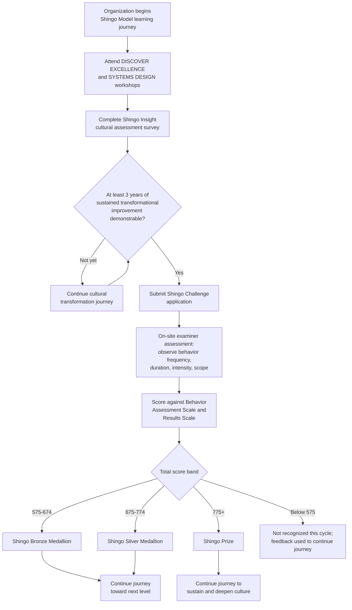

## Shingo Prize Assessment and Recognition Levels

### Overview

The Shingo Prize is an international recognition awarded by the Shingo Institute at Utah State University's Jon M. Huntsman School of Business to organizations that demonstrate sustained, principle-based cultural transformation driving world-class business results. Described by BusinessWeek in 2000 as the "Nobel Prize of manufacturing," and by the Shingo Institute as the highest international standard an organization can strive for in organizational excellence, the award process (now generally referred to as the **Shingo Challenge**) is built directly on the assessment of an organization's culture, systems, and results against the Shingo Model rather than on documentation review or self-reported metrics alone. Since the inauguration of the Shingo Prize in 1988, more than 350 organizations have received a Shingo award.

### Historical Development

**Key Points**

- In 1988, Utah State University conferred an honorary doctorate on Shigeo Shingo, a Japanese industrial engineer credited with contributing to many of the principles, elements, theories, and tools associated with the Toyota Production System. That same year, the university established what was then called the North American Shingo Prizes for Excellence in Manufacturing in his honor.
- The award was originally limited to organizations within the United States. Ford Electronics in Markham, Ontario, became the first Canadian recipient by 1994, and Industrias CYDSA Bayer became the first Mexican recipient by 1997.
- In 2004, a "Finalist" category was added to recognize challengers that scored well but did not reach the Shingo Prize threshold.
- In 2005, a separate awards system with three levels (Gold, Silver, Bronze) was established specifically for public-sector organizations; state-level Shingo awards (such as North Carolina's state-level Silver Award) existed for a period before being phased out.
- In 2008, a change in scoring criteria substantially raised the bar: the average number of organizations receiving the Shingo Prize itself each year decreased from 11 to 2, reflecting a deliberate tightening of the standard. That same year, state-level Shingo awards were eliminated, with all applicants evaluated at the national/international level going forward.

### The Three Levels of Recognition

**Key Points**

The current recognition structure consists of three levels, awarded based on the degree of cultural transformation an organization has achieved, from earliest-stage to most mature:

1. **Shingo Bronze Medallion** — awarded to organizations in the earlier stages of cultural transformation, with a primary focus on tools and systems for improvement.
2. **Shingo Silver Medallion** — awarded to organizations that are maturing on their learning journey, with the tools and systems in place to back up that progress.
3. **Shingo Prize** — the top-level award, a worldwide-recognized symbol of an organization's successful establishment of a culture that fosters the principles of enterprise excellence; it is awarded to organizations that can demonstrate robust key systems that are driving behavior ever closer to the ideal.

The distinction between award levels is deliberately designed to encourage organizations to engage with and leverage the Shingo Model as early as possible in their cultural transformation journey, and to continue that improvement journey both leading up to and following Shingo Prize recognition, rather than treating any single award level as a terminal destination.

### Scoring Structure

**Key Points**

Shingo Challenge submissions are evaluated using a numerical scoring system, with published point thresholds separating the three recognition levels:

| Award Level | Score Range |
| --- | --- |
| Shingo Bronze Medallion | 575 – 674 |
| Shingo Silver Medallion | 675 – 774 |
| Shingo Prize | 775 or higher |

All business systems examined during an assessment are scored according to a **Behavior Assessment Scale** consisting of five levels, each with its own percentage range:

| Behavior Assessment Level | Percentage Range |
| --- | --- |
| Level 1 | 0–20% |
| Level 2 | 21–40% (inferred from the scale's structure) |
| Level 3 | 41–60% (inferred from the scale's structure) |
| Level 4 | 61–80% |
| Level 5 | 81–100% |

[Inference: the exact percentage boundaries for Levels 2 and 3 were not independently confirmed in the sources reviewed and are inferred from the stated structure of the scale (five levels spanning 0–100%, with Level 1 and Level 4 boundaries confirmed); organizations preparing a Shingo Challenge submission should consult the official Shingo Guidelines document directly for the exact figures.]

Organizations receive a score sheet reporting levels achieved according to both the Behavior Assessment Scale and a separate **Results Scale**, rather than a single raw numerical score — for example, a Shingo Bronze Medallion recipient typically receives a score sheet showing an overall level ranging between high Level 3 and low Level 4. The Shingo Institute does not publish or provide raw numerical scores to challenge participants beyond this level-based reporting.

### Eligibility and Preparation Requirements

**Key Points**

- To qualify for a Shingo Challenge, an organization must be able to provide evidence of at least **three years of sustained transformational improvement** — a single strong year of results is explicitly insufficient, consistent with the model's emphasis on culture and behavior as the drivers of durable, not episodic, results.
- Preparation typically begins with the **DISCOVER EXCELLENCE** and **SYSTEMS DESIGN** workshops, the first two of the six-part Shingo Workshop Series, which build the shared vocabulary and systems-design understanding an organization needs before undertaking a formal assessment.
- Organizations are encouraged to complete **Shingo Insight**, an anonymous, web-based cultural assessment survey, to gauge their current culture, systems, and results before committing to a formal Challenge submission.
- The Shingo Challenge process is explicitly described as rigorous and demanding rather than a documentation exercise — a Shingo Prize challenge will validate many things an organization already knows about itself, and will also expose new gaps that can lead to new levels of performance, both in results and in the behaviors that bring about those results. Not all organizations that challenge become recipients of a Shingo award.

### Assessment Methodology

**Key Points**

- Examiners assess an organization by observing behavior directly (typically through on-site visits, interviews at multiple organizational levels, and direct observation of work areas) and rating the frequency, duration, intensity, and scope of principle-based behavior — a methodology consistent with the Shingo Model's insight that results are lagging indicators of behavior and culture.
- Examiners specifically evaluate how well managers focus on principles and culture, and how well systems are aligned with ideal behaviors — meaning the assessment is structured to test the full Shingo Model chain (principles inform systems, systems drive behavior, behavior produces results), not merely to audit the presence of tools or the strength of final KPIs.
- Companies receiving Shingo recognition must demonstrate lean implementation progressing through the stages of Principles, Systems, Tools and Techniques to the ultimate goal of achieving exceptional business results and customer satisfaction — the ordering of this progression (principles first, results last) mirrors the causal chain described in the Three Insights of Organizational Excellence.

### Process Flow: The Shingo Challenge Journey

### Related Award Categories

**Key Points**

Beyond the three core recognition levels for challenging organizations, the Shingo Institute administers several additional award categories:

- **Research Award** — recognizes contributions to lean and operational excellence research.
- **Publication Award** — recognizes published works (books, papers) that advance understanding of the Shingo Model and related principles.
- **Finalist** category (added 2004) — recognizes organizations that scored well in a Challenge but did not reach the Shingo Prize threshold, distinct from the Bronze/Silver Medallion structure.
- **Affiliates Choice for Systems Excellence Recognition** and **Shingo Advocate** — additional recognition pathways noted on current Shingo Institute program listings, reflecting the institute's broader portfolio of assessment, education, and recognition activities alongside the core Challenge.

### Illustrative Example

**Example**

A pharmaceutical manufacturing plant begins its Shingo journey after several years of standard lean tool deployment (5S, value stream mapping, Kanban) without formal Shingo engagement.

1. **Foundation building**: Plant leadership attends DISCOVER EXCELLENCE and SYSTEMS DESIGN workshops, then completes a Shingo Insight survey, which reveals that while tools are well-established (high Behavior Assessment Scale scores for tool-related systems), leadership behaviors around coaching versus directing ("Lead with Humility") score lower, and front-line problem-solving autonomy is inconsistent across shifts.
2. **Targeted system redesign**: Over the following three years, the plant redesigns its daily management system to build in structured leader-standard-work coaching routines, rather than adding new improvement tools, directly targeting the gap the Insight survey identified.
3. **Challenge submission**: After three years of sustained, evidenced improvement in both behavior and results, the plant submits a Shingo Challenge application.
4. **Examination**: Shingo examiners spend multiple days on-site, observing shift-change routines, interviewing operators and supervisors at random about how problems are escalated and resolved, and reviewing the alignment between stated systems and actual observed behavior.
5. **Outcome**: The plant receives a Shingo Silver Medallion, with the score sheet indicating strong tool and system maturity but continued opportunity in the consistency of principle-based leadership behavior across all shifts — providing a clear, behaviorally specific roadmap for the plant's continued journey toward a future Shingo Prize challenge, rather than a simple pass/fail outcome.

This reflects the general pattern seen among real recipients across industries and geographies — recent Shingo award recipients span sectors including diagnostics, medical devices, and mining, and levels awarded in the same recognition cycle range from Bronze Medallion through the Shingo Prize itself, reflecting organizations at different points along the same multi-year cultural transformation continuum.

### Common Misunderstandings

**Key Points**

- **Misconception**: "The Shingo Prize is awarded primarily based on financial or operational KPI performance." **Correction**: While an organization must have strong performance results to succeed at any level, the assessment methodology is explicitly built around observing behavior and evaluating system-principle alignment, treating results as a lagging indicator rather than the primary object of examiner scrutiny.
- **Misconception**: "Bronze, Silver, and Gold are the three Shingo recognition levels." **Correction**: The current three-tier structure for organizations challenging under the standard Shingo Model is Bronze Medallion, Silver Medallion, and the Shingo Prize; a separate Gold/Silver/Bronze structure existed specifically for the public-sector awards category established in 2005, which is a distinct historical program rather than the current general recognition ladder.
- **Misconception**: "A strong single year of results is sufficient to qualify for a Shingo Challenge." **Correction**: Eligibility requires evidence of at least three years of sustained transformational improvement, reflecting the model's emphasis on durable cultural change rather than a single strong performance period.

### Practical Preparation Steps

**Next Steps**

1. Attend the DISCOVER EXCELLENCE and SYSTEMS DESIGN workshops as the foundational first step, before undertaking any formal self-assessment.
2. Complete the Shingo Insight cultural assessment survey to establish an honest, anonymous baseline of current culture, systems, and results, rather than assuming internal perception matches actual organizational behavior.
3. Use gaps identified in the Insight survey to prioritize system redesign (not new tool deployment) over the following improvement cycle, directly targeting principle-behavior misalignment.
4. Track sustained improvement evidence across a minimum three-year window before submitting a formal Challenge application, since eligibility explicitly requires this duration of evidence.
5. Consult the official Shingo Guidelines document directly for the current, authoritative point-scoring ranges and Behavior Assessment Scale percentage boundaries prior to submission, since these figures are periodically revised by the Shingo Institute (as occurred with the 2008 scoring criteria change).

**Related Topics**

- The Shingo Model's guiding principles, systems, tools, and results
- The three insights of organizational excellence
- Shingo Insight cultural assessment survey methodology
- Behavior Assessment Scale and Results Scale scoring mechanics
- Lean maturity assessment frameworks compared (Shingo vs. Baldrige vs. EFQM)
- Sustaining continuous improvement culture post-recognition
- Case studies of Shingo Prize recipient organizations across industries