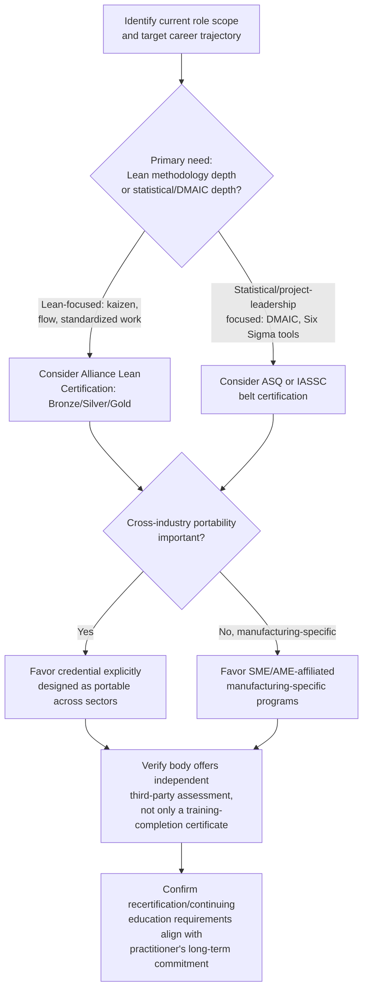

## Lean Certification Paths and Professional Bodies

### Overview

Lean certification refers to the formal credentialing landscape through which practitioners demonstrate proficiency in lean manufacturing and continuous improvement methodology. This landscape spans two distinct traditions that are frequently confused: the **Lean Certification** administered by a multi-organization alliance (the only credential its founding organizations describe as a true independent, third-party certification rather than a training-completion certificate), and the much broader, more fragmented **Lean Six Sigma belt system**, offered by numerous competing bodies with varying degrees of standardization, rigor, and industry recognition. Understanding the distinction between certification (independent, third-party assessed) and certificate programs (training-completion credentials issued under a provider's own proprietary criteria) is essential to evaluating any credential in this space.

### The SME-AME-Shingo-ASQ Lean Certification Alliance

**Key Points**

The most significant attempt at a standardized, industry-wide lean credential is the **Lean Certification**, developed through a partnership originally formed by the **Society of Manufacturing Engineers (SME)**, the **Association for Manufacturing Excellence (AME)**, and the administrators of **the Shingo Prize** (Shingo Institute), with the **American Society for Quality (ASQ)** joining as a fourth sponsoring body in 2010.

- The collaboration to develop this standard began with SME, AME, and the Shingo Prize administrators working with industrial and academic participants, with the certification originally scheduled to launch in the fourth quarter of 2005.
- ASQ subsequently joined the alliance, becoming the newest sponsor of the lean certification program alongside SME, AME, and the Shingo Prize; the first administration of the lean certification exam for ASQ was held at the World Conference on Quality and Improvement.
- ASQ's stated rationale for joining reflected member demand for a common certification standard already aligned to industry and accepted within the manufacturing community, plus the credential's design to be portable across industries — relevant to ASQ's growing interest in healthcare, service, and other non-manufacturing sectors.
- The organizations describe this alliance's credential as the only true lean certification available and the only independent, third-party assessment of knowledge and experience in the space — explicitly distinguishing it from other market offerings that use the term "certification" but are, in the alliance's characterization, really certificate programs conferred based on a provider's own proprietary criteria, curriculum, and/or training, lacking the independence and credibility associated with formal professional credentialing standards.
- The credential follows standards for professional credentialing programs, is independent of any single prescribed curriculum, is overseen by practitioners in the field, and incorporates a rigorous continuing-education and practice requirement through a recertification process occurring every three years.
- The Lean Certification Alliance is described in current industry-workforce-development material as a partnership among four leading non-profit organizations — ASQ, AME, Shingo Institute, and SME — that collectively set the standard for operational excellence and an improved workforce, drawing on their collective experience and the proven practices of thousands of individuals.

### The Three Alliance Certification Levels

**Key Points**

The Lean Certification has three levels, each targeting a progressively broader and more strategic scope of lean competency:

| Level | Focus |
| --- | --- |
| **Bronze Certification** | Emphasizes the tactical aspects of Lean |
| **Silver Certification** | Based on the integration of Lean across functions/processes |
| **Gold Certification** | Focuses on Lean's strategic facets |

This Bronze/Silver/Gold tiering for individual practitioner certification is structurally distinct from (though conceptually parallel to) the Shingo Institute's own separate Bronze Medallion / Silver Medallion / Shingo Prize recognition levels, which are awarded to *organizations*, not individuals, based on cultural transformation assessment. [Inference: because both use a Bronze/Silver/Gold-or-Prize naming convention but apply to different units of assessment (individual practitioner competency versus organizational cultural transformation), practitioners should take care not to conflate personal Lean Certification levels with an organization's Shingo Medallion/Prize status when discussing credentials.]

### Lean Six Sigma Belt Certifications: The Broader Landscape

**Key Points**

Distinct from the alliance-based Lean Certification, a much larger and more fragmented ecosystem of Lean Six Sigma "belt" certifications exists, offered by numerous independent bodies. Lean Six Sigma certifications are typically organized into belt levels, commonly cited as up to five tiers, reflecting depth of statistical and project-leadership competency rather than the tactical/integration/strategic framing of the alliance's Lean Certification.

Major certifying/training bodies commonly referenced in this space include:

- **American Society for Quality (ASQ)** — offers a comprehensive range of Six Sigma certification programs, including Certified Six Sigma Green Belt (CSSGB), covering fundamentals such as the DMAIC framework, process improvement, and data analysis; Certified Six Sigma Black Belt (CSSBB), for professionals leading Six Sigma projects with in-depth knowledge of advanced statistical tools and project management; and Certified Six Sigma Master Black Belt (CSSMBB), ASQ's highest Six Sigma certification level, intended for individuals who mentor and coach Black Belts and Green Belts, emphasizing advanced statistical analysis, strategic planning, and organizational change management. ASQ certifications are based on a defined Body of Knowledge (BoK) that is periodically updated to reflect current trends and best practices.
- **International Association for Six Sigma Certification (IASSC)** — a body known for rigorous, globally recognized certification exams validating proficiency in Lean Six Sigma methodologies.
- **Association for Manufacturing Excellence (AME)**, **Society of Manufacturing Engineers (SME)**, and **Shingo Institute** — each participates in the broader lean certification and education landscape both through the joint alliance credential described above and through their own independent workshops, conferences, and educational programs.

Because Lean Six Sigma certifications generally lack a single unifying accreditation body analogous to the alliance model, the rigor, exam format, prerequisite requirements, and market recognition of a given belt credential vary meaningfully by issuing organization, and practitioners evaluating a program should assess the specific issuing body's standing rather than assuming uniformity across all "belt" credentials.

### Comparative Overview

| Credential Type | Issuing Model | Levels | Assessment Basis |
| --- | --- | --- | --- |
| Alliance Lean Certification (SME-AME-Shingo-ASQ) | Single joint standard, four co-sponsoring non-profits | Bronze, Silver, Gold | Independent third-party assessment of knowledge and field experience; recertification every 3 years |
| ASQ Six Sigma Certifications | Single organization (ASQ) | Green Belt, Black Belt, Master Black Belt | Body of Knowledge-based exam |
| IASSC Certifications | Single organization (IASSC) | Belt-tiered (commonly Yellow through Black) | Exam-based |
| Shingo Prize / Medallions | Shingo Institute | Bronze Medallion, Silver Medallion, Shingo Prize | Organizational assessment (not an individual credential) |
| Generic vendor "Lean/Six Sigma certificate" programs | Individual training providers, proprietary criteria | Varies by provider | Training-completion based, not independently third-party assessed |

### Illustrative Example

**Example**

A quality engineer at a mid-sized manufacturer is evaluating which credential to pursue to support both immediate job performance and long-term career mobility:

1. **Immediate tactical need**: The engineer's current role centers on running kaizen events and value stream mapping exercises on the shop floor. A Bronze-level alliance Lean Certification, emphasizing tactical lean competency, or an ASQ Green Belt, emphasizing DMAIC and data analysis fundamentals, both align well with this scope.
2. **Portability consideration**: Because the alliance's Lean Certification was explicitly designed to be portable across industries (reflecting ASQ's interest in extending lean credentialing beyond manufacturing into healthcare and services), the engineer weighs whether their career path might move into a non-manufacturing sector, in which case the alliance credential's cross-industry design may offer more durable value than a manufacturing-specific program.
3. **Long-term strategic path**: If the engineer anticipates moving into an enterprise-level continuous improvement leadership role, pursuing the alliance's Gold Certification (strategic facets of Lean) or ASQ's Master Black Belt (organizational change management, mentoring) both target that trajectory, though through different competency frameworks — strategic lean integration versus advanced statistical/coaching mastery.
4. **Recertification discipline**: The engineer notes that the alliance credential's built-in three-year recertification cycle requires ongoing continuing education and active practice, which they weigh as a positive signal of sustained competency versus a one-time exam-based credential with no renewal requirement.

This illustrates that credential choice should be driven by the specific competency gap and career trajectory of the practitioner, not by defaulting to whichever credential is most widely advertised.

### Process Flow: Choosing a Certification Path

### Common Misunderstandings

**Key Points**

- **Misconception**: "Any program offering a 'Lean Six Sigma certification' provides an equivalent, standardized credential." **Correction**: The founding organizations of the alliance Lean Certification explicitly distinguish independent, third-party certification (assessed against a professional credentialing standard) from certificate programs conferred by individual training providers under proprietary curricula — the two are not equivalent in rigor or external validation, and the terminology "certification" is used loosely across the market.
- **Misconception**: "A Shingo Bronze/Silver Medallion is a personal credential a practitioner can hold." **Correction**: Shingo Medallions and the Shingo Prize are awarded to *organizations*, based on assessed cultural transformation, not to individual practitioners; individual practitioner credentials in the Shingo-affiliated space instead fall under the separate alliance Lean Certification (Bronze/Silver/Gold) or Shingo's own workshop-completion pathway.
- **Misconception**: "Six Sigma belt levels (Green, Black, Master Black) are standardized across all issuing bodies." **Correction**: While the general belt naming convention (Green Belt, Black Belt, etc.) is widely used, the specific body of knowledge, exam rigor, and prerequisite experience requirements differ by issuing organization (e.g., ASQ versus IASSC versus other training providers), so a Black Belt from one body is not automatically equivalent in scope or recognition to a Black Belt from another.

### Practical Guidance for Selecting a Path

**Next Steps**

1. Clarify whether the primary competency gap is in lean flow/waste-elimination methodology (favoring the alliance Lean Certification or SME/AME-affiliated programs) or in statistical process control and DMAIC-driven problem solving (favoring ASQ or IASSC Six Sigma belt tracks).
2. Verify whether a prospective credential is independently, third-party assessed against a professional credentialing standard, or is a training-completion certificate issued under a single provider's proprietary criteria, since the two carry different weight in most manufacturing and quality-focused hiring contexts.
3. For practitioners anticipating cross-industry career moves (e.g., manufacturing into healthcare or services), prioritize credentials explicitly designed for cross-industry portability.
4. Confirm ongoing recertification or continuing-education requirements before committing, since credentials with a structured renewal cycle (such as the alliance Lean Certification's three-year recertification) require sustained investment beyond the initial exam.
5. Where organizational (not individual) recognition is the goal, pursue the separate Shingo Challenge/Medallion pathway rather than treating individual practitioner certification as a substitute for organizational assessment.

**Related Topics**

- The Shingo Model's guiding principles, systems, tools, and results
- Shingo Prize assessment and recognition levels
- DMAIC framework and Six Sigma statistical tools
- Association for Manufacturing Excellence (AME) and Society of Manufacturing Engineers (SME) educational programs
- Continuing education and recertification models in professional credentialing
- Building an internal lean/continuous-improvement career development ladder