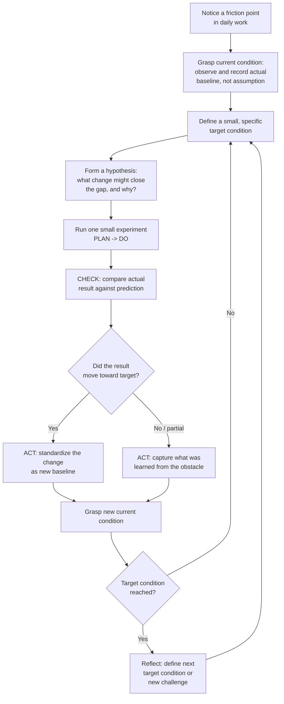

## Building a Personal Kaizen Practice

### Overview

A personal kaizen practice is the deliberate, individual application of continuous improvement discipline — habitually noticing small inefficiencies or problems in one's own work, testing small countermeasures, and reflecting on results — as a sustained daily or weekly habit rather than a periodic organizational event. Where "kaizen" is often associated with formal, scheduled kaizen events run by cross-functional teams over several days, a *personal* kaizen practice scales the same underlying philosophy (small, frequent, scientifically-tested improvements made by the person doing the work) down to the level of an individual practitioner's own routines, skills, and immediate work environment. This is closely related to, and often implemented through, the **Toyota Kata** framework's improvement kata and coaching kata, which formalizes how individuals build the habit of structured, scientific-thinking-based improvement.

### Why a Personal Practice Matters

**Key Points**

- Organizational kaizen capability is built from individual habit, not the reverse — an organization cannot sustain a culture of continuous improvement if improvement is something that only happens during scheduled events led by a dedicated team; it must become how individuals routinely think about their own work.
- This directly connects to the Shingo Model's insight that ideal results require ideal behaviors practiced by every team member, not only leadership or specialists, and that principles must be embedded into daily behavior rather than treated as an occasional program.
- A personal kaizen practice builds the underlying skill — structured, scientific-thinking-based problem solving — that makes a practitioner effective as a contributor to (or eventual leader of) larger-scale organizational kaizen events, since the mental discipline is the same at both scales; only the scope differs.

### Core Principles Applied at the Individual Level

**Key Points**

| Lean/Kaizen Principle | Personal Application |
| --- | --- |
| Muda (waste) identification | Notice small frictions, wasted motion, or wasted time in one's own daily routine |
| Small, incremental change | Test one small change at a time rather than overhauling an entire workflow at once |
| Standardize before improving | Establish a consistent current baseline method before attempting to improve it, so improvement can be measured against a known starting point |
| PDCA (Plan-Do-Check-Act) | Apply the cycle explicitly and in writing, even for small personal changes, rather than relying on informal impression of whether something "felt better" |
| Genchi genbutsu (go and see) | Observe one's own actual behavior directly (e.g., timing a task, tracking where time actually goes) rather than relying on assumption or memory of how a task is performed |
| Respect for people | Applied reflexively — respecting one's own capacity, avoiding burnout-driven "improvement" that is really just overwork, and treating personal kaizen as sustainable practice, not a self-optimization pressure campaign |

### The Improvement Kata as a Structured Personal Practice

**Key Points**

The Toyota Kata framework, developed by Mike Rother based on research into how Toyota develops scientific thinking as a routine capability, offers the most widely used structured template for personal (and team) kaizen practice. The **Improvement Kata** consists of four repeating steps:

1. **Understand the direction or challenge** — a clear, longer-term target condition (e.g., "reduce time lost to context-switching during focused work blocks").
2. **Grasp the current condition** — a concrete, honestly observed baseline (not an assumed or idealized description) of how the process currently works, including actual metrics where possible.
3. **Establish the next target condition** — a specific, achievable near-term condition to move toward, smaller in scope than the overall challenge, with a defined timeframe.
4. **Conduct experiments (PDCA) toward that target condition** — run small, rapid experiments, one obstacle at a time, learning from each iteration regardless of whether the experiment "succeeds," since the obstacle encountered is itself useful information.

$$\text{Current Condition} \xrightarrow{\text{PDCA experiments}} \text{Target Condition} \xrightarrow{} \text{New Current Condition} \xrightarrow{} \ldots \xrightarrow{} \text{Challenge}$$

### Process Flow: A Personal Kaizen Cycle

### Illustrative Example

**Example**

A software developer wants to reduce time lost to interruptions during deep-focus coding blocks.

1. **Challenge**: Spend more uninterrupted time in deep focus during the workday.
2. **Grasp current condition**: Rather than assuming the cause of interruptions, the developer tracks, for one week, every interruption during intended focus blocks — logging source (Slack notification, colleague walk-up, email alert), time of day, and duration lost. The baseline data shows the majority of interruptions occur via Slack notifications during a specific two-hour morning window.
3. **Target condition**: Reduce Slack-notification interruptions during the 9–11am block from an observed baseline average to a specific, smaller number within two weeks.
4. **Experiment 1 (PDCA)**: *Plan* — enable Slack's "Do Not Disturb" mode during that window. *Do* — implement for three days. *Check* — interruption count drops, but two urgent messages were missed that required a delayed response, revealing a new obstacle (colleagues need an escalation path for genuinely urgent items). *Act* — the blanket "do not disturb" approach is not a viable standard on its own.
5. **Experiment 2 (PDCA)**: *Plan* — keep Do Not Disturb on, but establish a team norm that genuinely urgent items are flagged via a different channel (e.g., a phone call or an agreed urgent-tag) that bypasses the mute. *Do* — implement for one week. *Check* — interruption count during the focus window drops close to target, and no urgent items were missed. *Act* — this becomes the new standard practice, and the developer records it as the current condition going forward.
6. **Reflection**: With the morning block improved, the developer sets a new target condition addressing the next largest source of interruption identified in the original baseline data (e.g., colleague walk-ups), continuing the cycle.

This demonstrates the core discipline of personal kaizen: basing the improvement on directly observed data (not assumption), testing one small change at a time, treating an unsuccessful or partially successful experiment as useful information rather than failure, and standardizing what works before moving to the next target condition.

### Practical Techniques for Sustaining the Practice

**Key Points**

- **Keep a kaizen log**: a simple, low-friction written record (notebook, spreadsheet, or note-taking app) of observed frictions, hypotheses tested, results, and standardized changes — the record itself is what prevents personal kaizen from dissolving into vague good intentions, and mirrors the role a formal A3 report or improvement board plays in organizational kaizen.
- **Limit work-in-progress on personal improvements**: attempting to improve multiple aspects of one's workflow simultaneously makes it difficult to attribute any observed change to a specific cause — a direct application of the lean principle of limiting work-in-progress (WIP) to the domain of personal habit change.
- **Set a fixed reflection cadence**: a brief, regular (e.g., weekly) personal retrospective — what friction did I notice this week, what did I test, what did I learn — keeps the practice from being purely reactive and ad hoc.
- **Treat obstacles as the unit of learning, not the change itself**: consistent with the improvement kata's framing, an experiment that reveals an obstacle (e.g., "Do Not Disturb mode caused missed urgent messages") is not a failed kaizen cycle; the obstacle discovered is exactly the information needed to inform the next experiment.
- **Pair with a coach or accountability partner where possible**: Toyota Kata's companion **Coaching Kata** — a structured five-question routine a coach uses to guide a learner through their own improvement kata cycle — can be adapted informally between peers, even outside a formal organizational kata program, to build the discipline of scientific thinking through repeated practice with feedback.

### Common Pitfalls

**Key Points**

- **Skipping the "grasp current condition" step**: jumping directly from noticing a problem to implementing a fix, without first establishing an honestly observed baseline, makes it impossible to know afterward whether the change actually helped — this is the single most common shortcut that undermines a personal kaizen practice's credibility to the practitioner themselves.
- **Attempting large-scope changes framed as "kaizen"**: kaizen specifically denotes small, incremental improvement; a sweeping personal overhaul (e.g., a complete life-system redesign undertaken all at once) does not fit the kaizen model and loses the benefit of rapid, low-risk experimentation that the small-step approach provides.
- **Treating personal kaizen as personal-optimization pressure**: framing continuous improvement as a demand for constant self-optimization can become a source of stress rather than a sustainable practice; the lean principle of respect for people applies reflexively — sustainable pacing and honest acknowledgment of constraints (including rest and recovery) are part of a genuine kaizen mindset, not exceptions to it.
- **Abandoning the log/record after initial enthusiasm fades**: because the practice depends on comparing actual observed results against a baseline, discontinuing the habit of recording undermines the very mechanism that distinguishes kaizen from ordinary, unstructured self-improvement effort.

### Practical Implementation Steps

**Next Steps**

1. Choose one small, currently-experienced friction point in daily work as the starting challenge — avoid starting with a large, vague goal.
2. Spend a defined observation period (a few days to one week) directly recording the actual current condition related to that friction, rather than relying on memory or assumption.
3. Set one small, specific, time-bound target condition based on that observed baseline.
4. Run a single PDCA experiment at a time, recording the plan, the result, and — regardless of outcome — what was learned.
5. Standardize whatever change proves effective before introducing the next experiment, and update the personal kaizen log with the new current condition.
6. Establish a fixed, brief weekly reflection cadence to review progress and identify the next target condition, keeping the practice habitual rather than sporadic.

**Related Topics**

- Toyota Kata: Improvement Kata and Coaching Kata frameworks
- PDCA (Plan-Do-Check-Act) cycle applied at the individual level
- A3 problem-solving reports as a structured reflection tool
- Genchi genbutsu and direct observation techniques
- Standardized work as a prerequisite for sustainable improvement
- Building organizational kaizen event facilitation skills
- Scientific thinking as a core Shingo guiding principle