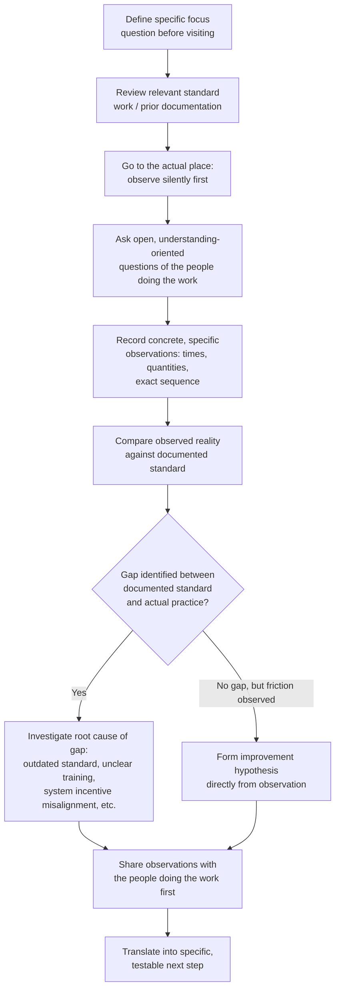

## Conducting Gemba Visits and Benchmarking Other Organizations

### Overview

Gemba visits and inter-organizational benchmarking are structured methods of direct observation used to build lean capability, generate improvement ideas, and calibrate an organization's own maturity against external reference points. "Gemba" (現場) is a Japanese term meaning "the actual place" — the location where value-creating work actually happens (the shop floor, the nurses' station, the customer service desk). A gemba visit is the deliberate act of going to that actual place to observe reality directly, a practice rooted in the lean/TPS principle of **genchi genbutsu** ("go and see for yourself"). Benchmarking other organizations extends this same direct-observation discipline outward, comparing one's own systems, tools, and results against those of other sites — whether sister plants, industry peers, or organizations recognized for excellence (such as Shingo Prize recipients) — to identify gaps and generate improvement hypotheses grounded in observed reality rather than assumption.

### The Purpose and Philosophy of Gemba Walks

**Key Points**

- The core discipline of a gemba visit is to observe the process as it actually operates, not as it is described in documentation, reported in status meetings, or assumed by those removed from the work — direct observation surfaces the gap between the *documented* standard and the *actual* practice, which is frequently the richest source of improvement opportunity.
- Gemba visits are conducted with a posture of curiosity and respect, not inspection or blame — consistent with the Shingo guiding principles of "Respect Every Individual" and "Lead with Humility." A gemba visit conducted as a surprise audit or a search for individual fault undermines the psychological safety needed for workers to honestly show and explain what is actually happening.
- The practice applies at every organizational level — from front-line supervisors observing their own area daily, to senior executives conducting periodic gemba walks across the enterprise — with the understanding that leaders who do not regularly go to the gemba risk making decisions based on secondhand, filtered, or outdated information.

### Structuring an Effective Gemba Visit

**Key Points**

**Preparation**

- Define a specific focus or question before the visit (e.g., "how does material flow between the assembly and packaging stations," or "where do quality escapes most often originate"), rather than conducting an unfocused general walkthrough, which tends to produce shallow, unconnected observations.
- Review any relevant standard work, process documentation, or prior observation notes beforehand, so the visit can identify gaps between documented standard and observed reality rather than starting from zero understanding.

**During the visit**

- Observe silently for an initial period before asking questions, allowing the natural rhythm of the work to be seen without immediately interrupting it.
- Ask open-ended questions directed at understanding, not correcting: "Can you walk me through what you're doing here?" or "What happens when this step doesn't go as expected?" rather than leading or evaluative questions.
- Record specific, concrete observations (times, quantities, exact sequences, direct quotes) rather than general impressions — a gemba visit that produces only vague conclusions ("things seem to be running smoothly") provides little basis for subsequent action.
- Follow the physical and information flow of the actual process, tracing material, product, or information as it genuinely moves, rather than following a predetermined tour route that may skip the actual points of friction.

**After the visit**

- Debrief promptly, comparing observed reality against the documented standard or the initial focus question, and translate observations into specific, testable improvement hypotheses rather than leaving them as unactioned notes.
- Share observations with the people who do the work before broader distribution, both as a matter of respect and because they often provide essential context that changes the interpretation of what was observed.

### Diagram: The Gemba Visit Cycle

### Benchmarking Other Organizations

**Key Points**

Benchmarking extends gemba-style direct observation beyond one's own organization, typically pursued through several channels:

- **Sister-site or intra-company benchmarking**: visiting other plants or departments within the same organization, often the lowest-friction starting point since access and mutual trust are usually more readily available.
- **Industry-peer benchmarking**: arranged visits to organizations in the same or adjacent industries, frequently facilitated through professional bodies, trade associations, or regional manufacturing extension partnerships.
- **Best-practice/excellence benchmarking**: visits to organizations recognized for exceptional performance regardless of industry — including Shingo Prize, Silver Medallion, or Bronze Medallion recipient organizations, whose public recognition and typically greater openness to hosting visitors make them a common target for this kind of learning visit.
- **Conference- and workshop-facilitated visits**: many lean-focused professional and educational events (such as those run by AME, SME, and the Shingo Institute) include facilitated plant tours as an explicit part of the program, providing a structured, vetted entry point to benchmarking visits that individual organizations might otherwise find difficult to arrange independently.

**Distinguishing genuine benchmarking from tourism**

A benchmarking visit that produces lasting value differs from a plant "tour" in its rigor:

| Element | Plant Tourism | Genuine Benchmarking |
| --- | --- | --- |
| Purpose | General interest, exposure | Specific, pre-defined question or gap to investigate |
| Preparation | Minimal | Review of own baseline data on the same metric/process before visiting |
| Focus during visit | Broad impressions | Concrete observation of a specific system, tool, or behavior |
| Follow-up | Anecdotes shared informally | Structured comparison against own current condition; specific hypothesis for a testable change |
| Outcome | "That was interesting" | A defined experiment or system change attempted upon return |

### Illustrative Example

**Example**

A mid-sized food processing plant struggles with excessive changeover time between product variants, limiting the plant's ability to run smaller, more frequent batches (a barrier to improved flow and reduced finished-goods inventory).

1. **Internal gemba visit first**: Before looking externally, the improvement team conducts a focused internal gemba visit at the changeover station itself, timing each step of an actual changeover and categorizing steps as internal (machine must be stopped) versus external (can be done while the machine still runs) — directly applying SMED (Single-Minute Exchange of Die) methodology. This produces a concrete baseline: total changeover time, and the proportion currently done as internal versus external work.
2. **Benchmarking target selection**: The team identifies a Shingo Silver Medallion-recognized consumer packaged goods plant in a related industry, known publicly for changeover performance, and arranges a benchmarking visit through an AME regional event offering a facilitated plant tour.
3. **Focused visit**: Rather than a general tour, the team arrives with their own changeover data in hand and a specific question: "How do you convert internal changeover steps to external steps, and how do you standardize the sequence across operators?" They observe the host plant's changeover process directly, noting specific techniques (pre-staged tooling carts, standardized checklists visible at the station, dedicated changeover roles).
4. **Post-visit translation**: Rather than attempting to copy every observed practice wholesale, the team compares each observed technique against their own baseline gap and selects the single highest-leverage practice (pre-staged tooling carts) as the first PDCA experiment to run at their own plant, given their own constraints (available floor space, current cart inventory).
5. **Result and reflection**: After testing the pre-staged cart approach on their own line, the team records the actual result against their own baseline, and — following genuine kaizen discipline — treats this as one experiment in an ongoing series rather than assuming the single visit "solved" the changeover problem.

This demonstrates the core distinction the topic addresses: internal gemba observation established a rigorous baseline before benchmarking began, the external visit was focused and comparative rather than a general tour, and the outcome was a specific, testable local experiment rather than an attempt to directly replicate another organization's system wholesale.

### Common Pitfalls

**Key Points**

- **Benchmarking without an internal baseline**: visiting another organization before establishing one's own current-condition data makes it difficult to know which observed practices are genuinely relevant improvements versus interesting but non-transferable differences in context.
- **Wholesale copying without adaptation**: directly importing another organization's specific system or tool without accounting for differences in product mix, scale, workforce, or constraints often fails, since the *system* the tool sits within (per the Shingo Model's systems layer) may differ substantially even when the tool itself looks identical.
- **Treating a gemba visit as an inspection**: approaching the visit with an evaluative or fault-finding posture damages trust and yields shallower, more guarded responses from the people being observed, undermining the honesty of what is actually shown.
- **Failing to close the loop**: conducting a visit, collecting interesting observations, and then not translating them into a specific tested change back at the home organization — a gemba or benchmarking visit that produces only anecdotes, without a defined follow-up experiment, largely forfeits its value.
- **One-time visits treated as sufficient**: a single gemba walk or benchmarking trip is a snapshot; sustainable improvement capability depends on establishing gemba visits as a routine, recurring practice (daily or weekly for internal gemba, periodic for external benchmarking) rather than an occasional special event.

### Practical Implementation Steps

**Next Steps**

1. Establish a recurring internal gemba walk cadence (e.g., a fixed weekly time for supervisors, a monthly cadence for senior leadership) before pursuing external benchmarking, so the organization has direct-observation discipline in place as a habit, not a special occasion.
2. Before any benchmarking visit, define a specific question and collect the organization's own current-condition baseline data on the relevant metric or process.
3. Identify potential benchmarking targets through multiple channels — sister sites, industry peer networks, and recognized-excellence organizations (e.g., Shingo award recipients) — and consider starting with lower-friction intra-company visits before external ones.
4. During any gemba or benchmarking visit, prioritize direct observation and open questions over guided presentations or slide decks, and record specific, concrete detail rather than general impressions.
5. After the visit, hold a structured debrief that explicitly compares observations against the organization's own baseline, and select the highest-leverage single change to test first, rather than attempting to adopt every observed practice simultaneously.
6. Share observations and resulting action plans with the people whose work was observed, both at the home organization and, where appropriate, back to the host organization, as a matter of reciprocity and respect.

**Related Topics**

- Genchi genbutsu ("go and see") as a Toyota Production System principle
- SMED (Single-Minute Exchange of Die) and changeover reduction
- Toyota Kata: grasping the current condition through direct observation
- Value stream mapping as a structured observation and documentation tool
- Shingo Prize assessment and recognition levels
- Building a personal kaizen practice
- Standardized work audits and gap analysis