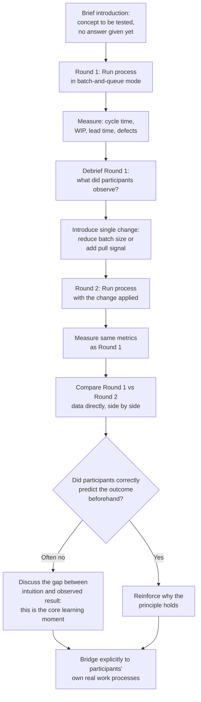

## Using Simulations and Exercises to Internalize Lean Concepts

### Overview

Lean simulations and structured hands-on exercises are experiential learning tools designed to make abstract lean concepts — flow, pull, waste, variability, batch size, visual management — tangible and viscerally understood, rather than only intellectually explained. Because many lean principles produce counterintuitive results (for example, that smaller batch sizes often *increase* throughput despite requiring more changeovers, or that adding inventory buffers can *mask* rather than solve underlying problems), lecture-based instruction alone frequently fails to produce lasting behavioral change. Simulations close this gap by letting participants directly experience the consequences of different process designs within a short, compressed timeframe, producing the kind of first-hand realization that written explanation struggles to replicate.

### Why Experiential Learning Matters for Lean

**Key Points**

- Lean concepts such as flow and pull often contradict intuitive assumptions rooted in traditional batch-and-queue thinking (e.g., the intuitive but incorrect belief that keeping every workstation maximally busy improves overall system throughput). Simulations allow participants to observe the counterintuitive result directly — such as work-in-process piling up at a bottleneck while upstream stations remain "productive" — producing a more durable understanding than a diagram or lecture alone.
- Because simulations are compressed in time (a process that would unfold over weeks in reality can be simulated in an hour), participants can run multiple iterations of the same process under different conditions (batch-and-queue versus single-piece flow, pushed versus pulled scheduling, with and without visual management) and directly compare measured outcomes across iterations — a form of rapid, low-risk PDCA applied to the learning process itself.
- Simulations create a shared, concrete experience across a group, which is particularly valuable when introducing lean concepts to a mixed audience spanning operators, supervisors, and executives — the shared experience gives everyone a common reference point for subsequent discussion, reducing the risk that abstract terminology is interpreted differently across organizational levels.

### Common Categories of Lean Simulations

**Key Points**

**Flow and pull simulations**

Physical simulations in which participants assemble a simple product (paper airplanes, LEGO models, simple mechanical assemblies) through a multi-station process, typically run first in a batch-and-queue configuration and then reconfigured to single-piece flow with pull signals (kanban cards), allowing direct, measured comparison of cycle time, work-in-process inventory, and lead time between the two configurations.

**Bottleneck and Theory of Constraints simulations**

Exercises (including well-known dice-and-cards simulations modeling variability propagating through a multi-station line) that demonstrate how variability at any single station in a dependent sequence of steps degrades overall system throughput more than intuition suggests, and how a single bottleneck station governs the throughput of the entire line regardless of how efficient other stations are.

**Pull system / kanban simulations**

Exercises simulating a multi-stage supply chain (sometimes structured as a card or token-passing exercise across several "companies" or stations) contrasting a push-based forecast-driven ordering system against a pull-based kanban replenishment system, typically demonstrating how the push system amplifies demand variability upstream (illustrating the bullwhip effect) while the pull system dampens it.

**5S and visual management exercises**

Timed exercises (e.g., a "find the item in a disorganized toolbox" versus "find the item in a 5S-organized toolbox" comparison) that make the time-cost of disorganization directly measurable rather than merely asserted.

**Value stream mapping exercises**

Structured walk-through exercises, often based on a simplified case-study process, where participants practice constructing a current-state map, identifying waste and information/material flow, and then constructing a future-state map — building the specific technical skill of VSM notation and analysis in a lower-stakes setting before applying it to a real production line.

### Diagram: Structure of a Typical Flow Simulation Session

### Designing an Effective Simulation Session

**Key Points**

- **Start with a prediction, not an explanation**: before running the first round, ask participants to predict the outcome (e.g., "which configuration do you expect to produce more units in the same time?") — this creates a personal stake in the result and makes the eventual gap between prediction and observed outcome the central teaching moment, rather than simply presenting the correct answer upfront.
- **Measure real data during the exercise**: track actual cycle time, work-in-process counts, defect rates, and lead time during each round using simple visible methods (stopwatch, tally marks, a visible WIP counter) rather than only asking for subjective impressions afterward — the credibility of the exercise depends on the data being real and visibly collected, not asserted.
- **Run at least two contrasting conditions**: a single-round exercise demonstrates a process but does not isolate the effect of the variable being taught; running the same process under two configurations (e.g., large batch vs. small batch, push vs. pull) that differ in only the specific variable being taught isolates that variable's effect clearly.
- **Debrief explicitly and connect to real work**: the exercise itself teaches little if the facilitator does not explicitly walk participants through what changed, why the measured result differed, and — critically — how the same underlying principle applies to the participants' actual work processes; without this bridge, participants may experience the simulation as an enjoyable but disconnected game.
- **Keep the physical exercise simple**: the value of the simulation lies in the process structure (number of stations, batch size, information flow, variability), not in the complexity of the product being built; overly complex assembly tasks distract from the underlying lean principle being demonstrated.

### Illustrative Example

**Example**

A manufacturing supervisor training program uses a simple paper-airplane assembly simulation to teach the relationship between batch size and lead time.

1. **Setup**: Four stations are established, each responsible for one folding step in a standardized paper airplane design; four participants staff the stations, with a fifth acting as timer/data-recorder.
2. **Round 1 — large batch**: Each station completes all ten units of its assigned fold step for the entire batch of ten airplanes before passing the entire batch to the next station. The time from the first unit starting station 1 to the last completed airplane reaching the end is recorded, along with the elapsed time before the *first completed airplane* becomes available.
3. **Debrief and prediction**: Participants are shown the Round 1 data, then asked to predict what will happen to total completion time and time-to-first-unit if the batch size is reduced to one (single-piece flow) — most predict total time will increase, reasoning that "more handling" seems inefficient.
4. **Round 2 — single-piece flow**: The same four stations now pass each individual airplane to the next station as soon as its step is complete, rather than waiting for the full batch.
5. **Result comparison**: The recorded data typically shows that while total completion time for all ten units is similar or modestly improved, the time-to-first-completed-unit drops dramatically — often by more than half — directly demonstrating the lean principle that smaller batch sizes reduce lead time (time until value is delivered) even when total processing capacity is unchanged.
6. **Bridge to real work**: The facilitator connects the observed result explicitly to the supervisors' actual production lines, asking them to identify one process in their own area currently run in large batches, and to consider what a smaller-batch or single-piece-flow pilot might reveal.

This demonstrates the core pedagogical mechanism: participants predicted an outcome based on intuitive batch-thinking, observed a different and often counterintuitive result from real, measured data, and were then guided to connect that gap directly to their own operational context — producing a more durable internalization of the principle than a lecture describing the same result would achieve.

### Facilitation Considerations

**Key Points**

- **Facilitator role is to guide discovery, not lecture**: the facilitator's primary task during debrief is to ask questions that help participants articulate what they observed and why it happened, rather than immediately supplying the explanation — participants who arrive at the insight through guided reflection retain it more durably than those who are simply told the conclusion.
- **Psychological safety during the exercise**: because simulations often expose participants' incorrect intuitive predictions, the facilitator must frame incorrect predictions as valuable and expected (since the gap between intuition and reality is the entire teaching mechanism), not as a performance shortfall — consistent with the lean principle of respect for people applied to a learning context.
- **Scaling for audience level**: the same underlying simulation structure can be adapted in complexity and debrief depth depending on audience — a front-line operator audience may focus debrief on direct operational application, while an executive audience may extend debrief toward the systems and incentive-design implications (connecting to the Shingo Model's insight that systems drive behavior).
- **Debrief time should not be shorter than execution time**: a common design error is spending most of the session time running rounds and only a few minutes debriefing; since the learning genuinely happens during structured reflection on the data, debrief time deserves at least equal priority to execution time.

### Common Pitfalls

**Key Points**

- **Treating the simulation as entertainment rather than a teaching tool**: a well-run simulation is often genuinely enjoyable, but if the debrief does not rigorously connect the exercise to real operational principles and to participants' own work, the session risks being remembered as a fun activity without producing lasting behavioral change.
- **Skipping the prediction step**: omitting the "predict before you see the result" step removes the cognitive tension that makes the eventual result memorable; participants who are simply shown two configurations side-by-side without having first committed to a prediction engage less deeply with the underlying "why."
- **Using overly complex products or processes**: an assembly task that is too intricate shifts participant attention toward mastering the craft task itself rather than observing the process-design principle being taught.
- **Failing to use real measured data**: relying on participants' subjective sense of "that felt faster" instead of genuine timed, counted data undermines the credibility and precision of the lesson, and can allow incorrect intuitions to persist unchallenged.

### Practical Implementation Steps

**Next Steps**

1. Select a simulation type matched to the specific concept being taught (flow/batch-size, bottleneck/variability, push/pull, visual management) rather than a generic "lean game" disconnected from the current training objective.
2. Design the exercise around at least two clearly contrasting conditions that isolate the single variable being taught, keeping the physical task itself simple.
3. Build in an explicit prediction step before each round, and collect genuine measured data (time, WIP count, defect count) during execution rather than relying on impressions.
4. Allocate debrief time at least equal to execution time, using guided questions to help participants articulate the gap between prediction and observed result themselves.
5. Explicitly bridge the exercise's result to participants' own real work processes before concluding the session, asking them to identify a specific application or pilot in their own area.
6. Where possible, follow up after the training session to check whether participants applied any insight from the simulation to a real process, closing the loop between the simulated learning experience and actual workplace behavior change.

**Related Topics**

- Toyota Kata and building scientific thinking as a habitual skill
- Value stream mapping training and practice exercises
- Bullwhip effect demonstrations in pull-system simulations
- Building a personal kaizen practice
- Theory of Constraints and bottleneck management
- SMED (Single-Minute Exchange of Die) practice exercises
- Adult learning theory applied to operational excellence training design