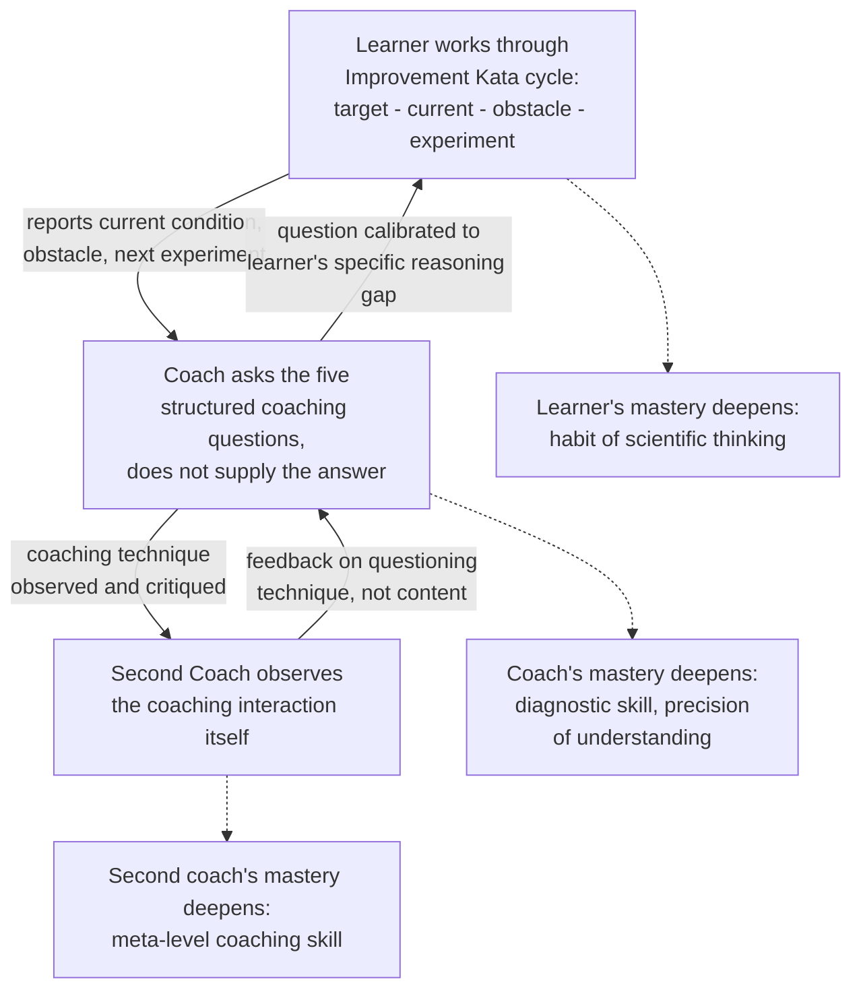

## Teaching and Coaching Others as a Path to Mastery

### Overview

Teaching and coaching others is widely regarded within lean practice as one of the most effective mechanisms for deepening a practitioner's own mastery, not merely a way of transferring knowledge already fully possessed. This reflects a broader principle sometimes summarized as "the best way to learn is to teach" — the act of explaining a concept clearly enough for someone else to apply it forces the teacher to surface gaps, inconsistencies, and unexamined assumptions in their own understanding that remain invisible when knowledge is used only privately. Within lean and Toyota Production System traditions specifically, this is formalized through structured coaching relationships (most notably the Toyota Kata **Coaching Kata**) and through the long-standing practice of experienced practitioners developing successors via direct mentorship rather than through classroom instruction alone.

### Why Teaching Deepens Mastery

**Key Points**

- **Articulation exposes gaps**: a practitioner can often perform a skill or apply a principle correctly through tacit, internalized habit without being able to explain *why* it works — attempting to teach forces that tacit knowledge to become explicit, and the difficulty encountered in articulating it reveals exactly where understanding is still shallow or intuition-based rather than principle-based.
- **Questions from learners reveal unexamined assumptions**: a novice's questions frequently probe exactly the areas an experienced practitioner has stopped consciously questioning — a learner asking "why do we always grasp the current condition before setting a target?" forces the teacher to re-derive the underlying reasoning rather than simply repeating a memorized procedure.
- **Coaching requires diagnosing someone else's thinking, not just producing a correct answer**: this is a categorically different — and typically more difficult — skill than solving a problem oneself. Effective coaching in the Toyota Kata tradition requires observing a learner's specific reasoning process and current step in the scientific-thinking cycle, then asking a question calibrated to move that specific learner forward, which demands a far more precise and adaptable understanding of the underlying method than executing the method personally.
- **Teaching under real stakes with real learners exposes edge cases**: a concept that seems fully understood in the abstract often reveals additional nuance and boundary conditions only when applied to a learner's genuinely different context, situation, or level of prior experience — broadening the teacher's own grasp of when and how the principle actually applies.

### The Coaching Kata: A Formal Structure for Developing Others

**Key Points**

The **Coaching Kata**, developed alongside the Improvement Kata within the Toyota Kata framework (Mike Rother), provides a structured, repeatable routine a coach uses to guide a learner through their own scientific-thinking (Improvement Kata) cycle, rather than solving the learner's problem for them.

The coaching routine centers on a small set of structured questions, typically asked in a consistent sequence during brief, frequent coaching interactions (often standing at the learner's own storyboard or visual tracking tool):

1. What is the target condition?
2. What is the actual condition now?
3. What obstacles do you think are preventing you from reaching the target condition? Which one are you addressing now?
4. What is your next step (next experiment)? What do you expect?
5. When can we go and see what we learned from taking that step?

**Key Points on the Coaching Kata's design**:

- The coach deliberately does *not* supply the answer to the learner's problem — the questions are designed to make the learner's own reasoning process visible and to develop the learner's habit of scientific thinking, rather than to produce the fastest correct solution for the immediate problem.
- Coaching sessions are typically brief and frequent (sometimes daily), rather than long and occasional, reflecting the view that the habit of structured thinking is built through repeated, short practice cycles rather than infrequent deep-dive sessions.
- A **second coach** (sometimes called a "coach's coach") often observes the coaching interaction itself, providing feedback to the coach on their own coaching technique — reflecting the recognition that coaching is itself a skill requiring its own deliberate practice and feedback loop, not an ability that automatically follows from subject-matter mastery.

### Diagram: The Nested Coaching Relationship

### Illustrative Example

**Example**

A senior process engineer who has led numerous successful kaizen events is asked to mentor a newly promoted supervisor who is running her first formal improvement effort.

1. **Initial assumption**: The engineer expects the mentoring relationship to be straightforward, since the underlying kaizen method (define the problem, gather current-state data, test countermeasures) is second nature to him after years of practice.
2. **First coaching interaction**: The supervisor reports she has identified a "root cause" for a recurring quality defect and proposes a countermeasure. When the engineer asks the Coaching Kata-style question "what obstacle are you addressing, and how do you know that's the right one to tackle first," he realizes he cannot easily articulate, in words a novice can act on, *how he personally distinguishes* a genuine root cause from a plausible-sounding but unverified hypothesis — a judgment he has always made intuitively based on years of pattern recognition, never previously forced into explicit, teachable criteria.
3. **Forced articulation**: To coach the supervisor effectively rather than simply telling her the "correct" root cause himself, the engineer has to work out and state explicitly the actual reasoning steps he uses (e.g., "has this been directly observed at the gemba, or inferred from a report," "has a single data point been generalized into a conclusion without checking for confirming or disconfirming cases nearby").
4. **Result**: In the process of teaching this reasoning explicitly, the engineer discovers that his own root-cause practice had, in several past kaizen events, occasionally skipped direct gemba verification when time pressure was high — a gap in his own rigor he had not previously noticed, because it had never been forced into explicit, examinable language until he needed to teach it to someone else.
5. **Deepened mastery**: The engineer's subsequent kaizen work incorporates a more consistently applied, now-explicit verification step — a genuine improvement in his own practice that arose directly from the demands of coaching someone else, not from any additional individual study or experience on his part.

This demonstrates the core mechanism the topic addresses: the coaching relationship did not simply transfer existing, complete knowledge from expert to novice — it exposed and corrected a genuine gap in the expert's own practice that had remained invisible until the demands of teaching forced it into explicit, examined form.

### Broader Organizational Forms of Teaching-as-Mastery

**Key Points**

- **Train-the-trainer models**: organizations formally build teaching responsibility into advancement paths for continuous improvement practitioners, on the premise that requiring a practitioner to train others is itself a development method, not only a knowledge-distribution mechanism.
- **Sensei/apprentice traditions**: the historical TPS tradition of a sensei (experienced master, sometimes an outside consultant) directly and repeatedly challenging a student's reasoning — often through pointed, sometimes deliberately uncomfortable questioning at the gemba — reflects the same underlying principle in an older cultural form: mastery is developed and continually refined through the discipline of explaining, defending, and re-examining one's reasoning in front of another person, not through solitary practice alone.
- **Internal Shingo/lean certification pathways that require teaching**: several professional certification frameworks and internal corporate lean-belt progression systems require candidates for higher-level credentials (e.g., a "Black Belt" or "Gold" level practitioner) to have formally trained or mentored lower-level practitioners as an explicit prerequisite — reflecting an institutional recognition that teaching ability is both evidence of, and a mechanism for producing, deeper mastery.
- **Peer coaching circles**: even without a formal expert/novice hierarchy, practitioners at similar levels of experience coaching one another (using structures like the Coaching Kata's five questions, adapted for peer use) can produce comparable benefit, since the value derives from the act of structured articulation and diagnostic questioning itself, not exclusively from an expertise gap between coach and learner.

### Common Pitfalls

**Key Points**

- **Coaching by supplying answers rather than asking questions**: an experienced practitioner's natural instinct is often to solve the learner's problem directly, since this is faster and demonstrates competence — but doing so both deprives the learner of the scientific-thinking practice the coaching relationship is meant to build, and deprives the coach of the forced articulation that produces the coach's own deepened mastery.
- **Treating teaching as a one-directional transfer**: framing the relationship as the expert simply depositing complete, static knowledge into the novice overlooks the bidirectional nature of the benefit — the novice's questions and reasoning gaps are themselves a diagnostic tool that can reveal weaknesses in the expert's own understanding, which is lost if the expert never genuinely engages with why a question was hard to answer.
- **Skipping the meta-level coaching skill**: assuming that subject-matter mastery automatically confers coaching skill overlooks that diagnosing another person's specific reasoning gap and asking a precisely calibrated question is a distinct capability, developed through practice and feedback (such as a second coach observing the coaching interaction), not an automatic byproduct of one's own technical expertise.
- **Infrequent, lengthy coaching sessions in place of brief, frequent ones**: the Coaching Kata's design specifically favors short, frequent interactions over rare deep-dive sessions, since the habit-forming benefit — for both learner and coach — depends on repetition more than session length.

### Practical Implementation Steps

**Next Steps**

1. Volunteer or seek out opportunities to formally teach or mentor even a single less-experienced colleague on a lean concept the practitioner already considers well understood, treating any resulting difficulty in articulation as a signal of where personal mastery is genuinely still shallow.
2. Adopt a structured coaching format (such as the Coaching Kata's five questions) rather than ad hoc mentoring conversations, to build the discipline of question-asking over answer-supplying.
3. Where possible, arrange for a second coach or peer to observe one's own coaching interactions and provide feedback on questioning technique specifically, separate from feedback on subject-matter content.
4. Keep coaching interactions brief and frequent rather than long and occasional, mirroring the Coaching Kata's emphasis on repetition as the mechanism for habit formation in both learner and coach.
5. After each coaching or teaching interaction, briefly reflect on any moment where explaining a concept proved harder than expected, and treat that specific moment as a personal kaizen target for deepening one's own understanding.

**Related Topics**

- Toyota Kata: Improvement Kata and Coaching Kata frameworks
- Building a personal kaizen practice
- Sensei and mentorship traditions in the Toyota Production System
- Lean certification paths and professional bodies
- The three insights of organizational excellence
- Scientific thinking as a Shingo guiding principle
- Succession planning for continuous improvement leadership roles