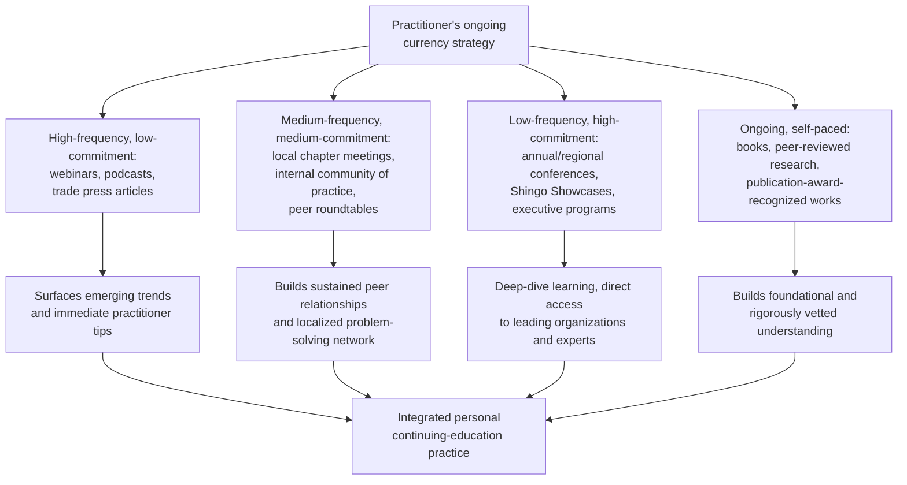

## Staying Current Through Communities, Conferences, and Publications

### Overview

Sustained lean mastery requires ongoing engagement with the broader practitioner community, not only initial training or certification. Because lean is fundamentally an applied, evolving discipline — shaped by new technologies, changing workforce dynamics, and continuously accumulating case experience across industries — practitioners who stop engaging with external communities after initial certification risk their knowledge becoming static, disconnected from how the field's leading organizations are actually adapting the methodology in practice. This topic surveys the primary channels — professional associations, conferences, publications, and informal communities — through which practitioners maintain and deepen their currency in lean thinking over a career.

### Professional Associations and Institutes

**Key Points**

Several organizations serve as the primary institutional hubs for ongoing lean community engagement, each with a somewhat distinct focus:

- **Association for Manufacturing Excellence (AME)** — a practitioner-based organization whose events are historically noted for being led by real-world industry professionals rather than primarily academics or consultants, with an explicit "lean beyond manufacturing" track covering healthcare, government, and other non-manufacturing sectors. AME's annual international conference has historically been among the largest lean-focused conferences in North America.
- **Shingo Institute** — housed at Utah State University's Jon M. Huntsman School of Business, administers the Shingo Prize and the broader Shingo Model curriculum, and runs its own conference and community engagement programming (branded as **Shingo Connect**) alongside its assessment and workshop functions.
- **Lean Enterprise Institute (LEI)** — runs a consistent, recurring series of events, historically covering topics such as value stream mapping, continuous flow, lean supply chain management, strategy deployment, and lean logistics, with sessions distributed across different locations.
- **American Society for Quality (ASQ)** — in addition to its certification programs, maintains ongoing publications, local chapters, and events relevant to practitioners whose lean practice intersects with quality management.
- **Industry- and region-specific bodies** — including organizations such as the University of Dayton's Center for Competitive Change, regional manufacturing partnerships, and technical assistance centers, which provide more localized or industry-specific community engagement than the larger national/international bodies.

### Conferences and Live Events

**Key Points**

Current (2026) examples of the conference and event landscape illustrate the range of formats available to practitioners:

- **AME's annual international conference** — a flagship multi-day event (for example, AME Milwaukee 2026, held in late October 2026) combining keynote presentations, practitioner-led workshops, and facility tours.
- **AME regional summits** — smaller, city-specific events (such as the AME Charlotte 2026 Lean Summit, held in May 2026, and an AME Portland 2026 Lean Summit) offering a more focused, curated audience of plant managers, operations leaders, and executives, typically combining workshops, keynote presentations, and behind-the-scenes site tours across a range of industries from biotech and aerospace to healthcare and technology.
- **Shingo Connect conferences** — regional and international conferences (for example, Shingo Connect USA held in San Diego in March 2026, and Shingo Connect APAC held in Bangkok in June 2026) where professionals across industries come together specifically around the Shingo Model, Lean, and continuous improvement practice.
- **Shingo Showcases** — one-day, single-organization site visits (for example, showcases hosted at Creative Testing Solutions in Arizona, Story Construction in Iowa, and ThermoFisher Scientific in Lithuania during 2026) giving continuous improvement leaders, operational excellence professionals, and executive teams direct access to the inner workings of an organization actively leveraging the Shingo Model, including the opportunity to talk directly with leaders who have lived the transformation journey.
- **Shingo Executive Leadership Program** — an immersive multi-day program (for example, a session held in Dublin, Ireland in April 2026) specifically designed to help senior leaders connect Shingo principles to systems and behaviors at the executive level.
- **Virtual events and webinars** — both AME and the Shingo Institute run frequent, often free or low-cost virtual sessions on narrowly scoped topics (examples from AME's 2026 calendar include sessions on workforce development, hidden-factory waste, and even emerging AI-coaching-agent applications; the Shingo Institute hosts monthly webinars, archived afterward on its YouTube channel), offering a lower-commitment way to stay current between larger in-person events.
- **Plant tours and "2 Second Lean" style tours** — shorter-format benchmarking-style tours (for example, a benchmarking plant tour hosted at Dentsply Sirona, or a "2 Second Lean" tour of a hardware retailer) that combine community engagement with direct-observation learning, connecting this topic closely to the practice of gemba visits and benchmarking discussed elsewhere in this material.

[Unverified: specific attendance figures, exact program agendas, and pricing details for any individual event change year to year and by location; practitioners should verify current details directly against the sponsoring organization's website before planning attendance.]

### Publications

**Key Points**

- **Books published in connection with major frameworks** — the Shingo Institute publishes a series of books tied to its six-workshop curriculum, and numerous other publishers maintain ongoing lean-focused book series covering topics from Toyota Kata to lean healthcare to lean product and process development.
- **Award-recognized publications** — the Shingo Institute's own **Publication Award** specifically recognizes published works that advance understanding of the Shingo Model and related principles, providing a curated signal of significant recent contributions to the field.
- **Trade and practitioner press** — ongoing publications from bodies such as Assembly Magazine, Quality Digest, and various manufacturing-focused trade outlets track emerging technology adoption (for example, connected worker/AR adoption trends) and practitioner case studies on a rolling basis, offering more frequent, shorter-form currency than book-length publications.
- **Peer-reviewed academic research** — journals and conference proceedings in operations management and industrial engineering continue to publish empirical research testing, extending, or critiquing lean and Shingo Model claims, providing a more rigorously vetted (though typically slower-moving and less immediately practitioner-oriented) channel for staying current.
- **Podcasts** — several organizations, including the Shingo Institute (via its Shingo Principles podcast), maintain regular podcast programming featuring practitioner interviews and topic-specific episodes, offering a lower-friction, ongoing-engagement format compared to books or in-person events.

### Informal and Peer Communities

**Key Points**

- **Practitioner blogs and online communities** — long-running independent practitioner blogs and online forums (historically including figures and outlets referenced across the lean community, such as the Gemba Panta Rei blog associated with Gemba Research) have functioned as informal, frequently updated channels for practitioner-to-practitioner knowledge sharing outside formal institutional programming.
- **Local chapters and roundtables** — regional or company-hosted roundtables (for example, a "2 Second Lean leader roundtable" format seen in AME's event calendar) provide smaller, more conversational peer-exchange settings than large conferences.
- **Internal communities of practice** — many organizations maintain their own internal lean/continuous-improvement communities of practice, connecting practitioners across different sites or business units to share locally-developed solutions, which — while internal rather than external — serve a similar currency-maintaining function and are often the most immediately actionable source of peer learning available to a given practitioner.
- **Benchmarking networks** — ongoing relationships built through benchmarking visits (see the related topic on gemba visits and benchmarking) often evolve into standing informal peer networks that continue to exchange ideas well beyond the initial visit.

### Diagram: A Layered Approach to Staying Current

### Illustrative Example

**Example**

A continuous improvement manager at a mid-sized manufacturer builds a structured annual plan for staying current, rather than relying on ad hoc exposure:

1. **Ongoing (weekly/monthly)**: Subscribes to a small number of trade publications and the Shingo Institute's podcast, reviewing new episodes and articles during a fixed weekly time block rather than sporadically.
2. **Quarterly**: Attends one AME or Shingo Institute virtual webinar per quarter on a topic directly relevant to a current organizational priority (for example, attending a webinar on connected worker technology while evaluating an AR pilot at their own plant).
3. **Annually**: Attends one regional in-person summit (such as an AME regional Lean Summit) selected specifically for its site-tour offerings, since direct observation of other organizations' systems provides learning not available through virtual formats alone.
4. **Periodically (every 2–3 years)**: Attends a larger flagship conference (such as the AME international conference or a Shingo Connect event) when a specific strategic initiative (e.g., preparing for an internal Shingo Challenge) makes the deeper, multi-day investment particularly timely.
5. **Ongoing peer network**: Maintains an informal peer relationship with a counterpart met at a prior benchmarking visit, exchanging brief updates a few times a year on how each organization is applying a specific practice both observed together.

This demonstrates that an effective personal currency practice is typically layered — combining frequent, low-commitment channels with periodic, higher-commitment deep engagement — rather than relying exclusively on either constant light exposure or infrequent large events alone.

### Common Pitfalls

**Key Points**

- **Treating conference attendance as passive consumption**: attending sessions without a specific question or application target in mind (echoing the same distinction drawn in gemba/benchmarking practice between genuine investigation and general "tourism") tends to produce interesting but non-actionable takeaways rather than applied learning.
- **Relying exclusively on a single source or organization**: since different bodies (AME's practitioner focus, Shingo's principle-and-culture focus, academic journals' rigor-focused research) each surface different kinds of insight, over-reliance on one channel risks a distorted or incomplete view of how the field is actually evolving.
- **Letting currency lapse after initial certification**: treating a certification or credential as a terminal achievement rather than a starting point risks the practitioner's knowledge becoming outdated relative to how leading organizations are currently adapting lean practice to new contexts (e.g., emerging technology integration, evolving supply chain risk practice).
- **Confusing volume of exposure with depth of learning**: attending numerous events or reading widely without pausing to translate any specific insight into a concrete change in one's own practice mirrors the same failure mode identified in simulation-based learning — exposure without a deliberate bridge back to application yields limited lasting benefit.

### Practical Implementation Steps

**Next Steps**

1. Identify one or two professional associations (such as AME, the Shingo Institute, or ASQ) most aligned with the practitioner's industry and role, and establish a standing subscription or membership rather than relying on occasional, unplanned exposure.
2. Build a layered annual plan combining high-frequency, low-commitment channels (webinars, podcasts, trade press) with at least one periodic, higher-commitment event (a regional summit or flagship conference) selected specifically for its relevance to a current organizational priority.
3. Before attending any conference, webinar, or publication deep-dive, define a specific question or application target, mirroring the same discipline used in effective gemba visits and benchmarking.
4. Maintain and periodically re-engage informal peer relationships built through conferences, benchmarking visits, or local chapters, since these often provide more immediately actionable, context-specific insight than large-scale formal programming.
5. After any significant learning event, translate at least one specific insight into a concrete personal-kaizen or organizational experiment, closing the loop between external learning and internal application.

**Related Topics**

- Conducting gemba visits and benchmarking other organizations
- Lean certification paths and professional bodies
- Shingo Prize assessment and recognition levels
- Building a personal kaizen practice
- Teaching and coaching others as a path to mastery
- Connected workers and augmented reality on the shop floor (as an example of an emerging-technology topic tracked through ongoing community engagement)