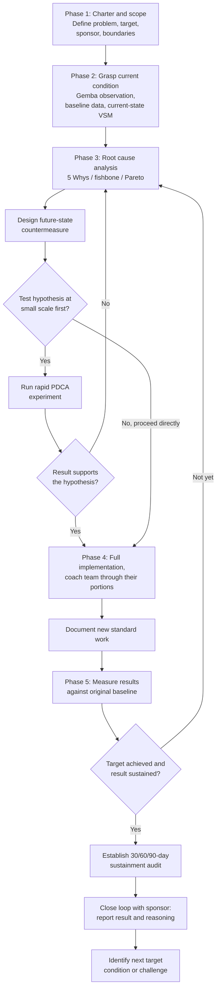

## Capstone Practice of Leading an End-to-End Kaizen Initiative

### Overview

Leading an end-to-end kaizen initiative — from initial problem identification through sustained standardization — serves as the capstone demonstration of lean mastery, requiring a practitioner to integrate every capability developed across prior stages of learning: direct observation (gemba practice), structured scientific thinking (the improvement kata), facilitation and coaching of others, data-driven analysis (value stream mapping, root cause investigation), and the discipline of translating results into sustained standard work. Unlike isolated exercises or simulations that practice a single skill in a controlled setting, an end-to-end initiative exposes the practitioner to the full complexity of leading real organizational change — including the political, cultural, and cross-functional obstacles that no simulation can fully replicate.

### What Distinguishes a Capstone Initiative from a Standard Kaizen Event

**Key Points**

- **Full lifecycle ownership**: a capstone initiative requires the practitioner to own the process from chartering and scoping through post-event sustainment audits, rather than participating in or facilitating only the multi-day event portion, which is the piece most commonly experienced during earlier training.
- **Cross-functional complexity**: capstone-level initiatives typically span more than a single work cell or department, requiring the practitioner to navigate competing priorities, differing local standards, and stakeholders who were not present for the practitioner's own prior lean training and may not share the same foundational vocabulary.
- **Accountability for sustained results**: where a training exercise's success criterion is often "did participants learn the concept," a capstone initiative's success criterion is whether the improvement is still in place, still being followed, and still producing measurable benefit weeks or months after the event — directly testing whether the practitioner can close the loop through standardization and follow-up audit, not merely generate an initial improvement.
- **Integration of coaching, not just doing**: a genuine capstone test of mastery typically requires the practitioner to lead a *team* through the initiative — coaching others through the improvement kata cycle rather than personally executing every step — since leading others through structured problem-solving is a categorically harder and more revealing test of understanding than solving the problem oneself (directly connecting to the earlier principle that teaching and coaching deepen mastery).

### Structure of an End-to-End Kaizen Initiative

**Key Points**

**Phase 1 — Charter and scope**

- Define a specific, bounded problem statement and measurable target, typically documented in a kaizen charter specifying the scope boundaries (what is and is not included), the team, the timeline, and the sponsoring leader.
- Secure explicit sponsorship from a leader with authority over the process being improved, since a capstone initiative lacking genuine organizational backing risks producing recommendations that are never actually implemented.

**Phase 2 — Grasp the current condition**

- Conduct direct gemba observation of the actual process, collecting concrete baseline data (cycle times, defect rates, lead time, or whatever metric is central to the charter) rather than relying on secondhand description.
- Construct a current-state value stream map or equivalent process documentation, distinguishing value-adding from non-value-adding activity and surfacing the specific location(s) of waste.

**Phase 3 — Root cause analysis and future-state design**

- Apply structured root cause techniques (5 Whys, fishbone/Ishikawa diagrams, or Pareto analysis of defect categories) to move from symptom to underlying cause, resisting the common failure of jumping directly to a countermeasure based on an untested assumption.
- Design a future-state process or countermeasure set, ideally testing smaller-scale hypotheses (rapid PDCA experiments) before committing to a full-scale change.

**Phase 4 — Implementation**

- Lead the team (not merely direct it) through implementing the change, actively coaching team members through their own portions of the work using structured questioning rather than supplying every answer.
- Document the new standard work explicitly, ensuring the change is captured in a form that can be trained to people who were not present for the original kaizen event.

**Phase 5 — Verification and sustainment**

- Measure actual post-implementation results against the original baseline and target, using the same metric definitions established in Phase 2 to ensure a valid comparison.
- Establish a follow-up audit cadence (commonly at 30, 60, and 90 days) to verify the change is genuinely holding — the phase most frequently skipped in practice, and the one most directly determining whether the initiative produced durable versus temporary improvement.
- Formally close the loop with the sponsoring leader and the broader organization, sharing both the result and the reasoning, and identify the next target condition or challenge as a natural continuation rather than treating the initiative as a one-time, closed event.

### Diagram: The End-to-End Kaizen Initiative Lifecycle

### Illustrative Example

**Example**

A continuous improvement practitioner nearing the completion of a structured lean development program is assigned a capstone initiative: reducing order-fulfillment cycle time in a distribution center that spans order intake, picking, packing, and shipping — a process crossing three separate departments.

1. **Charter and scope**: The practitioner works with the operations director (the sponsoring leader) to define the specific target: reduce average order-to-ship time from a documented baseline to a specific reduced figure within a defined quarter, explicitly scoping out inbound receiving (a related but separate process) to keep the initiative bounded.
2. **Grasp current condition**: Rather than beginning with a proposed solution, the practitioner spends several days conducting gemba observation across all three departments, timing each handoff and identifying that the largest single source of delay is orders sitting in a queue between picking and packing during a specific shift overlap window — a finding not previously visible in departmental-level reporting, since each department tracked its own cycle time separately and the interdepartmental queue time was invisible in existing metrics.
3. **Root cause analysis**: A 5 Whys analysis with representatives from both picking and packing reveals the queue accumulates specifically because packing staffing is set to match average daily volume rather than the actual arrival pattern of picked orders, which clusters heavily in the shift-overlap window due to how picking routes are currently scheduled.
4. **Future-state design and small-scale test**: Rather than immediately proposing a full staffing change, the team tests a smaller hypothesis first — staggering picking route start times for one specific route group for a one-week trial — and measures whether this smooths the arrival pattern into packing without requiring any staffing change.
5. **Implementation**: With the small-scale test showing a meaningful reduction in queue time, the practitioner leads (rather than personally executes) the rollout across all picking routes, coaching the picking supervisor through adapting the schedule for the remaining route groups using the same PDCA structure, rather than dictating the full solution.
6. **Verification and sustainment**: Post-implementation cycle time is measured against the original baseline using the same metric definition, confirming the target was met. The practitioner establishes 30/60/90-day audits with the picking and packing supervisors to confirm the new route-scheduling standard is genuinely being followed, not silently reverting under production pressure.
7. **Closing the loop**: Results and the underlying reasoning (not just the final number) are formally reported back to the operations director, and the practitioner, applying the improvement kata's continuing-cycle logic, identifies the next target condition — investigating the now-second-largest source of delay revealed by the improved data.

This demonstrates the integrated, cross-functional, and sustainment-focused nature that distinguishes a capstone initiative from a bounded training exercise: the practitioner had to charter the work with genuine organizational authority, discover a root cause invisible in existing departmental metrics, test a hypothesis before committing to a larger change, coach rather than simply direct implementation, and verify durability well beyond the initial event.

### Evaluating Capstone Performance

**Key Points**

A well-designed capstone evaluation assesses more than whether the target metric was achieved, since target achievement alone does not confirm the underlying capability was genuinely demonstrated:

| Dimension | What to Evaluate |
| --- | --- |
| Chartering discipline | Was the problem statement specific and bounded, with genuine leadership sponsorship secured before work began? |
| Direct observation rigor | Was the current condition grasped through direct gemba observation and real data, or assumed/secondhand? |
| Root cause discipline | Was a structured method used to move from symptom to cause, or was a countermeasure proposed based on an untested assumption? |
| Hypothesis testing | Were larger changes tested at smaller scale first where feasible, rather than committing immediately to full-scale implementation? |
| Coaching versus doing | Did the practitioner develop the team's own problem-solving capability through structured questioning, or execute the solution personally? |
| Standardization | Was the resulting change documented as transferable standard work, usable by people not present for the original event? |
| Sustainment | Was a follow-up audit cadence established and actually executed, confirming the change held over time rather than reverting? |
| Continuation | Was the initiative's conclusion used to identify a next target condition, reflecting ongoing kaizen discipline rather than treating the project as a closed, one-time event? |

### Common Pitfalls

**Key Points**

- **Treating the multi-day event as the entire initiative**: focusing almost all effort on the implementation phase while under-investing in chartering, root cause discipline beforehand, and sustainment auditing afterward reproduces the most common failure pattern in real organizational kaizen work — an initial burst of improvement that regresses once attention moves elsewhere.
- **Solving the problem personally rather than coaching the team**: an experienced practitioner under time pressure often reverts to directly solving the problem rather than developing the team's capability — this may achieve the target metric but fails the deeper capstone test, since it does not demonstrate the harder skill of leading others through structured thinking.
- **Skipping small-scale hypothesis testing under pressure to show results quickly**: committing immediately to a full-scale change without testing the underlying hypothesis at smaller scale increases the risk of a costly, hard-to-reverse implementation built on an unverified assumption.
- **Insufficient scoping discipline**: a capstone initiative scoped too broadly (attempting to fix an entire value stream at once) tends to stall under its own complexity, while one scoped appropriately (a specific, bounded problem within a larger process) is more likely to reach genuine completion and produce a clean, evaluable result.
- **No formal sustainment audit**: without an explicit 30/60/90-day (or equivalent) follow-up mechanism, there is no reliable way to distinguish a genuinely sustained improvement from a temporary spike in performance driven by the heightened attention surrounding the event itself.

### Practical Implementation Steps

**Next Steps**

1. Select a real, currently unresolved process problem with genuine organizational significance and secure explicit sponsorship from a leader with authority over that process, rather than choosing an artificially simple or already-solved problem.
2. Invest deliberate time in direct gemba observation and baseline data collection before proposing any countermeasure, resisting pressure to move immediately to a solution.
3. Apply a structured root cause method and, where feasible, test the resulting hypothesis at a smaller scale before committing to full implementation.
4. Lead the initiative through a team, deliberately using coaching techniques (such as the Coaching Kata's structured questions) rather than personally executing every step, treating the coaching itself as part of what is being evaluated.
5. Document the resulting change as transferable standard work and establish an explicit, dated sustainment audit schedule before declaring the initiative complete.
6. Formally close the loop with the sponsoring leader, reporting both the result and the underlying reasoning, and identify a specific next target condition to demonstrate the ongoing, continuing nature of genuine kaizen practice.

**Related Topics**

- Building a personal kaizen practice
- Toyota Kata: Improvement Kata and Coaching Kata frameworks
- Conducting gemba visits and benchmarking other organizations
- Teaching and coaching others as a path to mastery
- Value stream mapping and root cause analysis techniques
- The Shingo Model's guiding principles, systems, tools, and results
- Shingo Prize assessment and recognition levels