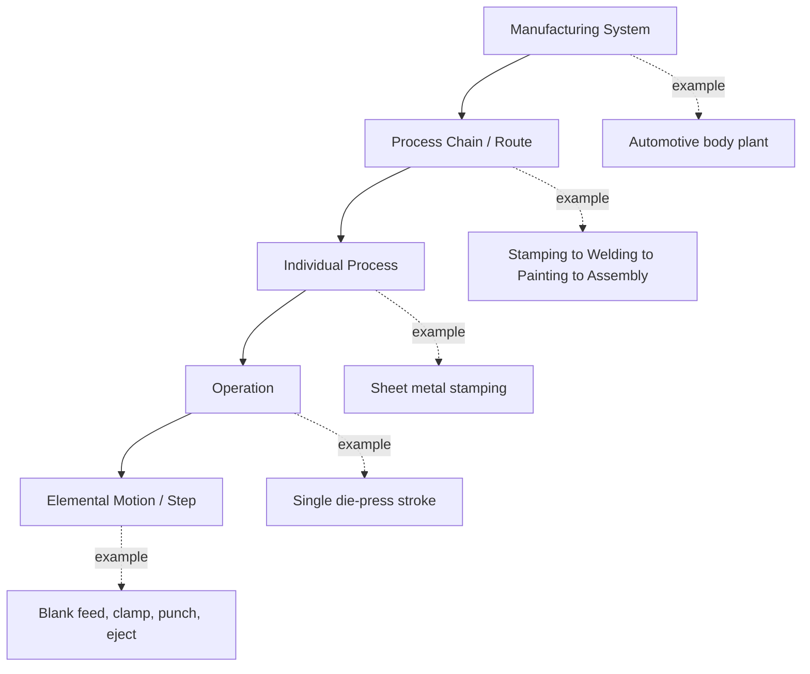

## Defining Manufacturing and the Scope of a Manufacturing Process

### Definition of Manufacturing

Manufacturing is the systematic transformation of raw materials, components, or feedstocks into finished or semi-finished goods through the application of physical, chemical, mechanical, or thermal processes, combined with labor, machinery, tools, and energy inputs. The term derives etymologically from the Latin *manu factus* ("made by hand"), though modern manufacturing is overwhelmingly mechanized and automated.

A generalized definition used in industrial engineering:

> Manufacturing is the value-adding transformation of inputs (materials, energy, information) into outputs (products) via a defined sequence of operations, under controlled conditions, to meet specified functional, dimensional, and quality requirements.

**Key Points**

- Manufacturing always involves a **transformation** — a change in form, properties, composition, or assembly state of matter.
- It is distinguished from mere handling, storage, or transportation, which do not alter the material's form or properties.
- Manufacturing is **value-adding**: the economic worth of the output exceeds the combined cost of inputs, due to the utility created by the transformation.
- It occurs within an organized production system (a factory, plant, or workshop), as opposed to informal or artisanal one-off fabrication, although the underlying physics is identical.

### Manufacturing vs. Related Concepts

| Concept | Distinction from Manufacturing |
| --- | --- |
| Production | Broader term; includes manufacturing plus services, agriculture, extraction |
| Fabrication | Often used interchangeably with manufacturing, but sometimes restricted to metal-forming/assembly trades |
| Processing | Frequently synonymous with manufacturing in chemical/food industries; emphasizes continuous transformation |
| Assembly | A subset of manufacturing focused on joining pre-made components rather than shaping raw material |
| Construction | Site-based creation of fixed structures (buildings, infrastructure); generally excluded from manufacturing classification despite similar processes |
| Extraction/Mining | Precedes manufacturing; obtains raw materials but does not transform them into finished goods |

### The Scope of a Manufacturing Process

A **manufacturing process** is the specific, bounded set of operations that accomplishes one identifiable transformation step or a coherent group of steps within the overall production of a good. Defining "scope" requires establishing boundaries along several dimensions.

#### 1. Input–Output Boundary

Every manufacturing process has:

- **Inputs**: raw material, semi-finished stock, energy, tooling, and information (specifications, process parameters).
- **Outputs**: a transformed workpiece, product, or assembly, plus process waste (scrap, emissions, heat, effluent).

$$\text{Process} : (M_{in}, E_{in}, I_{in}) \rightarrow (M_{out}, W_{out})$$

where $M_{in}$ is material input, $E_{in}$ is energy input, $I_{in}$ is control/process information, $M_{out}$ is the transformed material output, and $W_{out}$ is waste output.

#### 2. Physical/Chemical Boundary

The scope is defined by the nature of transformation involved:

- **Mechanical** — shape/form change without altering chemical composition (e.g., machining, forming, forging).
- **Thermal** — heat-driven change of state, structure, or bonding (e.g., casting, welding, heat treatment).
- **Chemical** — molecular/compositional change (e.g., polymerization, electroplating, chemical etching).
- **Electrical/Electromagnetic** — energy-field-driven transformation (e.g., EDM, induction hardening, additive processes using laser sintering).
- **Biological** — biologically mediated transformation (e.g., fermentation-based manufacturing, biofabrication).

#### 3. Process-Level vs. System-Level Scope

Manufacturing scope can be defined at different levels of granularity, and this hierarchy is fundamental to classification systems used later in the discipline:

- **Manufacturing System**: the entire facility-level arrangement of machines, labor, and material flow.
- **Process Chain / Route**: the ordered sequence of distinct processes a part undergoes (also called the process plan or routing).
- **Individual Process**: one named technology-based transformation (e.g., "injection molding").
- **Operation**: a discrete task performed within a process (e.g., "clamp mold," "inject melt," "cool," "eject").
- **Elemental Motion**: the smallest analyzable unit, often used in time-and-motion study (therbligs in classical industrial engineering).

#### 4. Organizational/Economic Boundary

Scope is also bounded by what is *included* versus *excluded* from "manufacturing" in economic and regulatory classification systems:

- **Included**: transformation of materials into new products, whether by hand or machine, in factories, mills, or plants, including processes performed on a fee or contract basis for others.
- **Excluded** (typically classified elsewhere):
  - Agriculture, forestry, fishing (primary sector — raw material generation)
  - Mining and quarrying (extraction)
  - Construction of buildings/infrastructure
  - Wholesale/retail trade (mere resale without transformation)
  - Repair and maintenance (restoration, not original transformation) — though some classification systems place substantial rebuilding under manufacturing

**Example**

Standard industrial classification systems formalize this boundary. Under systems such as ISIC (International Standard Industrial Classification) and NAICS (North American Industry Classification System), manufacturing is defined as:

> The mechanical, physical, or chemical transformation of materials, substances, or components into new products, whether the work is performed by power-driven machines or by hand, whether it is done in a factory or in the worker's home, and whether the products are sold at wholesale or retail.

Two boundary cases commonly tested in classification exercises:

- A bakery producing bread for direct retail sale on-premises → classified as **retail**, not manufacturing, because the transformation is incidental to the retail transaction.
- A commercial bakery producing bread and distributing it to grocery stores → classified as **manufacturing**, because the transformation is the core economic activity, independent of the sales channel.

#### 5. Temporal/Batch Boundary

Scope can also be bounded by production timing and continuity:

- **Discrete process scope**: bounded by a single part or batch cycle (e.g., one casting cycle).
- **Continuous process scope**: bounded by a steady-state flow condition rather than discrete units (e.g., continuous rolling, petrochemical refining).

### Formal Elements That Define a Manufacturing Process

A complete technical definition of any manufacturing process specifies:

1. **Material scope** — which material families the process is applicable to (metals, polymers, ceramics, composites).
2. **Geometric scope** — what shapes, features, or tolerances the process can achieve.
3. **Energy mechanism** — the form of energy applied to effect transformation (mechanical force, heat, chemical reaction, radiation).
4. **Process parameters** — controllable variables (temperature, pressure, speed, feed rate, dwell time) governing output quality.
5. **Output characteristics** — dimensional accuracy, surface finish, mechanical properties, microstructure resulting from the process.
6. **Rate/scale** — production volume regime the process is economically suited to (unit/job production, batch, mass, continuous).

### Illustrative Diagram: Manufacturing Process Boundary Model

<svg xmlns="http://www.w3.org/2000/svg" viewBox="0 0 700 320" font-family="sans-serif">
<text x="350" y="24" font-size="16" font-weight="bold" text-anchor="middle">Manufacturing Process Boundary Model (svg_diagram)</text>
<rect x="250" y="90" width="200" height="120" rx="10" fill="#e8f0fe" stroke="#2b579a" stroke-width="2" />
<text x="350" y="140" font-size="14" font-weight="bold" text-anchor="middle">Manufacturing</text>
<text x="350" y="160" font-size="14" font-weight="bold" text-anchor="middle">Process</text>
<text x="350" y="185" font-size="11" text-anchor="middle">(Transformation)</text>
<line x1="30" y1="150" x2="248" y2="150" stroke="#333" stroke-width="2" marker-end="url(#arrow)" />
<text x="130" y="140" font-size="12" text-anchor="middle">Raw Material Input</text>
<line x1="30" y1="180" x2="248" y2="165" stroke="#333" stroke-width="2" marker-end="url(#arrow)" />
<text x="130" y="195" font-size="12" text-anchor="middle">Energy Input</text>
<line x1="452" y1="140" x2="670" y2="140" stroke="#333" stroke-width="2" marker-end="url(#arrow)" />
<text x="580" y="130" font-size="12" text-anchor="middle">Finished/Semi-finished Output</text>
<line x1="452" y1="180" x2="670" y2="195" stroke="#333" stroke-width="2" marker-end="url(#arrow)" />
<text x="580" y="210" font-size="12" text-anchor="middle">Waste / Scrap / Emissions</text>
<line x1="350" y1="90" x2="350" y2="40" stroke="#333" stroke-width="2" marker-end="url(#arrow)" />
<text x="350" y="35" font-size="12" text-anchor="middle">Process Information (specs, control parameters)</text>
<rect x="250" y="90" width="200" height="120" rx="10" fill="none" stroke="#2b579a" stroke-width="1" stroke-dasharray="4,3" />
<text x="350" y="250" font-size="11" text-anchor="middle" fill="#555">Dashed boundary = system scope under study</text>
<text x="350" y="270" font-size="11" text-anchor="middle" fill="#555">(process, operation, or full system level)</text>
</svg>

### Why Scope Definition Matters for Classification

Precisely bounding "manufacturing" and its constituent processes is a prerequisite for building any classification taxonomy (by energy source, by material removal/addition/forming, by production volume, etc.), because:

- Ambiguous scope leads to double-counting or omission in economic statistics (GDP contribution, employment classification).
- Process boundaries determine what falls within **process planning**, **capability analysis**, and **cost estimation** in engineering practice.
- Standardized scope enables comparison across process families (e.g., comparing casting versus machining based on shared input/output boundary definitions) despite differing physics.

[Inference] The specific inclusion/exclusion rules (e.g., on-site bakery vs. distributed bakery) can vary somewhat between classification systems (ISIC, NAICS, NACE) and between revisions of the same system, so practitioners should consult the current edition applicable to their jurisdiction when precise classification is required for regulatory or statistical purposes.

**Related Topics**

- Classification of manufacturing processes by energy/mechanism (mechanical, thermal, chemical, electrical)
- Material removal vs. material addition vs. material forming vs. joining process families
- Discrete vs. continuous production systems
- Process planning and routing (process chains)
- Industrial classification systems (ISIC, NAICS, NACE) and manufacturing sector boundaries
- Production volume regimes: job shop, batch, mass, continuous production
- Value-adding vs. non-value-adding activities (Lean Manufacturing perspective)
- Process capability and tolerance scope in manufacturing engineering