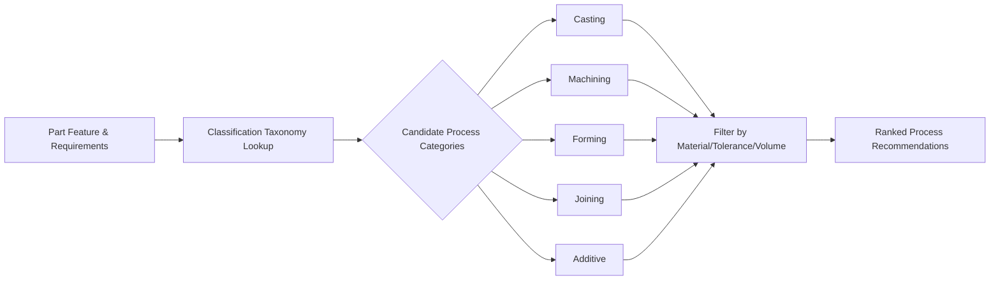
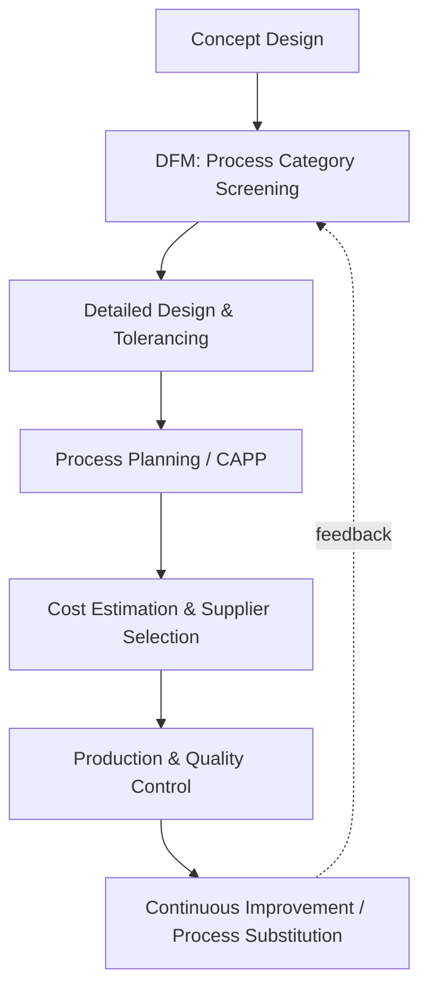

## Purpose and Practical Value of Classifying Processes

### Overview

Classifying manufacturing processes means organizing the vast and heterogeneous universe of transformation methods into structured categories based on shared characteristics — such as the mechanism of material transformation, energy source, or output geometry. This classification is not an academic exercise; it is a foundational engineering and managerial tool that enables systematic decision-making across process selection, cost estimation, education, automation, and quality control.

### Why Classification Is Necessary

Manufacturing encompasses hundreds of distinct processes spanning mechanical, thermal, chemical, and electrical domains. Without a structured taxonomy:

- Engineers cannot efficiently compare or select among alternative processes for a given part.
- Knowledge cannot be transferred systematically between similar processes (e.g., lessons from one casting method rarely generalize to machining without a shared framework).
- Databases, standards, and CAM/CAPP software cannot encode process capabilities in a machine-readable, searchable way.

**Key Points**

- Classification converts an unordered set of hundreds of processes into a navigable, hierarchical structure.
- It enables **abstraction** — reasoning about a category of processes (e.g., "all material removal processes") without needing exhaustive knowledge of every specific variant.
- It supports **prediction** — inferring likely capabilities, costs, or limitations of an unfamiliar process based on the category it belongs to.

### Core Purposes of Process Classification

#### 1. Process Selection and Design for Manufacturing (DFM)

Classification provides the decision framework used in **process selection**, where a designer or process engineer matches a part's requirements (material, geometry, tolerance, production volume, surface finish) to a compatible process family.

$$\text{Process}_{selected} = f(\text{Material}, \text{Geometry}, \text{Volume}, \text{Tolerance}, \text{Cost})$$

By first narrowing to a *category* (e.g., "bulk deformation processes" rather than "casting"), the engineer eliminates incompatible categories quickly before evaluating specific process variants within the shortlisted category.

**Example**

A designer needing a high-volume, thin-walled aluminum housing with complex internal geometry would use classification logic to:

1. Eliminate machining-dominant approaches (excessive material waste, poor economics at high volume for complex 3D internal cavities).
2. Narrow to the **casting** category, then further to **pressure die casting** (a subclass suited to thin walls, aluminum, high volume).

#### 2. Cost Estimation and Economic Analysis

Different process categories carry characteristic cost structures — fixed tooling cost, variable cycle-time cost, labor intensity, and scrap rate. Classification allows cost estimators to apply **parametric or category-based cost models** rather than deriving cost from first principles for every unique process.

| Process Category | Typical Fixed Cost | Typical Variable Cost | Volume Suitability |
| --- | --- | --- | --- |
| Casting | High (tooling/dies) | Low per unit | Medium–high volume |
| Machining | Low–medium | Medium–high per unit | Low–medium volume |
| Forming (e.g., stamping) | High (dies) | Very low per unit | High volume |
| Additive Manufacturing | Very low | High per unit | Low volume, high complexity |

#### 3. Standardization, Codification, and Communication

Classification underlies international standards (ISO, ASME, DIN) and coding systems (e.g., Group Technology codes, STEP-NC) used to:

- Communicate manufacturing intent unambiguously between designers, suppliers, and machinists across organizations and languages.
- Enable **Group Technology (GT)**, where parts with similar process requirements are grouped into families to standardize tooling, fixtures, and routings — reducing setup time and inventory.

#### 4. Computer-Aided Process Planning (CAPP) and Automation

Modern CAPP systems, CAM software, and digital manufacturing platforms rely on formal process taxonomies as their underlying data schema. A part feature (e.g., a "blind hole" or "external thread") is matched algorithmically against a classified database of processes capable of producing that feature within specified tolerances.

#### 5. Education, Training, and Knowledge Transfer

A classification system provides pedagogical scaffolding, allowing learners to build mental models incrementally — first understanding broad categories (e.g., subtractive vs. additive vs. formative), then specific processes within each. This mirrors how this course itself is structured, moving from foundational definitions to process-family-specific detail.

#### 6. Environmental, Safety, and Regulatory Management

Process categories often share common hazard profiles, emissions characteristics, and regulatory requirements:

- Thermal processes (welding, casting) share fume/particulate hazards and OSHA/EPA reporting categories.
- Chemical processes (etching, electroplating) share effluent treatment and hazardous materials handling requirements.

Classifying by mechanism allows a single safety or environmental protocol to be applied consistently across an entire process family rather than developed ad hoc for each variant.

#### 7. Capacity Planning and Facility Layout

Manufacturing systems engineers use process classification to group compatible equipment into **process-focused layouts** (job shops organizing by process type) versus **product-focused layouts** (flow lines organizing by product sequence), directly informing factory design decisions.

### Practical Value Across the Product Lifecycle

At each lifecycle stage, classification reduces the search space, standardizes communication, and enables reuse of prior engineering knowledge, rather than requiring re-derivation of process suitability from raw physical principles each time.

### Common Classification Bases Used to Deliver These Purposes

While later course sections detail each scheme, the practical value above is realized through classification along axes such as:

- **Mechanism of transformation**: mechanical, thermal, chemical, electrical
- **Material continuity effect**: material removal (subtractive), material addition (additive), material conservation/deformation (formative), joining
- **Production volume/repetition**: unit/job, batch, mass, continuous
- **Tooling dependency**: tooled (dies, molds) vs. tool-less (generative/additive)
- **Precision regime**: conventional, precision, ultra-precision/micro-manufacturing

### Limitations of Classification Systems

[Inference] No single classification scheme captures every relevant dimension simultaneously; a process may be classified differently depending on whether the classifier prioritizes energy mechanism, output geometry, or economic scale, so practitioners often must cross-reference multiple classification axes for complete process selection guidance. Hybrid and emerging processes (e.g., hybrid additive-subtractive machines) can also blur category boundaries, requiring classification frameworks to be periodically revised.

**Conclusion**

Classifying manufacturing processes is not merely descriptive taxonomy — it is the structural backbone enabling process selection, cost estimation, standardization, automation (CAPP/CAM), education, safety management, and facility planning. A well-designed classification system compresses the complexity of hundreds of processes into navigable categories, allowing engineers and organizations to make faster, more consistent, and more transferable manufacturing decisions throughout the product lifecycle.

**Related Topics**

- Classification of processes by transformation mechanism (mechanical, thermal, chemical, electrical)
- Material removal, addition, forming, and joining process families
- Group Technology (GT) and part family formation
- Computer-Aided Process Planning (CAPP) fundamentals
- Design for Manufacturing and Assembly (DFMA) principles
- Process capability analysis and tolerance charting
- Facility layout strategies (process-focused vs. product-focused)
- Production volume regimes and their influence on process selection