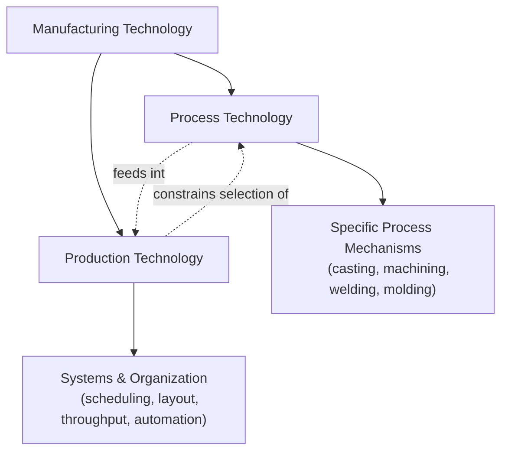
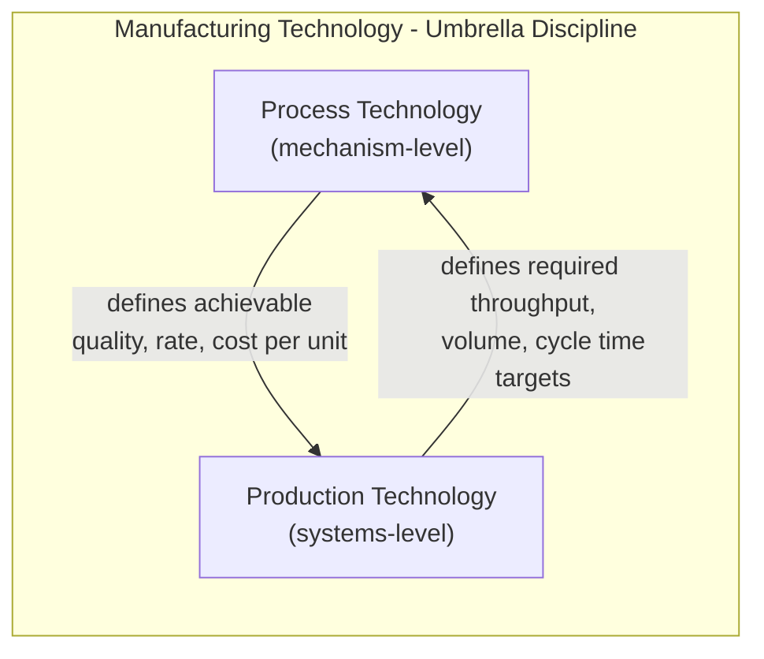

## Manufacturing Technology versus Process Technology versus Production Technology

### Overview

These three terms are frequently used interchangeably in casual industrial discourse, but each denotes a distinct scope within the broader discipline of industrial engineering. Distinguishing them precisely is essential for correctly scoping problems in curricula, standards, and organizational responsibilities (e.g., a "process engineer" vs. a "production manager" have formally different mandates).

**Key Points**

- **Manufacturing technology** is the broadest term: the entire body of knowledge, methods, and equipment used to convert materials into finished products.
- **Process technology** is a subset focused specifically on the *how* of transformation — the physical/chemical/mechanical mechanism applied to a workpiece.
- **Production technology** overlaps substantially with manufacturing technology but leans toward the *systems, planning, and organization* of converting processes into an operating output stream (throughput, scheduling, flow).

### Hierarchical Relationship

Manufacturing technology functions as the umbrella discipline; process technology and production technology are complementary lenses applied within it — one at the level of the individual transformation, the other at the level of the operating system that executes many transformations at scale.

### Manufacturing Technology

**Definition**: The complete body of scientific and engineering knowledge — materials science, mechanics, thermodynamics, chemistry, control systems, and organizational methods — applied to convert raw materials into finished goods.

**Scope includes**:

- All individual processes (casting, forming, machining, joining, additive manufacturing)
- Tooling, fixturing, and equipment design
- Material behavior under processing conditions
- Quality assurance and metrology
- Automation, robotics, and digital manufacturing (Industry 4.0)
- Organizational and economic aspects of running a manufacturing enterprise

Manufacturing technology is effectively the parent discipline that this entire course (Manufacturing Process Classifications) sits within — it is the field-level term.

### Process Technology

**Definition**: The specific engineering knowledge concerning how a single transformation mechanism converts a material's form, composition, or properties — i.e., the physics, chemistry, and parametric control of one process or a closely related family of processes.

**Scope includes**:

- Mechanism of transformation (e.g., plastic deformation in forging, solidification in casting, material removal in turning)
- Process parameters and their effect on output (temperature, pressure, feed rate, tool geometry, cycle time)
- Process-specific defects, tolerances, and achievable surface finishes
- Material-process compatibility (which materials a given process can handle)

**Example**

"Injection molding process technology" concerns melt flow behavior, mold filling dynamics, packing/holding pressure, cooling rate, and shrinkage/warpage — the physics internal to that one process. It does *not* inherently concern how many injection molding machines a factory should operate, how they are scheduled, or how the output integrates with downstream assembly — those are production technology questions.

$$\dot{Q} = k A \frac{\Delta T}{L}$$

A process-technology-level equation (e.g., conductive cooling rate in a mold, governing cycle time) is characteristic of this scope: it describes the internal physics of the transformation itself.

### Production Technology

**Definition**: The knowledge and methods concerned with organizing, planning, and executing manufacturing processes as a coordinated system to achieve target output volume, quality, cost, and delivery — i.e., converting individual processes into a functioning production line or facility.

**Scope includes**:

- Production planning and scheduling (MRP, JIT, lean production)
- Facility layout (process-focused, product-focused, cellular)
- Line balancing, throughput analysis, bottleneck management
- Material handling and logistics between process stations
- Automation integration and workflow sequencing
- Capacity planning and production volume strategy (job shop, batch, mass, continuous)

**Example**

"Production technology" applied to the same injection molding context would address: how many molding machines are needed to meet demand, how mold changeovers are scheduled across product variants, how molded parts are conveyed to downstream assembly stations, and how overall line efficiency (OEE) is measured and improved.

$$\text{Throughput} = \frac{\text{Units Produced}}{\text{Time Period}}$$

A production-technology-level metric like throughput describes system-level output rather than the physics of a single process step.

### Comparative Summary

| Dimension | Manufacturing Technology | Process Technology | Production Technology |
| --- | --- | --- | --- |
| Scope level | Entire discipline (umbrella) | Single transformation mechanism | System/organization of processes |
| Primary question | "What can be made and how, broadly?" | "How does this specific process work?" | "How do we run processes at scale efficiently?" |
| Typical unit of analysis | Industry/enterprise | Workpiece/operation | Production line/factory |
| Example concern | Overall product realization strategy | Melt flow physics in injection molding | Machine scheduling and line throughput |
| Related roles | Manufacturing engineer (general) | Process engineer | Production/industrial engineer, plant manager |
| Governing disciplines | Materials science, mechanics, systems engineering | Thermodynamics, mechanics of materials, chemistry | Operations research, industrial engineering, logistics |

### How the Three Interact in Practice

A change at either level cascades to the other:

- A **process technology** improvement (e.g., faster mold cooling via conformal cooling channels) directly reduces cycle time, which **production technology** planners then use to reduce machine count or increase throughput targets.
- A **production technology** decision (e.g., switching from batch to continuous flow production) may require selecting a different **process** altogether (e.g., replacing batch casting with continuous casting) to be economically viable at the new target volume.

### Why This Distinction Matters for Classification

This course's classification framework is primarily a **process technology** classification — it organizes processes by their internal transformation mechanism (mechanical, thermal, chemical, electrical) rather than by production system architecture. Understanding this distinction clarifies scope going forward:

- Topics like "material removal processes" or "casting processes" belong to **process technology** classification.
- Topics like "job shop vs. mass production" or "line balancing" belong to **production technology** and, while related, follow a separate classification logic (by volume/flow pattern rather than by transformation mechanism).

[Inference] In practice, industry usage of these three terms is not always rigorously separated — some organizations and texts use "manufacturing technology" and "production technology" interchangeably, particularly in operations management literature, so readers should confirm the intended scope from context when encountering these terms outside a formal academic framework.

**Related Topics**

- Classification of processes by transformation mechanism (process technology axis)
- Production volume regimes: job shop, batch, mass, continuous (production technology axis)
- Process planning and routing (bridge between process and production technology)
- Facility layout strategies and line balancing
- Industrial engineering vs. manufacturing engineering as disciplines
- Industry 4.0 and the convergence of process, production, and digital technology