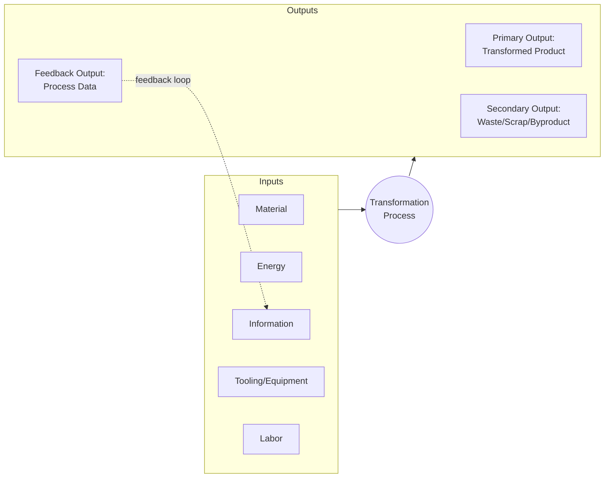
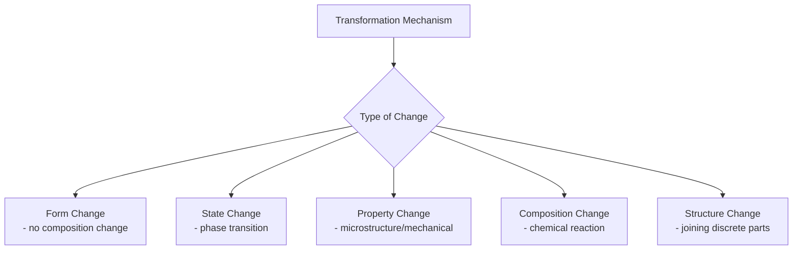

## Inputs, Transformations, and Outputs in a Generic Process Model

### Overview

The Input-Transformation-Output (I-T-O) model is the fundamental conceptual framework used to analyze, describe, and classify any manufacturing process, regardless of its underlying physics. Every manufacturing operation — from casting a turbine blade to 3D printing a prosthetic — can be abstracted into this generic structure, which makes it possible to compare dissimilar processes on a common analytical basis.

**Key Points**

- The I-T-O model treats a manufacturing process as a **system boundary** across which material, energy, and information flow.
- It is the conceptual ancestor of both process classification schemes and process capability/cost models used throughout manufacturing engineering.
- It applies identically at every level of granularity: a single operation, a full process, or an entire production line can each be modeled as an I-T-O system.

### The Generic Process Model

$$\text{Process}: (M, E, I, T, L) \xrightarrow{\text{transformation}} (P_{primary}, W_{waste}, D_{data})$$

where $M$ = material input, $E$ = energy input, $I$ = control/design information, $T$ = tooling/equipment, $L$ = labor, $P_{primary}$ = the intended product output, $W_{waste}$ = scrap/byproduct/emissions, and $D_{data}$ = process feedback data (measurements, sensor readings).

### 1. Inputs

Inputs are everything consumed, applied, or referenced by the process to effect the transformation. They are typically categorized into five sub-classes:

#### a) Material Inputs

The substance undergoing transformation — raw stock, semi-finished parts, or components to be assembled.

- **Examples**: aluminum billet (for extrusion), steel sheet (for stamping), thermoplastic pellets (for injection molding), sub-assemblies (for final assembly).
- Material inputs are characterized by composition, initial geometry, and initial material state (solid, liquid, powder).

#### b) Energy Inputs

The form of energy that drives the transformation mechanism.

- **Examples**: mechanical energy (press force in stamping), thermal energy (furnace heat in casting), electrical energy (arc energy in welding, laser energy in additive manufacturing), chemical energy (exothermic reaction in curing).
- Energy input type is often the primary axis used later in process classification (mechanical, thermal, chemical, electrical processes).

#### c) Information Inputs

The specifications and control data that define *what* transformation should occur and to what tolerance.

- **Examples**: CAD/CAM models, process parameters (temperature setpoints, feed rates), engineering drawings, tolerance specifications, quality standards.
- Information inputs increasingly take digital form (G-code, STEP files, digital twins) in modern manufacturing systems.

#### d) Tooling and Equipment Inputs

The physical apparatus that applies energy to material in a controlled manner.

- **Examples**: dies, molds, cutting tools, fixtures, jigs, machine frames, robotic end-effectors.
- Tooling is often the dominant fixed-cost driver in process economics (see prior discussion of cost estimation by process category).

#### e) Labor/Human Inputs

Human operators, programmers, or supervisors who set up, monitor, or directly perform operations.

- **Examples**: machine setup technicians, CNC programmers, quality inspectors, manual assembly workers.
- The degree of labor input varies drastically by automation level, ranging from fully manual processes to lights-out automated cells.

### 2. Transformation

The transformation is the core mechanism by which inputs are converted into outputs — the defining "black box" (or, when analyzed in depth, "white box") of the process.

**Key Points**

- Transformation can act on **form** (shape change without composition change — forming, machining), **state** (phase change — casting, sintering), **properties** (microstructural/mechanical change — heat treatment), **composition** (chemical change — plating, polymerization), or **structure** (joining — welding, adhesive bonding, fastening).
- The nature of the transformation mechanism is the single most common basis for high-level process classification, because it directly determines what materials, geometries, and tolerances are achievable.

#### Sub-elements of the Transformation Stage

| Sub-element | Description | Example |
| --- | --- | --- |
| Mechanism | The physical/chemical principle applied | Plastic deformation, melting/solidification, material removal via shear |
| Control loop | How parameters are monitored and adjusted during the process | Closed-loop temperature control in a furnace |
| Rate | Speed at which transformation proceeds | Deposition rate in additive manufacturing (mm³/s) |
| Duration/Cycle | Time required to complete one transformation cycle | Injection molding cycle time (fill + pack + cool + eject) |

### 3. Outputs

Outputs are everything produced by the transformation, classified into three categories:

#### a) Primary Output

The intended product — the transformed material, component, or assembly meeting (ideally) the specified requirements.

- Characterized by: dimensional accuracy, surface finish, mechanical/material properties, geometric conformance.

#### b) Secondary Output (Waste/Byproduct)

Unavoidable non-product outputs generated alongside the primary output.

- **Examples**: metal chips (machining), flash (molding/forging), off-gases (thermal processes), effluent (chemical processes), heat loss (all thermal processes, per the second law of thermodynamics).
- Secondary outputs are increasingly central to **sustainable manufacturing** analysis (material utilization ratio, energy efficiency, emissions per unit).

$$\eta_{material} = \frac{M_{product}}{M_{input}} \times 100\%$$

Material utilization efficiency $\eta_{material}$ is a standard process-comparison metric derivable directly from the I-T-O model — high in near-net-shape processes like casting, comparatively low in heavy material-removal machining.

#### c) Feedback/Data Output

Process data generated during transformation, used for quality control, process monitoring, and closed-loop adjustment.

- **Examples**: in-process sensor data (temperature, force, vibration), post-process inspection data (CMM measurements, X-ray inspection), statistical process control (SPC) data.
- This output category is the basis of modern **Industry 4.0** and digital manufacturing systems, where feedback data is fed back into the information input to adjust future cycles.

### Worked Example: Sand Casting Modeled as I-T-O

| I-T-O Element | Sand Casting Instance |
| --- | --- |
| Material input | Molten metal alloy (e.g., aluminum, gray iron) |
| Energy input | Thermal energy (furnace melting), gravitational/pressure energy (mold filling) |
| Information input | Pattern/mold design, pouring temperature spec, cooling rate spec |
| Tooling input | Sand mold, pattern, gating/riser system, flask |
| Labor input | Mold preparation, pouring operator, shakeout/finishing labor |
| Transformation | Solidification (liquid-to-solid phase change) within mold cavity |
| Primary output | Cast component (near-net shape) |
| Secondary output | Runners/risers (scrap metal, often recycled), sand waste, emissions |
| Feedback output | Casting inspection data (porosity, dimensional check), process log |

### Why This Model Underpins Process Classification

The I-T-O model provides the analytical vocabulary used throughout subsequent classification schemes in this course:

- **Classification by energy mechanism** directly maps to the "Energy Input" category (mechanical, thermal, chemical, electrical processes).
- **Classification by material continuity effect** (removal, addition, forming, joining) directly maps to the "Transformation" stage's effect on material form/structure.
- **Classification by output characteristics** (precision regime, surface finish class) directly maps to the "Primary Output" category.
- **Process capability and cost analysis** (introduced in the prior "purpose and value" discussion) is computed directly from I-T-O quantities (material efficiency, energy consumption per unit, cycle time).

[Inference] Real industrial processes often involve more complex, multi-stage I-T-O chains with internal feedback loops (e.g., in-process adaptive control), and the simplified single-block model presented here is a pedagogical abstraction; practitioners modeling an actual production line may need to decompose a single "process" into multiple nested I-T-O sub-models to capture this internal complexity accurately.

**Related Topics**

- Classification of processes by transformation mechanism (mechanical, thermal, chemical, electrical)
- Material utilization efficiency and sustainable manufacturing metrics
- Process capability and cycle time analysis
- Statistical Process Control (SPC) and closed-loop feedback systems
- Industry 4.0, digital twins, and real-time process monitoring
- Process planning: translating I-T-O models into routings and operation sheets