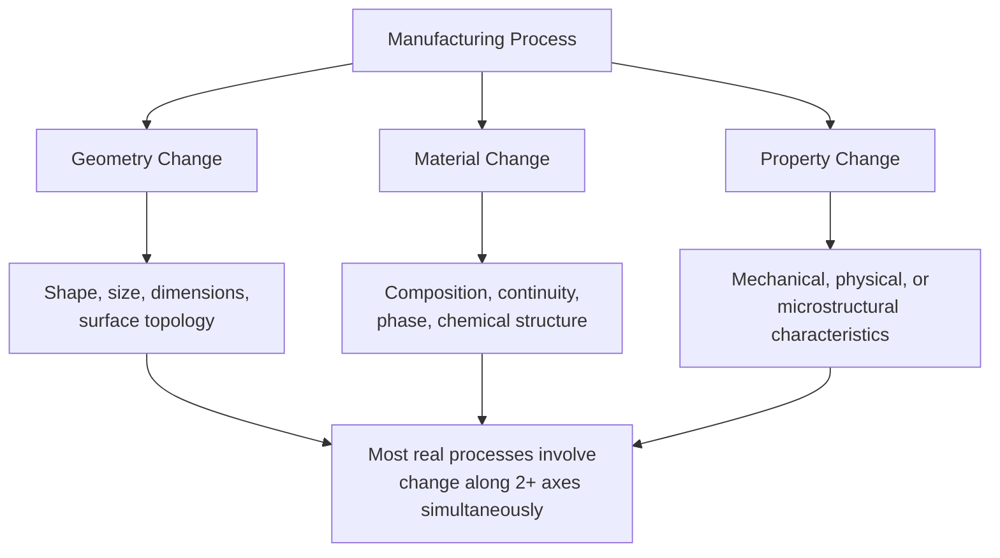
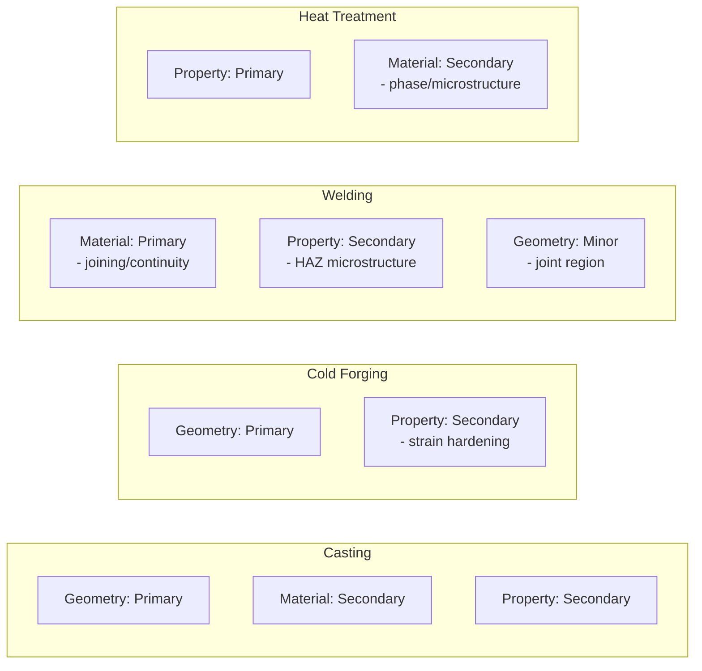

## Geometry, Material, and Property Change as Classification Lenses

### Overview

Beyond classifying processes by their energy mechanism (mechanical, thermal, chemical, electrical) or by the input-transformation-output model, a complementary and highly practical approach classifies processes according to **what changes** in the workpiece as a result of the transformation. This "change-based" lens asks: does the process alter the part's *geometry* (shape/dimensions), its *material* (composition/continuity), its *properties* (mechanical/physical characteristics), or some combination of these three?

This lens is particularly valuable because it maps directly onto the engineering questions a designer asks when reading a part drawing: "What shape do I need?", "What material must it be?", and "What performance properties must it exhibit?"

**Key Points**

- Geometry, material, and property change are not mutually exclusive — most real processes cause change along more than one axis simultaneously.
- This lens complements (rather than replaces) mechanism-based classification (mechanical/thermal/chemical/electrical); the two are often cross-tabulated in process selection charts.
- Recognizing which axis a process primarily addresses helps engineers sequence process routings correctly (e.g., establishing geometry before finalizing properties, or vice versa).

### The Three Classification Lenses

### 1. Geometry Change

**Definition**: Processes primarily concerned with establishing or modifying the physical shape, size, dimensions, and surface topology of a workpiece, generally without intentionally altering the base material's chemical composition.

**Sub-categories**:

- **Shape generation** — creating a new geometric form from undifferentiated or bulk stock (casting, forging, additive manufacturing).
- **Shape modification** — removing or redistributing material from an existing near-net-shape blank (machining, grinding).
- **Dimensional refinement** — achieving tighter tolerances or finer surface finish on an already-shaped part (lapping, honing, polishing).

**Example**

Turning a cylindrical shaft on a lathe changes only the shaft's diameter and surface finish (geometry); the steel's chemical composition and, to first order, its bulk mechanical properties remain unchanged by the cutting action itself (aside from minor surface work-hardening effects).

$$V_{removed} = V_{initial} - V_{final}$$

Geometry-change processes are often quantified by material removal rate (MRR) or forming ratio, both purely geometric/volumetric measures independent of composition.

### 2. Material Change

**Definition**: Processes primarily concerned with altering the composition, continuity, phase, or chemical structure of the workpiece — what the part is *made of*, or how discrete material volumes are joined or separated.

**Sub-categories**:

- **Compositional change** — altering elemental/molecular makeup (alloying, carburizing, chemical vapor deposition, electroplating).
- **Phase/state change** — transitioning between solid, liquid, or amorphous states (casting/solidification, sintering, curing of polymers).
- **Continuity change** — joining previously separate material volumes into one continuous body, or separating one continuous body into parts (welding, adhesive bonding, cutting, shearing).

**Example**

Carburizing a steel gear introduces carbon atoms into the surface layer via diffusion at elevated temperature, changing the surface composition (and consequently its hardenability) without altering the gear's macroscopic geometry.

Welding two steel plates together is a material-change process at its core: it achieves metallurgical continuity (often via localized melting and re-solidification) across what were previously two distinct, separate volumes of material — the plates' individual geometries are largely retained, but their material continuity is fundamentally altered.

### 3. Property Change

**Definition**: Processes primarily concerned with altering the mechanical, physical, thermal, electrical, or microstructural properties of a workpiece, typically without significant intentional geometry or bulk composition change.

**Sub-categories**:

- **Mechanical property modification** — altering hardness, strength, ductility, toughness (heat treatment: annealing, quenching, tempering; cold working/strain hardening).
- **Microstructural modification** — altering grain size, phase distribution, crystal structure (normalizing, recrystallization annealing).
- **Surface property modification** — altering surface hardness, wear resistance, or corrosion resistance without changing bulk properties (shot peening, nitriding, anodizing).

**Example**

Quenching and tempering a steel component changes its hardness, yield strength, and toughness substantially — often by a factor of two or more in yield strength — while its geometry (dimensions) and bulk chemical composition remain essentially unchanged (aside from minor surface effects in some quench media).

$$\sigma_y \propto \frac{1}{\sqrt{d}}$$

The Hall-Petch relationship, relating yield strength $\sigma_y$ to average grain diameter $d$, exemplifies a property-change process's governing physics — heat treatments that refine grain size directly increase yield strength without altering part geometry.

### Cross-Classification: Most Processes Span Multiple Lenses

While each process has a *primary* lens, real transformations frequently cause secondary changes along the other two axes. Recognizing this overlap is essential for accurate process planning.

| Process | Primary Change | Secondary Change(s) |
| --- | --- | --- |
| Sand Casting | Geometry (near-net shape) | Material (solidification/phase change), Property (as-cast grain structure) |
| Cold Forging | Geometry (shape) | Property (strain hardening increases strength/hardness) |
| Welding | Material (continuity/joining) | Property (heat-affected zone microstructure change), Geometry (minor, at joint) |
| Case Hardening | Property (surface hardness) | Material (surface composition via carbon/nitrogen diffusion) |
| CNC Milling | Geometry (material removal) | Property (minor surface work-hardening) |
| Injection Molding | Geometry (shape) | Material (polymer chain orientation, crystallinity — a property/material hybrid effect) |
| Anodizing | Property (corrosion/wear resistance) | Material (oxide layer composition change), Geometry (negligible thickness change) |

### Practical Value of This Lens in Process Routing

Because most parts require change along all three axes to reach final specification, process **routings** (sequences of operations) are typically planned by assigning each stage to its dominant lens, in a logical order:

This ordering reflects a common industrial heuristic: establish approximate geometry first (least precise, most material-intensive stage), refine geometry via machining, then apply property-changing heat treatments (since machining after full hardening is often impractical), then apply finishing/coating and final assembly. [Inference] Actual routing order varies by part requirements and industry practice — for example, some designs require finish machining *after* heat treatment to correct distortion, so this sequence should be treated as a common heuristic rather than a universal rule.

### Why This Lens Complements Mechanism-Based Classification

| Classification Lens | Answers the Question | Example Categories |
| --- | --- | --- |
| Energy mechanism | *How* is the transformation driven? | Mechanical, thermal, chemical, electrical |
| Material continuity effect | Does material get removed, added, or conserved? | Subtractive, additive, formative, joining |
| **Geometry/Material/Property change** | *What attribute* of the part is being altered? | Geometry, material, property (and combinations) |

Using all three lenses together gives a complete engineering description of any process: for example, "grinding" can be described as a *mechanical* (energy mechanism), *subtractive* (material continuity effect), primarily *geometry-change* (this lens) process with a *secondary property* effect (surface residual stress/hardening from grinding heat).

**Conclusion**

Classifying processes by whether they primarily change geometry, material, or property gives engineers a design-oriented lens that maps directly to part specifications (shape, composition, and performance requirements). Because most processes affect more than one of these dimensions simultaneously, this lens is most powerful when used to identify a process's *primary* effect for routing and sequencing purposes, while remaining alert to secondary effects that influence downstream process planning.

**Related Topics**

- Classification by material continuity effect: subtractive, additive, formative, joining processes
- Classification by energy mechanism: mechanical, thermal, chemical, electrical processes
- Process routing and sequencing logic
- Heat treatment fundamentals and the Hall-Petch relationship
- Work hardening and strain hardening in forming processes
- Design for Manufacturing (DFM) and property specification in engineering drawings