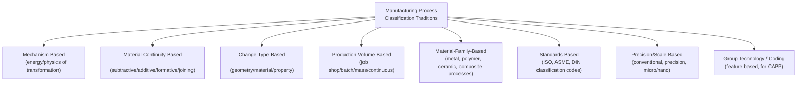
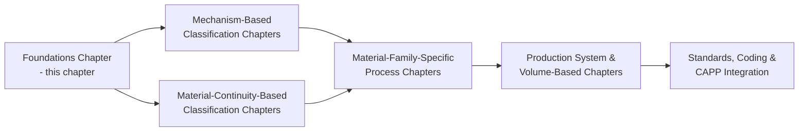

## Overview of Major Classification Traditions in the Field

### Overview

Manufacturing process classification has evolved through several distinct but overlapping intellectual traditions, each developed to serve different practical needs — engineering education, production system design, standards bodies, and computer-aided process planning. No single classification scheme is universally adopted; rather, practitioners and textbooks draw on multiple traditions depending on the task at hand. This section surveys the major traditions so that subsequent, more detailed chapters can be understood as elaborations within one or more of these frameworks.

**Key Points**

- Classification traditions differ primarily in their **organizing principle** — the single question each scheme uses to partition the universe of processes.
- Most modern textbooks and standards use a **hybrid** approach, combining elements from multiple traditions.
- Understanding these traditions helps engineers recognize *why* a given source organizes processes the way it does, and how to translate between different classification vocabularies.

### Map of the Major Traditions

### 1. Mechanism-Based (Energy-Source) Tradition

**Organizing principle**: What form of energy drives the transformation?

**Categories**: Mechanical, thermal, chemical, electrical/electromagnetic (and sometimes a separate biological/biochemical category for emerging biomanufacturing processes).

This is the most physics-fundamental tradition, rooted in engineering mechanics and thermodynamics curricula. It directly follows from the I-T-O model's "Energy Input" element discussed previously.

**Example**: Machining (mechanical energy via cutting force), casting (thermal energy via melting/solidification), electroplating (electrical/chemical energy via electrolysis), electrochemical machining (electrical energy via anodic dissolution).

**Strengths**: Maps cleanly to underlying physics; supports first-principles process modeling and simulation.

**Limitations**: Does not directly indicate the effect on the workpiece (geometry/material/property), requiring a secondary lens for design decisions.

### 2. Material-Continuity-Based Tradition

**Organizing principle**: Does the process remove, add, or conserve material volume, or join separate material bodies?

**Categories**: Subtractive (material removal), additive (material addition/deposition), formative/deformation (material conserved, shape changed), joining (separate bodies unified).

This tradition became especially prominent with the rise of additive manufacturing, which required a clear conceptual counterpart to traditional subtractive machining.

**Example**: CNC milling (subtractive), fused deposition modeling/3D printing (additive), sheet metal stamping (formative), resistance spot welding (joining).

**Strengths**: Highly intuitive for design and cost-estimation purposes (buy-to-fly ratio, material utilization); widely used in modern manufacturing education.

**Limitations**: Some processes span categories (e.g., powder bed fusion additive manufacturing followed by machining finishing) and require hybrid labeling.

### 3. Change-Type-Based Tradition

**Organizing principle**: What attribute of the workpiece changes — geometry, material composition/continuity, or property?

Covered in depth in the preceding section of this chapter. This tradition emphasizes the *design specification* perspective: what a drawing calls out (dimensions, material callout, hardness/property callout) maps directly to a process category.

**Strengths**: Aligns naturally with how designers specify parts; useful for DFM and routing sequence logic.

**Limitations**: Most real processes affect multiple attributes simultaneously, requiring primary/secondary distinctions.

### 4. Production-Volume/Flow-Based Tradition

**Organizing principle**: What repetition rate, batch size, and flow pattern characterizes the production system executing the process?

**Categories**: Job shop (unit/one-off production), batch production, mass production, continuous process production.

This tradition originates from production/industrial engineering and operations management rather than from process physics. It classifies the *production system*, not strictly the transformation mechanism itself — though certain processes are strongly associated with certain volume regimes (e.g., die casting with mass production due to high tooling cost amortization).

**Strengths**: Directly informs facility layout, scheduling, and economic analysis.

**Limitations**: The same underlying process (e.g., machining) can appear across nearly all volume regimes, so this tradition alone does not classify process *mechanism*.

### 5. Material-Family-Based Tradition

**Organizing principle**: What material family is being processed?

**Categories**: Metal manufacturing processes, polymer/plastics processes, ceramic processes, composite manufacturing processes, and increasingly, processes for advanced/smart materials.

Many textbooks (and much of industrial practice) are organized around material family first, then process type within each family, because material behavior fundamentally constrains which physical mechanisms are viable (e.g., ceramics cannot generally be forged like metals due to brittleness).

**Strengths**: Reflects how materials science and manufacturing curricula are often co-taught; practical for material-specific process selection.

**Limitations**: Creates redundant categories across material families for conceptually similar mechanisms (e.g., "sintering" appears separately under both powder metallurgy and technical ceramics).

### 6. Standards-Based / Regulatory Tradition

**Organizing principle**: How do formal national/international standards bodies define and code manufacturing processes for regulatory, statistical, or interoperability purposes?

**Examples**:

- **DIN 8580** (Germany) — a widely referenced hierarchical classification of manufacturing processes into six main groups: Urformen (primary shaping), Umformen (forming), Trennen (separating/cutting), Fügen (joining), Beschichten (coating), and Stoffeigenschaftändern (changing material properties).
- **ISO/ASME welding and process symbols** — standardized codes for identifying specific processes on engineering drawings.
- **ISIC/NAICS** — economic/statistical classification of manufacturing as a sector (introduced earlier in this chapter), with sub-codes for process-adjacent industries.

**Strengths**: Provides legally and internationally recognized, unambiguous definitions; essential for cross-border communication, contracts, and regulatory compliance.

**Limitations**: Can be more rigid and slower to update than academic or industrial classification schemes, particularly for emerging processes (e.g., additive manufacturing required significant standards development, such as ISO/ASTM 52900, to be formally incorporated).

[Inference] The DIN 8580 six-group system is frequently cited in European and international manufacturing engineering literature as a rigorous formal counterpart to the more colloquial subtractive/additive/formative/joining tradition common in English-language texts; both systems are conceptually compatible but use different category boundaries and terminology, so cross-referencing is often needed when comparing sources.

### 7. Precision/Scale-Based Tradition

**Organizing principle**: What dimensional scale and precision regime does the process operate at?

**Categories**: Conventional manufacturing, precision manufacturing, ultra-precision manufacturing, micro-manufacturing, nano-manufacturing.

This tradition has grown in importance with the rise of semiconductor fabrication, MEMS, and micro-scale medical devices, where conventional process classifications (e.g., "machining") must be further subdivided by achievable tolerance and feature size.

**Example**: Conventional turning (tolerances ~±0.1 mm) versus diamond turning (ultra-precision, tolerances ~±0.1 μm) versus photolithography (nano-scale feature definition).

**Strengths**: Essential for high-tech industries where scale fundamentally changes applicable physics (e.g., surface forces dominate over gravity at micro/nano scale).

**Limitations**: Cuts across all other traditions rather than replacing them — it is a modifier applied to a process, not a standalone taxonomy.

### 8. Group Technology / Feature-Based Coding Tradition

**Organizing principle**: How can parts and processes be coded into families based on shared manufacturing attributes to support Computer-Aided Process Planning (CAPP)?

**Examples**: Opitz classification system, Group Technology (GT) coding schemes that assign alphanumeric codes to parts based on geometric and manufacturing attributes, enabling retrieval of similar historical process plans.

**Strengths**: Directly operationalizes classification into software-usable, machine-readable form; enables retrieval-based (variant) process planning.

**Limitations**: Requires significant upfront coding investment; codes can become organization-specific and non-standardized across companies.

### Comparative Summary Table

| Tradition | Organizing Question | Primary Use Case | Key Limitation |
| --- | --- | --- | --- |
| Mechanism-based | What energy drives it? | Physics-based modeling, education | Doesn't indicate workpiece effect |
| Material-continuity-based | Remove, add, conserve, or join? | DFM, cost estimation | Hybrid processes blur categories |
| Change-type-based | Geometry, material, or property? | Design specification, routing | Most processes span multiple types |
| Production-volume-based | What repetition/flow pattern? | Facility layout, scheduling | Classifies system, not mechanism |
| Material-family-based | What material is processed? | Materials-focused curricula | Redundant categories across families |
| Standards-based | What is the legal/formal definition? | Regulation, international trade | Slower to incorporate new processes |
| Precision/scale-based | What tolerance/size regime? | High-tech/micro manufacturing | Modifier, not standalone taxonomy |
| Group Technology/coding | What CAPP-retrievable family? | Automated process planning | Requires coding investment |

### How These Traditions Relate to This Course's Structure

This "Foundations of Manufacturing Process Classification" chapter establishes the conceptual vocabulary (definitions, I-T-O model, change-type lenses, purpose/value) that subsequent chapters will apply within one or more of the eight traditions surveyed here — most commonly beginning with mechanism-based and material-continuity-based classification, since these two traditions offer the clearest, most widely-adopted starting taxonomy in contemporary manufacturing engineering education.

**Conclusion**

No single classification tradition is definitively "correct"; each was developed to answer a different practical question, and mature manufacturing engineering practice draws on several simultaneously. Recognizing which tradition a given source, standard, or software system is using — and being able to translate between them — is itself a core competency for navigating manufacturing literature, standards, and CAPP tools.

**Related Topics**

- DIN 8580 six-group classification system in detail
- Mechanism-based classification: mechanical, thermal, chemical, electrical processes
- Material-continuity-based classification: subtractive, additive, formative, joining
- Group Technology and Opitz coding systems
- ISO/ASTM 52900 and additive manufacturing standardization
- Precision and micro-manufacturing process categories
- Computer-Aided Process Planning (CAPP) architectures