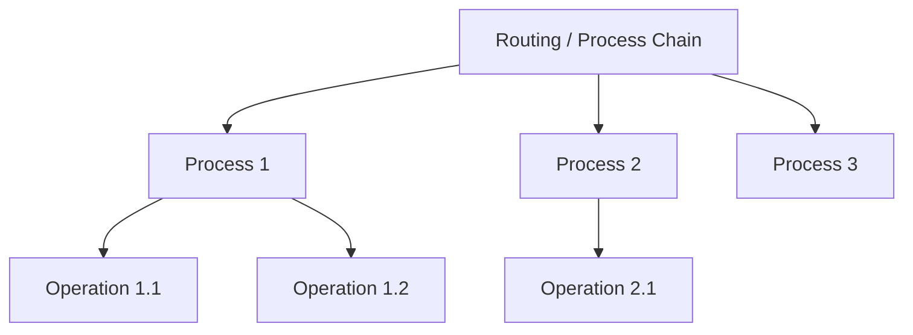
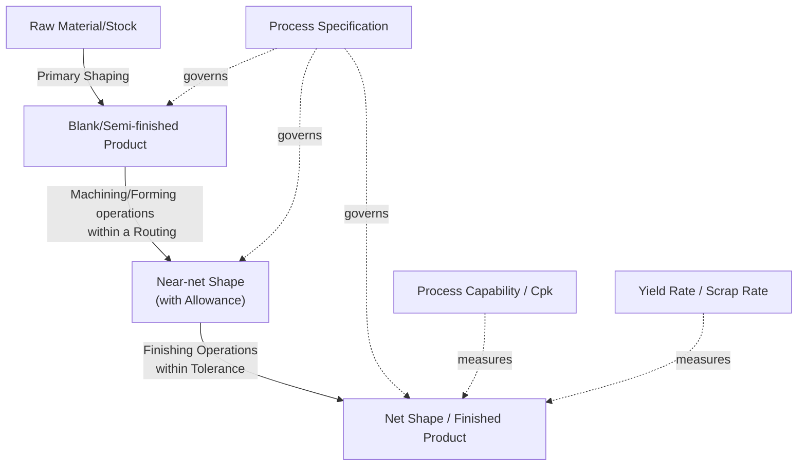

## Core Vocabulary and Terminology for Describing Processes

### Overview

Precise, shared vocabulary is the foundation of unambiguous communication in manufacturing engineering — between designers and process engineers, between suppliers and customers, and across the classification traditions surveyed previously. This section consolidates the essential terminology used throughout process classification, providing formal definitions, distinctions between commonly confused terms, and usage examples.

**Key Points**

- Many terms below are used loosely in casual conversation but carry precise, distinct technical meanings in formal manufacturing engineering usage.
- Correct terminology is a prerequisite for reading standards (DIN 8580, ISO), process planning documents (routings, operation sheets), and CAPP system outputs correctly.
- This vocabulary set builds directly on the I-T-O model and classification traditions covered earlier in this chapter.

### Hierarchical/Structural Terms

| Term | Definition |
| --- | --- |
| **Process** | A named, technology-defined transformation mechanism applied to a workpiece (e.g., "turning," "injection molding," "gas metal arc welding"). |
| **Operation** | A single discrete task performed as part of executing a process on a specific workpiece (e.g., "rough turn OD," "drill 4x Ø10mm holes"). One process may comprise multiple operations. |
| **Process Plan / Routing** | The complete ordered sequence of operations (potentially spanning multiple processes) required to convert raw stock into a finished part. |
| **Process Chain** | A synonym for routing, emphasizing the sequential, linked nature of operations across possibly different process technologies. |
| **Workstation / Work Center** | The physical location (machine, cell, or manual station) where an operation is performed. |
| **Setup** | The preparatory configuration of a machine/tooling/fixture before operations can begin (also: "changeover" when switching between part types). |
| **Cycle** | One complete execution of a process from start to finish, producing one unit (or one batch) of output. |
| **Cycle Time** | The elapsed time to complete one cycle; a key production-technology metric distinct from process-technology parameters like feed rate. |

### Terms Describing the Workpiece Through Its Lifecycle

| Term | Definition |
| --- | --- |
| **Raw Material / Stock** | The unprocessed or minimally processed input material before any manufacturing transformation (e.g., billet, ingot, sheet coil, resin pellets). |
| **Blank** | A piece of stock cut or formed to approximate size/shape prior to further processing (e.g., a sheet metal blank before stamping). |
| **Workpiece** | The general term for the part being actively processed at any stage. |
| **Semi-finished Product** | A workpiece that has undergone some transformation but requires further processing before it is usable/sellable (e.g., hot-rolled bar stock, forged preform). |
| **Near-net Shape** | A workpiece whose geometry closely approximates the final part geometry, requiring minimal further material removal (e.g., precision forgings, investment castings). |
| **Net Shape** | A workpiece produced directly to final dimensions, requiring no further shaping (only finishing operations, if any). |
| **Finished Product** | The completed part or assembly meeting all specified requirements, ready for use, sale, or further assembly. |

### Terms Describing Process Effects (linking to prior "Change Lenses" discussion)

| Term | Definition |
| --- | --- |
| **Allowance** | Intentional extra material left on a workpiece to be removed by a subsequent finishing operation (e.g., machining allowance on a casting). |
| **Tolerance** | The permissible variation range for a dimension or property, specified as $\pm$ a value or as an upper/lower limit pair. |
| **Draft/Draft Angle** | A slight taper applied to vertical surfaces in molds/dies to permit part removal (relevant in casting, molding, forging). |
| **Flash** | Excess material that escapes the mold/die cavity at the parting line during forming/molding processes; typically removed in a secondary trimming operation. |
| **Shrinkage** | Dimensional reduction of a workpiece as it cools/solidifies/cures, which pattern and mold designers must compensate for. |
| **Residual Stress** | Internal stress remaining in a workpiece after processing, even with no external load applied; can result from thermal gradients or non-uniform plastic deformation. |
| **Heat-Affected Zone (HAZ)** | The region of base material (not melted) whose microstructure and properties are altered by heat from an adjacent thermal process, most notably welding. |

$$T_{tol} = T_{upper} - T_{lower}$$

Tolerance width $T_{tol}$ is the fundamental quantity linking achievable process precision (a process-technology characteristic) to design requirements (an information input, per the I-T-O model).

### Terms Describing Process Capability and Performance

| Term | Definition |
| --- | --- |
| **Process Capability** | A quantitative measure (commonly $C_p$, $C_{pk}$) of a process's ability to produce output within specified tolerance limits under statistical control. |
| **Achievable Tolerance** | The typical range of dimensional precision a given process can reliably deliver, often tabulated by process type (e.g., sand casting ~±0.5mm vs. CNC machining ~±0.01mm). |
| **Surface Finish / Roughness** | A quantified measure of surface texture, commonly expressed as $R_a$ (arithmetic average roughness), used to characterize process output quality. |
| **Material Removal Rate (MRR)** | Volume of material removed per unit time in subtractive processes, a key throughput/economics metric. |
| **Deposition Rate** | Volume or mass of material added per unit time in additive/joining processes (analogous counterpart to MRR). |
| **Yield / Yield Rate** | The proportion of output units meeting quality specifications, expressed as a percentage of total units produced. |
| **Scrap Rate** | The proportion of input material or output units rejected/discarded due to defects or process waste, expressed as a percentage. |

$$C_{pk} = \min\left(\frac{USL - \mu}{3\sigma}, \frac{\mu - LSL}{3\sigma}\right)$$

Process capability index $C_{pk}$ formally quantifies how well a process's actual output distribution (mean $\mu$, standard deviation $\sigma$) fits within specification limits ($USL$, $LSL$) — a term that recurs throughout quality engineering and statistical process control.

### Terms Distinguishing Similar/Commonly Confused Concepts

| Term Pair | Distinction |
| --- | --- |
| **Process vs. Operation** | Process = the named technology; Operation = a discrete task within executing that process on one part. |
| **Tolerance vs. Allowance** | Tolerance = permissible variation in a final dimension; Allowance = intentional extra stock left for later removal. |
| **Accuracy vs. Precision** | Accuracy = closeness to the true/target value; Precision = repeatability/consistency of repeated measurements, independent of whether they're correct. |
| **Net shape vs. Near-net shape** | Net shape requires no further shaping; near-net shape requires minor additional shaping/finishing. |
| **Batch vs. Lot** | Batch commonly refers to a group processed together through one cycle/operation; Lot often refers to an administratively/commercially grouped quantity (may span multiple batches) — usage varies by industry. |
| **Fixture vs. Jig** | A fixture holds/locates a workpiece but does not guide the tool; a jig both holds the workpiece and guides the cutting tool (e.g., a drill jig). |
| **Die vs. Mold** | "Die" is typically used for metal-forming processes (stamping, forging, extrusion dies); "mold" is typically used for casting and polymer processes (injection molds, casting molds) — usage conventions vary somewhat by industry and region. |

[Inference] Some of these term-pairs (particularly "batch vs. lot" and regional "die vs. mold" conventions) are subject to industry-specific or company-specific usage variation rather than a single universally enforced standard, so definitions should be confirmed against the specific standard or organizational glossary in use when precision matters (e.g., in contracts or quality documentation).

### Terms Describing Production Context (linking forward to production-volume classification)

| Term | Definition |
| --- | --- |
| **Job Production** | Manufacturing of a single unit or very small quantity, often customized (also: "unit production," "one-off production"). |
| **Batch Production** | Manufacturing of parts in discrete, finite groups (batches), with different products/batches potentially sharing equipment sequentially. |
| **Mass Production** | High-volume manufacturing of standardized/identical products, typically using dedicated, product-specific tooling and layout. |
| **Continuous Production** | Manufacturing in an uninterrupted flow, characteristic of process industries (chemical, petrochemical) rather than discrete unit production. |
| **Lead Time** | The total elapsed time from order/process initiation to completion/delivery of output. |
| **Takt Time** | The target pace of production required to meet customer demand, calculated as available production time divided by customer demand rate. |

$$\text{Takt Time} = \frac{\text{Available Production Time}}{\text{Customer Demand (units)}}$$

### Terms Related to Standards and Documentation

| Term | Definition |
| --- | --- |
| **Process Specification** | A formal document defining required parameters, materials, and acceptance criteria for executing a process. |
| **Work Instruction** | A detailed, step-by-step document guiding an operator through an operation. |
| **Bill of Process (BoP)** | A structured document listing all operations, sequence, and resources required to manufacture a part (the process-engineering counterpart to a Bill of Materials). |
| **Bill of Materials (BOM)** | A structured list of all raw materials, components, and sub-assemblies required to build a product — an information input distinct from, but linked to, the Bill of Process. |

### Visual Summary: Terminology Map

**Conclusion**

This core vocabulary — spanning structural terms (process, operation, routing), workpiece-lifecycle terms (stock, blank, near-net shape, finished product), effect-description terms (tolerance, allowance, residual stress), and performance terms (capability, yield, MRR) — forms the shared technical language used throughout the remainder of this course. Precise use of these terms, and clear recognition of commonly confused pairs, is essential for correctly interpreting process classifications, standards documents, and process planning outputs covered in subsequent chapters.

**Related Topics**

- Process capability analysis and statistical process control (SPC)
- Tolerance stack-up and geometric dimensioning and tolerancing (GD&T)
- Bill of Process vs. Bill of Materials in manufacturing documentation
- Achievable tolerance and surface finish tables by process type
- Production volume regimes: job, batch, mass, continuous (detailed treatment)
- Fixture and jig design fundamentals