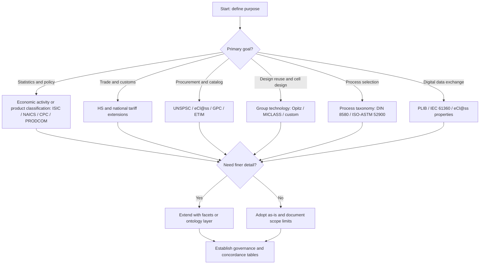

## Scope and Limits of Classification Systems Across Industries


### Introduction

A **classification system** is a structured scheme that assigns entities (products, processes, parts, materials, activities, or firms) to categories according to defined criteria. In manufacturing, classification systems underpin process planning, cost estimation, procurement, statistical reporting, trade regulation, quality assurance, and digital manufacturing data exchange.

No single classification system serves every purpose. Each system is built around a **primary objective** (for example, economic statistics, tariff assessment, shop-floor part retrieval, or process selection), and its **scope** (what it can describe well) and **limits** (what it cannot describe, or describes poorly) follow directly from that objective. Understanding these boundaries is a foundational skill for anyone selecting, adapting, or integrating classification schemes in manufacturing.

This topic covers:

- The purposes and structural principles of classification systems
- The major families of systems used across industries
- Scope: where each family works well
- Limits: systematic weaknesses and failure modes
- Cross-industry mapping and interoperability problems
- Evaluation criteria and practical selection guidance

---

### Core Concepts and Terminology

| Term | Definition |
| --- | --- |
| **Classification** | Assigning entities to classes based on shared attributes |
| **Taxonomy** | Hierarchical classification with parent-child (is-a) relationships |
| **Coding system** | Symbolic representation (numeric, alphabetic, alphanumeric) of a class |
| **Ontology** | Formal model of entities, attributes, and relations, richer than a taxonomy |
| **Scope** | The set of entities and attributes a system is designed to cover |
| **Granularity** | Level of detail at which classes are distinguished |
| **Exhaustiveness** | Every entity in scope fits at least one class |
| **Mutual exclusivity** | Each entity fits exactly one class (at a given level) |
| **Concordance (crosswalk)** | Mapping table between two classification systems |
| **Basis of classification** | The organizing principle (input, output, process, function, geometry, material) |

**Key Points**

- A good classification is both **exhaustive** and **mutually exclusive** within its scope, but real manufacturing data frequently violates one or both properties.
- The **basis of classification** determines what questions the system can answer. A system organized by *output product* cannot reliably answer questions about *process route*.
- Scope is defined by three axes: **entity type**, **attribute coverage**, and **industry coverage**.

---

### Purposes of Classification in Manufacturing

Classification systems serve distinct purposes, and a mismatch between purpose and system is the most common source of failure.

| Purpose | Typical Question Answered | Example Systems |
| --- | --- | --- |
| Economic statistics | How much output does sector X produce? | ISIC, NAICS, NACE |
| Product statistics and trade | What goods were produced or traded? | CPC, PRODCOM, HS |
| Procurement and e-commerce | How do I identify and buy this item uniformly? | UNSPSC, eCl@ss, GPC |
| Shop-floor part retrieval | Do we already make a similar part? | Opitz, MICLASS, DCLASS, KK-3 |
| Process selection | Which process route suits this shape/material? | Process taxonomies (Schey, Ashby-style, DIN 8580) |
| Product data exchange | How do systems share technical attributes? | ISO 13584 (PLIB), IEC 61360, eCl@ss |
| Regulatory and safety | Which rules apply to this item or process? | Hazard classes, machinery categories |
| Quality and inspection | What tolerances or inspection regime applies? | Feature and tolerance classes |

**Key Points**

- Statistical systems favor **stability over time** and **international comparability**; they sacrifice technical detail.
- Group-technology (GT) systems favor **geometric and manufacturing similarity**; they sacrifice cross-company comparability.
- Procurement systems favor **buyer-oriented naming**; they sacrifice process information.

---

### Major Families of Classification Systems

#### Economic Activity Classifications

These classify **establishments or firms** by their principal activity.

- **ISIC** (International Standard Industrial Classification of All Economic Activities, UN)
- **NACE** (EU statistical classification of economic activities, derived from ISIC)
- **NAICS** (North American Industry Classification System, based on a production-oriented principle, grouping establishments with similar production processes)
- **SIC** (legacy US Standard Industrial Classification)

Scope: sector-level statistics, national accounts, labor and employment analysis, industrial policy.

#### Product Classifications

These classify **goods and services**.

- **CPC** (Central Product Classification, UN)
- **PRODCOM** (EU classification of manufactured products for production statistics)
- **HS** (Harmonized System, World Customs Organization, used for customs and tariffs)
- **GPC** (GS1 Global Product Classification, retail and supply chain)
- **UNSPSC** (United Nations Standard Products and Services Code, spend analysis)

Scope: production and trade statistics, tariffs, customs, procurement categorization.

#### Technical and Attribute-Based Product Classifications

- **eCl@ss**: multi-level classification with standardized properties and units
- **ETIM**: technical classification for electrical, HVAC, and building products
- **ISO 13584 / IEC 61360 (PLIB)**: dictionary-based description of parts library data

Scope: technical property exchange, digital catalogs, digital product passports, Industry 4.0 asset descriptions.

#### Group Technology (GT) Part Classification and Coding

- **Opitz system** (Aachen University): a 9-digit code, with a 5-digit form code (geometry) plus a 4-digit supplementary code (dimensions, material, raw part shape, accuracy)
- **MICLASS** (Metal Institute Classification System): variable-length code, roughly 12 digits for the universal portion plus company-specific digits
- **DCLASS**, **KK-3** (Japan): other GT schemes

Scope: part family formation, cellular manufacturing design, design retrieval, standardization, process planning.

#### Manufacturing Process Classifications

- **DIN 8580 / ISO-aligned main groups**: classifies processes by how cohesion of material is treated. The six main groups are primary shaping (Urformen), forming (Umformen), separating (Trennen), joining (Fügen), coating (Beschichten), and changing material properties (Stoffeigenschaften ändern).
- **Traditional textbook taxonomies**: casting, forming, machining, joining, finishing, and additive processes
- **ISO/ASTM 52900**: terminology and classification of additive manufacturing process categories (seven categories, such as material extrusion, powder bed fusion, vat photopolymerization)

Scope: process capability mapping, process selection, education, capability matching in supplier networks.

#### Domain-Specific Classifications

- Materials: ISO/ASTM material designation systems, UNS (Unified Numbering System), EN steel names
- Tolerances and surface quality: ISO 286 (fits), ISO 1302 (surface texture)
- Hazard and safety: GHS, machinery directive categories
- Industry-specific: automotive part numbering (VDA), aerospace (ATA chapters), semiconductor (SEMI standards)

---

### Structural Overview

```mermaid
flowchart TD
    A[Classification Systems in Manufacturing] --> B[Economic Activity]
    A --> C[Product and Trade]
    A --> D[Technical Attribute]
    A --> E[Group Technology]
    A --> F[Process Classifications]
    A --> G[Domain-Specific]
    B --> B1[ISIC / NACE / NAICS]
    C --> C1[CPC / PRODCOM / HS / UNSPSC / GPC]
    D --> D1[eCl@ss / ETIM / PLIB]
    E --> E1[Opitz / MICLASS / DCLASS]
    F --> F1[DIN 8580 / ISO-ASTM 52900]
    G --> G1[Materials / Tolerances / Safety]
```

---

### Scope: What Classification Systems Do Well

#### Standardization of Vocabulary

Shared category names and codes allow different organizations to refer to the same class of entity. This is the basis for statistical aggregation, procurement contracts, and customs declarations.

#### Aggregation and Comparison

Hierarchical structures allow roll-up and drill-down. For example, a NAICS code can be examined at the 2-digit sector level or the 6-digit national industry level.

#### Retrieval and Reuse

GT coding allows a designer to search for existing parts with similar geometry and manufacturing features, reducing duplicate part creation and enabling part-family-based cell layout.

#### Process Selection Support

Process taxonomies structure the decision space. A designer can narrow from "all processes" to "forming" to "bulk forming" to "forging" to "closed-die forging," aided by attribute-based screening (material, volume, shape complexity, tolerance).

#### Automation and Data Exchange

Machine-readable classification with standardized properties (eCl@ss, PLIB) supports automated catalog import, digital twins, and asset administration shells.

#### Regulation and Compliance

Codes such as HS classifications determine tariffs and export controls. Hazard classes determine handling requirements.

**Key Points**

- Classification scope is strongest where **the objective is clear, the entity is stable, and the attributes are discrete**.
- Hierarchies work best when the underlying domain is genuinely hierarchical.

---

### Limits: Systematic Weaknesses

#### Limit 1: Purpose Mismatch

A system designed for one purpose is often misused for another.

| Misuse | Why It Fails |
| --- | --- |
| Using NAICS/ISIC to infer a plant's process capabilities | Codes classify the establishment's *principal activity*, not the full range of processes. A plant coded as "fabricated metal product manufacturing" may run casting, machining, coating, and assembly. |
| Using HS codes to select manufacturing routes | HS classifies traded goods, and the same code can cover items made by very different processes. |
| Using UNSPSC for engineering design decisions | UNSPSC lacks the technical attributes needed for design. |
| Using a GT code as a cost estimator | GT codes capture similarity, not cost drivers such as batch size or machine loading. |

#### Limit 2: Granularity Mismatch

- Too coarse: many distinct processes or products fall into one class, hiding variation (for example, "machining" lumps turning, milling, EDM, and grinding).
- Too fine: the class list explodes, coding becomes error-prone, and data becomes sparse.
- Statistical systems often stop at a level where **confidentiality thresholds** (few firms per class) prevent finer breakdown.

#### Limit 3: Single-Basis Hierarchy versus Multi-Dimensional Reality

Real manufacturing entities vary along many independent dimensions at once (geometry, material, process, tolerance, volume, function). A single tree hierarchy forces one primary dimension, and other dimensions are relegated to secondary codes or ignored.

- **Consequence**: the same part may be legitimately classified in different places depending on which dimension is primary.
- **Mitigation**: faceted classification (independent attribute facets combined at query time) and ontology-based models.

#### Limit 4: Hybrid and Multi-Step Processes

Modern manufacturing blurs categorical boundaries.

- Hybrid additive-subtractive machines combine deposition and machining in one setup.
- Laser-based processes may perform cutting, welding, cladding, or surface hardening with the same equipment.
- Net-shape and near-net-shape processes merge primary shaping with forming.
- Friction stir processing modifies material properties while also acting as a joining process.

A taxonomy with mutually exclusive process classes cannot represent these cleanly. Practitioners typically assign a **primary** class and record the others as secondary attributes [Inference: the exact convention varies by organization].

#### Limit 5: Temporal Drift and Emerging Technologies

Classification systems age. Revision cycles are slow relative to technology change.

- Additive manufacturing was poorly covered in older product and industry classifications until specific categories were introduced and revised.
- Battery cell manufacturing, semiconductor advanced packaging, and biomanufacturing may not map cleanly to legacy industry codes [Inference: coverage depends on the specific edition of each system].
- Revision changes break time series. Statistical agencies publish concordances between editions, but one-to-many and many-to-many mappings introduce uncertainty.

#### Limit 6: Cross-System Incompatibility

Different systems have different bases, boundaries, and revision schedules.

- ISIC and NAICS are conceptually related but not identical, and correspondences are not one-to-one.
- HS (goods traded) and CPC (goods and services produced) have different structures and are linked through correspondence tables.
- eCl@ss and UNSPSC classify overlapping product space but differ in structure and property definition.

**Concordance problem types**

| Mapping Type | Description | Effect |
| --- | --- | --- |
| One-to-one | A single code in system A maps to a single code in system B | Lossless |
| One-to-many (split) | One class in A divides across several classes in B | Requires allocation rules |
| Many-to-one (merge) | Several classes in A merge into one in B | Information lost |
| Many-to-many | Overlapping partitions | Ambiguous, needs weighting |

#### Limit 7: Subjectivity and Inter-Rater Variability

Classification requires human or algorithmic judgment. Two coders may assign different codes to the same item, especially for ambiguous, multi-function, or novel items. Typical consequences include inconsistent statistics, inconsistent GT part families, and customs disputes.

#### Limit 8: Information Loss Through Coding

A code compresses a rich description into a short symbol. Attributes not encoded (surface finish history, heat treatment, lot traceability, process parameters) are lost. A monocode with a fixed digit structure has a hard ceiling on how many attributes it can hold.

#### Limit 9: Code Structure Trade-offs

| Code Type | Strength | Limitation |
| --- | --- | --- |
| **Monocode (hierarchical)** | Compact, encodes hierarchy | Rigid, digit meaning depends on preceding digits |
| **Polycode (chain-type)** | Each digit independent, easy to interpret | Long codes for many attributes |
| **Hybrid (mixed)** | Balances length and flexibility | More complex to design and learn |

The Opitz system is a common example of a hybrid structure. MICLASS uses a chain-type structure.

#### Limit 10: Organizational and Contextual Specificity

Company-specific classification schemes optimize for local needs but hinder mergers, supplier integration, and data sharing. Adoption of a standard often requires extensions, and those extensions reduce comparability.

#### Limit 11: Measurement of Process Attributes Is Not Captured by Product Codes

Product classifications describe *what* is made, not *how*. Two products in the same class may differ in energy intensity, environmental impact, and process route. Sustainability reporting (embodied carbon, scope 3 emissions) therefore requires additional attribute layers beyond standard codes.

#### Limit 12: Data Quality and Governance

Even a well-designed system fails without governance: version control, training, audit, and maintenance of mapping tables. Misclassification at data entry propagates through downstream analytics.

---

### Cross-Industry Comparison

| Industry | Dominant Classification Needs | Commonly Used Systems | Typical Gaps |
| --- | --- | --- | --- |
| Automotive | Part numbering, supplier data, process capability | VDA schemes, eCl@ss, OEM-specific coding, GT codes | OEM-specific codes hinder cross-supplier comparability |
| Aerospace | Configuration control, traceability, special processes | ATA chapters, AMS/NADCAP process specifications, UNS | Special-process approvals are external to product codes |
| Electronics and semiconductors | Component parametrics, process node, packaging | SEMI standards, IEC 61360, IPC, ECCN | Rapid technology change outpaces revision cycles |
| Machinery and equipment | Catalog components, spare parts | eCl@ss, ETIM, GT codes | Multi-function assemblies do not fit single classes |
| Medical devices | Regulatory class, materials, sterilization | Risk-based classes, GMDN, UDI | Regulatory class does not describe manufacturing process |
| Food and consumer goods | Retail identification, safety, traceability | GPC, GTIN, HS | Process attributes (fermentation, thermal treatment) rarely encoded |
| Metal fabrication and foundry | Process routes, material grades | DIN 8580 categories, UNS, EN/ASTM material specs | Hybrid processing lines cross category boundaries |
| Chemicals and process industries | Hazard, purity, batch identity | GHS, CAS Registry, HS | Continuous processes do not map to discrete-part classes |
| Additive manufacturing | Process category, material, machine parameters | ISO/ASTM 52900, ISO/ASTM 52900-series standards | Rapid evolution and hybrid processes |

**Key Points**

- **Discrete manufacturing** (automotive, machinery) leans on part-oriented and GT classification.
- **Process industries** (chemicals, refining, food processing) rely on substance, batch, and hazard classification, and part-similarity concepts transfer poorly.
- Industries with heavy regulation add **regulatory classes** on top of technical classes, and the two hierarchies frequently conflict.

---

### Discrete versus Continuous Manufacturing: Scope Differences

| Aspect | Discrete Manufacturing | Continuous / Batch Process Manufacturing |
| --- | --- | --- |
| Entity of classification | Countable part or assembly | Substance, grade, batch, or stream |
| Geometry relevance | High | Low |
| Typical GT applicability | High | Low |
| Key attributes | Shape, dimensions, tolerance, material | Composition, purity, phase, concentration |
| Process taxonomy fit | Good (forming, machining, joining) | Partial (unit operations such as mixing, reaction, separation) |
| Traceability unit | Serial number or lot | Batch or campaign |

A classification framework built around geometry (like Opitz) is essentially inapplicable to bulk chemicals, and a unit-operations framework is poorly suited to individual machined parts.

---

### Illustration: Scope Coverage by System Type

<svg xmlns="http://www.w3.org/2000/svg" viewBox="0 0 760 420" width="760" height="420" font-family="Arial, Helvetica, sans-serif">
<rect x="0" y="0" width="760" height="420" fill="#ffffff" stroke="#cccccc" />
<text x="380" y="28" text-anchor="middle" font-size="16" font-weight="bold" fill="#222222">Scope Coverage by Classification Family (svg_diagram)</text>
<text x="190" y="62" text-anchor="middle" font-size="12" font-weight="bold" fill="#333333">System Family</text>
<text x="390" y="62" text-anchor="middle" font-size="11" fill="#333333">Statistics</text>
<text x="470" y="62" text-anchor="middle" font-size="11" fill="#333333">Trade</text>
<text x="550" y="62" text-anchor="middle" font-size="11" fill="#333333">Procurement</text>
<text x="640" y="62" text-anchor="middle" font-size="11" fill="#333333">Design/GT</text>
<text x="720" y="62" text-anchor="middle" font-size="11" fill="#333333">Process</text>

<text x="30" y="100" font-size="12" fill="`#222222`">Economic activity (ISIC/NAICS)</text>

<circle cx="390" cy="96" r="10" fill="`#2e7d32`" />

<circle cx="470" cy="96" r="6" fill="`#f9a825`" />

<circle cx="550" cy="96" r="3" fill="`#c62828`" />

<circle cx="640" cy="96" r="3" fill="`#c62828`" />

<circle cx="720" cy="96" r="4" fill="`#c62828`" />

<text x="30" y="150" font-size="12" fill="`#222222`">Product/trade (CPC/HS)</text>

<circle cx="390" cy="146" r="8" fill="`#2e7d32`" />

<circle cx="470" cy="146" r="10" fill="`#2e7d32`" />

<circle cx="550" cy="146" r="6" fill="`#f9a825`" />

<circle cx="640" cy="146" r="3" fill="`#c62828`" />

<circle cx="720" cy="146" r="3" fill="`#c62828`" />

<text x="30" y="200" font-size="12" fill="`#222222`">Procurement (UNSPSC/GPC)</text>

<circle cx="390" cy="196" r="4" fill="`#c62828`" />

<circle cx="470" cy="196" r="4" fill="`#c62828`" />

<circle cx="550" cy="196" r="10" fill="`#2e7d32`" />

<circle cx="640" cy="196" r="4" fill="`#c62828`" />

<circle cx="720" cy="196" r="3" fill="`#c62828`" />

<text x="30" y="250" font-size="12" fill="`#222222`">Technical attribute (eCl@ss/PLIB)</text>

<circle cx="390" cy="246" r="3" fill="`#c62828`" />

<circle cx="470" cy="246" r="4" fill="`#c62828`" />

<circle cx="550" cy="246" r="8" fill="`#2e7d32`" />

<circle cx="640" cy="246" r="7" fill="`#f9a825`" />

<circle cx="720" cy="246" r="4" fill="`#c62828`" />

<text x="30" y="300" font-size="12" fill="`#222222`">Group technology (Opitz/MICLASS)</text>

<circle cx="390" cy="296" r="3" fill="`#c62828`" />

<circle cx="470" cy="296" r="3" fill="`#c62828`" />

<circle cx="550" cy="296" r="4" fill="`#c62828`" />

<circle cx="640" cy="296" r="10" fill="`#2e7d32`" />

<circle cx="720" cy="296" r="8" fill="`#2e7d32`" />

<text x="30" y="350" font-size="12" fill="`#222222`">Process taxonomy (DIN 8580/ISO-ASTM)</text>

<circle cx="390" cy="346" r="3" fill="`#c62828`" />

<circle cx="470" cy="346" r="3" fill="`#c62828`" />

<circle cx="550" cy="346" r="3" fill="`#c62828`" />

<circle cx="640" cy="346" r="6" fill="`#f9a825`" />

<circle cx="720" cy="346" r="10" fill="`#2e7d32`" />

<circle cx="60" cy="392" r="8" fill="#2e7d32" />
<text x="76" y="396" font-size="11" fill="#222222">Strong fit</text>
<circle cx="170" cy="392" r="6" fill="#f9a825" />
<text x="184" y="396" font-size="11" fill="#222222">Partial fit</text>
<circle cx="280" cy="392" r="3" fill="#c62828" />
<text x="292" y="396" font-size="11" fill="#222222">Weak or no fit</text>
<text x="640" y="396" font-size="10" fill="#555555">Illustrative, not quantitative</text>
</svg>

---

### Worked Example 1: One Part, Multiple Classifications

Consider a **forged and machined steel connecting rod** for an automotive engine.

| System | Classification Result | What It Captures | What It Omits |
| --- | --- | --- | --- |
| NAICS / ISIC | Establishment coded in motor vehicle parts manufacturing | Industry of the producing plant | Which processes the plant used |
| HS | Code within engine parts in the machinery/vehicle chapters (exact subheading depends on edition and end use) | Trade identity and duty class | Material grade, process route |
| UNSPSC | Commodity code for engine components | Procurement category | Geometry and tolerances |
| eCl@ss | Technical class with properties (material, length, weight) | Property values for catalog use | Full process history |
| Opitz (GT) | Form code for a non-rotational-symmetric, elongated part with bores and features | Geometric similarity | Batch size, machine loading |
| DIN 8580 process route | Forming (closed-die forging), then separating (machining), then changing material properties (heat treatment), then possibly coating | Process chain by main group | Cost, capacity |

**Key Points**

- Six systems produce six different views of the same part, and none is wrong. Each answers a different question.
- Integration requires a **master data model** that links the codes rather than replacing them.

---

### Worked Example 2: Concordance Ambiguity

Suppose a plant produces components using a hybrid laser-based process that both cuts and welds sheet blanks.

**Step 1: Attempt a process classification.**

Under a DIN 8580-style scheme, cutting falls under *separating* and welding under *joining*. A single machine or operation spans two main groups.

**Step 2: Attempt an industry classification.**

The plant's principal activity (measured by revenue share) determines its industry code. If 55% of revenue derives from welded assemblies and 45% from cut blanks, the principal-activity rule places the plant in one industry class, and the other 45% is not visible in statistics.

**Step 3: Attempt a product concordance.**

If the classification revision splits a previous class into two, the historical time series needs an allocation. Suppose old class $A$ splits into new classes $B_1$ and $B_2$ with allocation weights $w_1$ and $w_2$:

$$V_{B_i} = w_i \cdot V_A, \qquad \sum_i w_i = 1$$

The weights $w_i$ are estimates. Errors in $w_i$ propagate into any trend analysis that crosses the revision boundary.

**Output**

| Question | Result |
| --- | --- |
| Single process class for the operation? | No, spans separating and joining |
| Plant classified by | Principal activity, with the minority activity hidden |
| Historical comparability | Approximate, dependent on allocation weights |

**Conclusion**: The limits are structural, not errors of implementation. Practitioners handle them by adding secondary attributes, using multi-label tagging, and documenting assumptions.

---

### Quantifying Classification Quality

Several measures help evaluate whether a classification system suits a purpose.

#### Coverage

$$C = \frac{N_{\text{classified}}}{N_{\text{total}}}$$

where $N_{\text{classified}}$ is the number of entities that receive a valid, non-residual code. High reliance on residual classes such as "other, not elsewhere classified (n.e.c.)" signals poor scope fit.

#### Residual Share

$$R = \frac{N_{\text{n.e.c.}}}{N_{\text{total}}}$$

A large $R$ indicates that the system does not distinguish entities the user cares about.

#### Inter-Coder Agreement (Cohen's Kappa)

$$\kappa = \frac{p_o - p_e}{1 - p_e}$$

where $p_o$ is the observed agreement between two coders and $p_e$ is the agreement expected by chance. Values near 1 indicate high reproducibility, and values near 0 indicate agreement no better than chance.

#### Discriminating Power (Entropy of Class Distribution)

$$H = -\sum_{i=1}^{k} p_i \log_2 p_i$$

where $p_i$ is the fraction of entities in class $i$. Very low $H$ means most entities cluster in a few classes (poor discrimination). The maximum $H = \log_2 k$ occurs when entities are spread evenly.

#### Code Length and Capacity

For a code of $n$ positions with $b$ symbols per position, the number of distinct codes is:

$$N_{\text{codes}} = b^{n}$$

For example, a 5-digit decimal form code provides $10^5 = 100{,}000$ codes, but not all combinations are meaningful. Many polycode systems have large unused or invalid regions.

#### Worked Calculation

A company classifies 200 parts into 5 classes. Two coders independently code the parts:

- Observed agreement: 170 of 200, so $p_o = 0.85$
- Expected chance agreement: $p_e = 0.25$

$$\kappa = \frac{0.85 - 0.25}{1 - 0.25} = \frac{0.60}{0.75} = 0.80$$

**Output**

$\kappa = 0.80$. Whether this is acceptable depends on the application. Interpretive bands (such as "substantial agreement") are conventions and vary across fields [Inference].

---

### Python Example: Auditing a Classification Scheme

The following script computes coverage, residual share, entropy, and Cohen's kappa for a small dataset.

```python
import math
from collections import Counter

# Sample coding results from two coders for 12 parts
coder_a = ["FORM", "FORM", "MACH", "MACH", "JOIN", "NEC",
           "MACH", "FORM", "JOIN", "NEC", "MACH", "FORM"]
coder_b = ["FORM", "MACH", "MACH", "MACH", "JOIN", "NEC",
           "MACH", "FORM", "JOIN", "MACH", "MACH", "FORM"]

RESIDUAL = "NEC"  # "not elsewhere classified"


def coverage(labels, residual):
    """Fraction of entities with a non-residual code."""
    total = len(labels)
    classified = sum(1 for x in labels if x != residual)
    return classified / total


def residual_share(labels, residual):
    """Fraction of entities placed in the residual class."""
    return sum(1 for x in labels if x == residual) / len(labels)


def entropy(labels):
    """Shannon entropy (bits) of the class distribution."""
    counts = Counter(labels)
    n = len(labels)
    return -sum((c / n) * math.log2(c / n) for c in counts.values())


def cohens_kappa(a, b):
    """Cohen's kappa for two coders over the same items."""
    assert len(a) == len(b)
    n = len(a)
    p_o = sum(1 for x, y in zip(a, b) if x == y) / n
    ca, cb = Counter(a), Counter(b)
    labels = set(ca) | set(cb)
    p_e = sum((ca[l] / n) * (cb[l] / n) for l in labels)
    return (p_o - p_e) / (1 - p_e)


print(f"Coverage (coder A):       {coverage(coder_a, RESIDUAL):.3f}")
print(f"Residual share (coder A): {residual_share(coder_a, RESIDUAL):.3f}")
print(f"Entropy (coder A):        {entropy(coder_a):.3f} bits")
print(f"Cohen's kappa (A vs B):   {cohens_kappa(coder_a, coder_b):.3f}")
```

**Output** (approximate, computed from the sample above)



```
Coverage (coder A):       0.833
Residual share (coder A): 0.167
Entropy (coder A):        1.918 bits
Cohen's kappa (A vs B):   0.717
```

**Key Points**

- A residual share of about 17% suggests the scheme may lack a class for some of the parts being coded.
- Kappa of about 0.72 indicates moderate-to-substantial agreement in common interpretive conventions, and disagreements should be reviewed to find ambiguous class definitions.

---

### Python Example: Concordance Handling

This example shows how a many-to-many mapping introduces allocation, and how to propagate values from an old classification to a new one.

```python
# Old-class values (e.g., annual production value in millions)
old_values = {"A1": 100.0, "A2": 50.0}

# Concordance: old -> list of (new_class, weight); weights sum to 1 per old class
concordance = {
    "A1": [("B1", 0.7), ("B2", 0.3)],
    "A2": [("B2", 1.0)],
}

new_values = {}
for old_cls, value in old_values.items():
    weights = concordance[old_cls]
    assert abs(sum(w for _, w in weights) - 1.0) < 1e-9, f"Weights for {old_cls} must sum to 1"
    for new_cls, w in weights:
        new_values[new_cls] = new_values.get(new_cls, 0.0) + value * w

print(new_values)
```

**Output**



```
{'B1': 70.0, 'B2': 80.0}
```

The allocation weights (0.7 and 0.3) are assumptions. Real statistical concordances derive weights from survey data, and results carry estimation uncertainty.

---

### Faceted Classification as a Partial Remedy

A **faceted classification** defines independent facets (dimensions) and lets users combine values to describe an entity. It relaxes the single-hierarchy limit.

| Facet | Example Values |
| --- | --- |
| Process group | Forming, separating, joining, coating |
| Material family | Ferrous, non-ferrous, polymer, ceramic, composite |
| Geometry class | Rotational, prismatic, sheet, freeform |
| Tolerance grade | Coarse, medium, fine, precision |
| Volume regime | Prototype, small batch, mass production |

A part is described as a tuple, for example: (Forming, Ferrous, Prismatic, Medium, Mass production).

**Advantages**

- Handles multi-dimensional attributes without forcing a single primary hierarchy
- Extensible by adding facets or values
- Supports flexible search and filtering

**Limitations**

- Requires more careful data entry and governance
- Combinatorial explosion of possible tuples
- Lacks the simple aggregation properties of a strict tree, so statistical roll-ups need explicit design

---

### Ontology-Based and Semantic Approaches

Ontologies (for example, expressed in OWL/RDF) go beyond taxonomies by representing typed relations such as *isPartOf*, *requiresProcess*, *hasMaterial*, and *producedBy*.

**Scope gains**

- Multi-relational modeling of parts, processes, machines, and materials
- Automated reasoning (classification inference, consistency checks)
- Better fit for hybrid and multi-step processes

**Limits that remain**

- High modeling and maintenance effort
- Need for agreed upstream vocabularies across organizations
- Reasoning performance and tooling maturity vary by implementation [Inference]
- Ontologies still inherit the ambiguity of natural-language definitions unless carefully axiomatized

---

### Machine Learning and Automated Classification

Machine learning is increasingly used to assign codes automatically from text descriptions, CAD geometry, or images.

| Approach | Input | Typical Use |
| --- | --- | --- |
| Text classification (NLP) | Product descriptions | HS, UNSPSC, eCl@ss assignment |
| Geometric feature recognition | CAD models | GT part-family assignment, process suggestion |
| Point-cloud or shape descriptors | 3D scans | Part retrieval |
| Hierarchical classifiers | Text or features | Multi-level code prediction |

**Limits**

- Training labels inherit the inconsistency of human coders.
- Performance degrades for rare classes and for classes introduced by new revisions.
- Models require retraining after taxonomy revisions.
- Explainability requirements (customs, regulatory) can constrain use [Inference: requirements differ by jurisdiction].
- Model accuracy on a benchmark does not guarantee accuracy on a new company's data.

---

### Decision Framework: Selecting a Classification System



---

### Practical Guidelines

#### Selection Checklist

1. **Define the decision the classification must support.** Write the questions the data must answer.
2. **Check the basis of classification.** Does it match the questions (product, process, geometry, function)?
3. **Check granularity.** Are the classes fine enough to discriminate, and coarse enough to code reliably?
4. **Check coverage.** Test the system on a sample of real entities and measure the residual share.
5. **Check revision policy.** How often is the system updated, and are concordances provided?
6. **Check interoperability.** Are there published mappings to the systems your partners use?
7. **Plan for extensions.** Decide how to add company-specific attributes without breaking standards alignment.
8. **Plan governance.** Assign ownership, training, audit, and version control.

#### Common Pitfalls

- Treating an industry code as evidence of a plant's technical capability
- Assuming a customs code identifies the manufacturing route
- Building a GT system with too many digits, leading to coding fatigue and errors
- Ignoring revision changes when comparing multi-year data
- Overusing "other" categories, which conceals real diversity
- Failing to version and document the mappings between internal codes and external standards
- Assuming that a code in one country's national extension has the same boundaries as a similarly named code elsewhere

#### Recommended Practices

- Keep the **classification** (what the entity is) separate from the **attributes** (measurable properties) so that attributes can evolve without recoding.
- Store **multiple codes** per entity, each tagged with its system and edition year.
- Record **secondary process classes** for hybrid operations.
- Validate mappings through **sample audits** and inter-coder agreement tests.
- Maintain **crosswalk tables** as governed master data, not ad hoc spreadsheets.

---

### Summary Table: Scope versus Limits by Family

| Family | Scope (Strengths) | Limits (Weaknesses) |
| --- | --- | --- |
| Economic activity (ISIC, NAICS, NACE) | Stable, international, supports national accounts | Coarse for technology; principal-activity rule hides secondary activities; slow revision |
| Product and trade (CPC, HS, PRODCOM) | Trade, tariff, and production statistics | Ignores process route; boundary disputes; code creep per country |
| Procurement (UNSPSC, GPC) | Broad spend categorization | Limited technical properties; inconsistent adoption |
| Technical attribute (eCl@ss, ETIM, PLIB) | Rich properties, machine-readable | Heavy maintenance; coverage varies by domain |
| Group technology (Opitz, MICLASS) | Geometric similarity, part families, process planning | Poor for non-discrete products; weak on cost and volume; company-specific customization |
| Process taxonomies (DIN 8580, ISO/ASTM 52900) | Clear process structure, education, capability mapping | Hybrid processes cross boundaries; slow to reflect new processes |
| Domain-specific (materials, tolerances, hazards) | Precise within their domain | Narrow scope; not integrated with each other |
| Faceted / ontology-based | Multi-dimensional, extensible, machine reasoning | Effort, governance, tooling maturity |

---

### Conclusion

Classification systems in manufacturing are **purpose-built instruments**. Their scope is defined by the objective, the chosen basis of classification, the level of granularity, and the industries the designers had in mind. Their limits arise from unavoidable trade-offs: single-hierarchy versus multi-dimensional reality, stability versus responsiveness to technological change, standardization versus local specificity, and compactness of codes versus richness of information.

Effective practice does not seek a universal classification. It combines complementary systems, documents their boundaries, maintains concordances, records multiple classifications per entity, and measures quality (coverage, residual share, inter-coder agreement, discriminating power). Faceted schemes, ontologies, and machine-learning-assisted coding extend what is possible but bring their own governance and reliability demands.

---

### Related Topics

- Basis of classification: input, output, function, and process-based schemes
- Hierarchical, faceted, and network classification structures
- Monocode, polycode, and hybrid coding structures in detail
- Group technology and part family formation (Opitz and MICLASS coding in depth)
- DIN 8580 main groups and process subdivisions
- ISO/ASTM 52900 additive manufacturing process categories
- Harmonized System (HS) structure and classification rules
- ISIC, NACE, and NAICS structure and concordances
- eCl@ss, ETIM, and PLIB property-based classification
- Ontologies for manufacturing knowledge (OWL/RDF models)
- Classification in digital twins and Industry 4.0 asset administration shells
- Classification of hybrid and emerging processes
- Automated classification using NLP and geometric machine learning
- Classification governance, versioning, and master data management