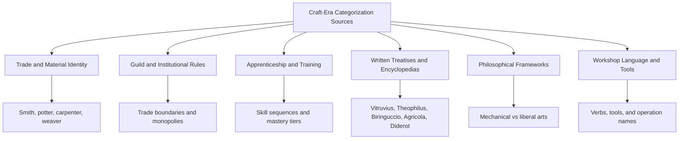

## Craft-Era Categorization of Making Processes


### Introduction

The **craft era** of manufacturing spans, in broad terms, prehistory through the pre-industrial period, ending approximately when mechanized factory production displaced hand-and-tool workshop production (roughly the late 18th to mid-19th century in Western Europe, with earlier or later transitions elsewhere). During this period there was no formal, standardized "manufacturing process taxonomy" as understood today. Instead, making processes were categorized through several overlapping, informal, and institutional mechanisms:

- **Material-based trades** (the smith works metal, the potter works clay, the carpenter works wood)
- **Guild structures** that policed the boundaries between trades
- **Apprenticeship curricula** that grouped operations into learnable skill sets
- **Encyclopedic and technical treatises** that described and grouped arts and trades
- **Philosophical classifications** of the "mechanical arts" as opposed to the liberal arts
- **Tool- and operation-based vocabularies** embedded in workshop language

Understanding these categorizations matters for two reasons. First, modern process taxonomies (for example, the DIN 8580 main groups or the textbook division into casting, forming, machining, joining, and finishing) did not appear from nothing; they inherit vocabulary and conceptual habits from craft practice. Second, the craft-era approach reveals the limits of trade-based classification, which motivated the shift toward operation-based and physics-based taxonomies during industrialization.

This topic covers:

- Sources of craft-era categorization and their historical evidence
- Material-based and trade-based organization
- Guild and apprenticeship structures as classification mechanisms
- Encyclopedic and treatise-based classification (Vitruvius, Theophilus, Biringuccio, Agricola, Diderot and d'Alembert)
- The mechanical arts versus liberal arts framework
- Operation- and tool-based vocabularies
- Regional variation (European, Islamic world, East Asian, South Asian traditions)
- Strengths, limits, and the transition toward modern taxonomies
- A worked example mapping a craft-era artifact to both trade and modern process views

---

### Core Concepts and Terminology

| Term | Definition |
| --- | --- |
| **Craft production** | Small-scale production by skilled artisans using hand tools and simple machines, with knowledge held in the person and transmitted by apprenticeship |
| **Trade (craft) classification** | Grouping of making activities by the practitioner's occupation, typically tied to a principal material or product |
| **Guild** | Association of artisans or merchants that regulated training, quality, prices, and the boundaries of a trade |
| **Apprenticeship** | Structured multi-year training moving a learner from apprentice through journeyman to master |
| **Mechanical arts (artes mechanicae)** | Medieval and early modern category of manual, productive arts, contrasted with the liberal arts |
| **Tacit knowledge** | Skill-based knowledge that is difficult to articulate or codify in writing |
| **Mystery (or "mistery")** | Historical term for a craft trade and its secrets, used in some English guild contexts |
| **Operation vocabulary** | The set of verbs and tool names used within a trade to describe individual working actions (forging, filing, throwing, turning) |
| **Chaîne opératoire** | Archaeological concept describing the sequence of operations by which raw material becomes a finished object |

**Key Points**

- Craft-era categorization was **primarily social and material-centered**, not physics-centered. A worker was classified by *what they made and with what material*, more than by *what physical mechanism* they applied.
- Formal, written taxonomies of processes were rare. Much knowledge was **tacit** and passed through demonstration, so classification often existed only as trade boundaries and shop vocabulary.
- Surviving written classifications come from **treatises, encyclopedias, guild regulations, and educational schemes**, each with different purposes and biases.

---

### Periodization

The following periodization is a simplified teaching aid. Boundaries differ by region and craft [Inference: dates are approximate and vary across scholarly sources].

| Period | Approximate Span | Characteristic Categorization Mode |
| --- | --- | --- |
| Prehistoric and early antiquity | Prehistory to c. 500 BCE | Implicit operation sequences (chaîne opératoire) inferred archaeologically; no written taxonomies |
| Classical antiquity | c. 500 BCE to c. 500 CE | Trade names, philosophical distinctions (banausic versus liberal), architectural and technical treatises (for example Vitruvius) |
| Medieval period | c. 500 to c. 1400 | Guild systems, monastic craft treatises (for example Theophilus), mechanical arts schemes (Hugh of St. Victor) |
| Renaissance and early modern | c. 1400 to c. 1750 | Printed technical treatises (Biringuccio, Agricola), workshop manuals, expanded guild regulation |
| Late craft and proto-industrial | c. 1750 to c. 1850 | Encyclopedic classification of trades (Diderot and d'Alembert), emerging division of labor, early mechanization |

---

### Sources of Craft-Era Categorization



#### 1. Material-Based Trade Identity

The most fundamental categorization was by **principal material**. Trade names in many languages encode the material or product directly:

| Trade (English) | Principal Material or Product | Typical Operations |
| --- | --- | --- |
| Blacksmith / smith | Iron and steel (blacksmith), other metals (goldsmith, silversmith, coppersmith) | Heating, hammering, upsetting, drawing out, welding by forging, quenching |
| Potter | Clay | Wedging, throwing or hand building, drying, glazing, firing |
| Carpenter / joiner | Timber | Sawing, planing, chiseling, jointing, pegging |
| Wheelwright | Timber and iron | Shaping felloes and spokes, shrink-fitting iron tires |
| Cooper | Wood staves and hoops | Splitting, shaping, hooping, fitting heads |
| Tanner | Hides | Soaking, liming, scraping, tanning |
| Weaver | Yarn | Warping, weaving, finishing |
| Mason | Stone | Quarrying, dressing, laying, carving |
| Founder (bell, brass) | Molten metal | Pattern or model making, molding, melting, pouring |
| Glassmaker | Glass melt | Gathering, blowing, shaping, annealing |
| Miller | Grain (and water or wind power) | Grinding, dressing stones |
| Baker and brewer | Food and drink | Mixing, fermenting, baking or brewing |

This organization has an important consequence: **one physical process could appear in several trades under different names and contexts**. Hammering shapes metal for a smith and stone for a mason, but the trades were classified as different crafts.

#### 2. Guild and Institutional Rules

Guilds defined **jurisdictional boundaries**: which trade had the right to perform which operation on which material. These boundaries are, in effect, a legal form of process classification.

- In many European towns, disputes between guilds over whether a given item belonged to (for example) the locksmith or the blacksmith were recorded in regulations and court decisions [Inference: the specifics and frequency varied widely by town and period].
- Guild rules often distinguished **making** from **selling**, and **new work** from **repair** or **finishing**.
- Regulations specified permissible materials, quality marks, and sometimes the sequence of operations.

This meant the effective "taxonomy" was **legally and economically enforced**, rather than derived from technical analysis.

#### 3. Apprenticeship and Training Sequences

Apprenticeship curricula grouped operations by **learning order**. An apprentice in a metalworking trade might progress from fire tending and simple drawing-out, to more precise forging and welding, to finishing and heat treatment. This produced an implicit classification by **skill level and dependency**:

| Stage | Typical Focus |
| --- | --- |
| Apprentice | Basic tool handling, preparation, simple repetitive operations |
| Journeyman | Independent completion of standard work, broader range of operations |
| Master | Design, judgment, difficult or specialized operations, management of a shop |

The classification of operations by difficulty and dependency is a precursor of modern process planning concepts such as operation sequencing.

#### 4. Written Treatises and Encyclopedic Works

Selected works that document or organize making activities:

| Work (Approximate Date) | Author / Context | Categorization Approach |
| --- | --- | --- |
| *De Architectura* (1st century BCE) | Vitruvius | Organizes building crafts by material and building type, with attention to materials properties and construction methods |
| *De Diversis Artibus* (early 12th century) | Theophilus Presbyter | Organized in three books by material and craft: painting and pigments, glass, and metalwork |
| *Didascalicon* (12th century) | Hugh of St. Victor | Philosophical scheme placing the mechanical arts within a broader system of knowledge |
| *De la Pirotechnia* (1540) | Vannoccio Biringuccio | Metallurgy and related fire-based arts organized by material, ores, and processes such as smelting, casting, and assaying |
| *De Re Metallica* (1556) | Georgius Agricola | Comprehensive treatment of mining and metallurgy organized around operations from prospecting to smelting |
| *Encyclopédie* (1751 to 1772) | Diderot and d'Alembert | Extensive plates and articles on the arts and trades, arranged alphabetically for text but conceptually placing trades within a "system of human knowledge" |

These works differ in intent (instruction, record, prestige, philosophy), so their categorization schemes should not be assumed to reflect everyday workshop practice exactly.

#### 5. Philosophical Frameworks: Mechanical Arts versus Liberal Arts

In classical and medieval thought, a distinction separated **liberal arts** (intellectual, associated with free persons and study) from **mechanical or banausic arts** (manual, associated with productive labor). Medieval schemes (notably Hugh of St. Victor's list of mechanical arts) enumerated the mechanical arts as a set of categories. A commonly cited version lists seven mechanical arts, whose exact names and groupings vary in translations and later interpretations:

| Category (traditional rendering) | Approximate Scope |
| --- | --- |
| Fabric making (lanificium) | Textile and clothing production |
| Armament (armatura) | Weapons, metalwork, building, and construction crafts |
| Commerce (navigatio) | Trade and transport, including navigation |
| Agriculture (agricultura) | Farming and food production |
| Hunting (venatio) | Hunting and food procurement |
| Medicine (medicina) | Healing arts |
| Theatrical arts (theatrica) | Performance and entertainment |

[Inference: the modern English renderings of these categories and their scope differ across authors, and later medieval writers proposed alternative lists.]

This philosophical scheme is **not a process taxonomy in the modern sense**. It categorizes human activities and their social function, and metalworking, building, and weapon-making are grouped together under one heading. It nonetheless illustrates that craft-era thinkers grouped making activities by **purpose and product domain**.

#### 6. Workshop Language, Tools, and Operations

Within each trade, a rich **operation vocabulary** existed. Terms such as *drawing out*, *upsetting*, *fullering*, *swaging*, *punching*, *scarf welding*, and *quenching* describe forging operations. Terms such as *throwing*, *turning* (trimming), *slip casting* (later), and *glazing* describe pottery operations. This vocabulary is effectively a **fine-grained, trade-internal classification of operations**, which is often more technically precise than the coarse trade names themselves.

**Key Points**

- Craft-era categorization was **layered**: trade identity at the top, operation vocabulary below, with guild and training structures as supporting social frameworks.
- The **operation vocabulary** is the strongest ancestor of modern process names (forging, casting, turning).
- Written taxonomies emphasize **materials and products** far more than physical mechanisms.

---

### Material-Based and Product-Based Organization

Because craft knowledge was tied to material behavior learned by experience, organizing by material was natural.

#### Metalworking Tradition

Metalworking was divided among many specialized trades by metal type and product:

- **Ferrous work**: blacksmith (general forged goods), farrier (horseshoes), cutler (blades), armourer (armor), locksmith, nailer, wire drawer
- **Non-ferrous and precious metals**: goldsmith, silversmith, coppersmith, brazier (brass and bronze), pewterer, tinsmith
- **Casting**: bell founder, brass founder, type founder
- **Auxiliary**: charcoal burner, bellows maker

The process categories now called forming, casting, machining, and joining were all present but were **distributed across trades** rather than presented as distinct top-level categories.

#### Ceramics and Glass

Ceramics workers were classified around the product (pots, tiles, bricks) and the kiln technology. Glassmaking distinguished **hot-forming operations** (blowing, gathering) from **cold-working operations** (cutting, grinding, polishing).

#### Timber and Building Trades

Carpentry and joinery were often separated: **carpenters** handled structural framing; **joiners** handled finer finished woodwork with precise joints. Related trades included wheelwrights, coopers, shipwrights, turners, and sawyers.

#### Textiles

Textile production was organized as a **sequence of specialized stages** often assigned to different workers or trades: fiber preparation (carding, combing), spinning, weaving or knitting, and finishing (fulling, dyeing, dressing). This is an early example of a **process chain divided among specialists**.

---

### Regional and Cultural Variation

Craft categorization was not uniform worldwide.

| Region or Tradition | Notable Characteristics |
| --- | --- |
| **Medieval and early modern Europe** | Strong guild systems, urban craft regulation, treatise tradition emerging with printing |
| **Islamic world (medieval)** | Craft organizations and market regulation (for example, institutions overseeing markets and trade quality); technical writings documenting devices and methods [Inference: organizational forms differed across cities and dynasties] |
| **China** | Extensive technical writing on crafts, including the *Kaogong Ji* (a text on artisan work incorporated into the classical *Rites of Zhou* tradition) and later Ming-era compendia such as the *Tiangong Kaiwu* (1637), which documents a wide range of production processes including metallurgy, ceramics, and textiles |
| **India** | Caste and hereditary occupational structures associated with specific crafts, alongside classical texts on technical arts (for example, the tradition of enumerated arts) [Inference: relationship between caste occupations and technical classification is complex and debated] |
| **Japan** | Specialized craft lineages and later guild-like associations (*za*, and in the Edo period, trade associations); strong emphasis on transmission of craft lineage |
| **Pre-Columbian Americas** | Sophisticated metalworking, ceramics, and textile traditions organized around communal and state structures; limited written documentation of taxonomies in many regions |

**Key Points**

- The **strong link between trade identity and material** appears in many cultures, though the institutional form differs.
- East Asian technical compendia (such as *Tiangong Kaiwu*) are especially valuable because they organize production knowledge by product domain with detailed process description.
- Comparative claims about the sophistication or influence of one tradition over another require care and are frequently contested in the historiography [Inference].

---

### Illustration: Layers of Craft-Era Categorization

<svg xmlns="http://www.w3.org/2000/svg" viewBox="0 0 760 460" width="760" height="460" font-family="Arial, Helvetica, sans-serif">
<rect x="0" y="0" width="760" height="460" fill="#ffffff" stroke="#cccccc" />
<text x="380" y="28" text-anchor="middle" font-size="16" font-weight="bold" fill="#222222">Layers of Craft-Era Categorization (svg_diagram)</text>
<rect x="80" y="55" width="600" height="60" rx="6" fill="#e3f2fd" stroke="#1565c0" />
<text x="380" y="80" text-anchor="middle" font-size="13" font-weight="bold" fill="#0d47a1">Layer 1: Philosophical Framework</text>
<text x="380" y="100" text-anchor="middle" font-size="12" fill="#333333">Liberal arts vs mechanical arts; grouping by social function</text>
<rect x="80" y="130" width="600" height="60" rx="6" fill="#e8f5e9" stroke="#2e7d32" />
<text x="380" y="155" text-anchor="middle" font-size="13" font-weight="bold" fill="#1b5e20">Layer 2: Trade and Material Identity</text>
<text x="380" y="175" text-anchor="middle" font-size="12" fill="#333333">Smith, potter, carpenter, weaver, mason, glassmaker</text>
<rect x="80" y="205" width="600" height="60" rx="6" fill="#fff8e1" stroke="#f9a825" />
<text x="380" y="230" text-anchor="middle" font-size="13" font-weight="bold" fill="#e65100">Layer 3: Guild and Institutional Boundaries</text>
<text x="380" y="250" text-anchor="middle" font-size="12" fill="#333333">Who may make what, with which materials, and how to train</text>
<rect x="80" y="280" width="600" height="60" rx="6" fill="#fce4ec" stroke="#c2185b" />
<text x="380" y="305" text-anchor="middle" font-size="13" font-weight="bold" fill="#880e4f">Layer 4: Apprenticeship and Skill Sequences</text>
<text x="380" y="325" text-anchor="middle" font-size="12" fill="#333333">Apprentice, journeyman, master; ordered operation learning</text>
<rect x="80" y="355" width="600" height="60" rx="6" fill="#ede7f6" stroke="#5e35b1" />
<text x="380" y="380" text-anchor="middle" font-size="13" font-weight="bold" fill="#311b92">Layer 5: Operation and Tool Vocabulary</text>
<text x="380" y="400" text-anchor="middle" font-size="12" fill="#333333">Drawing out, upsetting, throwing, dressing, quenching</text>
<line x1="380" y1="115" x2="380" y2="130" stroke="#555555" stroke-width="2" />
<line x1="380" y1="190" x2="380" y2="205" stroke="#555555" stroke-width="2" />
<line x1="380" y1="265" x2="380" y2="280" stroke="#555555" stroke-width="2" />
<line x1="380" y1="340" x2="380" y2="355" stroke="#555555" stroke-width="2" />

<text x="380" y="440" text-anchor="middle" font-size="11" fill="`#555555`">Top layers: broad and social. Bottom layers: fine-grained and technical.</text>

</svg>

---

### Characteristics of Craft-Era Categorization

#### Strengths

- **Grounded in practical knowledge**: categories aligned with actual material behavior and workshop realities.
- **Integrated with training and quality control**: classification doubled as a means of transmitting and verifying skill.
- **Rich operation vocabulary**: detailed terms for fine distinctions in working actions.
- **Holistic product responsibility**: a single craftsperson or small shop often controlled a product from raw material to finished object, which linked design, process, and quality.

#### Limitations

| Limitation | Description |
| --- | --- |
| **Material-centered fragmentation** | The same physical mechanism (for example, hammering, heating, cutting) appeared as separate skills in different trades, obscuring common principles. |
| **Non-analytical boundaries** | Trade boundaries reflected legal, economic, and social history as much as technical logic. |
| **Tacit and local knowledge** | Much knowledge was unwritten and varied from shop to shop and town to town, limiting comparability. |
| **Inconsistent vocabulary** | The same operation could have different names across regions and languages, and the same name could mean different operations. |
| **Lack of quantification** | Categories were qualitative, with limited use of measured parameters (temperatures judged by color, for example). |
| **Weak treatment of hybrid work** | Items crossing trade boundaries required cooperation or negotiation, and sometimes generated disputes. |
| **Resistance to change** | Guild regulation could slow adoption of new methods or crossing of boundaries [Inference: the extent varied and is debated by historians]. |

---

### Worked Example 1: A Craft-Era Iron Tool

Consider a **hand-forged iron axe head** produced in a medieval or early modern European workshop.

**Step 1: Trade view.**

The item belongs to the smith's trade. Depending on locality, a specialist edge-tool maker might be involved, and a separate woodworker (a wheelwright or handle turner) would produce the haft.

**Step 2: Operation vocabulary.**

A plausible operation sequence, described in traditional smithing terms, is:

1. Heat a billet of wrought iron in the forge.
2. Draw out and shape the body, punching or drifting the eye for the handle.
3. Forge-weld a steel bit into the edge (a common practice for edge retention) [Inference: practice varied by period and region].
4. Refine the profile by hammering and filing.
5. Heat and quench (and typically temper) the edge.
6. Grind and sharpen.

**Step 3: Modern process view.**

Mapping the same sequence onto a modern classification of the type discussed in later chapters:

| Craft-Era Operation | Modern Process Category | Modern Example Term |
| --- | --- | --- |
| Heating in the forge | Supporting thermal step | Furnace heating |
| Drawing out, shaping | Forming | Open-die (free) forging |
| Punching or drifting the eye | Forming or separating (depending on whether material is displaced or removed) | Piercing, drifting |
| Forge-welding steel bit | Joining | Forge welding |
| Filing | Separating | Machining (manual filing) |
| Quenching and tempering | Changing material properties | Heat treatment |
| Grinding and sharpening | Separating (abrasive) | Grinding |

**Output**

| View | Result |
| --- | --- |
| Craft-era classification | One trade (smith), one product type (edge tool), with the haft assigned to another trade |
| Modern classification | At least four main process groups involved: forming, joining, separating, and changing material properties |

**Conclusion**: A single craft-era "smith's work" corresponds to a chain spanning several modern process categories. This is a direct illustration of why modern taxonomies reorganize knowledge by **process mechanism** rather than by **trade**.

---

### Worked Example 2: Comparing Trade-Based and Mechanism-Based Views

Consider three trades and one shared physical mechanism: **shaping by impact and deformation**.

| Trade | Material | Operation Name in Trade | Underlying Mechanism |
| --- | --- | --- | --- |
| Blacksmith | Hot iron | Drawing out | Plastic deformation by hammering |
| Coppersmith | Copper sheet | Raising (hammering over a form) | Plastic deformation by hammering |
| Silversmith | Silver sheet | Chasing and repoussé | Plastic deformation by punching and hammering |

Under a **trade-based scheme**, these are three separate crafts with different training paths and guild memberships. Under a **mechanism-based scheme**, they share a category: **forming by localized plastic deformation**.

A simple conceptual similarity measure between operations can be expressed by the fraction of shared attributes. If operation A has attribute set $S_A$ and operation B has attribute set $S_B$, the Jaccard similarity is:

$$J(A,B) = \frac{|S_A \cap S_B|}{|S_A \cup S_B|}$$

Suppose the attributes considered are {hammering, plastic deformation, hand tool, metal workpiece, hot working}. Let blacksmith drawing out be $S_A = $ {hammering, plastic deformation, hand tool, metal workpiece, hot working} and coppersmith raising be $S_B = $ {hammering, plastic deformation, hand tool, metal workpiece}.

$$J(A,B) = \frac{4}{5} = 0.8$$

**Output**

$J = 0.8$ indicates high mechanism-level similarity, even though the two operations belong to different trades. The trade-based scheme did not capture this similarity, which is one motivation for later mechanism-based taxonomies.

---

### Python Example: Encoding Craft Trades and Comparing to Mechanism Categories

This script models a small dataset linking trades, operations, and modern process categories, then groups operations by mechanism instead of trade.

```python
from collections import defaultdict

# Each record: (trade, craft_operation, modern_category)
records = [
    ("blacksmith",  "drawing out",      "forming"),
    ("blacksmith",  "forge welding",    "joining"),
    ("blacksmith",  "quenching",        "property_change"),
    ("blacksmith",  "filing",           "separating"),
    ("coppersmith", "raising",          "forming"),
    ("coppersmith", "soldering",        "joining"),
    ("silversmith", "repousse",         "forming"),
    ("silversmith", "chasing",          "forming"),
    ("silversmith", "polishing",        "separating"),
    ("potter",      "throwing",         "forming"),
    ("potter",      "firing",           "property_change"),
    ("potter",      "glazing",          "coating"),
    ("founder",     "mold making",      "primary_shaping"),
    ("founder",     "pouring",          "primary_shaping"),
    ("mason",       "dressing stone",   "separating"),
    ("carpenter",   "sawing",           "separating"),
    ("carpenter",   "pegging joints",   "joining"),
]

# Trade-based view
by_trade = defaultdict(list)
for trade, op, cat in records:
    by_trade[trade].append(op)

# Mechanism-based view
by_category = defaultdict(list)
for trade, op, cat in records:
    by_category[cat].append((trade, op))

print("=== Trade-based view ===")
for trade, ops in by_trade.items():
    print(f"{trade:12s}: {ops}")

print("\n=== Modern-category view ===")
for cat, items in by_category.items():
    trades = sorted({t for t, _ in items})
    print(f"{cat:16s}: {len(items)} operations across trades {trades}")

# How many trades does each modern category span?
print("\n=== Trade spread per modern category ===")
for cat, items in by_category.items():
    n_trades = len({t for t, _ in items})
    print(f"{cat:16s} spans {n_trades} trade(s)")
```

**Output** (computed from the sample above)



```
=== Trade-based view ===
blacksmith  : ['drawing out', 'forge welding', 'quenching', 'filing']
coppersmith : ['raising', 'soldering']
silversmith : ['repousse', 'chasing', 'polishing']
potter      : ['throwing', 'firing', 'glazing']
founder     : ['mold making', 'pouring']
mason       : ['dressing stone']
carpenter   : ['sawing', 'pegging joints']

=== Modern-category view ===
forming         : 6 operations across trades ['blacksmith', 'coppersmith', 'potter', 'silversmith']
joining         : 3 operations across trades ['blacksmith', 'carpenter', 'coppersmith']
property_change : 3 operations across trades ['blacksmith', 'potter']
separating      : 4 operations across trades ['blacksmith', 'carpenter', 'mason', 'silversmith']
coating         : 1 operations across trades ['potter']
primary_shaping : 2 operations across trades ['founder']

=== Trade spread per modern category ===
forming          spans 4 trade(s)
joining          spans 3 trade(s)
property_change  spans 2 trade(s)
separating       spans 4 trade(s)
coating          spans 1 trade(s)
primary_shaping  spans 1 trade(s)
```

**Key Points**

- The **forming** and **separating** categories each cut across four different trades in this small sample, showing that modern mechanism-based categories are **orthogonal** to craft-era trade categories.
- The dataset is illustrative and simplified; real craft practice contained far more variation, and category assignments (for example, whether chasing is best treated as forming) involve interpretation.

---

### The Chaîne Opératoire Concept

The **chaîne opératoire** (operational sequence) is an analytical method from archaeology and anthropology (associated with André Leroi-Gourhan and Marcel Mauss's earlier work on techniques). It describes the full sequence of actions, gestures, tools, and materials by which a raw material becomes a finished object.

Structure of an operational sequence:


Applied to a hand-thrown clay pot, a simplified sequence is:

1. Clay procurement and preparation (digging, cleaning, wedging)
2. Forming (throwing on a wheel or coil building)
3. Drying to leather-hard state
4. Trimming or finishing the form
5. Decoration and glazing (where used)
6. Firing
7. Use, repair, and eventual discard

This concept is important because it treats a craft product as a **process chain**, which anticipates the process-route thinking central to modern manufacturing planning. It also provides a way to compare processes across cultures without relying on the trade names of any one society.

---

### Transition Toward Modern Taxonomies

The craft-era scheme began to give way during the proto-industrial and early industrial period for several interacting reasons:

| Driver | Effect on Categorization |
| --- | --- |
| **Division of labor within workshops** | Work was broken into discrete operations performed by different workers, encouraging operation-level thinking |
| **Mechanization** | Machine tools (lathes, planers, drilling and boring machines) performed operations across many materials and trades, encouraging **machine-based** categories |
| **Interchangeable parts** | Emphasis on repeatable dimensions and tolerances required standardized operation definitions |
| **Scientific study of materials and heat** | Physical understanding (metallurgy, mechanics) supported categorization by mechanism |
| **Engineering education** | Technical schools and textbooks organized knowledge by principle rather than trade |
| **Printing and technical publication** | Standard terminology spread, and encyclopedic works organized knowledge systematically |
| **Decline of guild regulation** | Legal barriers between trades weakened in many regions during the 18th and 19th centuries [Inference: timing varied strongly by country] |

This transition is covered in more depth in later topics of this chapter. The key conceptual shift was from **"who makes it, and from what"** toward **"what physical operation is being performed."**

---

### Legacy in Modern Terminology

Many modern process names and conceptual habits are direct inheritances from the craft era.

| Modern Term or Concept | Craft-Era Origin |
| --- | --- |
| Forging, casting, welding, turning, milling (from milling in a mill sense for some terms) | Trade vocabulary of smiths, founders, and turners |
| Quenching, tempering, annealing | Smith and glassmaker vocabulary (annealing appears in both metalworking and glass contexts) |
| Apprenticeship and skill certification | Guild training tiers |
| Process route and routing sheet | Implicit operation sequences in workshop practice and chaîne opératoire |
| Material-based process families (metal forming, polymer processing, ceramics processing) | Material-based trades |
| Term "manufacture" | Derived from Latin roots meaning "made by hand" (*manu factus*), reflecting the craft origin of the word |

**Key Points**

- Modern classification retains **material-based subdivisions** (for example, sheet metal forming versus polymer molding) as a secondary layer, echoing craft-era organization.
- Modern **operation names** often preserve craft-era words even when the underlying technology has changed radically.

---

### Common Misconceptions

| Misconception | Clarification |
| --- | --- |
| Craft-era makers had no organized knowledge | Knowledge was highly organized but often tacit, embodied in trade structures, training, and vocabulary rather than in written taxonomies |
| Guilds uniformly blocked innovation | Effects varied by time and place, and historians debate the extent of guild influence on technological change [Inference] |
| The seven mechanical arts are a manufacturing process taxonomy | They are a philosophical classification of productive human activities, not a technical process classification |
| Craft production was uniform across cultures | Institutions, terminology, and documentation differed substantially between regions |
| Modern taxonomies replaced trades entirely | Trade identities persist (machinist, welder, potter), coexisting with process-based classifications |
| A single ordered list of craft categories existed | Different sources give different groupings, and no single authoritative craft-era taxonomy existed |

---

### Practical Guidelines for Studying Craft-Era Categorization

1. **Identify the source type.** Distinguish between guild regulations, treatises, encyclopedias, philosophical schemes, and archaeological evidence, since each reflects a different purpose.
2. **Separate trade from mechanism.** When mapping historical practice to modern taxonomy, list operations first, then assign modern categories, rather than mapping whole trades.
3. **Account for tacit knowledge.** Written sources capture only a portion of practice; supplement with archaeological and ethnographic evidence where available.
4. **Note regional and period variation.** Avoid generalizing from one region (for example, Western European guilds) to all craft traditions.
5. **Use chaîne opératoire analysis** to reconstruct process chains for comparison.
6. **Flag interpretive claims.** Historical reconstructions of workshop practice involve inference, and the level of certainty varies by source.

---

### Summary Table

| Aspect | Craft-Era Approach | Modern Approach (Preview) |
| --- | --- | --- |
| Primary organizing principle | Trade and material | Physical mechanism or process type |
| Knowledge form | Tacit, embodied, apprenticeship-based | Codified, quantified, textbook-based |
| Boundary setter | Guilds, custom, local regulation | Standards bodies, engineering disciplines |
| Vocabulary | Trade-specific, regionally variable | Standardized, often international |
| Treatment of hybrid work | Negotiation between trades | Multi-attribute or multi-route description |
| Documentation | Treatises, regulations, encyclopedias | Standards, handbooks, databases |
| Quantification | Limited, judgment-based | Parameter-based (temperature, force, tolerance) |
| Scope of a practitioner's responsibility | Whole product, raw material to finish | Individual operation or process step |

---

### Conclusion

Craft-era categorization of making processes was **a layered, socially embedded system** rather than a formal taxonomy. It combined material-based trade identities, guild-enforced boundaries, apprenticeship sequences, philosophical frameworks (the mechanical arts), written treatises and encyclopedias, and a fine-grained operation vocabulary within each trade. Its strengths lay in practical grounding and integration with training and quality control; its limitations lay in fragmentation by material, tacit and local knowledge, inconsistent vocabulary, and weak recognition of the shared physical mechanisms underlying different trades.

The transition to modern process taxonomies was driven by division of labor, mechanization, interchangeable parts, scientific understanding, and engineering education. Modern classifications retain a heritage from the craft era in their terminology, material-based subdivisions, and the concept of a process chain, and they reorganize knowledge around **what operation is performed** rather than **who performs it and on what material**.

---

### Next Steps

- Proto-industrial division of labor and its effect on operation-level classification
- Encyclopedic classification of the arts and trades (Diderot and d'Alembert in depth)
- Emergence of machine-tool-based classification (lathes, planers, drilling and boring machines)
- Interchangeable parts and the American System of manufactures
- Reuleaux, Willis, and early mechanism-based classification of machines and operations
- Early engineering handbooks and textbooks that organized processes by principle
- Chaîne opératoire method in archaeology and its use in process comparison
- Guild regulation, trade boundaries, and technological change (historiographical debates)
- Regional craft traditions: China (*Kaogong Ji*, *Tiangong Kaiwu*), Islamic world, India, Japan
- From craft vocabulary to standardized process terminology (DIN 8580 origins)