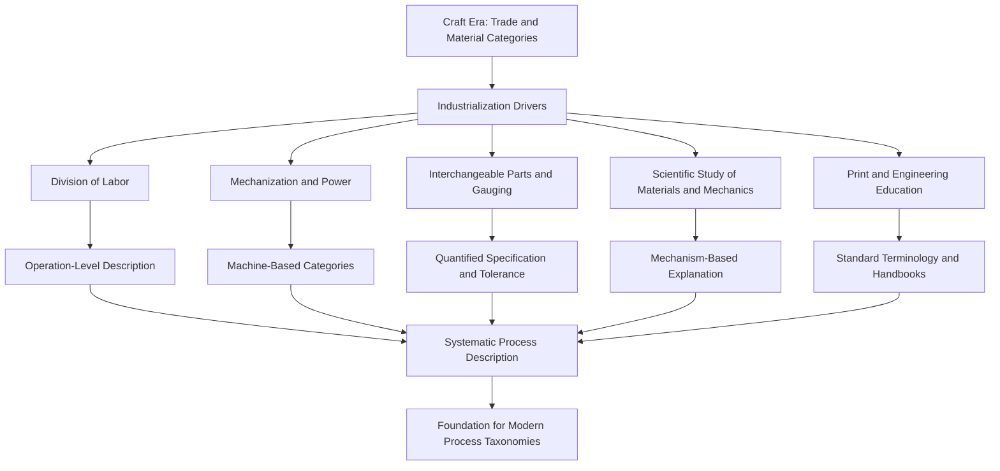

## Industrial Revolution and Systematic Process Description


### Introduction

The **Industrial Revolution** (broadly c. 1760 to c. 1840 for the first phase in Britain, with later phases and other regions extending well into the 19th and early 20th centuries) transformed production from small-scale, craft-based, tacit-knowledge activity into mechanized, factory-based, increasingly codified activity. One of its most consequential but least visible effects was intellectual: for the first time, making processes were **described, analyzed, measured, and classified in a systematic way** that was independent of any single trade.

Where the craft era organized knowledge by *who makes it and from what material* (see the preceding topic on craft-era categorization), the industrial era progressively reorganized knowledge by *what operation is performed, by what mechanism, with what machine, and in what sequence*. This shift produced the conceptual foundation for every later process taxonomy, including the DIN 8580 main groups, textbook divisions into casting, forming, machining, joining, and finishing, and the process-planning vocabulary used in modern manufacturing engineering.

This topic covers:

- Drivers of systematic process description during industrialization
- Division of labor and operation-level analysis (Smith, Babbage)
- Machine tools and machine-based categorization (Maudslay, Whitworth, Nasmyth)
- Interchangeable parts, gauging, and the American System of manufactures
- Mechanism-based analysis of machines and operations (Willis, Reuleaux)
- Encyclopedic and handbook codification of process knowledge (Ure, Rees, Oberlin Smith, and others)
- The Second Industrial Revolution: steel, standardization, and scientific management (Taylor and successors)
- Engineering education and the emergence of process-oriented curricula
- Strengths, limits, and lasting legacy
- Worked examples, quantitative models, and code

---

### Core Concepts and Terminology

| Term | Definition |
| --- | --- |
| **Industrial Revolution** | Transition from hand-and-tool craft production to mechanized, factory-based production, beginning in Britain in the later 18th century |
| **Division of labor** | Decomposition of a production task into distinct operations, each performed by a specialized worker or machine |
| **Operation** | A discrete, describable unit of work performed on a workpiece at one station, typically with one tool or machine setting |
| **Machine tool** | A power-driven machine that shapes material (commonly metal) by removing, deforming, or otherwise working it, with the tool guided by the machine rather than by hand alone |
| **Interchangeability** | Property of parts made so that any part of a given type fits and functions in an assembly without individual fitting |
| **Gauging** | Use of fixed or adjustable gauges to check dimensional conformity, replacing individual measurement and fitting |
| **Tolerance** | Permitted variation in a dimension |
| **Standardization** | Agreement on common dimensions, threads, materials, and terminology |
| **Process description** | A written, structured account of operations, tools, materials, and parameters |
| **Scientific management** | Early 20th-century approach (Taylor and followers) to systematic analysis, measurement, and optimization of work methods |
| **Process route (routing)** | The ordered sequence of operations and machines required to make a part |

**Key Points**

- The essential intellectual shift was from **trade identity** to **operation identity**. Once an operation could be defined independently of the person who traditionally performed it, it could be analyzed, mechanized, measured, and taught in a standardized way.
- The Industrial Revolution did not produce a single, agreed taxonomy. It produced **the preconditions** (operation-level thinking, machine-based categories, quantification, and standard vocabulary) from which later taxonomies were built.
- Periodization and attribution in industrial history are simplified in teaching; scholars debate causes, timing, and the relative importance of individual inventors [Inference].

---

### Periodization

| Phase | Approximate Span | Characteristic Development in Process Description |
| --- | --- | --- |
| **Proto-industrial / early mechanization** | c. 1700 to c. 1770 | Workshop division of labor, early water- and steam-powered devices, first systematic technical compilations |
| **First Industrial Revolution** | c. 1760 to c. 1840 | Factory system, textile machinery, steam power, iron production advances, early machine tools |
| **Machine-tool and interchangeability era** | c. 1800 to c. 1880 | Precision machine tools, gauging, standard threads, the American System of manufactures |
| **Second Industrial Revolution** | c. 1870 to c. 1914 | Steel (Bessemer, open-hearth), electricity, chemical industry, mass production beginnings, scientific management, national standards bodies |
| **Early 20th-century consolidation** | c. 1900 to c. 1940 | Engineering handbooks, industrial engineering, time and motion study, formal process planning, early classification schemes |

[Inference: All dates are approximate teaching conventions. Regional timing differs (for example, Britain first, followed by Belgium, the United States, Germany, France, and later Japan and Russia).]

---

### Conceptual Overview



---

### Driver 1: Division of Labor and Operation-Level Analysis

#### Adam Smith's Pin Factory

Adam Smith's *The Wealth of Nations* (1776) famously illustrated the division of labor with pin manufacture, describing how the task was split into a number of distinct operations (Smith describes roughly eighteen distinct operations, among them drawing the wire, straightening it, cutting it, pointing it, grinding the top for the head, making the head, whitening the pin, and packaging). Smith's central claim was that specialization dramatically increased output per worker. Whatever the accuracy of his numerical estimates [Inference: the figures are illustrative and derived from observation of a small workshop], the passage is historically important for classification because it **decomposes a single craft product into a list of named, separable operations**.

Once a product is expressed as a **sequence of separable operations**, three consequences follow:

1. Each operation can be **studied and improved independently**.
2. Each operation can be **assigned to a specialized worker or machine**.
3. Operations from different products (for example, wire drawing for pins and for needles) can be **recognized as the same operation**, opening the way to cross-trade categories.

#### Babbage and the Economy of Machinery

Charles Babbage's *On the Economy of Machinery and Manufactures* (1832) extended the analysis. Babbage argued that dividing a process into operations of differing skill levels allows the manufacturer to assign each operation to a worker paid only for the skill required, a principle sometimes called the **Babbage principle**. He also surveyed a wide range of manufacturing processes, describing them in comparative, analytical terms rather than as trade secrets, and proposed a systematic way to study factories (a "mode of observing" manufactures).

Babbage's book is significant for classification because it treats **making processes as a general subject of study**, spanning many industries, instead of documenting one trade at a time.

#### Quantifying Division of Labor

A simple illustrative model shows why operation-level decomposition changes production economics. Suppose a product requires $n$ operations, operation $i$ takes time $t_i$ per unit, and each operation is assigned to a dedicated worker. The steady-state production rate is limited by the slowest operation (the bottleneck):

$$\text{Rate} = \frac{1}{\max_i t_i}$$

If a single craftsperson performs all operations sequentially, the rate is:

$$\text{Rate}_{\text{craft}} = \frac{1}{\sum_{i=1}^{n} t_i}$$

The theoretical speed-up from ideal division of labor with one worker per operation is:

$$S = \frac{\sum_{i=1}^{n} t_i}{\max_i t_i}$$

**Example**: Suppose a simplified pin-like product has five operations with times (in seconds per unit) $t = (12, 8, 6, 10, 4)$.

$$\sum t_i = 12 + 8 + 6 + 10 + 4 = 40 \text{ s}$$


$$\max t_i = 12 \text{ s}$$


$$S = \frac{40}{12} \approx 3.33$$

**Output**

With five dedicated workers, the ideal speed-up is about $3.33$ (not $5$), because the $12$ s bottleneck limits throughput. The efficiency per worker is:

$$\eta = \frac{S}{n} = \frac{3.33}{5} \approx 0.67$$

**Conclusion**: Operation-level description makes bottleneck analysis and line balancing possible, capabilities that trade-based categorization could not provide. These are figures from an illustrative model, and real systems include transfer time, variability, setup, and idle time.

---

### Driver 2: Mechanization and Machine-Based Categories

#### Power Sources and Prime Movers

Water wheels, and later steam engines (developed and improved by Newcomen, Watt, and others), supplied power beyond human and animal capacity. Access to centralized power encouraged the **factory system**, in which machines were arranged around line shafts and belts.

#### Machine Tools as a Classification Axis

Machine tools introduced a new axis of classification: the **machine type**. Instead of "the smith's work," one could now speak of *turning* (lathe), *planing* (planer), *shaping* (shaper), *drilling* (drill press), *boring* (boring machine), *milling* (milling machine), and *grinding* (grinding machine). Each machine type embodies a **defined kinematic relationship between tool and workpiece**, so the machine name became a precise process name.

| Machine Tool | Characteristic Kinematics (Simplified) | Typical Operations |
| --- | --- | --- |
| Lathe | Workpiece rotates; tool translates | Turning, facing, boring, threading |
| Planer | Workpiece reciprocates under a fixed tool | Flat surface generation on large parts |
| Shaper | Tool reciprocates over a stationary workpiece | Flat and shaped surfaces on smaller parts |
| Drill press | Rotating tool advances axially | Drilling, reaming |
| Boring machine | Rotating tool (or workpiece) with controlled feed | Enlarging and finishing holes |
| Milling machine | Rotating multi-tooth cutter; workpiece feeds | Flat surfaces, slots, gears, contours |
| Grinding machine | Rotating abrasive wheel; workpiece feeds | Finishing, hardened materials, close tolerances |

**Key Points**

- The machine-based scheme is **independent of the trade**: a lathe turns iron, brass, or wood by essentially the same kinematic principle, though the practical details differ.
- Machine names became **process names** (turning, milling, planing), a lasting feature of modern terminology.

#### Notable Figures and Milestones (Selected)

The following are commonly cited in histories of machine tools. Attribution of "firsts" is frequently contested, and the list is a teaching selection rather than a definitive ranking [Inference].

| Figure or Development | Approximate Date | Significance for Process Description |
| --- | --- | --- |
| John Wilkinson's boring machine (for cylinders) | c. 1774 | Accurate boring of large cylinders, supporting steam engine manufacture |
| Henry Maudslay's screw-cutting lathe with slide rest | c. 1800 | Precise, repeatable thread cutting and controlled tool guidance |
| James Nasmyth's steam hammer | 1839 (patent 1842) | Controlled forging of very large components |
| Joseph Whitworth's standard thread and measuring machines | 1830s to 1840s | Standard thread form and precision measurement culture |
| Eli Whitney, Simeon North, John Hall (American arms manufacture) | early 19th century | Development of interchangeable-part manufacture (extent of early success debated by historians) |
| Universal milling machine (Brown and Sharpe) | 1860s | Versatile milling for general machine shops |

#### The Concept of the "Generating Principle"

An important intellectual contribution of machine-tool development was the idea that **accuracy is generated by the machine's geometry rather than by the operator's hand skill**. A lathe produces circular cross-sections because of its rotary motion, not because the operator draws a circle. This principle underlies modern kinematic descriptions of machining: the shape of the surface is determined by the relative motion of tool and workpiece.

A simple kinematic description of turning relates surface speed $v$, spindle speed $N$, and workpiece diameter $D$:

$$v = \pi D N$$

where $v$ is in m/min if $D$ is in m and $N$ is in rev/min. **Example**: For $D = 0.05$ m and $N = 400$ rev/min:

$$v = \pi \times 0.05 \times 400 \approx 62.8 \text{ m/min}$$

**Output**

Surface speed of about $62.8$ m/min. Whether this is appropriate depends on the tool and workpiece material, and recommended values vary by source and tooling.

---

### Driver 3: Interchangeable Parts, Gauging, and Quantified Specification

#### The Problem of Fitting

In craft production, parts were **individually fitted**: a skilled worker filed each part until it matched its mate. This made repair difficult (a replacement part would not fit without further fitting) and made large-scale assembly slow.

#### The Idea of Interchangeability

Interchangeable manufacture aims for parts to be made **within specified limits** so that any conforming part fits any conforming mate. Early efforts, especially in arms manufacture, in both France (Gribeauval system, Honoré Blanc) and the United States (Springfield and Harpers Ferry armories, Whitney, North, Hall), led to the development of **jigs, fixtures, gauges, and specialized machine tools**. Historians dispute how completely early interchangeability was actually achieved in the first decades [Inference].

#### Consequences for Classification and Description

1. **Dimensions and tolerances became part of the process description.** Where a craft description might say "file until it fits," an interchangeable-parts description says "machine to $25.00 \pm 0.05$ mm and inspect with a go/no-go gauge."
2. **The concept of "process capability" emerged implicitly**: a process must be able to hold the specified tolerance reliably.
3. **Inspection and measurement became distinct, classifiable activities** rather than being embedded in the craftsperson's judgment.

#### Tolerance and Fit: A Basic Formalization

For a shaft of nominal size $d$ with upper and lower deviations, the limits of size are:

$$d_{\max} = d + e_s, \qquad d_{\min} = d + e_i$$

where $e_s$ is the upper deviation and $e_i$ the lower deviation. The tolerance is:

$$T = d_{\max} - d_{\min} = e_s - e_i$$

For a mating hole with limits $D_{\max}$ and $D_{\min}$, the clearance range is:

$$C_{\max} = D_{\max} - d_{\min}, \qquad C_{\min} = D_{\min} - d_{\max}$$

**Example**: Shaft: $25.000$ mm nominal with $e_s = -0.020$ mm and $e_i = -0.041$ mm. Hole: $D_{\min} = 25.000$ mm, $D_{\max} = 25.021$ mm.

$$d_{\max} = 24.980, \quad d_{\min} = 24.959$$


$$C_{\min} = 25.000 - 24.980 = 0.020 \text{ mm}$$


$$C_{\max} = 25.021 - 24.959 = 0.062 \text{ mm}$$

**Output**

The fit always has clearance between $0.020$ and $0.062$ mm, so any conforming shaft assembles with any conforming hole. This is the interchangeability guarantee expressed numerically (a *clearance fit*). Formal fit systems came later, in the 20th century, but the underlying logic descends from 19th-century gauging practice.

#### Standard Threads and Common Vocabulary

Before standardization, screw threads were often unique to each maker, so nuts and bolts from different shops did not fit. Whitworth's proposal for a standard thread form (1841) and later national and international thread standards (for example, American, and later unified and ISO metric threads) exemplify how **standardization created a shared technical vocabulary**, a prerequisite for any cross-company classification.

---

### Driver 4: Scientific Study of Mechanisms and Materials

#### Mechanism-Based Analysis of Machines

Nineteenth-century mechanical scientists began classifying **mechanisms and machine elements** by kinematic function, rather than by the trade that used them.

- **Robert Willis**, *Principles of Mechanism* (1841): proposed a classification of mechanisms based on the **transmission of motion** (relations between input and output motion, such as velocity ratio and directional relationship). This approach categorized devices by what they do kinematically rather than by where they appear.
- **Franz Reuleaux**, *Theoretische Kinematik* (1875, English translation *The Kinematics of Machinery*): introduced the concepts of **kinematic pairs** and **kinematic chains**, and a systematic notation for machine mechanisms, establishing the machine as an assembly of elements constrained to defined relative motions.

These works matter for process taxonomy because they supplied the **conceptual tools for describing machines and operations by mechanism**, the same logic that later taxonomies apply to processes (grouping by how material is shaped rather than by trade).

#### Materials Science Foundations

Development of systematic metallurgy, chemistry, and mechanics of materials in the 18th and 19th centuries supported the shift toward mechanism-based grouping:

- Understanding of iron, steel, and carbon content, and later the microscopic study of metal structure (metallography, developed in the second half of the 19th century)
- Study of heat, thermodynamics, and heat treatment
- Elasticity and strength of materials, enabling calculations of stresses in formed and machined parts

As material behavior could be explained physically, categories such as *plastic deformation processes* or *thermal processes* became meaningful, independent of trade.

---

### Driver 5: Codification in Encyclopedias, Dictionaries, and Handbooks

Industrialization was accompanied by a large expansion of technical literature.

| Work or Type | Approximate Date | Contribution to Systematic Description |
| --- | --- | --- |
| Diderot and d'Alembert, *Encyclopédie* | 1751 to 1772 | Extensive plates and articles on trades, presenting operations visually and textually; bridge between craft and industrial documentation |
| Abraham Rees, *Cyclopædia* | 1802 to 1820 | Extensive coverage of arts and manufactures |
| Andrew Ure, *A Dictionary of Arts, Manufactures, and Mines* | 1839 | Alphabetical compendium of industrial processes, with emphasis on the factory system |
| Babbage, *On the Economy of Machinery and Manufactures* | 1832 | Analytical survey of manufacturing processes across industries |
| Trade and engineering handbooks (for example, pocket-book and reference-manual traditions) | 19th and early 20th centuries | Tabulated data, formulas, and standard practice, contributing to shared terminology |
| Technical journals and engineering society transactions | 19th century onward | Circulation of comparable descriptions of processes and machines |

Alphabetical dictionaries and encyclopedias offer a **retrieval-oriented arrangement** (find a process by name), whereas mechanism-based approaches offer a **conceptual arrangement** (understand a process by its principle). Both were important, and their coexistence foreshadows the modern distinction between **indexing schemes** and **taxonomies** [Inference: this is an interpretive framing, not a claim about the intent of the original authors].

**Key Points**

- Encyclopedic works made process knowledge **portable across trades and countries**.
- Printed material and illustrations allowed **standardized descriptions** to circulate, reducing dependence on person-to-person transmission.

---

### Driver 6: Engineering Education and Professionalization

Technical education institutions and professional societies emerged and grew during the 18th and 19th centuries:

- French *École des Ponts et Chaussées* (founded 1747) and *École Polytechnique* (founded 1794)
- German technical schools (*Technische Hochschulen*), which grew in the 19th century and became models for engineering education
- The Conservatoire national des arts et métiers (Paris, 1794)
- British institutions of mechanical and civil engineers (for example, the Institution of Civil Engineers, 1818, and the Institution of Mechanical Engineers, 1847)
- American engineering schools and societies (for example, the American Society of Mechanical Engineers, 1880)

These institutions produced **textbooks and curricula** that organized manufacturing knowledge by principle: mechanics, materials, thermodynamics, machine design, and eventually **"mechanical technology"** (*mechanische Technologie* in German), a field devoted to describing and classifying manufacturing processes systematically. The German tradition of *Technologie* (associated with figures such as Johann Beckmann in the late 18th century, who proposed a systematic study of crafts and trades) is an important precursor of process taxonomies that eventually crystallized in German standards [Inference: the direct line from Beckmann to DIN 8580 involves many intermediate steps and should not be treated as a simple lineage].

Johann Beckmann's *Anleitung zur Technologie* (1777) is often cited as an early attempt to **classify crafts and trades according to a common scientific scheme**, with technology defined as the systematic description of crafts. His work exemplifies the move from listing trades toward analyzing processes in general terms.

---

### Driver 7: Scientific Management, Time Study, and Process Planning

By the late 19th and early 20th centuries, industrial engineers began **analyzing work itself** systematically.

- **Frederick W. Taylor** (*The Principles of Scientific Management*, 1911; earlier metal-cutting experiments, published in the 1900s) used stopwatch time study and controlled experiments (including systematic studies of tool life and cutting speed) to establish standard methods and times.
- **Frank and Lillian Gilbreth** developed motion study, classifying human motions into elemental units (often called "therbligs"), a very fine-grained operation vocabulary.
- **Henry Gantt** introduced scheduling charts.
- **Henry Ford's** assembly-line and moving-line methods (1913 onward) applied operation decomposition and flow to large-scale assembly.

#### Taylor's Tool-Life Relationship

Taylor's empirical work on cutting yielded a relationship between cutting speed $V$ and tool life $T$:

$$V T^{n} = C$$

where $n$ and $C$ are constants that depend on tool material, workpiece material, and cutting conditions. Typical values of $n$ for high-speed steel are often cited in the range of roughly $0.1$ to $0.2$, and for carbide roughly $0.2$ to $0.4$, but treat these as approximate and source-dependent [Inference].

**Example**: Suppose for a given tool-workpiece pair $n = 0.25$ and $C = 200$ (with $V$ in m/min and $T$ in min). Find the tool life at $V = 100$ m/min.

$$T = \left(\frac{C}{V}\right)^{1/n} = \left(\frac{200}{100}\right)^{4} = 2^{4} = 16 \text{ min}$$

Now increase the speed to $V = 120$ m/min:

$$T = \left(\frac{200}{120}\right)^{4} = (1.667)^{4} \approx 7.72 \text{ min}$$

**Output**

Raising the cutting speed by 20% (from 100 to 120 m/min) reduces the tool life from $16$ min to about $7.7$ min, roughly a halving. This illustrates why systematic measurement mattered: an empirical relationship replaced individual judgment about "how fast to cut."

#### Significance for Systematic Description

- **Operations were decomposed into elements**, each with measurable parameters.
- **Standard operation sheets and routing sheets** became common, documenting the sequence of operations, machines, tools, and times for each part.
- **Process planning** emerged as a distinct function, separating the *planning of how to make a part* from the *act of making it*.

This separation is directly reflected in modern computer-aided process planning (CAPP), whose logic depends on a machine-readable classification of operations.

---

### Illustration: From Trade to Operation to Mechanism

<svg xmlns="http://www.w3.org/2000/svg" viewBox="0 0 800 480" width="800" height="480" font-family="Arial, Helvetica, sans-serif">
<rect x="0" y="0" width="800" height="480" fill="#ffffff" stroke="#cccccc" />
<text x="400" y="28" text-anchor="middle" font-size="16" font-weight="bold" fill="#222222">Shift in Organizing Principle During Industrialization (svg_diagram)</text>
<rect x="30" y="60" width="220" height="330" rx="8" fill="#fff8e1" stroke="#f9a825" />
<text x="140" y="85" text-anchor="middle" font-size="14" font-weight="bold" fill="#e65100">Craft Era</text>
<text x="140" y="108" text-anchor="middle" font-size="12" fill="#333333">Organized by trade</text>
<text x="140" y="140" text-anchor="middle" font-size="12" fill="#333333">Smith</text>
<text x="140" y="165" text-anchor="middle" font-size="12" fill="#333333">Potter</text>
<text x="140" y="190" text-anchor="middle" font-size="12" fill="#333333">Carpenter</text>
<text x="140" y="215" text-anchor="middle" font-size="12" fill="#333333">Mason</text>
<text x="140" y="240" text-anchor="middle" font-size="12" fill="#333333">Weaver</text>
<text x="140" y="290" text-anchor="middle" font-size="11" fill="#555555">Knowledge: tacit</text>
<text x="140" y="310" text-anchor="middle" font-size="11" fill="#555555">Boundary: guild</text>
<text x="140" y="330" text-anchor="middle" font-size="11" fill="#555555">Unit: whole product</text>
<rect x="290" y="60" width="220" height="330" rx="8" fill="#e8f5e9" stroke="#2e7d32" />
<text x="400" y="85" text-anchor="middle" font-size="14" font-weight="bold" fill="#1b5e20">Industrial Transition</text>
<text x="400" y="108" text-anchor="middle" font-size="12" fill="#333333">Organized by operation and machine</text>
<text x="400" y="140" text-anchor="middle" font-size="12" fill="#333333">Turning (lathe)</text>
<text x="400" y="165" text-anchor="middle" font-size="12" fill="#333333">Planing (planer)</text>
<text x="400" y="190" text-anchor="middle" font-size="12" fill="#333333">Drilling (drill press)</text>
<text x="400" y="215" text-anchor="middle" font-size="12" fill="#333333">Milling (mill)</text>
<text x="400" y="240" text-anchor="middle" font-size="12" fill="#333333">Forging (hammer)</text>
<text x="400" y="290" text-anchor="middle" font-size="11" fill="#555555">Knowledge: codified</text>
<text x="400" y="310" text-anchor="middle" font-size="11" fill="#555555">Boundary: machine and skill</text>
<text x="400" y="330" text-anchor="middle" font-size="11" fill="#555555">Unit: operation</text>
<rect x="550" y="60" width="220" height="330" rx="8" fill="#e3f2fd" stroke="#1565c0" />
<text x="660" y="85" text-anchor="middle" font-size="14" font-weight="bold" fill="#0d47a1">Toward Modern Taxonomy</text>
<text x="660" y="108" text-anchor="middle" font-size="12" fill="#333333">Organized by mechanism</text>
<text x="660" y="140" text-anchor="middle" font-size="12" fill="#333333">Primary shaping</text>
<text x="660" y="165" text-anchor="middle" font-size="12" fill="#333333">Forming</text>
<text x="660" y="190" text-anchor="middle" font-size="12" fill="#333333">Separating</text>
<text x="660" y="215" text-anchor="middle" font-size="12" fill="#333333">Joining</text>
<text x="660" y="240" text-anchor="middle" font-size="12" fill="#333333">Coating and property change</text>
<text x="660" y="290" text-anchor="middle" font-size="11" fill="#555555">Knowledge: quantified</text>
<text x="660" y="310" text-anchor="middle" font-size="11" fill="#555555">Boundary: standards</text>
<text x="660" y="330" text-anchor="middle" font-size="11" fill="#555555">Unit: process class</text>
<line x1="250" y1="225" x2="290" y2="225" stroke="#555555" stroke-width="2" />
<polygon points="290,225 282,220 282,230" fill="#555555" />
<line x1="510" y1="225" x2="550" y2="225" stroke="#555555" stroke-width="2" />
<polygon points="550,225 542,220 542,230" fill="#555555" />

<text x="400" y="430" text-anchor="middle" font-size="12" fill="`#333333`">Organizing principle moves: trade and material, then operation and machine, then physical mechanism</text>

<text x="400" y="452" text-anchor="middle" font-size="10" fill="`#777777`">Simplified conceptual model; real developments overlapped and varied by region</text>

</svg>

---

### Comparison: Craft-Era versus Industrial-Era Process Description

| Dimension | Craft Era | Industrial Era |
| --- | --- | --- |
| **Primary categorizing unit** | Trade (person and material) | Operation, machine, and eventually mechanism |
| **Typical description form** | Oral instruction, demonstration, guild rules | Written specifications, drawings, routing sheets, handbooks |
| **Quantification** | Qualitative, judgment-based (color of heated metal, feel) | Measured dimensions, times, speeds, temperatures |
| **Precision source** | Operator skill | Machine geometry, jigs, fixtures, gauges |
| **Vocabulary** | Local and trade-specific | Increasingly standardized and international |
| **Treatment of variation** | Individual adjustment (fitting) | Tolerance limits and inspection |
| **Knowledge transmission** | Apprenticeship | Apprenticeship plus technical schools, texts, and journals |
| **Planning** | Embedded in the craftsperson | Separate planning function (routing, scheduling) |
| **Scope of analysis** | One trade at a time | Cross-industry comparison (Babbage, Beckmann, Ure) |

---

### Worked Example 1: Redescribing a Craft Product as an Industrial Process Route

Consider a **hex-head bolt with a threaded shank**, produced first as a craft item and then as an industrial item.

#### Craft-Era Description (Simplified)

A smith forges a bolt from a bar: heat the bar, upset the head, draw the shank to size, then cut the thread using dies or, earlier, file the thread by hand. Fit is achieved by individually matching the nut to the bolt.

#### Industrial-Era Process Route (Simplified, Illustrative)

| Op. No. | Operation | Machine or Equipment | Key Specification |
| --- | --- | --- | --- |
| 10 | Cut bar to length | Cutting-off machine or saw | Length tolerance stated |
| 20 | Head forming | Header or forging machine (hot or cold) | Head dimensions to gauge |
| 30 | Turn shank to diameter (if required) | Lathe or automatic screw machine | Diameter tolerance stated |
| 40 | Thread cutting or rolling | Threading machine or thread-rolling machine | Standard thread form and pitch |
| 50 | Heat treatment (if specified) | Furnace | Hardness range |
| 60 | Inspection | Thread gauges, calipers | Go/no-go gauge acceptance |

**Output**

| Aspect | Craft Description | Industrial Description |
| --- | --- | --- |
| Number of named operations | Few, implicit | Six, explicit and numbered |
| Fit method | Individual fitting of nut to bolt | Standard thread and gauge inspection |
| Repeatability | Depends on individual | Depends on machine and gauge |
| Classification of operations | By smith's trade | By operation: cutting, forming, turning, threading, heat treatment, inspection |

**Conclusion**: The industrial description makes each step **nameable, measurable, and reassignable to different machines**, the prerequisites for later classification by process mechanism. The actual operation set varies by bolt size, material, and production volume.

---

### Worked Example 2: Line Balancing Using an Operation-Level Description

A part requires six operations with the following times (minutes per unit): $t = (2.0, 3.5, 1.5, 4.0, 2.5, 3.0)$. A factory wants to assign operations to workstations in sequence with a target cycle time of $c = 5.0$ min (station time must not exceed $c$).

**Step 1: Total work content.**

$$W = \sum t_i = 2.0 + 3.5 + 1.5 + 4.0 + 2.5 + 3.0 = 16.5 \text{ min}$$

**Step 2: Minimum theoretical number of stations.**

$$N_{\min} = \left\lceil \frac{W}{c} \right\rceil = \left\lceil \frac{16.5}{5.0} \right\rceil = \lceil 3.3 \rceil = 4$$

**Step 3: Greedy sequential assignment.**

- Station 1: ops 1 and 2 total $5.5$, which exceeds $5.0$. Assign op 1 ($2.0$) and check op 2: $2.0 + 3.5 = 5.5 > 5.0$, so op 2 does not fit. Station 1 = {op 1}, time $2.0$.
- Station 2: op 2 ($3.5$), adding op 3 ($1.5$) gives $5.0 \le 5.0$, so it fits. Station 2 = {ops 2, 3}, time $5.0$.
- Station 3: op 4 ($4.0$), adding op 5 ($2.5$) gives $6.5 > 5.0$. Station 3 = {op 4}, time $4.0$.
- Station 4: op 5 ($2.5$), adding op 6 ($3.0$) gives $5.5 > 5.0$. Station 4 = {op 5}, time $2.5$.
- Station 5: op 6 ($3.0$). Station 5 = {op 6}, time $3.0$.

**Step 4: Efficiency.**

With 5 stations and cycle time $5.0$:

$$E = \frac{W}{N \cdot c} = \frac{16.5}{5 \times 5.0} = 0.66$$

**Output**

The greedy sequential assignment uses 5 stations (above the theoretical minimum of 4) with a line efficiency of $66\%$. A different assignment might do better if precedence relations allow re-ordering.

**Conclusion**: This kind of analysis is only possible once a product has been decomposed into **named, timed operations**, a capability that emerged with industrial-era process description.

---

### Python Example: Operation-Level Modeling and Line Balancing

```python
import math

# Operation times in minutes, in required precedence order
operations = [
    ("cut",        2.0),
    ("form_head",  3.5),
    ("turn",       1.5),
    ("thread",     4.0),
    ("heat_treat", 2.5),
    ("inspect",    3.0),
]

cycle_time = 5.0  # target station time (min)


def total_work(ops):
    """Total work content (min)."""
    return sum(t for _, t in ops)


def theoretical_min_stations(ops, c):
    """Lower bound on the number of stations."""
    return math.ceil(total_work(ops) / c)


def greedy_sequential_balance(ops, c):
    """Assign operations in order to stations without exceeding cycle time c."""
    stations = []
    current, current_time = [], 0.0
    for name, t in ops:
        if t > c:
            raise ValueError(f"Operation {name} ({t}) exceeds cycle time {c}")
        if current_time + t <= c + 1e-9:
            current.append(name)
            current_time += t
        else:
            stations.append((current, current_time))
            current, current_time = [name], t
    if current:
        stations.append((current, current_time))
    return stations


def efficiency(ops, stations, c):
    return total_work(ops) / (len(stations) * c)


W = total_work(operations)
n_min = theoretical_min_stations(operations, cycle_time)
stations = greedy_sequential_balance(operations, cycle_time)
eff = efficiency(operations, stations, cycle_time)

print(f"Total work content: {W:.1f} min")
print(f"Theoretical minimum stations: {n_min}")
print(f"Greedy stations used: {len(stations)}")
for i, (ops, t) in enumerate(stations, start=1):
    print(f"  Station {i}: {ops} -> {t:.1f} min")
print(f"Line efficiency: {eff:.2%}")

# Taylor tool-life example: V * T**n = C
n, C = 0.25, 200.0


def tool_life(V):
    return (C / V) ** (1.0 / n)


for V in (100.0, 120.0):
    print(f"Cutting speed {V:.0f} m/min -> tool life {tool_life(V):.2f} min")
```

**Output** (computed from the code above)



```
Total work content: 16.5 min
Theoretical minimum stations: 4
Greedy stations used: 5
  Station 1: ['cut'] -> 2.0 min
  Station 2: ['form_head', 'turn'] -> 5.0 min
  Station 3: ['thread'] -> 4.0 min
  Station 4: ['heat_treat'] -> 2.5 min
  Station 5: ['inspect'] -> 3.0 min
Line efficiency: 66.00%
Cutting speed 100 m/min -> tool life 16.00 min
Cutting speed 120 m/min -> tool life 7.72 min
```

**Key Points**

- The model treats a product as an **ordered list of named, timed operations**, which is exactly the representation that operation-level description made possible.
- The greedy heuristic is simple and does not guarantee an optimal assignment. Real line-balancing problems involve branching precedence graphs, and various algorithms exist for them.

---

### Emergence of Process Categories Recognizable Today

By the late 19th and early 20th centuries, a recognizable set of broad process families appeared in engineering textbooks, often under headings such as the following (names and groupings varied by author and country) [Inference: exact groupings differ across sources].

| Family (Typical Textbook Heading) | Typical Contents |
| --- | --- |
| **Founding / casting** | Sand casting, permanent-mold casting, die casting, investment casting |
| **Forging and metal forming** | Forging, rolling, drawing, extrusion, sheet-metal working |
| **Machining (metal cutting)** | Turning, milling, drilling, planing, shaping, grinding |
| **Joining** | Riveting, soldering, brazing, welding (gas, arc, later resistance) |
| **Heat treatment** | Annealing, hardening, tempering, case hardening |
| **Finishing and coating** | Polishing, plating, painting, galvanizing |
| **Assembly** | Fitting, fastening, erection |

Textbook headings of this kind are ancestors of the formal main groups later standardized in the 20th century (see subsequent topics on standardized taxonomies). The categories became increasingly **mechanism-oriented** (deformation, material removal, joining by cohesion), though many textbooks retained hybrid organization (some by material, some by machine, some by mechanism).

---

### Strengths of Industrial-Era Systematic Description

- **Cross-trade comparability**: the same operation (for example, drilling) could be studied across industries.
- **Quantification**: speeds, feeds, times, and tolerances allowed rational optimization.
- **Planning and scheduling**: operation-level data enabled routing, capacity planning, and cost estimation.
- **Education and diffusion**: standard vocabulary and textbooks made process knowledge teachable at scale.
- **Foundation for automation**: explicit operation descriptions are a precondition for later numerical control and computer-aided planning.
- **Basis for standards**: shared definitions enabled national and international standards.

### Limitations and Criticisms

| Limitation | Description |
| --- | --- |
| **Inconsistent organizing principles** | Handbooks and textbooks mixed trade-, machine-, material-, and mechanism-based headings, so no single consistent taxonomy existed. |
| **Loss of tacit knowledge** | Codification captured explicit parameters but not necessarily the embodied judgment of skilled workers, and deskilling was a documented social consequence [Inference: extent and interpretation are debated by labor historians]. |
| **Over-simplified decomposition** | Breaking work into operations can neglect interactions between operations and the overall product context. |
| **Uneven diffusion** | Systematic description was adopted unevenly across industries, firms, and countries. |
| **Machine-type bias** | Machine-based categories tie a process name to particular equipment, which becomes awkward when new machines perform multiple process types (foreshadowing later multi-function machines). |
| **Scientific management critiques** | Time-and-motion approaches were criticized for neglecting worker autonomy and human factors [Inference: this is a widely discussed historical criticism, and interpretations differ]. |
| **Attribution myths** | Popular accounts credit single inventors for developments that were collective and gradual. |

---

### Legacy for Modern Process Taxonomies

| Industrial-Era Development | Persisting Modern Feature |
| --- | --- |
| Operation-level decomposition | Process planning, routing sheets, CAPP, manufacturing execution systems |
| Machine-based process names | Turning, milling, drilling, grinding as standard process names |
| Interchangeability and gauging | Tolerancing systems (for example, ISO limits and fits), inspection planning |
| Standard threads and dimensions | National and international standards bodies and standardized terminology |
| Mechanism-based analysis (Willis, Reuleaux) | Kinematic descriptions of machines and processes |
| Cross-industry surveys (Babbage, Ure, Beckmann's *Technologie*) | Comparative, technology-oriented classification |
| Scientific management and time study | Standard times, work measurement, lean and industrial engineering methods |
| Engineering education | Manufacturing processes as a standard course subject organized by process family |

**Key Points**

- The industrial era supplied the **units** (operations), the **vocabulary** (machine and process names), and the **quantitative language** (tolerances, speeds, times) that later taxonomies formalize.
- The **formal top-level groupings** (for example, primary shaping, forming, separating, joining, coating, changing material properties) were codified later, and were built upon this foundation.

---

### Common Misconceptions

| Misconception | Clarification |
| --- | --- |
| The Industrial Revolution created the first process classification | Earlier treatises and trade vocabularies existed, and industrialization changed the **organizing principle and scale** rather than inventing classification |
| Interchangeable manufacture was achieved fully and immediately in the early 1800s | Historians debate how fully and how early it was achieved, and full interchangeability developed gradually with better machines and gauges |
| A single inventor created the machine-tool tradition | Development was collective and incremental, with many contributors |
| Systematic description eliminated craft skill | Craft skill persisted (toolmaking, setup, maintenance), even as routine operations were mechanized |
| Modern taxonomies came directly from industrial-era handbooks | Modern taxonomies were codified later by standards bodies and educators, drawing on many sources |
| Scientific management is identical to process classification | It is a work-analysis and management approach, related to but distinct from classification of processes |

---

### Practical Guidelines for Studying and Applying This Material

1. **Distinguish organizing principles.** For any historical source, identify whether categories are based on trade, material, machine, operation, or mechanism.
2. **Decompose into operations first.** When analyzing a historical or modern product, list operations with tools, machines, and parameters before assigning categories.
3. **Record specifications quantitatively.** Include dimensions, tolerances, times, and parameters wherever the source provides them.
4. **Separate process description from process planning.** The description says *what operations exist and how they work*; planning decides *which to use, in what order, on which equipment*.
5. **Treat historical claims cautiously.** Attributions and dates in popular histories are often simplified, so flag uncertain claims.
6. **Use cross-industry comparison.** Grouping operations that share a mechanism across trades reproduces the intellectual step taken during industrialization.

---

### Summary Table

| Theme | Key Development | Representative Sources or Figures | Effect on Classification |
| --- | --- | --- | --- |
| Division of labor | Decomposition of production into operations | Smith (1776), Babbage (1832) | Operation becomes the unit of analysis |
| Mechanization | Machine tools and power | Wilkinson, Maudslay, Whitworth, Nasmyth | Machine-based process names |
| Interchangeability | Gauging, tolerances, standard threads | Gribeauval and Blanc, American armories, Whitworth | Quantified specification |
| Mechanism science | Kinematic classification | Willis (1841), Reuleaux (1875) | Mechanism-based grouping logic |
| Codification | Encyclopedias and handbooks | Diderot, Rees, Ure, Babbage | Portable, standard descriptions |
| Technology as a discipline | Systematic study of crafts | Beckmann (1777) | Cross-trade classification of processes |
| Education | Technical schools and societies | École Polytechnique, Technische Hochschulen | Curricula organized by process principle |
| Work analysis | Time and motion study, process planning | Taylor, Gilbreths, Gantt, Ford | Elemental operations, standard routing |

---

### Conclusion

The Industrial Revolution and the decades that followed established **systematic process description** as a distinct intellectual activity. Division of labor decomposed products into named operations; machine tools linked those operations to identifiable machine types and kinematic principles; interchangeability and gauging introduced quantified specification and tolerance; mechanism-based scientists supplied conceptual tools for grouping devices by function; encyclopedias, handbooks, and technical schools made process knowledge portable and teachable; and scientific management treated work itself as an object of measurement and planning.

The result was not a single unified taxonomy but a **shift in the organizing principle** of manufacturing knowledge: from trade and material toward operation, machine, and, increasingly, physical mechanism. Textbook process families such as casting, forming, machining, joining, heat treatment, and finishing became recognizable, and the **operation** became the fundamental unit for planning, costing, and standardization. Later standardization efforts built on this foundation to produce the formal classification schemes covered in subsequent topics of this chapter.

---

### Next Steps

- Early 20th-century engineering handbooks and textbook classification schemes
- Beckmann's *Technologie* and the German tradition of systematic technology description
- Machine-tool classification schemes (by kinematics, by function, by degree of automation)
- The American System of manufactures in depth: armory practice, jigs, fixtures, and gauges
- Reuleaux's kinematic classification and its influence on machine and process description
- Taylor's metal-cutting experiments and the origins of machinability data
- Time study, motion study, and standard operation vocabularies (Gilbreth's therbligs)
- Emergence of national standards bodies (BSI, DIN, ANSI predecessors) and their role in terminology
- Origins of formal process planning and routing sheets
- Formation of DIN 8580-style main groups from historical textbook categories
- Mass production and assembly-line description (Ford and successors)