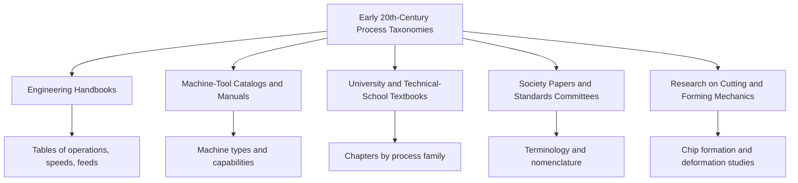

## Early Twentieth-Century Machining and Forming Taxonomies


### Introduction

By the opening decades of the twentieth century, the intellectual groundwork laid during industrialization (operation-level description, machine-based process names, quantified specification, and cross-industry surveys) had matured into a body of **engineering textbooks, handbooks, and shop manuals** that organized manufacturing knowledge in recognizable process families. Two families in particular, **machining** (metal cutting, or material removal) and **forming** (plastic deformation without intentional material removal), became the most thoroughly systematized, because they dominated the metalworking industries that drove the Second Industrial Revolution: machinery, automobiles, armaments, railways, shipbuilding, and early aircraft.

The period from roughly 1900 to 1940 is best described as an era of **consolidation and refinement** rather than a single conceptual revolution. There was no single authoritative taxonomy. Instead, several complementary organizing schemes coexisted:

- **Machine-tool-centered classification** (lathes, planers, shapers, drilling machines, milling machines, grinding machines)
- **Operation-centered classification** (turning, boring, facing, threading, knurling, reaming)
- **Tool-geometry and cutting-mechanics classification** (single-point versus multi-point tools, chip formation types)
- **Forming classification by temperature and mode** (hot versus cold working; forging, rolling, drawing, extrusion, sheet-metal operations)
- **Material-removal versus deformation contrast** (chip-producing versus chipless processes)
- **Production-method classification** (job shop, batch, mass production, automatic and semi-automatic machines)

This topic covers:

- The engineering context and sources of the era
- Machine-tool-based taxonomies of machining
- Operation-based taxonomies of machining
- Cutting-tool and chip-formation classification
- Scientific foundations: Taylor, Merchant-era precursors, Time, and the mechanics of cutting
- Forming taxonomies: hot and cold working, bulk and sheet forming
- Standardization and terminology (national standards bodies, machine-tool associations)
- German-language classification tradition and its influence on later standards
- The chip-producing versus chipless (*spanend* versus *spanlos*) distinction
- Strengths, limits, and the path toward formal main-group standards
- Worked examples, models, and code

---

### Core Concepts and Terminology

| Term | Definition |
| --- | --- |
| **Machining** | Shaping by controlled removal of material (chips) using a cutting tool, abrasive, or other removal mechanism |
| **Forming** | Shaping by plastic deformation of a workpiece with no intentional material removal, the volume being approximately conserved |
| **Metal cutting** | Machining using a wedge-shaped tool that produces chips by shear |
| **Single-point tool** | Cutting tool with one principal cutting edge (for example, a lathe turning tool) |
| **Multi-point tool** | Cutting tool with several cutting edges (for example, drills, milling cutters, broaches) |
| **Chip formation** | Deformation and separation of material ahead of the tool edge |
| **Hot working** | Plastic deformation above the recrystallization temperature |
| **Cold working** | Plastic deformation below the recrystallization temperature, with strain hardening |
| **Bulk forming** | Forming where the workpiece has a low surface-area-to-volume ratio (forging, rolling, extrusion, drawing of bars and wire) |
| **Sheet forming** | Forming of thin sheet where thickness is small relative to other dimensions (bending, deep drawing, stretching) |
| **Chipless (chipless shaping) processes** | Processes that shape material without chip removal, including forming and casting, in the terminology of the period |
| **Machinability** | Relative ease with which a material can be cut, judged by tool life, cutting force, surface finish, and chip control |
| **Feed, speed, depth of cut** | The three primary cutting parameters in machining |
| **Automatic and semi-automatic machines** | Machine tools that carry out operation sequences with limited or no operator intervention (for example, screw machines and turret lathes) |

**Key Points**

- The taxonomies of this era were **pragmatic and pedagogical**. They were designed to help engineers, apprentices, and planners find, compare, and select methods, not to be formal axiomatic classification systems.
- Machining taxonomies leaned on **machine type and operation type**, whereas forming taxonomies leaned on **temperature regime and deformation mode**.
- Terminology and groupings varied by author, country, and industry. Statements about "the" early twentieth-century taxonomy are simplifications [Inference].

---

### Periodization and Context

| Period | Approximate Span | Characteristics for Machining and Forming Description |
| --- | --- | --- |
| **Turn-of-century consolidation** | c. 1890 to c. 1910 | Growth of engineering handbooks, machine-tool catalogs, and trade journals; high-speed steel (introduced around 1900) changes cutting practice |
| **Scientific study of cutting** | c. 1900 to c. 1930 | Taylor's tool-life experiments; studies of chip formation and cutting forces by researchers in Russia, Germany, Britain, and the United States |
| **Mass-production era** | c. 1910 to c. 1930 | Moving assembly lines, dedicated and transfer machinery, emphasis on interchangeability and standard times |
| **Standardization and terminology** | c. 1917 to c. 1940 | Formation of national standards bodies (for example, DIN in Germany, 1917; ASA, later ANSI, in the United States, 1918 lineage) and society committees; early terminology standards |
| **Interwar refinement** | c. 1920 to c. 1940 | Carbide tools (1920s onward), improved grinding, rise of sheet-metal stamping for automobiles, early cold-forming and extrusion methods |

[Inference: All dates are approximate teaching conventions, and adoption timing varied widely by country and industry.]

---

### Sources of Taxonomy in the Period



Typical source types and their classification styles:

| Source Type | Typical Organizing Style |
| --- | --- |
| **General mechanical-engineering handbooks** | Alphabetical or chapter-based, with tables by process and material |
| **Machine-shop practice books** | Organized by machine tool (lathe, drilling machine, milling machine, and so on) |
| **University textbooks on "mechanical technology"** | Organized by process family (casting, forging, rolling, cutting, joining) with underlying principles |
| **Trade journals and vendor catalogs** | Organized by product type and machine capability |
| **Technical society transactions** | Papers on specific processes with experimental data |

---

### Part I: Machining Taxonomies

#### 1. Machine-Tool-Centered Classification

The most widespread classification in the period was by **machine tool**. Shop-practice books and catalogs grouped operations under the machine that performed them.

| Machine Tool Family | Typical Machines | Principal Motion Pair (Simplified) | Typical Operations |
| --- | --- | --- | --- |
| **Lathes** | Engine lathe, turret lathe, automatic and semi-automatic screw machines, boring mills (vertical) | Workpiece rotates; tool feeds linearly | Turning, facing, boring, threading, knurling, parting |
| **Planers and shapers** | Planer, shaper, slotter | Linear reciprocating primary motion (workpiece or tool), with intermittent feed | Flat surfaces, slots, keyways |
| **Drilling machines** | Sensitive drill press, radial drill, multiple-spindle drill | Rotating tool with axial feed | Drilling, reaming, tapping, counterboring |
| **Boring machines** | Horizontal boring mill, jig borer | Rotating tool (or workpiece) with controlled feed | Precise hole enlargement and location |
| **Milling machines** | Column-and-knee, plain, universal, vertical, and production types | Rotating multi-tooth cutter; workpiece feeds | Planar surfaces, slots, gears, contours |
| **Grinding machines** | Cylindrical, surface, centerless, tool-and-cutter grinders | Rotating abrasive wheel; workpiece feeds | Finishing, hardened materials, close tolerances |
| **Broaching machines** | Push and pull broaches | Linear motion of a multi-tooth tool | Internal and external profiles in one pass |
| **Gear-cutting machines** | Hobbing, shaping, and planing machines | Coordinated generating motions | Spur, helical, bevel, and worm gears |
| **Sawing machines** | Hacksaws, band saws, circular saws | Toothed blade with cutting motion | Cutting off, blanking |
| **Finishing machines** | Lapping, honing, polishing, buffing | Abrasive action | Surface refinement |

**Key Points**

- This scheme was **intuitive for shop personnel** because it matched the physical layout of a machine shop.
- Its weakness was overlap: a single machine could perform several operations (for example, a lathe turns, faces, bores, drills, and threads), and the same operation (for example, drilling) could be done on several machines.

#### 2. Operation-Centered Classification

Operation-centered classification lists **work actions independent of the machine**. A commonly presented list (names vary) includes the following.

| Operation | Description | Typical Machine(s) |
| --- | --- | --- |
| **Turning** | Producing a surface of revolution on external diameters | Lathe |
| **Facing** | Producing a flat surface perpendicular to the rotation axis | Lathe |
| **Boring** | Enlarging or finishing an existing hole with a single-point tool | Lathe, boring machine |
| **Drilling** | Producing a hole with a rotating drill | Drill press, lathe |
| **Reaming** | Finishing a hole to size and surface quality | Drill press, lathe |
| **Tapping** | Cutting an internal thread | Drill press, tapping machine |
| **Threading** | Cutting an external or internal thread by single-point or die | Lathe, threading machine |
| **Knurling** | Impressing a pattern (deformation-based) | Lathe |
| **Parting (cutting off)** | Severing a part from bar stock | Lathe |
| **Planing and shaping** | Producing flat surfaces by linear cutting motion | Planer, shaper |
| **Slotting** | Producing internal keyways or slots | Slotter |
| **Milling** | Removing material with a rotating multi-tooth cutter | Milling machine |
| **Broaching** | Producing a profile by progressive tooth engagement | Broaching machine |
| **Gear cutting** | Producing gear teeth | Hobbing, shaping machines |
| **Grinding** | Removing material with an abrasive wheel | Grinding machine |
| **Lapping and honing** | Fine abrasive finishing | Lapping and honing machines |
| **Sawing** | Cutting with a toothed blade | Saws |

Note that knurling illustrates the fuzzy boundary between machining and forming that these taxonomies inherited: it appears in machining lists because it is done on a lathe, although the mechanism is deformation [Inference: treatment varied by author].

#### 3. Classification by Tool Geometry

Cutting tools were classified by the number and arrangement of cutting edges.

| Class | Description | Examples |
| --- | --- | --- |
| **Single-point tools** | One principal cutting edge | Turning, boring, planing, shaping tools |
| **Multi-point tools** | Two or more cutting edges acting together | Drills, milling cutters, reamers, broaches, saw blades |
| **Abrasive tools** | Many small, randomly oriented cutting grains | Grinding wheels, abrasive belts, honing stones, lapping compounds |

Single-point tool nomenclature standardized several features that remain in use: **rake angle**, **clearance (relief) angle**, **cutting edge angle**, and **nose radius**.

#### 4. Classification by Cutting Motion

A more analytical scheme classified machining by the **relationship between the primary cutting motion and the feed motion**, emphasizing kinematics. A simplified table:

| Primary (Cutting) Motion | Feed Motion | Resulting Family |
| --- | --- | --- |
| Rotation of workpiece | Linear tool motion | Turning family |
| Rotation of tool | Linear workpiece motion | Milling and drilling family |
| Linear reciprocation of tool or workpiece | Intermittent linear | Shaping and planing family |
| Linear motion of tool with progressive teeth | None (built into tool) | Broaching |
| Rotation of abrasive wheel | Linear or rotary workpiece motion | Grinding family |

This kinematic viewpoint, developed in German and British machine-tool literature of the period, prefigures the kinematic definitions used in later standards [Inference: the extent and attribution of this framing vary among sources].

#### 5. Chip-Formation Classification

Experimental studies of cutting in the late nineteenth and early twentieth centuries (including work by Time in Russia, and by Taylor, Reuleaux-era researchers, and later Ernst, Merchant, and others) led to classifying **chip types**. A commonly taught classification is:

| Chip Type | Description | Typical Conditions |
| --- | --- | --- |
| **Discontinuous (segmented)** | Chips separate in fragments | Brittle materials (cast iron), low speeds, small rake angles |
| **Continuous** | Long ribbon-like chip | Ductile materials, high speeds, larger rake angles, good lubrication |
| **Continuous with built-up edge (BUE)** | Continuous chip with material adhering to the tool tip | Ductile materials at lower speeds, poor lubrication |

The shear-plane model of chip formation (Time, 1870 in an early form; further developed by Mallock, Merchant, and others) provides the basic relations. Under the simple orthogonal cutting model, with uncut chip thickness $t_0$, chip thickness $t_c$, and rake angle $\alpha$, the chip thickness ratio and shear angle are related by:

$$r = \frac{t_0}{t_c}$$


$$\tan \phi = \frac{r \cos \alpha}{1 - r \sin \alpha}$$

**Example**: Suppose $t_0 = 0.25$ mm, $t_c = 0.50$ mm, and $\alpha = 10^\circ$.

$$r = \frac{0.25}{0.50} = 0.5$$


$$\tan \phi = \frac{0.5 \cos 10^\circ}{1 - 0.5 \sin 10^\circ} = \frac{0.5 \times 0.9848}{1 - 0.5 \times 0.1736} = \frac{0.4924}{0.9132} \approx 0.5392$$


$$\phi = \arctan(0.5392) \approx 28.3^\circ$$

**Output**

Shear angle of about $28.3^\circ$. This is an idealized orthogonal-cutting result, and real cutting involves more complex geometry and friction.

#### 6. Cutting-Parameter Vocabulary

The three principal parameters were formalized in this period:

- **Cutting speed** $v$ (m/min or ft/min)
- **Feed** $f$ (mm/rev for turning and drilling, or mm/tooth for milling)
- **Depth of cut** $a_p$ (mm)

The **material removal rate** for turning is commonly approximated as:

$$\text{MRR} = v \, f \, a_p$$

with consistent units (for $v$ in m/min, $f$ in mm/rev, $a_p$ in mm, the product gives $\text{cm}^3/\text{min}$ when appropriate unit conversion is applied: $\text{MRR (mm}^3\text{/min)} = 1000\, v\, f\, a_p$).

**Example**: $v = 100$ m/min, $f = 0.2$ mm/rev, $a_p = 2$ mm.

$$\text{MRR} = 1000 \times 100 \times 0.2 \times 2 = 40{,}000 \text{ mm}^3\text{/min} = 40 \text{ cm}^3\text{/min}$$

The tool-life relationship of Taylor (introduced in the previous topic), $V T^{n} = C$, was refined into the **extended Taylor equation** that includes feed and depth of cut:

$$V T^{n} f^{a} a_p^{b} = C$$

where the exponents $a$ and $b$ are empirically determined [Inference: numerical values depend strongly on tool and workpiece materials and are source-dependent].

#### 7. Classification by Production Method and Automation

The mass-production emphasis of the era produced a classification of machine tools by **degree of automation and specialization**:

| Class | Characteristics | Typical Machines |
| --- | --- | --- |
| **General-purpose (universal) machines** | Flexible, manually controlled, low volume | Engine lathe, universal milling machine |
| **Semi-automatic machines** | Operator loads and starts, machine completes cycle | Turret lathes, semi-automatic chuckers |
| **Automatic machines** | Continuous cycle with automatic feeding | Single- and multiple-spindle automatic screw machines |
| **Special-purpose machines** | Built for a specific part or operation set | Multi-station transfer machines, dedicated drilling and boring units |

This scheme is a production-engineering axis (matching machine to volume), complementary to the operation-based scheme. It is a direct precursor of later distinctions among general-purpose, special-purpose, and flexible manufacturing systems.

---

### Part II: Forming Taxonomies

#### 1. The Chipless versus Chip-Producing Contrast

German-language technical literature of the early twentieth century commonly distinguished **chip-producing shaping** (*spanende Formung* or *spanabhebende Bearbeitung*) from **chipless shaping** (*spanlose Formung*), a division that shaped later classification thinking. The chipless group included casting, forming (deformation), and, in some presentations, joining and other operations. English-language texts used analogous contrasts such as "cutting" versus "working by pressure" or "plastic working of metals."

| Category | Mechanism | Volume Behavior |
| --- | --- | --- |
| **Chip-producing (cutting)** | Material separated as chips | Volume of workpiece decreases |
| **Chipless (deformation)** | Material displaced by plastic flow | Volume conserved (approximately) |
| **Casting (primary shaping)** | Liquid metal solidifies in a mold | Volume changes on solidification |

[Inference: The precise division of chipless processes varied by author, and this three-way contrast is a teaching simplification.]

#### 2. Classification by Working Temperature

The most robust forming classification of the period distinguished **hot working** from **cold working**, based on the recrystallization behavior of metals.

| Aspect | Hot Working | Cold Working |
| --- | --- | --- |
| Temperature | Above recrystallization temperature | Below recrystallization temperature |
| Flow stress | Lower | Higher |
| Strain hardening | Removed by simultaneous recrystallization | Accumulates |
| Surface finish and tolerance | Coarser (scale, thermal contraction) | Finer |
| Typical processes | Forging, hot rolling, hot extrusion | Cold rolling, cold drawing, cold heading, stamping |
| Property effects | Refined grain structure, closing of internal voids | Increased strength and hardness, reduced ductility |

An approximate rule of thumb often cited is that the recrystallization temperature of a pure metal is on the order of $0.3$ to $0.5$ of its absolute melting temperature $T_m$ [Inference: values depend on purity, prior deformation, and strain rate]. The **homologous temperature** is:

$$T_h = \frac{T}{T_m}$$

where both temperatures are in kelvin. Hot working is commonly associated with $T_h$ above roughly $0.5$, and cold working with $T_h$ below roughly $0.3$, with a transitional "warm working" region between.

**Example**: For steel with $T_m \approx 1810$ K (approximately $1537^\circ$C for pure iron, used as an illustrative value), working at $1000^\circ$C:

$$T = 1000 + 273 = 1273 \text{ K}, \quad T_h = \frac{1273}{1810} \approx 0.70$$

**Output**

$T_h \approx 0.70$, consistent with hot working. Actual classification depends on the alloy, and the rule of thumb is approximate.

#### 3. Classification by Deformation Mode: Bulk versus Sheet

Forming was also divided by **workpiece geometry and stress state**.

| Class | Workpiece | Typical Stress State | Processes |
| --- | --- | --- | --- |
| **Bulk forming** | Billets, bars, slabs, rods | Predominantly compressive (three-dimensional) | Forging, rolling, extrusion, bar and wire drawing, cold heading |
| **Sheet forming** | Thin sheets, strip, tube walls | Predominantly tensile or mixed in-plane | Bending, deep drawing, stretching, spinning, shearing (as a cutting-related operation), flanging |

#### 4. Major Forming Processes and Their Descriptions

| Process | Description | Typical Regime and Applications |
| --- | --- | --- |
| **Open-die (smith) forging** | Deformation between flat or simple dies with free lateral flow | Hot; large shafts, rings, and heavy sections |
| **Closed-die (impression) forging** | Deformation in dies whose cavities define the shape | Hot; automotive components (connecting rods, crankshafts) |
| **Upset forging and heading** | Increasing cross-section by axial compression | Hot or cold; bolts, rivets |
| **Rolling** | Reduction of thickness between rotating rolls | Hot and cold; plate, sheet, structural sections, rails |
| **Extrusion** | Forcing material through a die opening | Hot (and later cold); tubes, rods, profiles |
| **Drawing (bar, wire, tube)** | Pulling material through a die | Cold; wire, bars, tubes |
| **Deep drawing** | Drawing sheet into a cup or shell shape with a punch and die | Cold; automotive body panels, cans, cookware |
| **Bending** | Angular deformation of sheet, bar, or tube | Cold or hot; brackets, channels |
| **Stamping and blanking** | Shearing and forming with punch and die (blanking and piercing involve cutting mechanisms) | Cold; sheet-metal components |
| **Spinning** | Forming axisymmetric parts over a rotating mandrel | Cold; lamp shades, cookware |
| **Coining and embossing** | Compressive deformation to impress fine surface detail | Cold; coins, medals |

Note that **blanking, piercing, and shearing** appear in forming lists in many period texts because they are performed on presses, although their mechanism (shear separation) is a cutting mechanism. The classification of these operations was a recognized ambiguity of the era [Inference], and later standards resolved it by placing shearing in the separating group.

#### 5. Forming Mechanics: Fundamental Relations

Early twentieth-century research (including work by von Mises, Tresca, Hencky, Prandtl, and, on the practical side, by engineers analyzing rolling and drawing) established the basis for a quantitative treatment of forming.

**True strain and true stress.** For a workpiece changing length from $l_0$ to $l$:

$$\varepsilon = \ln\frac{l}{l_0}$$

For volume-conserving deformation, the relation between initial and final cross-sectional areas $A_0$ and $A$ gives:

$$\varepsilon = \ln\frac{A_0}{A}$$

**Flow-stress model.** A widely used empirical relation between true stress $\sigma$ and true strain $\varepsilon$ in cold working is the power-law (Hollomon) form:

$$\sigma = K \varepsilon^{n}$$

where $K$ is the strength coefficient and $n$ is the strain-hardening exponent (not to be confused with the Taylor tool-life exponent).

**Example: Wire drawing reduction.** A wire is drawn from an initial diameter $d_0 = 5.0$ mm to a final diameter $d = 4.0$ mm.

$$\text{Area reduction} = 1 - \frac{A}{A_0} = 1 - \left(\frac{4.0}{5.0}\right)^2 = 1 - 0.64 = 0.36 = 36\%$$


$$\varepsilon = \ln\frac{A_0}{A} = \ln\left(\frac{25}{16}\right) = \ln(1.5625) \approx 0.446$$

**Ideal (frictionless, homogeneous) drawing stress.** Assuming a rigid-plastic material with constant flow stress $\bar{\sigma}$, the ideal drawing stress is:

$$\sigma_d = \bar{\sigma}\,\ln\frac{A_0}{A}$$

For a flow stress $\bar{\sigma} = 300$ MPa:

$$\sigma_d = 300 \times 0.446 \approx 133.8 \text{ MPa}$$

**Output**

The ideal drawing stress is about $134$ MPa. Real drawing stress is higher because of friction and redundant work. Practical drawing also requires that the drawing stress remain below the yield stress of the exiting wire, which limits the reduction per pass.

**Forging force estimate.** For simple upsetting of a cylinder, the ideal (frictionless) forging force is:

$$F = \bar{\sigma}\, A$$

where $A$ is the instantaneous contact area. With friction, an approximate factor accounting for the aspect ratio is often applied [Inference: friction factors and correction formulas vary across sources].

**Example**: A cylinder of diameter $50$ mm is upset with a flow stress of $150$ MPa (hot working). The contact area is $A = \pi (0.025)^2 = 1.963 \times 10^{-3}\ \text{m}^2$.

$$F = 150 \times 10^{6} \times 1.963 \times 10^{-3} \approx 2.94 \times 10^{5} \text{ N} \approx 294 \text{ kN}$$

**Output**

The ideal upsetting force is about $294$ kN. Actual force is higher because of friction.

#### 6. Classification by Equipment

As with machining, forming was often grouped by machine.

| Equipment Family | Typical Machines | Associated Processes |
| --- | --- | --- |
| **Hammers** | Drop hammer, steam hammer, board hammer | Forging (energy-limited, impact) |
| **Presses** | Mechanical, hydraulic, and screw presses | Forging, stamping, drawing, extrusion |
| **Rolling mills** | Two-high, three-high, four-high, cluster mills | Rolling of plate, sheet, sections |
| **Draw benches** | Draw bench, continuous wire-drawing machines | Bar, tube, and wire drawing |
| **Bending and spinning machines** | Press brakes, bending rolls, spinning lathes | Sheet and tube forming |
| **Upsetters (forging machines)** | Horizontal upsetting machines, headers | Upset forging |

---

### Illustration: Early Twentieth-Century Family Tree of Metalworking Processes

<svg xmlns="http://www.w3.org/2000/svg" viewBox="0 0 820 520" width="820" height="520" font-family="Arial, Helvetica, sans-serif">
<rect x="0" y="0" width="820" height="520" fill="#ffffff" stroke="#cccccc" />
<text x="410" y="28" text-anchor="middle" font-size="16" font-weight="bold" fill="#222222">Early Twentieth-Century Machining and Forming Families (svg_diagram)</text>
<rect x="310" y="50" width="200" height="40" rx="6" fill="#eeeeee" stroke="#555555" />
<text x="410" y="75" text-anchor="middle" font-size="13" font-weight="bold" fill="#222222">Metalworking Processes</text>
<line x1="410" y1="90" x2="410" y2="115" stroke="#555555" stroke-width="2" />
<line x1="150" y1="115" x2="670" y2="115" stroke="#555555" stroke-width="2" />
<line x1="150" y1="115" x2="150" y2="140" stroke="#555555" stroke-width="2" />
<line x1="410" y1="115" x2="410" y2="140" stroke="#555555" stroke-width="2" />
<line x1="670" y1="115" x2="670" y2="140" stroke="#555555" stroke-width="2" />
<rect x="50" y="140" width="200" height="50" rx="6" fill="#e3f2fd" stroke="#1565c0" />
<text x="150" y="162" text-anchor="middle" font-size="13" font-weight="bold" fill="#0d47a1">Machining</text>
<text x="150" y="180" text-anchor="middle" font-size="11" fill="#333333">Chip-producing</text>
<rect x="310" y="140" width="200" height="50" rx="6" fill="#e8f5e9" stroke="#2e7d32" />
<text x="410" y="162" text-anchor="middle" font-size="13" font-weight="bold" fill="#1b5e20">Forming</text>
<text x="410" y="180" text-anchor="middle" font-size="11" fill="#333333">Chipless, plastic deformation</text>
<rect x="570" y="140" width="200" height="50" rx="6" fill="#fff8e1" stroke="#f9a825" />
<text x="670" y="162" text-anchor="middle" font-size="13" font-weight="bold" fill="#e65100">Casting and Others</text>
<text x="670" y="180" text-anchor="middle" font-size="11" fill="#333333">Chipless, primary shaping</text>
<line x1="150" y1="190" x2="150" y2="215" stroke="#555555" stroke-width="2" />
<line x1="60" y1="215" x2="240" y2="215" stroke="#555555" stroke-width="2" />
<line x1="60" y1="215" x2="60" y2="235" stroke="#555555" stroke-width="2" />
<line x1="150" y1="215" x2="150" y2="235" stroke="#555555" stroke-width="2" />
<line x1="240" y1="215" x2="240" y2="235" stroke="#555555" stroke-width="2" />
<rect x="15" y="235" width="90" height="70" rx="6" fill="#f5faff" stroke="#1565c0" />
<text x="60" y="255" text-anchor="middle" font-size="11" font-weight="bold" fill="#0d47a1">Single-point</text>
<text x="60" y="272" text-anchor="middle" font-size="10" fill="#333333">Turning</text>
<text x="60" y="286" text-anchor="middle" font-size="10" fill="#333333">Planing, shaping</text>
<rect x="105" y="235" width="90" height="70" rx="6" fill="#f5faff" stroke="#1565c0" />
<text x="150" y="255" text-anchor="middle" font-size="11" font-weight="bold" fill="#0d47a1">Multi-point</text>
<text x="150" y="272" text-anchor="middle" font-size="10" fill="#333333">Milling, drilling</text>
<text x="150" y="286" text-anchor="middle" font-size="10" fill="#333333">Broaching</text>
<rect x="195" y="235" width="90" height="70" rx="6" fill="#f5faff" stroke="#1565c0" />
<text x="240" y="255" text-anchor="middle" font-size="11" font-weight="bold" fill="#0d47a1">Abrasive</text>
<text x="240" y="272" text-anchor="middle" font-size="10" fill="#333333">Grinding</text>
<text x="240" y="286" text-anchor="middle" font-size="10" fill="#333333">Lapping, honing</text>
<line x1="410" y1="190" x2="410" y2="215" stroke="#555555" stroke-width="2" />
<line x1="340" y1="215" x2="480" y2="215" stroke="#555555" stroke-width="2" />
<line x1="340" y1="215" x2="340" y2="235" stroke="#555555" stroke-width="2" />
<line x1="480" y1="215" x2="480" y2="235" stroke="#555555" stroke-width="2" />
<rect x="290" y="235" width="100" height="70" rx="6" fill="#f4fbf5" stroke="#2e7d32" />
<text x="340" y="255" text-anchor="middle" font-size="11" font-weight="bold" fill="#1b5e20">Hot working</text>
<text x="340" y="272" text-anchor="middle" font-size="10" fill="#333333">Forging, hot rolling</text>
<text x="340" y="286" text-anchor="middle" font-size="10" fill="#333333">Hot extrusion</text>
<rect x="430" y="235" width="100" height="70" rx="6" fill="#f4fbf5" stroke="#2e7d32" />
<text x="480" y="255" text-anchor="middle" font-size="11" font-weight="bold" fill="#1b5e20">Cold working</text>
<text x="480" y="272" text-anchor="middle" font-size="10" fill="#333333">Drawing, stamping</text>
<text x="480" y="286" text-anchor="middle" font-size="10" fill="#333333">Cold heading</text>
<line x1="340" y1="305" x2="340" y2="330" stroke="#555555" stroke-width="2" />
<line x1="480" y1="305" x2="480" y2="330" stroke="#555555" stroke-width="2" />
<line x1="340" y1="330" x2="480" y2="330" stroke="#555555" stroke-width="2" />
<line x1="410" y1="330" x2="410" y2="350" stroke="#555555" stroke-width="2" />
<rect x="300" y="350" width="220" height="60" rx="6" fill="#f4fbf5" stroke="#2e7d32" />
<text x="410" y="372" text-anchor="middle" font-size="11" font-weight="bold" fill="#1b5e20">Cross-cut: Bulk vs Sheet</text>
<text x="410" y="390" text-anchor="middle" font-size="10" fill="#333333">Bulk: forging, rolling, extrusion, drawing</text>
<text x="410" y="403" text-anchor="middle" font-size="10" fill="#333333">Sheet: bending, deep drawing, spinning</text>
<line x1="670" y1="190" x2="670" y2="215" stroke="#555555" stroke-width="2" />
<rect x="580" y="215" width="180" height="90" rx="6" fill="#fffbf0" stroke="#f9a825" />
<text x="670" y="238" text-anchor="middle" font-size="11" font-weight="bold" fill="#e65100">Casting (Founding)</text>
<text x="670" y="256" text-anchor="middle" font-size="10" fill="#333333">Sand, permanent mold</text>
<text x="670" y="271" text-anchor="middle" font-size="10" fill="#333333">Die casting, centrifugal</text>
<text x="670" y="286" text-anchor="middle" font-size="10" fill="#333333">Grouped as chipless shaping</text>

<text x="410" y="450" text-anchor="middle" font-size="12" fill="`#333333`">Machine-tool and equipment-based groupings ran alongside this tree (lathes, mills, presses, hammers)</text>

<text x="410" y="472" text-anchor="middle" font-size="10" fill="`#777777`">Simplified teaching model; period sources varied in grouping and terminology</text>

</svg>

---

### Standardization and Terminology Efforts

The period saw a strong move to **standardize vocabulary and dimensions**.

| Development | Approximate Date | Significance |
| --- | --- | --- |
| Formation of national standards bodies (for example, the Normenausschuss der deutschen Industrie in Germany, later DIN; British Engineering Standards Committee; American Engineering Standards Committee, later ASA and ANSI) | c. 1901 to 1930 | Institutional basis for terminology and dimensional standards [Inference: exact founding dates and organizational lineages differ by country] |
| Standard thread forms and tolerance systems | 1900s to 1930s | Common specification language for machined parts |
| ISA (International Federation of the National Standardizing Associations) fit and tolerance system | 1926 | Early international limits-and-fits system, the predecessor of ISO tolerancing |
| Society and trade-association terminology committees | 1910s to 1930s | Definitions for tool nomenclature, cutting terms, and machine types |
| Machine-tool builder association standards (for example, spindle noses, T-slots, taper shanks) | 1910s to 1940s | Interchangeability of tooling and accessories |

These efforts standardized **names, dimensions, and tolerances**, but not yet a comprehensive process taxonomy. Formal process classification at the level of main groups emerged later in the twentieth century (the DIN 8580 lineage, covered in subsequent topics).

---

### The German-Language Classification Tradition

German technical literature (the *Fertigungstechnik* or *Fertigungsverfahren* tradition) was especially active in classifying manufacturing processes systematically, building on Beckmann's earlier *Technologie* concept and on the strong technical-university system.

Notable characteristics [Inference: the following is a general characterization and individual texts varied]:

- Emphasis on **principle-based grouping**, in particular the contrast between chip-producing and chipless methods.
- Treatment of *Fertigungsverfahren* (manufacturing processes) as a general subject spanning casting, forming, cutting, joining, and finishing.
- Developing terminology committees whose work fed into later national standards.
- Concern for the **physical mechanism** of shaping (for example, treating cutting as separation by shear and forming as plastic flow).

This tradition provided a conceptual bridge from period textbook groupings to the six main groups later codified in the mid-twentieth-century standard, which classify processes by **how cohesion of the material is treated** (created, maintained, reduced, or increased). Details and dates of that standard are addressed in later topics.

---

### Comparison of Organizing Principles in the Period

| Organizing Principle | Machining Example | Forming Example | Strengths | Weaknesses |
| --- | --- | --- | --- | --- |
| **By machine** | Lathe, mill, drill press | Hammer, press, rolling mill | Matches shop layout, easy to use | Overlap; hides common mechanisms |
| **By operation** | Turning, facing, boring | Bending, drawing, upsetting | Cross-machine comparability | Names sometimes ambiguous |
| **By tool** | Single-point, multi-point, abrasive | Punch-and-die, roll pass, draw die | Links to tool design | Less useful for process planning |
| **By kinematics** | Cutting motion plus feed | Direction of force and material flow | Analytical clarity | More abstract, harder for novices |
| **By temperature** | Rarely used | Hot, warm, cold working | Physically meaningful | Not applicable to machining |
| **By workpiece geometry** | Rarely used | Bulk versus sheet | Aligned with stress states | Coarse for some processes |
| **By automation level** | General-purpose to special-purpose | Manual to automatic presses | Aids volume-based selection | Orthogonal to mechanism |

**Key Points**

- Machining leaned on **machine and operation** organization, and forming leaned on **temperature and geometry** organization. The two families were **not classified with a common set of principles**, a limitation later standards addressed with unified main groups.
- Multiple organizing principles operated **simultaneously and in parallel**, which is a natural fit for faceted description (later formalized in group technology and process-classification systems).

---

### Worked Example 1: Classifying a Machined and Formed Component

Consider an **automotive gear blank and hub** manufactured in the 1920s to 1930s in a mass-production setting.

**Step 1: Forming.**

A steel billet is hot forged (closed-die forging) into a rough shape, a chipless process using a hammer or press.

**Step 2: Heat treatment.**

Normalizing to refine grain structure and improve machinability.

**Step 3: Machining.**

- Rough and finish turning on a turret lathe or automatic machine
- Drilling and boring the central hole
- Broaching a keyway or spline
- Gear cutting (hobbing) of teeth
- Finish grinding of critical surfaces

**Step 4: Final heat treatment and finishing.**

Case hardening and final grinding.

**Classification under different period schemes**

| Step | Machine-Based View | Operation-Based View | Chip/Chipless View |
| --- | --- | --- | --- |
| Closed-die forging | Hammer or press | Forging | Chipless |
| Normalizing | Furnace | Heat treatment | Chipless (no shape change) |
| Turning | Turret lathe | Turning | Chip-producing |
| Boring | Turret lathe | Boring | Chip-producing |
| Broaching | Broaching machine | Broaching | Chip-producing |
| Gear hobbing | Gear-hobbing machine | Gear cutting | Chip-producing |
| Grinding | Cylindrical grinder | Grinding | Chip-producing (abrasive) |

**Output**

| Question | Answer |
| --- | --- |
| Number of process families involved | Forming, machining, heat treatment |
| Number of machine types | At least six (hammer or press, furnace, lathe, broaching machine, gear hobber, grinder) |
| Which taxonomy best supports planning? | Operation- and machine-based views (for routing); chip/chipless view (for material-flow logic) |

**Conclusion**: A single component crosses multiple families, and no single period taxonomy captures the whole process chain. Routing sheets and process plans (introduced in the previous topic) served as the integrative document that linked the different classification schemes for one part.

---

### Worked Example 2: Choosing Between Machining and Forming

A manufacturer needs $10{,}000$ small steel bolts. Two routes are compared: (A) machining from bar stock on an automatic screw machine and (B) cold heading and thread rolling.

**Data (illustrative assumptions)**

| Item | Route A: Machined | Route B: Cold-Headed |
| --- | --- | --- |
| Starting stock mass per bolt | 40 g (bar stock) | 25 g (wire) |
| Finished mass per bolt | 22 g | 22 g |
| Cycle time per bolt | 20 s | 2 s |
| Material cost | $2.00 per kg | $2.00 per kg |
| Tooling and setup cost | $500 | $4,000 |
| Machine hourly rate | $30 per hour | $30 per hour |

**Step 1: Material utilization.**

$$U_A = \frac{22}{40} = 0.55, \qquad U_B = \frac{22}{25} = 0.88$$

**Step 2: Material cost per bolt.**

$$C_{m,A} = 0.040 \times 2.00 = \$0.080, \qquad C_{m,B} = 0.025 \times 2.00 = \$0.050$$

**Step 3: Machine cost per bolt.**

$$C_{t,A} = \frac{20}{3600} \times 30 = \$0.1667, \qquad C_{t,B} = \frac{2}{3600} \times 30 = \$0.0167$$

**Step 4: Total cost for 10,000 bolts.**

$$C_A = 10000 \times (0.080 + 0.1667) + 500 = 2466.7 + 500 = \$2966.7$$


$$C_B = 10000 \times (0.050 + 0.0167) + 4000 = 666.7 + 4000 = \$4666.7$$

**Step 5: Break-even quantity.**

Route B has a higher fixed cost and lower variable cost. The break-even quantity $Q^{*}$ satisfies:

$$500 + Q^{*}(0.2467) = 4000 + Q^{*}(0.0667)$$


$$Q^{*} = \frac{4000 - 500}{0.2467 - 0.0667} = \frac{3500}{0.1800} \approx 19{,}444 \text{ bolts}$$

**Output**

| Quantity | Cheaper Route |
| --- | --- |
| $10{,}000$ bolts | Route A (machining), $2,967 vs $4,667 |
| Above about $19{,}400$ bolts | Route B (cold heading) |

**Conclusion**: The chip-producing (machining) route is economical at low volume with low tooling investment, and the chipless (forming) route is economical at high volume because of material savings and fast cycle times. This volume-driven trade-off is one reason period textbooks paired process taxonomies with **production-volume guidance**. The figures are illustrative assumptions, and real costs depend on part design, material, and shop conditions.

---

### Python Example: Modeling Machining and Forming Taxonomies and Trade-off Analysis

```python
import math

# ---------------- Taxonomy data model ----------------
processes = [
    # (name, family, subfamily, chip_producing, typical_machine)
    ("turning",          "machining", "single_point", True,  "lathe"),
    ("planing",          "machining", "single_point", True,  "planer"),
    ("shaping",          "machining", "single_point", True,  "shaper"),
    ("milling",          "machining", "multi_point",  True,  "milling machine"),
    ("drilling",         "machining", "multi_point",  True,  "drill press"),
    ("broaching",        "machining", "multi_point",  True,  "broaching machine"),
    ("grinding",         "machining", "abrasive",     True,  "grinder"),
    ("open_die_forging", "forming",   "hot_bulk",     False, "hammer/press"),
    ("closed_die_forging","forming",  "hot_bulk",     False, "hammer/press"),
    ("hot_rolling",      "forming",   "hot_bulk",     False, "rolling mill"),
    ("wire_drawing",     "forming",   "cold_bulk",    False, "draw bench"),
    ("cold_heading",     "forming",   "cold_bulk",    False, "header"),
    ("deep_drawing",     "forming",   "cold_sheet",   False, "press"),
    ("bending",          "forming",   "cold_sheet",   False, "press brake"),
]

# Group by family and by chip-producing flag
from collections import defaultdict
by_family = defaultdict(list)
by_chip = defaultdict(list)
for name, fam, sub, chip, mach in processes:
    by_family[fam].append(name)
    by_chip["chip-producing" if chip else "chipless"].append(name)

print("=== By family ===")
for k, v in by_family.items():
    print(f"{k}: {v}")
print("\n=== By chip/chipless ===")
for k, v in by_chip.items():
    print(f"{k}: {v}")

# ---------------- Machining calculations ----------------
def shear_angle(t0, tc, rake_deg):
    """Shear angle (deg) from chip thickness ratio (orthogonal cutting)."""
    r = t0 / tc
    a = math.radians(rake_deg)
    return math.degrees(math.atan(r * math.cos(a) / (1 - r * math.sin(a))))

def mrr_turning(v_m_min, f_mm_rev, ap_mm):
    """Material removal rate in mm^3/min for turning."""
    return 1000.0 * v_m_min * f_mm_rev * ap_mm

print("\nShear angle:", round(shear_angle(0.25, 0.50, 10.0), 1), "deg")
print("MRR (mm^3/min):", mrr_turning(100, 0.2, 2.0))

# ---------------- Forming calculations ----------------
def true_strain_area(A0, A):
    return math.log(A0 / A)

def ideal_drawing_stress(flow_stress, A0, A):
    return flow_stress * math.log(A0 / A)

A0 = math.pi * (5.0 / 2) ** 2
A1 = math.pi * (4.0 / 2) ** 2
print("\nArea reduction: {:.0%}".format(1 - A1 / A0))
print("True strain: {:.3f}".format(true_strain_area(A0, A1)))
print("Ideal drawing stress (MPa): {:.1f}".format(ideal_drawing_stress(300.0, A0, A1)))

# ---------------- Route cost comparison (machining vs cold heading) ----------------
def route_cost(qty, stock_kg, mat_cost_per_kg, cycle_s, rate_per_hr, fixed):
    variable = stock_kg * mat_cost_per_kg + (cycle_s / 3600.0) * rate_per_hr
    return qty * variable + fixed, variable

qty = 10_000
cost_A, var_A = route_cost(qty, 0.040, 2.00, 20, 30, 500)
cost_B, var_B = route_cost(qty, 0.025, 2.00, 2, 30, 4000)
print(f"\nRoute A total: ${cost_A:,.1f}   Route B total: ${cost_B:,.1f}")

fixed_A, fixed_B = 500, 4000
break_even = (fixed_B - fixed_A) / (var_A - var_B)
print(f"Break-even quantity: {break_even:,.0f} bolts")
```

**Output** (computed from the code above)



```
=== By family ===
machining: ['turning', 'planing', 'shaping', 'milling', 'drilling', 'broaching', 'grinding']
forming: ['open_die_forging', 'closed_die_forging', 'hot_rolling', 'wire_drawing', 'cold_heading', 'deep_drawing', 'bending']

=== By chip/chipless ===
chip-producing: ['turning', 'planing', 'shaping', 'milling', 'drilling', 'broaching', 'grinding']
chipless: ['open_die_forging', 'closed_die_forging', 'hot_rolling', 'wire_drawing', 'cold_heading', 'deep_drawing', 'bending']

Shear angle: 28.3 deg
MRR (mm^3/min): 40000.0

Area reduction: 36%
True strain: 0.446
Ideal drawing stress (MPa): 133.8

Route A total: $2,966.7   Route B total: $4,666.7
Break-even quantity: 19,444 bolts
```

**Key Points**

- In this small dataset, the **family** and the **chip/chipless** classifications coincide because only machining and forming are included. Once casting, joining, and heat treatment are added, the chipless group becomes heterogeneous, which is one reason later standards abandoned the simple chip/chipless split as a top-level division.
- The calculations reproduce the worked examples above, and the values are idealized.

---

### Strengths and Limitations of the Period's Taxonomies

#### Strengths

- **Practical and pedagogical**: well suited to teaching and to shop-floor use.
- **Physically informed**: chip-formation and deformation studies grounded categories in mechanics.
- **Quantitative coupling**: taxonomy entries were linked to data such as speeds, feeds, reductions, and forces.
- **Multiple complementary views**: machine, operation, tool, and mechanism views could be used together.
- **Foundation for standards**: terminology committees produced vocabulary reused in later standards.

#### Limitations

| Limitation | Description |
| --- | --- |
| **No single consistent principle** | Machining used machine and operation grouping, while forming used temperature and geometry grouping, so the two families were classified on different axes. |
| **Ambiguous boundary cases** | Shearing, blanking, knurling, and burnishing sat between cutting and deformation, and treatment varied by author. |
| **Chip/chipless heterogeneity** | The chipless group mixed casting, forming, and other processes with very different mechanisms. |
| **Machine-centered bias** | Grouping by machine obscured shared mechanisms and struggled when machines became multi-functional (for example, machining centers, later). |
| **Limited treatment of non-traditional methods** | Electrical, chemical, and thermal removal methods were not yet established, and were absent from period taxonomies. |
| **Weak coverage of joining and coating** | These families were often treated as separate topics without a unified framework. |
| **Local and national variation** | Terminology differed between Germany, Britain, the United States, and other countries, complicating comparison. |
| **Data quality** | Empirical constants (for example, tool-life exponents) were determined under specific conditions and were not universally transferable [Inference]. |

---

### Legacy: From Period Taxonomies to Formal Main Groups

| Period Feature | Later Development |
| --- | --- |
| Chip-producing versus chipless distinction | Replaced by mechanism-based main groups; cutting became part of *separating*, deformation part of *forming* |
| Machine-based and operation-based names | Retained as **process names** within groups (turning, milling, drilling, grinding) |
| Hot/cold and bulk/sheet forming divisions | Retained as **subgroup or attribute** distinctions within forming |
| Tool-based classification (single-point, multi-point, abrasive) | Retained as **geometrically defined and undefined cutting edge** distinctions in later standards |
| Kinematic description of cutting motion | Incorporated into formal definitions of machining processes |
| Terminology committees | Evolved into national and international standardization structures |
| Volume-driven method selection | Continues in process-selection methods and cost models |

**Key Points**

- The period's taxonomies supplied the **content** (named processes, subfamilies, parameters) that formal standards later reorganized under a **unified top-level principle**.
- Several period distinctions survive as **secondary attributes**: hot versus cold, bulk versus sheet, single-point versus multi-point.

---

### Common Misconceptions

| Misconception | Clarification |
| --- | --- |
| A single authoritative early-1900s taxonomy existed | Multiple coexisting schemes were used, varying by author, country, and purpose |
| Machining and forming were classified by the same principles | They were typically organized on different axes (machine and operation for machining; temperature and geometry for forming) |
| Forming excludes any cutting-like mechanism | Blanking, piercing, and shearing were commonly listed with forming because they are done on presses, although their mechanism is shear separation |
| Chipless means only forming | Casting and other methods were also grouped under chipless shaping in some presentations |
| Taylor's work defined the taxonomy | Taylor's work quantified tool life and cutting practice, but the classification of processes drew on many sources |
| Early-1900s classifications were replaced abruptly | Transition to formal standards was gradual, and period groupings persisted in textbooks long afterward |
| Non-traditional machining (EDM, ECM, laser) belonged to this era | These methods matured later in the twentieth century |

---

### Practical Guidelines for Studying and Applying This Material

1. **Identify the organizing axis of each source.** Determine whether a period text groups by machine, operation, tool, kinematics, temperature, or geometry.
2. **Cross-map views.** Build a table linking machine, operation, tool type, and mechanism for each process, mirroring the multi-view practice of the era.
3. **Flag boundary operations.** Note operations such as shearing, blanking, knurling, and burnishing, and record how each source classifies them.
4. **Attach quantitative parameters.** Record typical speeds, feeds, reductions, temperatures, and forces alongside each process.
5. **Use routing documents as integrators.** For any part, list the operation sequence and then assign families, since a single part usually spans several.
6. **Compare with later standards.** Map each period grouping onto the modern main groups to see how categories were split or merged.
7. **Treat empirical constants as conditional.** Tool-life and flow-stress constants apply only to the tested material and conditions.

---

### Summary Table

| Theme | Machining | Forming |
| --- | --- | --- |
| **Primary organizing axes** | Machine tool, operation, tool geometry, kinematics | Temperature regime, bulk versus sheet, equipment |
| **Representative processes** | Turning, milling, drilling, planing, broaching, grinding | Forging, rolling, extrusion, drawing, deep drawing, bending |
| **Physical mechanism** | Shear-based chip formation, abrasion | Plastic flow with volume conservation |
| **Key quantities** | Cutting speed, feed, depth of cut, tool life, chip ratio | True strain, flow stress, reduction, forming force |
| **Representative relations** | $VT^{n}=C$, $\tan\phi=\dfrac{r\cos\alpha}{1-r\sin\alpha}$, MRR | $\varepsilon=\ln(A_0/A)$, $\sigma=K\varepsilon^{n}$, $\sigma_d=\bar\sigma\ln(A_0/A)$ |
| **Typical ambiguity** | Knurling, burnishing | Shearing, blanking, piercing |
| **Legacy** | Cutting as *separating* with geometrically defined and undefined edges | Forming as a main group with temperature and geometry as sub-attributes |

---

### Conclusion

Early twentieth-century machining and forming taxonomies represent a **consolidation of industrial-era process knowledge** into structured, teachable, and quantifiable schemes. Machining was organized principally by machine tool, operation, tool geometry, and cutting kinematics, and enriched by studies of chip formation and tool life. Forming was organized principally by working temperature, bulk versus sheet geometry, and equipment type, and supported by emerging mechanics of plastic deformation. The German-language contrast between chip-producing and chipless shaping supplied an early **mechanism-oriented top-level division**, although its chipless side remained heterogeneous.

These schemes were pragmatic, parallel, and imperfectly aligned: machining and forming were not classified on a common axis, boundary operations were ambiguous, and non-traditional processes were absent. Yet they contributed the **vocabulary, subfamily structure, and quantitative attributes** on which later standardization efforts drew. The next stage of the historical evolution, formal standardized main groups organized by how cohesion of material is treated, reorganized these components under a unified principle while preserving many of the period's distinctions as secondary attributes.

---

### Next Steps

- Formation of German process-classification standards and the path to DIN 8580 main groups
- Unified top-level principle: creating, maintaining, reducing, and increasing material cohesion
- Casting, joining, and coating taxonomies of the same era and their integration with machining and forming
- Tool-life research and machinability rating systems in the interwar period
- Mechanics of metal cutting: Merchant's shear-plane analysis and later refinements
- Plasticity theory in forming (Tresca, von Mises, slab and upper-bound methods)
- Standard terminology for cutting tools and tool geometry
- Machine-tool classification standards and nomenclature
- Production-method taxonomies: job, batch, mass, and continuous production
- Emergence of group technology concepts and part-family classification after the mid-twentieth century