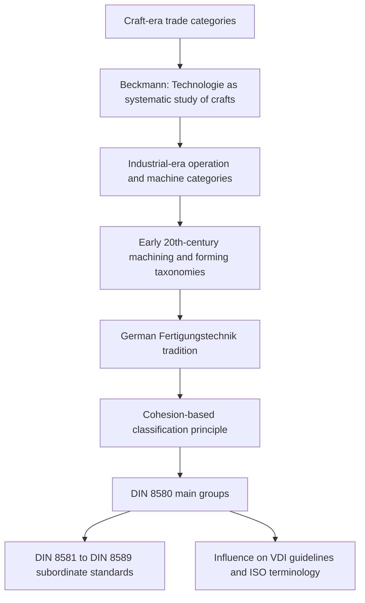

## Development of the DIN 8580 Standard


### Introduction

**DIN 8580** is the German standard that classifies **manufacturing processes** (*Fertigungsverfahren*) into a small number of **main groups** according to a single, uniform principle: **how the cohesion (coherence) of the material is treated during shaping**. It is the most widely cited formal manufacturing-process taxonomy in engineering education and industrial practice in German-speaking countries, and it strongly influences process terminology used internationally, including in textbooks, CAPP systems, and process-oriented product data models.

The standard did not appear suddenly. It is the endpoint of a long line of development described in earlier topics of this chapter: craft-era trade categories, industrial-era operation and machine-based description, and early twentieth-century machining and forming taxonomies. DIN 8580 resolved the central weaknesses of those earlier schemes (inconsistent organizing axes, heterogeneous "chipless" groups, ambiguous boundary operations) by adopting **one top-level principle applied uniformly to all processes**, and by providing a **hierarchical, numbered structure** with defined terminology.

This topic covers:

- Historical context and the need for a unified standard
- The intellectual lineage: Beckmann, Reuleaux, Kienzle, Wallichs, and the German *Fertigungstechnik* tradition
- The organizing principle: cohesion creation, maintenance, reduction, and increase
- The six main groups and their numbering
- Structure of the subordinate DIN 8580-series standards (DIN 8581 through DIN 8589)
- The revision history and international counterparts (including the 2003 revision and later updates)
- Detailed structure of each main group
- Strengths, limits, and criticisms
- Relationship to other taxonomies (VDI guidelines, ISO 15531, ISO/ASTM 52900, CIRP terminology)
- Worked examples, quantitative models, and code

Dates, edition years, and document titles for standards change with revisions, and the details below should be verified against the current edition of the standards before use in any formal or regulatory context [Inference: historical details of committee work and edition histories are summarized from general knowledge and may vary in specifics].

---

### Core Concepts and Terminology

| Term | Definition |
| --- | --- |
| **Fertigungsverfahren** | German term for manufacturing process; the object of classification in DIN 8580 |
| **Fertigen** | Manufacturing in the broad sense: production of geometrically defined solid bodies (workpieces) |
| **Zusammenhalt (cohesion)** | The internal bonding of material particles in a solid body, which holds it together as a coherent workpiece |
| **Hauptgruppe (main group)** | Top-level category in DIN 8580 |
| **Gruppe (group)** | Second-level subdivision within a main group |
| **Untergruppe (subgroup)** | Third-level subdivision |
| **Verfahren (process)** | A specific named method within a subgroup |
| **Formänderung (shape change)** | Change of geometric shape of a workpiece |
| **Stoffeigenschaften ändern** | Changing material properties, without primary intent to change shape |
| **Ordnungsprinzip** | Organizing principle of a classification |
| **Fügen** | Joining: creating lasting connection between workpieces |
| **Trennen** | Separating: local reduction of cohesion |
| **Umformen** | Forming: plastic change of shape with retention of mass and cohesion |
| **Urformen** | Primary shaping: creating a solid body from shapeless material |
| **Beschichten** | Coating: applying a firmly adhering layer of shapeless material |
| **Stoffeigenschaft ändern** | Changing material properties |

**Key Points**

- The **basis of classification** in DIN 8580 is the **change in cohesion** of material during the process. This is a physical criterion, in contrast to the trade, material, or machine-based criteria of earlier schemes.
- The classification is **process-oriented**, not product-oriented and not machine-oriented. A process is classified by what it does to the material, regardless of which machine performs it.
- The standard classifies **processes**, not entire process chains. A real part usually involves several processes from several main groups.

---

### Historical Context and Need for Standardization

#### The Problem: Inconsistent Terminology and Organizing Axes

By the first half of the twentieth century, German technical literature had a rich but inconsistent vocabulary for manufacturing processes. Textbooks organized processes on different axes (machine, operation, tool, material state), the chip/chipless division of the period was heterogeneous, and terms varied between authors, industries, and regions. This complicated:

- Engineering education (different textbooks with different structures)
- Communication between design, planning, and production departments
- Technical documentation and standards drafting
- Later, computer-based process planning and data exchange

#### Institutional Environment

The German standardization movement began in the early twentieth century with the founding of the Normenausschuss der deutschen Industrie (1917), later renamed and known as **DIN** (Deutsches Institut für Normung). Standardization of dimensions, threads, fits, and materials came first. Standardization of **terminology and classification** followed, as engineers recognized that shared vocabulary was also a prerequisite for rational manufacturing organization [Inference: exact dates and institutional names changed over time].

Together with DIN, the **VDI** (Verein Deutscher Ingenieure) and technical universities contributed to the intellectual groundwork, especially through work on *Fertigungstechnik* as a discipline.

---

### Intellectual Lineage



#### Key Contributors and Traditions (Selected)

The following names are commonly associated with the development of systematic manufacturing classification in the German-speaking world. Attribution of specific ideas to individuals is simplified, and the development was collective [Inference].

| Figure or Tradition | Contribution (Simplified) |
| --- | --- |
| **Johann Beckmann** (late 18th century) | Proposed *Technologie* as a systematic, general study of crafts and trades, an early move toward cross-trade classification |
| **Franz Reuleaux** (19th century) | Kinematic analysis of machines and mechanisms, supporting mechanism-based thinking |
| **Karl Karmarsch and 19th-century German technologists** | Systematic *mechanische Technologie* textbooks organizing processes by principle |
| **Otto Kienzle** (20th century) | Influential German production engineer whose work on *Fertigungsverfahren* classification contributed to the conceptual framing of manufacturing processes by their effect on material and shape [Inference: his role is frequently cited in accounts of the classification's development] |
| **Wallichs and the Aachen tradition** | Machine-tool and production engineering research emphasizing systematic process description |
| **VDI committees and university institutes** | Terminology and classification proposals feeding into DIN standardization |
| **Chip/chipless (*spanend/spanlos*) tradition** | Provided an early mechanism-oriented split later generalized into the cohesion principle |

#### From Chip/Chipless to Cohesion

The early twentieth-century chip/chipless division was intuitive but problematic: the "chipless" group contained casting, forming, joining, and other very different mechanisms. The insight leading to the cohesion-based scheme was to ask **what happens to the cohesion of the workpiece material** rather than whether chips are produced. This reframing:

- Puts cutting, grinding, EDM, laser cutting, and shearing in one class (**cohesion reduced locally**), because all of them separate material.
- Places forging, rolling, bending, and drawing in another class (**cohesion maintained**), because material is displaced plastically without separation.
- Places casting and powder-based shaping in a class where **cohesion is created** from shapeless material.
- Places welding, brazing, and adhesive bonding in a class where **cohesion is increased** by joining.
- Adds classes for **coating** (cohesion increased by applying a layer) and for **changing material properties** (rearranging or introducing particles without shape change).

---

### The Organizing Principle in Detail

DIN 8580 defines manufacturing processes by their effect on the **cohesion of the material** of a workpiece. In simplified form:

| Effect on Cohesion | Description | Main Group |
| --- | --- | --- |
| **Cohesion created** | A solid body is created from shapeless material | 1. Primary shaping (Urformen) |
| **Cohesion maintained** | Shape is changed without removing or adding material; plastic deformation | 2. Forming (Umformen) |
| **Cohesion locally reduced** | Material is separated, in whole or in part | 3. Separating (Trennen) |
| **Cohesion increased** | Workpieces are joined together | 4. Joining (Fügen) |
| **Cohesion increased (layer)** | A firmly adhering layer is applied | 5. Coating (Beschichten) |
| **Material properties changed** | Particles rearranged or added or removed, without primary shape intent | 6. Changing material properties (Stoffeigenschaften ändern) |

**Interpretation notes**

- The first five groups are often described as being ordered by the **effect on cohesion**: created, maintained, reduced, and increased (twice, for joining and coating, distinguished by whether workpieces or a layer of shapeless material are combined).
- The sixth group differs in kind: it does not primarily change shape but **modifies the material itself** (through heat treatment, thermomechanical treatment, magnetizing, irradiation, and similar means).
- The principle is formalized as a **physical criterion**, so processes can be classified consistently even when new technologies appear, provided their effect on cohesion is clear.

#### A Compact Formalization

One way to express the principle (a teaching abstraction, not part of the standard) is to describe a process $P$ by the change in the **cohesion state** of the workpiece material:

$$\Delta \kappa(P) \in \{\text{created},\ \text{maintained},\ \text{reduced},\ \text{increased},\ \text{property-changed}\}$$

and to map $\Delta\kappa$ to a main group. This can be written as a simple decision function:

$$g(P) = \begin{cases}

1 & \text{if shapeless material} \to \text{solid body (cohesion created)}\

2 & \text{if plastic shape change, mass and cohesion retained}\

3 & \text{if cohesion locally reduced (material separated)}\

4 & \text{if workpieces joined (cohesion increased)}\

5 & \text{if a layer of shapeless material applied}\

6 & \text{if material properties changed without primary shape intent}

\end{cases}$$

This function is a simplified conceptual model. Actual classification requires the precise definitions in the standard, and hybrid processes can meet more than one condition [Inference].

---

### Structure of the DIN 8580 Series

DIN 8580 is the **introductory and general standard** that defines the classification principle and the six main groups. Each main group is elaborated in its own subordinate standard, which subdivides the group into groups, subgroups, and individual processes.

| Standard | Content (Main Group) |
| --- | --- |
| **DIN 8580** | Manufacturing processes: terms and classification (general standard defining the six main groups) |
| **DIN 8580 (main group 1)** with **DIN 8581** referenced in some presentations | Historically, DIN 8580 (general) and the numbered documents below are organized as a series [Inference: numbering and title details should be verified against the current DIN catalog] |
| **DIN 8581** | Joining (Fügen): classification and terms (main group 4) |
| **DIN 8582** | Forming (Umformen): classification (main group 2) |
| **DIN 8583** | Forming under compressive conditions (subdivision within main group 2) |
| **DIN 8584** | Forming under combined tensile and compressive conditions (subdivision within main group 2) |
| **DIN 8585** | Forming under tensile conditions (subdivision within main group 2) |
| **DIN 8586** | Forming by bending (subdivision within main group 2) |
| **DIN 8587** | Forming by shearing (subdivision within main group 2) |
| **DIN 8588** | Separating: cutting (Zerteilen), dividing without chip formation (main group 3) |
| **DIN 8589** | Separating: machining with geometrically defined and undefined cutting edges, and removing (Abtragen) (main group 3, split across several parts, for example DIN 8589-0 to DIN 8589-99) |
| **DIN 8590** | Coating classification [Inference: numbering has varied across editions and presentations] |
| **DIN 8591** | Changing material properties [Inference: numbering has varied across editions and presentations] |

[Inference: The numbering above is the commonly presented scheme in teaching materials, but the mapping of standard numbers to main groups has been reorganized across editions, and individual document numbers, parts, and titles should be confirmed against the current DIN catalog. The essential point is that DIN 8580 defines the six main groups, and separate subordinate standards subdivide each group.]

**Key Points**

- The standard is a **series**, not a single document. The main-group definitions live in DIN 8580, and detailed process listings live in the subordinate documents.
- The numbering of subordinate documents does not correspond one-to-one with main group numbers, a common source of confusion for students.

---

### Revision History and Development Stages

The following outline summarizes the commonly presented development stages. Precise dates should be verified [Inference: dates are approximate teaching conventions].

| Stage | Approximate Period | Development |
| --- | --- | --- |
| **Pre-standard terminology work** | 1920s to 1950s | VDI and university committees develop terminology and classification proposals for *Fertigungsverfahren*; chip/chipless remains common |
| **Initial standardization** | 1950s to 1970s | DIN publishes the first classification standards for manufacturing processes; cohesion-based principle is adopted as top-level scheme; main groups established |
| **Subordinate standards** | 1970s to 1980s | Detailed standards for individual main groups are developed and published (forming, separating, joining, and so on) |
| **Consolidation and revisions** | 1980s to 1990s | Editions updated to refine definitions, add processes, and align terminology |
| **Major revision** | Early 2000s (commonly cited around 2003) | DIN 8580 revised to update the general classification and terminology, including clarifications to the main group definitions and better alignment with international usage |
| **Later updates** | 2000s to present | Ongoing maintenance, harmonization with European and international standardization, and consideration of new processes (for example additive manufacturing terminology, addressed partly in other standards) |

#### Key Design Decisions in the Standard's Development

| Decision | Rationale |
| --- | --- |
| **Adopt a single, physical top-level principle** | Overcome the inconsistent axes of earlier textbooks |
| **Classify processes, not machines or products** | Ensure classification stays stable when machines change |
| **Use cohesion as the criterion** | Provides a criterion that applies uniformly across metals, polymers, ceramics, and composites |
| **Separate joining from coating despite both increasing cohesion** | Distinguish combining defined workpieces from applying shapeless layers |
| **Include a sixth group for property change** | Capture processes (heat treatment) that change material without primary shape change |
| **Use decimal-like numbering** | Enable unambiguous reference to any process at any level |
| **Define terms formally** | Provide reference vocabulary for education, documentation, and data exchange |

---

### Detailed Structure of the Six Main Groups

#### Main Group 1: Primary Shaping (Urformen)

**Definition**: Creating a solid body from shapeless material by creating cohesion. Shapeless material includes liquids, powders, granules, fibers, chips, and melts.

**Typical subdivision (illustrative)**

| Group | Description | Example Processes |
| --- | --- | --- |
| Primary shaping from the liquid state | Casting | Sand casting, permanent-mold casting, die casting, investment casting, centrifugal casting, continuous casting |
| Primary shaping from the plastic state | Molding of plastic-state material | Injection molding, extrusion (as primary shaping), compression molding (of plastics and elastomers) |
| Primary shaping from the granular or powder state | Powder metallurgy, sintering-based shaping | Pressing and sintering of powders, metal injection molding |
| Primary shaping from the fibrous or chip state | Bonding of fibers or particles | Fiber-reinforced composite layup, particle board pressing (in broader material contexts) |
| Primary shaping from gaseous or ionized state | Deposition methods that form bodies | Vapor deposition producing bulk bodies (specialized) |
| Primary shaping from the solution state | Electrodeposition forming | Electroforming |

[Inference: The exact subdivision and naming follow the current standard's numbering, and several of the examples above are grouped differently in different editions or presentations.]

**Key Points**

- Casting is the archetypal primary shaping process, but the group is broader than casting.
- Many additive manufacturing processes create a solid body from shapeless material (powders, liquids, filaments), so they are frequently discussed as **primary shaping** in the DIN framework. However, DIN 8580 originated before additive manufacturing became industrial, and the classification of some additive processes is discussed in later revisions and related documents, and is treated differently in other standards [Inference].

#### Main Group 2: Forming (Umformen)

**Definition**: Plastic change of the shape of a solid body, with **retention of mass and cohesion** (no intentional removal of material). Forming is subdivided by the **predominant stress condition** during the process, not by temperature, and this is a notable difference from the earlier hot/cold division.

**Subdivision by stress condition (with associated subordinate standards)**

| Group | Predominant Stress | Example Processes | Associated Standard |
| --- | --- | --- | --- |
| **Compressive forming** (*Druckumformen*) | Compressive | Rolling, open-die forging, closed-die forging, extrusion, indentation | DIN 8583 |
| **Combined tensile and compressive forming** (*Zugdruckumformen*) | Combined tension and compression | Wire and bar drawing, deep drawing, spinning, ironing, collar drawing | DIN 8584 |
| **Tensile forming** (*Zugumformen*) | Tensile | Stretching, expanding, widening, stretch forming | DIN 8585 |
| **Bending forming** (*Biegeumformen*) | Bending | Bending with linear or rotary tool motion, roll bending, hemming | DIN 8586 |
| **Shear forming** (*Schubumformen*) | Shear | Twisting, shifting (displacement by shear) | DIN 8587 |

**Key Points**

- The stress-condition subdivision groups processes by the **mechanical state in the deforming zone**, a mechanics-based criterion consistent with the cohesion principle.
- Hot versus cold working, a major axis in early twentieth-century texts, becomes a **secondary attribute** (temperature regime) rather than a classification level.

#### Main Group 3: Separating (Trennen)

**Definition**: Changing the shape of a workpiece by **locally reducing cohesion**, that is, separating material. This group includes all cutting, machining, and removal processes.

**Subdivision (illustrative)**

| Group | Description | Example Processes |
| --- | --- | --- |
| **Cutting (Zerteilen)** | Mechanical separation without chip formation | Shearing, blanking, piercing, cutting off, tearing, fracturing |
| **Machining with geometrically defined cutting edges (Spanen mit geometrisch bestimmten Schneiden)** | Chip-producing separation with tools of defined cutting-edge geometry | Turning, drilling, milling, planing, shaping, broaching, sawing (with defined teeth) |
| **Machining with geometrically undefined cutting edges (Spanen mit geometrisch unbestimmten Schneiden)** | Chip-producing separation with abrasive grains of random geometry | Grinding, honing, lapping, abrasive blasting |
| **Removing (Abtragen)** | Separation by non-mechanical or non-cutting mechanisms | Thermal removal (electrical discharge machining, laser cutting, plasma cutting), chemical removal (etching, chemical milling), electrochemical removal (electrochemical machining) |
| **Disassembling (Zerlegen)** | Separation of previously joined workpieces | Unscrewing, unriveting, unbonding |
| **Cleaning (Reinigen)** | Removal of unwanted substances from surfaces | Degreasing, pickling, blasting for cleaning |
| **Evacuating (Evakuieren)** | Removal of gas from an enclosed volume (in some presentations) | Vacuum pumping [Inference: inclusion and grouping are specific to certain editions] |

**Key Points**

- The **defined versus undefined cutting edge** distinction is a signature feature of the separating group, and it preserves the earlier single-point/multi-point/abrasive tool split in a mechanism-based form.
- Non-traditional removal methods (EDM, ECM, laser) fit naturally into the group because it is based on cohesion reduction, not on chip formation. This resolves the limitation of the chip-based scheme.

#### Main Group 4: Joining (Fügen)

**Definition**: Lasting connection or other joining of two or more workpieces of **geometrically defined shape**, or of such workpieces with shapeless material, where **cohesion is created locally and increased overall**.

**Subdivision (illustrative)**

| Group | Description | Example Processes |
| --- | --- | --- |
| **Assembling (Zusammenlegen)** | Placing parts together without lasting connection | Placing, inserting, hooking in |
| **Filling (Füllen)** | Filling a hollow body or porous body with material | Impregnating, filling of containers |
| **Pressing on and in (An- und Einpressen)** | Joining by force or friction | Screwing, clamping, press fitting, wedging |
| **Joining by primary shaping (Fügen durch Urformen)** | Joining by casting or molding around a part | Casting in, potting, overmolding |
| **Joining by forming (Fügen durch Umformen)** | Joining by plastic deformation | Riveting, clinching, crimping, hemming, flanging |
| **Joining by welding (Fügen durch Schweißen)** | Joining by local melting or plastic deformation with heat and/or pressure | Arc welding, gas welding, resistance welding, laser welding, friction welding |
| **Joining by soldering and brazing (Fügen durch Löten)** | Joining with a filler metal of lower melting point than the base materials | Soft soldering, hard soldering, brazing |
| **Joining by adhesive bonding (Kleben)** | Joining with adhesives | Structural adhesive bonding |
| **Textile joining (Textiles Fügen)** | Joining of textile or flexible materials | Sewing, knitting-based joining, needling |

[Inference: The number of joining groups and their sequence differ between editions and presentations, and the list above is a representative teaching summary.]

#### Main Group 5: Coating (Beschichten)

**Definition**: Applying a **firmly adhering layer of shapeless material** to a workpiece. The layer becomes an integral part of the workpiece surface.

**Subdivision by state of the coating material (illustrative)**

| Group | Description | Example Processes |
| --- | --- | --- |
| **Coating from the liquid state** | Applying liquid material that solidifies or cures | Painting, dip coating, spin coating, hot-dip galvanizing |
| **Coating from the plastic or paste state** | Applying viscous or paste-like material | Plastering, spreading pastes, applying compounds |
| **Coating from the granular or powder state** | Applying powder | Powder coating, thermal spraying (powder feedstock), enameling |
| **Coating from the gaseous or vapor state** | Depositing from a vapor or plasma | Physical vapor deposition (PVD), chemical vapor deposition (CVD) |
| **Coating from the ionized state** | Depositing from ionized species | Electroplating (electrolytic deposition), anodizing (as electrochemical coating processes, with variations in classification) [Inference] |
| **Coating by welding or soldering** | Applying a layer using weld or solder material | Weld cladding, hardfacing, build-up welding |

**Key Points**

- Coating is distinguished from **joining** because the material applied is **shapeless** (a liquid, powder, vapor, or similar), not a geometrically defined workpiece.
- Coating changes the workpiece **surface** but is classified by the state of the coating material, not by the function of the layer (corrosion protection, wear resistance, appearance).

#### Main Group 6: Changing Material Properties (Stoffeigenschaften ändern)

**Definition**: Changing the properties of the workpiece material by **rearranging, removing, or adding material particles**, usually with no primary intent to change the macroscopic shape.

**Subdivision (illustrative)**

| Group | Description | Example Processes |
| --- | --- | --- |
| **Consolidating by forming (Verfestigen durch Umformen)** | Property change by plastic deformation | Work hardening, shot peening, roller burnishing (for property effects), cold working for strength |
| **Heat treatment (Wärmebehandeln)** | Property change by controlled heating and cooling | Annealing, hardening, tempering, normalizing, quenching, solution treatment and aging |
| **Thermochemical treatment (Thermochemisches Behandeln)** | Property change by diffusion of elements at temperature | Carburizing, nitriding, carbonitriding, boronizing |
| **Sintering and burning (Sintern, Brennen)** | Property change of ceramic or powder bodies by thermal consolidation | Firing of ceramics, sintering of pre-formed bodies (in property-change context) [Inference: treatment overlaps with primary shaping] |
| **Magnetizing and irradiating** | Property change by fields or radiation | Magnetizing, irradiation for cross-linking or modification |
| **Photochemical and other treatments** | Property change by light or chemical action | Photochemical curing, etching-based property modification [Inference] |

**Key Points**

- Heat treatment is the central example: shape does not primarily change, but the microstructure and mechanical properties do.
- The boundary with other groups can blur (for example, work hardening occurs during forming as a side effect, but is classified in this group only when property change is the **primary intent**).

---

### Overview Diagram (Structure)

<svg xmlns="http://www.w3.org/2000/svg" viewBox="0 0 860 560" width="860" height="560" font-family="Arial, Helvetica, sans-serif">
<rect x="0" y="0" width="860" height="560" fill="#ffffff" stroke="#cccccc" />
<text x="430" y="28" text-anchor="middle" font-size="16" font-weight="bold" fill="#222222">DIN 8580 Main Groups by Effect on Cohesion (svg_diagram)</text>
<rect x="300" y="45" width="260" height="45" rx="6" fill="#eeeeee" stroke="#555555" />
<text x="430" y="65" text-anchor="middle" font-size="13" font-weight="bold" fill="#222222">Manufacturing Processes</text>
<text x="430" y="82" text-anchor="middle" font-size="11" fill="#333333">Criterion: treatment of material cohesion</text>
<line x1="430" y1="90" x2="430" y2="115" stroke="#555555" stroke-width="2" />
<line x1="75" y1="115" x2="785" y2="115" stroke="#555555" stroke-width="2" />
<line x1="75" y1="115" x2="75" y2="140" stroke="#555555" stroke-width="2" />
<line x1="193" y1="115" x2="193" y2="140" stroke="#555555" stroke-width="2" />
<line x1="311" y1="115" x2="311" y2="140" stroke="#555555" stroke-width="2" />
<line x1="549" y1="115" x2="549" y2="140" stroke="#555555" stroke-width="2" />
<line x1="667" y1="115" x2="667" y2="140" stroke="#555555" stroke-width="2" />
<line x1="785" y1="115" x2="785" y2="140" stroke="#555555" stroke-width="2" />
<rect x="15" y="140" width="120" height="90" rx="6" fill="#fff8e1" stroke="#f9a825" />
<text x="75" y="162" text-anchor="middle" font-size="12" font-weight="bold" fill="#e65100">1 Primary</text>
<text x="75" y="177" text-anchor="middle" font-size="12" font-weight="bold" fill="#e65100">shaping</text>
<text x="75" y="197" text-anchor="middle" font-size="10" fill="#333333">Cohesion</text>
<text x="75" y="211" text-anchor="middle" font-size="10" fill="#333333">CREATED</text>
<rect x="133" y="140" width="120" height="90" rx="6" fill="#e8f5e9" stroke="#2e7d32" />
<text x="193" y="162" text-anchor="middle" font-size="12" font-weight="bold" fill="#1b5e20">2 Forming</text>
<text x="193" y="182" text-anchor="middle" font-size="10" fill="#333333">Cohesion</text>
<text x="193" y="196" text-anchor="middle" font-size="10" fill="#333333">MAINTAINED</text>
<rect x="251" y="140" width="120" height="90" rx="6" fill="#e3f2fd" stroke="#1565c0" />
<text x="311" y="162" text-anchor="middle" font-size="12" font-weight="bold" fill="#0d47a1">3 Separating</text>
<text x="311" y="182" text-anchor="middle" font-size="10" fill="#333333">Cohesion locally</text>
<text x="311" y="196" text-anchor="middle" font-size="10" fill="#333333">REDUCED</text>
<rect x="489" y="140" width="120" height="90" rx="6" fill="#fce4ec" stroke="#c2185b" />
<text x="549" y="162" text-anchor="middle" font-size="12" font-weight="bold" fill="#880e4f">4 Joining</text>
<text x="549" y="182" text-anchor="middle" font-size="10" fill="#333333">Cohesion</text>
<text x="549" y="196" text-anchor="middle" font-size="10" fill="#333333">INCREASED</text>
<rect x="607" y="140" width="120" height="90" rx="6" fill="#ede7f6" stroke="#5e35b1" />
<text x="667" y="162" text-anchor="middle" font-size="12" font-weight="bold" fill="#311b92">5 Coating</text>
<text x="667" y="182" text-anchor="middle" font-size="10" fill="#333333">Cohesion</text>
<text x="667" y="196" text-anchor="middle" font-size="10" fill="#333333">INCREASED (layer)</text>
<rect x="725" y="140" width="120" height="90" rx="6" fill="#eceff1" stroke="#455a64" />
<text x="785" y="158" text-anchor="middle" font-size="12" font-weight="bold" fill="#263238">6 Changing</text>
<text x="785" y="173" text-anchor="middle" font-size="12" font-weight="bold" fill="#263238">material</text>
<text x="785" y="188" text-anchor="middle" font-size="12" font-weight="bold" fill="#263238">properties</text>
<text x="785" y="210" text-anchor="middle" font-size="10" fill="#333333">Particles rearranged</text>

<text x="75" y="260" text-anchor="middle" font-size="10" fill="`#333333`">Casting</text>

<text x="75" y="274" text-anchor="middle" font-size="10" fill="`#333333`">Molding</text>

<text x="75" y="288" text-anchor="middle" font-size="10" fill="`#333333`">Sintering (shaping)</text>

<text x="193" y="260" text-anchor="middle" font-size="10" fill="`#333333`">Compressive</text>

<text x="193" y="274" text-anchor="middle" font-size="10" fill="`#333333`">Tensile, bending</text>

<text x="193" y="288" text-anchor="middle" font-size="10" fill="`#333333`">Shear</text>

<text x="311" y="260" text-anchor="middle" font-size="10" fill="`#333333`">Cutting, machining</text>

<text x="311" y="274" text-anchor="middle" font-size="10" fill="`#333333`">Abrasive, removal</text>

<text x="311" y="288" text-anchor="middle" font-size="10" fill="`#333333`">Disassembling</text>

<text x="549" y="260" text-anchor="middle" font-size="10" fill="`#333333`">Welding, brazing</text>

<text x="549" y="274" text-anchor="middle" font-size="10" fill="`#333333`">Bonding, riveting</text>

<text x="549" y="288" text-anchor="middle" font-size="10" fill="`#333333`">Pressing, textile</text>

<text x="667" y="260" text-anchor="middle" font-size="10" fill="`#333333`">Painting, plating</text>

<text x="667" y="274" text-anchor="middle" font-size="10" fill="`#333333`">PVD, CVD</text>

<text x="667" y="288" text-anchor="middle" font-size="10" fill="`#333333`">Thermal spray</text>

<text x="785" y="260" text-anchor="middle" font-size="10" fill="`#333333`">Heat treatment</text>

<text x="785" y="274" text-anchor="middle" font-size="10" fill="`#333333`">Thermochemical</text>

<text x="785" y="288" text-anchor="middle" font-size="10" fill="`#333333`">Work hardening</text>

<rect x="15" y="330" width="830" height="185" rx="8" fill="#fafafa" stroke="#cccccc" />
<text x="430" y="355" text-anchor="middle" font-size="13" font-weight="bold" fill="#222222">Cohesion Logic (Simplified)</text>
<text x="430" y="382" text-anchor="middle" font-size="11" fill="#333333">Shapeless material to solid body: group 1 (created)</text>
<text x="430" y="402" text-anchor="middle" font-size="11" fill="#333333">Solid body deformed, no material loss: group 2 (maintained)</text>
<text x="430" y="422" text-anchor="middle" font-size="11" fill="#333333">Material separated from solid body: group 3 (reduced)</text>
<text x="430" y="442" text-anchor="middle" font-size="11" fill="#333333">Defined workpieces united: group 4 (increased)</text>
<text x="430" y="462" text-anchor="middle" font-size="11" fill="#333333">Shapeless layer applied on workpiece: group 5 (increased, layer)</text>
<text x="430" y="482" text-anchor="middle" font-size="11" fill="#333333">Material itself modified, shape not the aim: group 6</text>
<text x="430" y="505" text-anchor="middle" font-size="10" fill="#777777">Simplified teaching diagram; consult the current standard for exact definitions</text>
</svg>

---

### Numbering and Hierarchical Structure

DIN 8580 uses a **decimal hierarchical numbering** so that each process can be referenced by a code reflecting its position in the hierarchy.

| Level | Example Label | Example Number (Illustrative) |
| --- | --- | --- |
| Main group | Separating | 3 |
| Group | Machining with geometrically defined cutting edges | 3.2 |
| Subgroup | Turning | 3.2.1 |
| Process | Longitudinal turning | 3.2.1.1 |

[Inference: The exact numbers above are illustrative of the decimal structure. Actual numbering in the standards may differ in detail, and the current edition of the relevant subordinate standard should be consulted for authoritative numbers.]

A general expression for a process reference can be written as:

$$\text{ID} = m.g.s.p$$

where $m$ is the main group, $g$ the group, $s$ the subgroup, and $p$ the individual process. Because the structure is a strict tree in the standard's presentation, each process has one primary location, which supports unambiguous referencing but forces a single classification for hybrid processes.

---

### Worked Example 1: Classifying Individual Processes

Classify the following processes using the cohesion criterion.

| Process | Cohesion Effect | Main Group | Reasoning |
| --- | --- | --- | --- |
| Sand casting of an engine block | Solid body created from liquid metal | 1 Primary shaping | Shapeless (liquid) to solid body |
| Closed-die forging of a connecting rod | Plastic shape change, mass retained | 2 Forming | Compressive forming, no material loss |
| Deep drawing of a cup from sheet | Plastic shape change, combined tension and compression | 2 Forming | Tension-compression forming |
| Turning a shaft | Chips removed | 3 Separating | Machining with geometrically defined edges |
| Surface grinding | Material removed by abrasive grains | 3 Separating | Machining with undefined edges |
| Laser cutting of sheet | Material separated by thermal action | 3 Separating | Removing (thermal) or cutting, per edition |
| Arc welding two plates | Cohesion created locally to join workpieces | 4 Joining | Joining by welding |
| Riveting two plates | Joining by plastic deformation of rivet | 4 Joining | Joining by forming |
| Powder coating a housing | Applying a layer of shapeless powder | 5 Coating | Coating from granular state |
| Hot-dip galvanizing | Applying a layer from liquid metal | 5 Coating | Coating from liquid state |
| Case hardening a gear | Material properties changed by carbon diffusion and heat | 6 Changing material properties | Thermochemical treatment |
| Shot peening | Property change by surface plastic deformation | 6 Changing material properties | Consolidation by forming, with property change as the aim |
| Injection molding a polymer housing | Solid body created from molten polymer | 1 Primary shaping | Shapeless (plastic melt) to solid body |
| Blanking a washer | Material separated by shearing | 3 Separating | Cutting, a separating process (unlike the early-twentieth-century habit of listing it under forming) |

**Output**

The classification resolves the ambiguities noted in the previous topic: blanking and shearing are **separating** processes, not forming, and non-traditional removal methods fit in the separating group. Shot peening and case hardening go into the property-change group because the **primary intent** is a property modification.

**Conclusion**: A single principle, applied consistently, assigns each process to one main group. Ambiguity remains only where a process serves more than one purpose or where the intent is unclear.

---

### Worked Example 2: Classifying a Process Chain

Consider a **hardened steel gear** with a coated surface finish.

| Step | Process | Main Group | DIN 8580 Sub-context |
| --- | --- | --- | --- |
| 1 | Closed-die forging of blank | 2 Forming | Compressive forming |
| 2 | Normalizing | 6 Changing material properties | Heat treatment |
| 3 | Turning of blank | 3 Separating | Machining, defined edges |
| 4 | Gear hobbing | 3 Separating | Machining, defined edges |
| 5 | Case hardening | 6 Changing material properties | Thermochemical treatment |
| 6 | Grinding of flanks | 3 Separating | Machining, undefined edges |
| 7 | Phosphate coating | 5 Coating | Coating (chemical conversion, classification by edition) |
| 8 | Pressing gear onto shaft | 4 Joining | Pressing on and in |

**Count of steps per main group**

| Main Group | Steps | Count |
| --- | --- | --- |
| 1 Primary shaping | none | 0 |
| 2 Forming | 1 | 1 |
| 3 Separating | 3, 4, 6 | 3 |
| 4 Joining | 8 | 1 |
| 5 Coating | 7 | 1 |
| 6 Changing material properties | 2, 5 | 2 |

**Output**

Five of the six main groups appear in one product's route (all except primary shaping). This illustrates why DIN 8580 is a **classification of individual processes**, and a real part requires a **process chain** description that references several groups.

**Conclusion**: The cohesion-based classification does not by itself describe the route. It provides the vocabulary for each step, and a routing or process-plan document sequences them.

---

### Quantitative Perspective: Coverage and Balance of a Route

A simple analysis tool computes the **main-group distribution** of a process route. If a route has $N$ steps and $n_k$ steps in main group $k$, the share is:

$$s_k = \frac{n_k}{N}$$

and the **diversity** (Shannon entropy in bits over the six groups) is:

$$H = -\sum_{k=1}^{6} s_k \log_2 s_k \quad (\text{with } 0 \log 0 = 0)$$

For the gear route above, $N = 8$ and $n = (0, 1, 3, 1, 1, 2)$:

$$s = (0,\ 0.125,\ 0.375,\ 0.125,\ 0.125,\ 0.25)$$


$$H = -\left[0.125\log_2 0.125 \times 3 + 0.375\log_2 0.375 + 0.25\log_2 0.25\right]$$


$$H = -\left[3(0.125)(-3) + 0.375(-1.415) + 0.25(-2)\right]$$


$$H = -\left[-1.125 - 0.5306 - 0.5\right] = 2.156 \text{ bits}$$

**Output**

$H \approx 2.16$ bits. The maximum for six groups is $\log_2 6 \approx 2.585$ bits, so this route is fairly diverse, using five of six groups with separating dominating. This is a simple descriptive statistic and has no standing in the standard itself.

---

### Python Example: Implementing a DIN 8580-Style Classifier and Route Analyzer

```python
import math
from collections import Counter

MAIN_GROUPS = {
    1: "Primary shaping (Urformen)",
    2: "Forming (Umformen)",
    3: "Separating (Trennen)",
    4: "Joining (Fuegen)",
    5: "Coating (Beschichten)",
    6: "Changing material properties (Stoffeigenschaften aendern)",
}

# Simplified lookup: process -> (main_group, group_label)
PROCESS_DB = {
    "sand casting":          (1, "from liquid state"),
    "injection molding":     (1, "from plastic state"),
    "powder sintering":      (1, "from powder state"),
    "closed-die forging":    (2, "compressive forming"),
    "rolling":               (2, "compressive forming"),
    "deep drawing":          (2, "tension-compression forming"),
    "bending":               (2, "bending forming"),
    "turning":               (3, "machining, defined edges"),
    "milling":               (3, "machining, defined edges"),
    "grinding":              (3, "machining, undefined edges"),
    "blanking":              (3, "cutting"),
    "laser cutting":         (3, "removing"),
    "edm":                   (3, "removing"),
    "arc welding":           (4, "welding"),
    "brazing":               (4, "soldering/brazing"),
    "adhesive bonding":      (4, "bonding"),
    "riveting":              (4, "joining by forming"),
    "press fitting":         (4, "pressing on and in"),
    "powder coating":        (5, "from powder state"),
    "hot-dip galvanizing":   (5, "from liquid state"),
    "pvd":                   (5, "from vapor state"),
    "hardening":             (6, "heat treatment"),
    "annealing":             (6, "heat treatment"),
    "case hardening":        (6, "thermochemical treatment"),
    "shot peening":          (6, "consolidation by forming"),
}


def classify(process):
    key = process.strip().lower()
    if key not in PROCESS_DB:
        raise KeyError(f"Unknown process: {process}")
    group, subgroup = PROCESS_DB[key]
    return group, MAIN_GROUPS[group], subgroup


def analyze_route(route):
    """Return main-group counts, shares, and Shannon entropy (bits)."""
    groups = [classify(p)[0] for p in route]
    counts = Counter(groups)
    n = len(groups)
    shares = {g: counts.get(g, 0) / n for g in MAIN_GROUPS}
    entropy = -sum(s * math.log2(s) for s in shares.values() if s > 0)
    return counts, shares, entropy


route = [
    "closed-die forging", "annealing", "turning", "milling",
    "case hardening", "grinding", "powder coating", "press fitting",
]

print("Route classification:")
for p in route:
    g, name, sub = classify(p)
    print(f"  {p:20s} -> {g} {name} [{sub}]")

counts, shares, H = analyze_route(route)
print("\nMain-group counts:", dict(sorted(counts.items())))
print("Shares:", {g: round(s, 3) for g, s in shares.items()})
print(f"Entropy: {H:.3f} bits (max {math.log2(6):.3f})")
```

**Output** (computed from the code above)



```
Route classification:
  closed-die forging   -> 2 Forming (Umformen) [compressive forming]
  annealing            -> 6 Changing material properties (Stoffeigenschaften aendern) [heat treatment]
  turning              -> 3 Separating (Trennen) [machining, defined edges]
  milling              -> 3 Separating (Trennen) [machining, defined edges]
  case hardening       -> 6 Changing material properties (Stoffeigenschaften aendern) [thermochemical treatment]
  grinding             -> 3 Separating (Trennen) [machining, undefined edges]
  powder coating       -> 5 Coating (Beschichten) [from powder state]
  press fitting        -> 4 Joining (Fuegen) [pressing on and in]

Main-group counts: {2: 1, 3: 3, 4: 1, 5: 1, 6: 2}
Shares: {1: 0.0, 2: 0.125, 3: 0.375, 4: 0.125, 5: 0.125, 6: 0.25}
Entropy: 2.156 bits (max 2.585)
```

**Key Points**

- The lookup table is a **teaching simplification** and is not a substitute for the standard's definitions.
- The classifier illustrates how a cohesion-based scheme lends itself to **machine-readable** representation, a reason for its adoption in CAPP and manufacturing data models.

---

### Relationship to Other Taxonomies and Standards

| Standard or Framework | Relationship to DIN 8580 |
| --- | --- |
| **VDI guidelines** (for example, on manufacturing process terminology and production planning) | Complementary; VDI guidelines often build on DIN 8580 vocabulary for planning and documentation [Inference: specific guideline numbers vary] |
| **ISO 15531 (MANDATE)** | International standard on industrial manufacturing management data; concerns data exchange rather than the process classification itself |
| **ISO/ASTM 52900** | Terminology and classification of additive manufacturing processes into seven process categories; a **separate, technology-specific** classification not derived from the cohesion principle |
| **CIRP terminology** | International academy for production engineering; publishes dictionaries of production engineering terms with multilingual coverage |
| **NAICS, ISIC, HS** | Classify industries and products, not processes (see the first topic of this course) |
| **Group technology systems (Opitz, MICLASS)** | Classify parts by geometry and manufacturing features, complementary to process classification |
| **Anglo-American textbook divisions** (casting, forming, machining, joining, finishing) | Similar in content but not formally standardized on the cohesion principle, and often mixed in organizing axes |
| **Japanese and other national standards** | Various national terminology standards; degree of alignment with the cohesion principle differs [Inference] |

**Key Points**

- DIN 8580 is a **national (German) standard** with wide influence, not an ISO standard. International use is often through textbooks, translation, and adoption by companies with German ties.
- **Additive manufacturing** is addressed separately by ISO/ASTM 52900, which groups AM processes by how material is deposited and bonded. In DIN terms, most AM processes correspond to primary shaping, and some involve joining-like mechanisms at the layer level [Inference: discussion of AM within the DIN framework varies among authors].

---

### Strengths of the Standard

- **Single, physical organizing principle** applied uniformly across all processes and materials.
- **Resolves earlier ambiguities**: shearing and blanking in separating, non-traditional removal in separating, property change as its own group.
- **Hierarchical and numbered**, supporting unambiguous reference and database use.
- **Process-centered and machine-independent**, so it remains stable as machines evolve.
- **Formal terminology** supporting education, documentation, and standardization.
- **Suitable for computer representation** in planning and data-model contexts.
- **Preserves useful earlier distinctions** as secondary attributes (defined versus undefined cutting edge, stress-condition subdivisions, temperature as attribute).

### Limitations and Criticisms

| Limitation | Description |
| --- | --- |
| **Hybrid and multi-function processes** | Processes that combine mechanisms (laser cladding, friction stir welding as joining plus property change, hybrid additive-subtractive machining) do not map to a single leaf in a strict tree [Inference] |
| **Emerging technologies** | Additive manufacturing, certain nano- and bio-manufacturing methods, and other recent technologies were not central when the framework was designed, and their placement requires interpretation |
| **Intent-dependent classification** | The property-change group depends on the **primary intent**, which may be unclear (for example, forming that also work-hardens) |
| **Joining versus coating boundary** | Distinction depends on whether the added material is a defined workpiece or shapeless material, which can be ambiguous for certain layers and cladding processes |
| **Single-axis view** | Classifies by cohesion effect only, so it does not capture material, energy source, tolerance capability, or economic regime (these require additional facets) |
| **National origin** | Terminology is German-language; translations are not always exact, and alignment with English-language textbooks is imperfect |
| **Numbering complexity** | The subordinate-standard numbering does not match main group numbering, confusing learners |
| **Process-chain blindness** | Describes individual processes, not routes, cost, or sequencing |
| **Revision lag** | Formal revision cycles are slow relative to technology change |

---

### Common Misconceptions

| Misconception | Clarification |
| --- | --- |
| DIN 8580 is an ISO standard | It is a German national standard; international influence is through education and industry practice |
| DIN 8580 classifies machines | It classifies **processes**, independent of machine |
| Hot versus cold working is a main division of forming | Forming is subdivided by **stress condition**; temperature is a secondary attribute |
| Blanking and shearing are forming processes | In DIN 8580 they are **separating** (cutting) processes |
| Heat treatment is a forming or joining process | It belongs to **changing material properties** |
| Additive manufacturing has its own main group in DIN 8580 | Classic DIN 8580 defines six groups; AM is commonly discussed under primary shaping and handled by separate standards such as ISO/ASTM 52900 [Inference] |
| Six main groups equals six process types | Each main group contains many groups, subgroups, and processes |
| The standard is a single document | It is a **series** with a general standard and subordinate standards |
| Numbering of DIN 8581 to 8589 equals main group numbers 1 to 6 | The mapping is not one-to-one |

---

### Practical Guidelines for Using the Standard

1. **Ask the cohesion question first.** For any process, determine whether cohesion is created, maintained, locally reduced, or increased, or whether material properties are altered.
2. **Identify the state of the starting material.** Shapeless material points to primary shaping or coating; a solid body points to forming, separating, or property change; multiple defined workpieces point to joining.
3. **Determine primary intent for borderline cases.** Separate property change from forming by asking what the process is intended to achieve.
4. **Use the subordinate standards for detail.** Consult the specific document for the relevant main group to find groups, subgroups, and precise definitions.
5. **Record secondary attributes separately.** Temperature, material, energy source, tolerance class, and machine belong in attributes, not in the classification level.
6. **Describe routes as sequences.** For real parts, list the ordered processes and classify each one.
7. **Document the edition.** Cite the edition year of the standard used, since terminology and structure change across revisions.
8. **Handle hybrids explicitly.** Assign a primary classification and record secondary effects as additional tags.

---

### Summary Table

| Aspect | Detail |
| --- | --- |
| **Type** | German national standard series for manufacturing process classification |
| **Organizing principle** | Treatment of material cohesion |
| **Main groups** | 1 Primary shaping, 2 Forming, 3 Separating, 4 Joining, 5 Coating, 6 Changing material properties |
| **Forming subdivision** | By stress condition: compressive, combined tensile-compressive, tensile, bending, shear |
| **Separating subdivision** | Cutting, machining with defined edges, machining with undefined edges, removing, disassembling, cleaning |
| **Precursors** | Beckmann's *Technologie*, machine-based and operation-based schemes, chip/chipless tradition |
| **Key improvements over earlier schemes** | Single principle, resolved boundary cases, formal terminology, hierarchical numbering |
| **Main limitations** | Hybrid processes, emerging technologies, intent dependence, single-axis view |
| **Complementary frameworks** | VDI guidelines, group technology, ISO/ASTM 52900, CIRP terminology |

---

### Conclusion

The development of DIN 8580 represents the point at which the long historical evolution of process taxonomies converged on a **single, physically grounded organizing principle**: the treatment of material cohesion. By classifying processes according to whether cohesion is created, maintained, locally reduced, or increased, and by adding a group for property change, the standard replaced the inconsistent axes of earlier machine-, operation-, and material-based schemes with a uniform framework. Its hierarchical numbering, formal definitions, and separate subordinate standards for each main group made it suitable for education, documentation, and computer-based planning.

Its strengths are stability, clarity, and broad applicability across materials and machines. Its limitations, hybrid and multi-function processes, intent-dependent boundaries, and the challenge of accommodating emerging technologies such as additive manufacturing, show why later work has supplemented it with faceted attributes, technology-specific standards, and data-model standards. DIN 8580 remains the reference framework from which most subsequent discussion of process families in this course is organized.

---

### Next Steps

- Detailed study of DIN 8580 main group definitions and the wording of each definition in the current edition
- Forming subdivisions by stress condition (DIN 8582 through DIN 8587) in depth
- Separating subdivisions: cutting, machining with defined and undefined edges, removing (DIN 8588 and DIN 8589 series)
- Joining subdivisions (DIN 8593 series) and coating subdivisions in depth
- Comparison of DIN 8580 with anglophone textbook classifications
- ISO/ASTM 52900 additive manufacturing categories and their mapping to DIN 8580
- Handling hybrid processes and process chains with faceted attributes
- Use of DIN 8580 in CAPP systems and manufacturing data models (ISO 15531, STEP-NC concepts)
- VDI guidelines complementing DIN 8580 for production planning
- Emerging process classification proposals for nano-, bio-, and hybrid manufacturing