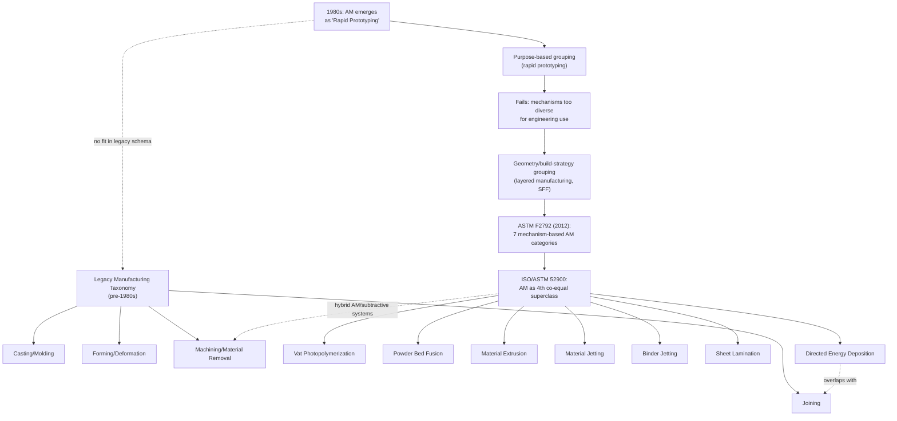

## Emergence of Additive Manufacturing as a Classification Challenge

### Overview

Additive manufacturing (AM) entered industrial practice in the late 1980s as "rapid prototyping," a term that itself signals how classification systems initially mis-scoped the technology. Traditional manufacturing process taxonomies — built around material removal (subtractive), material deformation (forming), and material joining (joining/assembly) — had no native category for processes that build parts by successive addition of material in a layer-wise fashion. This section traces how AM's emergence exposed the structural limits of legacy taxonomies and forced their revision.

### Legacy Taxonomy Structure Prior to AM

Classical manufacturing process classification, as codified in mid-20th-century engineering references (e.g., DeGarmo, Kalpakjian), organized processes into three or four superclasses:

- **Casting/Molding** — shaping via a fluid or plastic state poured/forced into a cavity
- **Forming/Deformation** — shaping via plastic deformation of solid stock
- **Machining/Material Removal** — shaping by removing material (subtractive)
- **Joining** — assembling discrete parts (welding, fastening, adhesive bonding)

These four families share an implicit taxonomic axis: **they all begin with a bulk or near-bulk quantity of material and either redistribute it, remove from it, or connect separate masses of it.** AM violates this axis entirely — parts are built incrementally from a raw feedstock (powder, wire, liquid resin, filament) with no analog "bulk starting shape" to remove from or deform.

### The Classification Problem AM Introduced

**Key Points**

- **No parent category fit.** AM could not be subsumed under any of the four legacy superclasses without contradiction. Early attempts to file it under "casting" (due to shared use of liquid photopolymer in stereolithography) or under "joining" (due to layer-to-layer bonding) both broke down on closer inspection, since neither captures the defining feature: geometry is generated by a controlled, discretized deposition/consolidation sequence driven directly by digital data.
- **Process diversity within AM itself.** Unlike the legacy families, which group processes sharing a single physical mechanism, AM as practiced by the mid-1990s already spanned wildly different physics: photopolymerization (stereolithography), powder bed fusion (selective laser sintering), material extrusion (fused deposition modeling), and sheet lamination (laminated object manufacturing). A taxonomy adequate for one of these mechanisms was not automatically adequate for the others, unlike, say, turning and milling, which share a removal mechanism despite different tool paths.
- **Feedstock state as a confound.** Legacy taxonomies partly classify by feedstock state (liquid casting vs. solid-stock machining). AM processes span all feedstock states (liquid resin, powder, filament, sheet, wire), so feedstock state alone could not serve as a discriminating axis the way it did for legacy processes.
- **Terminology drift.** The field cycled through "rapid prototyping," "solid freeform fabrication," "layered manufacturing," "3D printing," and "additive manufacturing" over roughly two decades, each term implicitly proposing a different classificatory emphasis (speed/purpose vs. geometric freedom vs. build strategy vs. consumer application vs. material-agnostic process description).

### Chronological Emergence of the Challenge

| Period | Development | Classification Consequence |
| --- | --- | --- |
| 1981–1984 | Kodama (Japan) and Hull (US) independently describe layer-based photopolymer solidification | No formal taxonomic placement yet; treated as a novel prototyping curiosity |
| 1986–1988 | Hull founds 3D Systems; commercial stereolithography (SLA) launches | Industry literature begins using "rapid prototyping" as a functional (purpose-based), not mechanism-based, category |
| 1988–1992 | FDM (Crump/Stratasys) and SLS (Deckard/UT Austin) commercialized | Multiple, physically distinct processes now share the "rapid prototyping" label, revealing that a purpose-based grouping cannot support engineering decision-making (process selection, tolerancing, material property prediction) |
| Mid-1990s | "Solid freeform fabrication" and "layered manufacturing" proposed in academic literature | Attempts to shift the classifying axis from *purpose* to *geometric build strategy* (layer-by-layer addition) |
| 2009 | ASTM Committee F42 formed | First formal standards body dedicated to AM; signals institutional acknowledgment that AM cannot be adequately classified within existing ASTM/ISO machining and forming standards |
| 2012 | ASTM F2792 defines seven AM process categories | First widely adopted mechanism-based taxonomy specific to AM (see below) |
| 2015 onward | ISO/ASTM 52900 series | Harmonizes terminology internationally; folds AM into broader "manufacturing process" standards as a co-equal fourth superclass alongside subtractive, forming, and joining |

### The ASTM F2792 / ISO/ASTM 52900 Resolution

The classification challenge was substantively resolved — though not eliminated — by the introduction of seven AM process categories, defined by the **mechanism of layer formation and consolidation** rather than by feedstock, application, or machine vendor:

1. **Vat Photopolymerization** (e.g., SLA, DLP)
2. **Powder Bed Fusion** (e.g., SLS, SLM, EBM)
3. **Material Extrusion** (e.g., FDM/FFF)
4. **Material Jetting** (e.g., PolyJet)
5. **Binder Jetting**
6. **Sheet Lamination** (e.g., LOM, UAM)
7. **Directed Energy Deposition** (e.g., LENS, WAAM)

This schema resolved several open problems:

- It gave AM an internally consistent taxonomic logic (mechanism of layer formation) comparable in rigor to the mechanism-based logic already used for machining subtypes (turning, milling, grinding, etc.).
- It allowed AM to be positioned as a **fourth coordinate superclass** — subtractive, forming, joining, additive — rather than forcing it into an existing branch.
- It exposed that some AM processes straddle categories that legacy taxonomy treated as mutually exclusive: Directed Energy Deposition, for instance, is simultaneously additive (layer buildup) and shares metallurgical characteristics with welding (a joining process), and hybrid manufacturing systems now combine DED deposition heads with CNC subtractive finishing on a single machine — meaning "process classification" as a per-machine label began to break down as well as a per-technique label.

### Residual and Ongoing Classification Difficulties

**Key Points**

- **Hybrid manufacturing systems** (additive + subtractive on one platform) resist single-category classification entirely; standards bodies now classify at the *operation* level within a job rather than the *machine* level.
- **Multi-material and functionally graded AM** challenges classification systems built around a single discrete feedstock-per-process assumption.
- **Post-processing ambiguity**: many AM parts require subtractive finishing, heat treatment, or infiltration to meet final specification, raising the question of whether "the AM process" should be classified as encompassing only the build step or the full process chain — a question with direct implications for standards, certification (notably in aerospace and medical device regulation), and cost/quality classification schemes.
- [Inference] The seven-category ASTM/ISO schema, while now dominant, may require further subdivision as novel mechanisms (e.g., cold spray additive processes, large-format construction-scale AM, bioprinting) continue to surface characteristics not cleanly captured by any of the seven existing buckets.

### Diagram: Taxonomic Repositioning of AM (1980s → Present)

### Example: Misclassification Consequence

A 2005-era manufacturing textbook categorizing "rapid prototyping" as a subtype of casting (because stereolithography uses a liquid resin) would mislead a process planner comparing SLA to powder bed fusion for a metal aerospace bracket — the shared "liquid feedstock" trait is classificatorily irrelevant to the mechanical property outcomes, thermal history, and qualification pathway that actually govern process selection. The ASTM F2792 mechanism-based schema corrects this by grouping on physically consequential variables (energy source, consolidation mechanism, feedstock delivery method) rather than superficial feedstock phase.

**Related Topics**

- ASTM F2792 / ISO 17296 / ISO/ASTM 52900 standards development
- Powder Bed Fusion vs. Directed Energy Deposition: metallurgical classification distinctions
- Hybrid manufacturing (additive-subtractive) and its implications for process-chain classification
- Feedstock-based vs. mechanism-based taxonomy debates in manufacturing standards
- Classification of post-processing steps within AM process chains
- Emerging AM subcategories: cold spray, bioprinting, large-scale construction printing