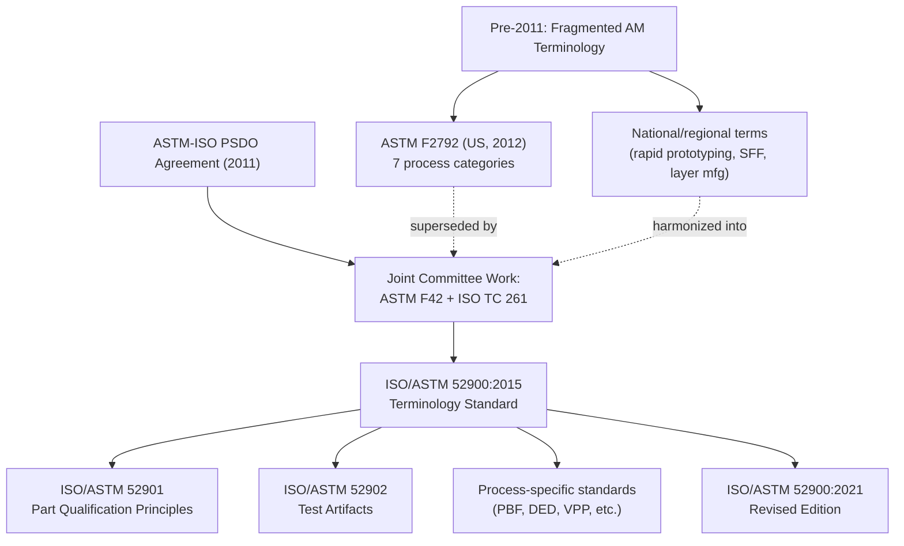

## Convergence Toward Joint International Standards

### Overview

By the mid-2000s, manufacturing process classification faced a fragmentation problem distinct from — but related to — the taxonomic gaps additive manufacturing had exposed. Multiple standards bodies (ASTM International in the US, ISO internationally, national bodies such as DIN, JIS, and BSI) maintained overlapping, sometimes contradictory process vocabularies and classification schemes. This section covers the institutional and technical convergence process that produced today's harmonized joint standards, most notably the ASTM/ISO merger track culminating in the ISO/ASTM 52900 series for additive manufacturing, alongside parallel harmonization efforts in conventional process classification (ISO 3002, ISO 513, DIN 8580).

### Drivers of Fragmentation Prior to Convergence

**Key Points**

- **Independent institutional origins.** ASTM International (originally the American Society for Testing and Materials) and ISO developed classification and terminology standards through separate technical committees with different membership bases, different balloting procedures, and different regional industrial priorities.
- **Divergent terminology for identical processes.** The same physical process was frequently assigned different names or definitional boundaries across standards — for example, early AM terminology varied between "rapid prototyping," "layer manufacturing," and "solid freeform fabrication" depending on the issuing body and era, as covered in the prior section on AM's classification emergence.
- **Regional regulatory drivers.** Aerospace, medical device, and automotive certification regimes in the US, EU, and Japan each referenced their preferred national or regional standard, creating friction for multinational manufacturers needing to qualify a single process against multiple overlapping certification frameworks.
- **Uneven standards maturity across process families.** Conventional subtractive and forming processes had decades of stable ISO/DIN classification (e.g., DIN 8580's process classification tree, established 1985) by the time AM required urgent standardization in the 2000s, creating a structural mismatch in how mature versus emergent process families were documented.

### The DIN 8580 Baseline for Conventional Processes

DIN 8580 (Germany, first issued 1985, most recently revised in the 2020s) established a widely referenced six-superclass taxonomy for conventional manufacturing that strongly influenced later international harmonization:

1. **Urformen** (Primary shaping — creating a solid from an unshaped state, e.g., casting, sintering)
2. **Umformen** (Forming — plastic deformation of existing solid material)
3. **Trennen** (Separating — removal processes, e.g., machining, cutting)
4. **Fügen** (Joining — assembly of discrete parts)
5. **Beschichten** (Coating)
6. **Stoffeigenschaftändern** (Changing material properties, e.g., heat treatment)

[Inference] DIN 8580's six-class structure is frequently cited as the conceptual template later extended to accommodate additive manufacturing as an effective seventh category or as a subdivision within "Urformen," since AM parts are built from an unshaped feedstock — though ISO/ASTM 52900 ultimately chose to define AM as an independent, co-equal classification framework rather than nesting it inside DIN's primary-shaping category.

### The ASTM–ISO Convergence Track for Additive Manufacturing

The clearest and most extensively documented case of standards convergence in modern process classification is the AM standardization effort, which explicitly adopted a joint-development model rather than parallel, competing standards.

| Milestone | Year | Significance |
| --- | --- | --- |
| ASTM Committee F42 formed | 2009 | First dedicated AM standards committee; US-based, industry-driven |
| ISO Technical Committee 261 formed | 2011 | ISO's parallel AM standardization effort, international scope |
| ASTM F2792 published | 2012 | First formal AM terminology and process-category standard (seven categories) |
| **ASTM–ISO Partner Standards Developing Organization (PSDO) agreement** | 2011 (signed) | Formal mechanism enabling joint, simultaneously-published standards rather than duplicated national/international tracks |
| ISO/ASTM 52900 published | 2015 | First jointly branded standard; supersedes ASTM F2792 terminology; establishes "ISO/ASTM" as a dual-branded standard prefix |
| ISO/ASTM 52900:2021 revision | 2021 | Updated terminology, alignment with expanding AM process variants and post-processing definitions |

**Key Points**

- The **PSDO agreement** is the structural mechanism that made convergence possible: rather than ISO and ASTM independently publishing competing AM standards (as had historically occurred across many other technical domains), the agreement designates F42 and TC 261 as co-developing a single standard published under both organizations' names.
- This joint-publication model (`ISO/ASTM 52900`, `ISO/ASTM 52901`, etc.) is now the dominant pattern for new AM-specific standards, covering terminology (52900), general principles for part qualification (52901), test method standards, and design guidelines.
- [Unverified] The precise degree to which this PSDO model will be extended to other emerging manufacturing domains (e.g., hybrid manufacturing, digital manufacturing/Industry 4.0 process classification) beyond AM is not yet fully established in public standards roadmaps as of the most recent documentation available.

### Structural Effect on Classification: The Merged AM Taxonomy

The convergence produced a single reference structure now used globally, replacing the prior fragmented AM vocabulary:

### Convergence Effects Beyond Additive Manufacturing

**Key Points**

- **ISO 3002 / ISO 513** (machining and cutting tool classification) underwent parallel, though less publicized, harmonization efforts with national machining standards (ANSI B94 series in the US) to reduce discrepancies in tool material and cutting process classification, particularly for hard-metal (carbide) grading systems used across international tooling supply chains.
- **Joining process classification** converged substantially through ISO 4063, which provides a unified numeric reference-number system for welding and allied processes, widely adopted alongside (and cross-referenced against) AWS (American Welding Society) classification codes.
- [Inference] The general pattern across these convergence efforts is that harmonization tends to accelerate specifically in process families experiencing rapid technological change or urgent multinational certification pressure (AM being the clearest recent case), while comparatively stable, mature process families (e.g., conventional turning/milling) see slower, incremental harmonization driven more by trade-facilitation motives than by classificatory necessity.

### Example: Practical Consequence of Convergence

Prior to ISO/ASTM 52900, a manufacturer qualifying a laser powder bed fusion process for aerospace use in both the US and EU markets might have needed to map ASTM F2792 category definitions against separate ISO or national equivalents, introducing ambiguity in audit and certification documentation. Post-convergence, a single ISO/ASTM 52900 process category reference ("Powder Bed Fusion") is directly citable in certification paperwork accepted by regulatory and certification bodies in both jurisdictions, reducing translation risk in quality management documentation.

### Residual Fragmentation

- Some national standards bodies (e.g., JIS in Japan, GB standards in China) maintain domestically parallel classification schemes that reference but do not fully adopt ISO/ASTM terminology verbatim, meaning true global uniformity remains partial rather than complete.
- Academic and industrial literature published prior to 2015 continues to use pre-convergence terminology, meaning practitioners engaging with the historical literature must still cross-reference older category definitions against the current joint standard.

**Next Steps**

- ISO/ASTM 52901: general principles for AM part qualification
- ISO 4063 unified welding/joining process reference numbering
- DIN 8580 as the conceptual precursor to modern process superclass taxonomies
- Regional standards divergence: JIS and GB standards relative to ISO/ASTM harmonization
- Certification and audit implications of standards convergence in regulated industries (aerospace, medical devices)