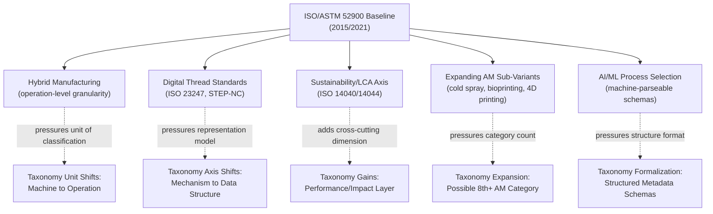

## Trends Currently Reshaping Classification Systems

### Overview

Having traced classification systems from their conventional (subtractive/forming/joining) origins through the AM-driven crisis and subsequent ASTM/ISO convergence, this section surveys the trends now actively pressuring manufacturing process taxonomies to evolve further. These pressures are largely post-2015 phenomena and, unlike the historically settled material earlier in this chapter, several remain in active standardization or represent genuinely emerging practice. Claims here are flagged accordingly.

### Trend 1: Hybrid Manufacturing and the Collapse of Single-Process Classification

**Key Points**

- Machines combining additive deposition (typically Directed Energy Deposition or material extrusion) with subtractive finishing on a single platform are now commercially established (e.g., DMG MORI LASERTEC, Mazak INTEGREX with hybrid heads, Optomec LENS-equipped systems).
- These systems break the foundational assumption underlying essentially all prior taxonomies discussed in this chapter: that *a machine* (and by extension *a job*) can be assigned a single process-family label. A hybrid job may execute subtractive roughing, additive buildup, and subtractive finishing operations in a single unbroken toolpath sequence.
- Classification response: standards and industry practice are shifting toward **operation-level classification within a process plan**, rather than **machine-level or job-level classification**, meaning the taxonomic unit of analysis is moving downward in granularity.
- [Inference] This shift plausibly represents the most structurally significant classification change since AM's emergence, because it challenges not just *which category a process belongs to* but *what the unit of classification should be* (machine vs. operation vs. toolpath segment).

### Trend 2: Process Classification Driven by Digital Thread and Data Standards

**Key Points**

- The rise of **digital manufacturing / Industry 4.0** frameworks has introduced classification pressures oriented around data interoperability rather than physical mechanism. Standards such as **ISO 23247** (digital twin framework for manufacturing) and ongoing work extending **STEP-NC (ISO 14649)** classify processes partly by *what machine-readable data structure represents them*, an axis orthogonal to the mechanism-based axis this chapter has otherwise used.
- [Unverified] The extent to which digital-thread-based classification will formally supersede or merely supplement mechanism-based taxonomy in future joint ISO/ASTM revisions is not settled in currently published standards roadmaps; this is an area of active technical committee work rather than resolved consensus.
- Practical effect: process planning software increasingly classifies operations by their **parametric and toolpath representation compatibility** (e.g., "STEP-NC compliant" vs. not) alongside — sometimes instead of — traditional mechanism categories, particularly in fully digital manufacturing environments.

### Trend 3: Sustainability and Circularity as a Classificatory Axis

**Key Points**

- Life-cycle and circular-economy considerations are introducing a new cross-cutting classification dimension: processes are increasingly tagged or grouped by material efficiency, energy intensity, and recyclability/remanufacturability characteristics, independent of their mechanism-based category.
- ISO 14040/14044 (life cycle assessment) methodologies are being applied at the process-category level, producing comparative classification schemes such as "high embodied-energy processes" vs. "low embodied-energy processes" that cut across the traditional subtractive/additive/forming/joining boundaries.
- **Additive manufacturing's material-efficiency profile** (near-net-shape, reduced material waste relative to subtractive machining of the same part) is frequently cited in this literature as a classificatory advantage, though [Inference] whether this constitutes a durable taxonomic axis (as opposed to a comparative performance metric layered atop existing taxonomy) remains an open methodological question, since energy intensity per part varies substantially by material, geometry, and machine — meaning sustainability-based groupings may prove more application-specific than mechanism-based groupings historically have been.

### Trend 4: Expansion of Additive Manufacturing's Own Sub-Taxonomy

Building on the ISO/ASTM 52900 seven-category schema established in the prior convergence section, several newer AM variants are pressuring further subdivision:

| Emerging Variant | Classification Tension |
| --- | --- |
| Cold spray additive manufacturing | Uses kinetic (not thermal) energy for consolidation; does not cleanly fit "Directed Energy Deposition" (which is thermally defined) or any other existing category |
| Large-scale/construction-scale AM (e.g., concrete 3D printing) | Existing categories (e.g., Material Extrusion) were defined around polymer/metal part-scale processes; construction-scale material behavior and quality standards differ substantially |
| Bioprinting | Involves living cellular material as feedstock, introducing biological viability and sterility classification dimensions absent from ISO/ASTM 52900's industrial-materials framing |
| 4D printing (stimulus-responsive materials) | Classification challenge is temporal — the "final" geometry is not fixed at build completion but evolves post-build in response to a stimulus, breaking the assumption that AM classification describes a static end-state part |

[Speculation] Several of these variants may eventually be formalized as additional ISO/ASTM 52900 categories or as separate joint standards analogous to the original seven, following the same committee-driven convergence pattern described in the prior section — but as of the most recent published standard revisions, no such formal eighth category has been adopted, so this remains speculative rather than a documented trajectory.

### Trend 5: AI/ML-Assisted Process Selection and Its Classificatory Feedback Effect

**Key Points**

- Machine-learning-based process planning and process-selection tools are trained on structured process taxonomy data (categories, capability envelopes, material compatibility matrices). As these tools proliferate, there is [Inference] a plausible feedback pressure toward taxonomies that are more machine-parseable (consistent attribute schemas, structured capability metadata) and less reliant on qualitative, human-readable category descriptions — though this is an emerging observation from industry practice rather than a documented standards-body objective.
- This pressure is conceptually distinct from Trend 2 (digital thread/data standards) in that it concerns *how categories are structured for algorithmic consumption* rather than *how individual processes are digitally represented*.

### Synthesis Diagram: Convergent Pressures on Current Taxonomy

### Example: Compounding Effect in Practice

A construction firm evaluating concrete 3D printing for a load-bearing wall element must simultaneously navigate: (1) whether the process is classified under Material Extrusion per ISO/ASTM 52900 despite scale mismatches with the standard's original polymer/metal framing (Trend 4); (2) whether digital design data is STEP-NC compatible for downstream toolpath generation (Trend 2); (3) how the process compares on embodied-carbon metrics against conventional formwork-and-pour construction for sustainability reporting (Trend 3); and (4) whether the equipment involves hybrid subtractive finishing of printed surfaces (Trend 1). No single classification dimension from this chapter's earlier historical material fully resolves the categorization on its own — illustrating why current taxonomic work increasingly treats classification as multi-axis rather than single-hierarchy.

### Outlook

[Inference] Based on the trajectory from mechanism-based convergence (this chapter's earlier sections) to the multi-axis pressures surveyed here, it is plausible that future taxonomy revisions will formalize manufacturing process classification as a **multi-dimensional tagging system** (mechanism + data-representation + sustainability-impact + granularity-level) rather than a single strict hierarchical tree of the kind DIN 8580 and early ASTM F2792 established — though no joint ISO/ASTM standard has yet formally adopted such a multi-axis model as of the most recent published revisions, so this remains a forward-looking inference rather than documented policy.

**Related Topics**

- Hybrid manufacturing standards and operation-level process planning (ISO/ASTM 52950 series)
- STEP-NC (ISO 14649) and digital thread representation of manufacturing processes
- Life cycle assessment methodology applied to process-category comparison (ISO 14040/14044)
- Cold spray additive manufacturing as a candidate new ISO/ASTM category
- 4D printing and temporal classification challenges in AM
- Machine-parseable process taxonomy schemas for AI-driven process planning