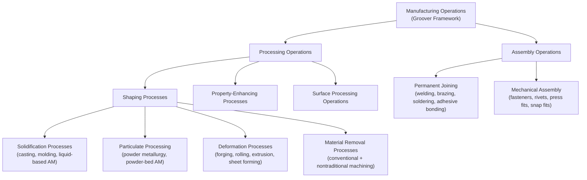

## Groover Processing-Versus-Assembly Framework Overview

### Overview

The Groover framework, developed by Mikell P. Groover and presented across successive editions of *Fundamentals of Modern Manufacturing* and *Automation, Production Systems, and Computer-Integrated Manufacturing*, is one of the most widely used process classification schemes in American manufacturing engineering education. Unlike DIN 8580's cohesion-based six-group logic (covered in the prior section), Groover's framework organizes manufacturing processes around a top-level binary distinction — **processing operations** versus **assembly operations** — and then subdivides each branch by the nature of the transformation performed.

### The Top-Level Binary Distinction

**Key Points**

- **Processing operations** transform a workpiece from one state of completion to a more advanced state, typically acting on a single workpart to change its geometry, material properties, or surface properties.
- **Assembly operations** join two or more separate components together to create a new, more complex entity.
- This binary split is a coarser first cut than DIN 8580's six-group structure but is pedagogically favored in many US engineering curricula because it maps directly onto how production systems are organized on the factory floor — processing departments versus assembly lines/stations.
- [Inference] The processing/assembly binary is arguably closer in spirit to DIN 8580's Fügen (joining) group being distinguished from the other five groups than it is to a genuinely novel classifying axis; Groover's assembly branch functions as a rough analog to Fügen, while the processing branch aggregates DIN's Urformen, Umformen, Trennen, Beschichten, and Stoffeigenschaftändern groups into a single superclass, subdivided differently at the next level.

### Processing Operations: The Four Subcategories

Groover subdivides processing operations into four categories, organized primarily around the nature of the geometric or property transformation:

| Subcategory | Definition | Representative Processes |
| --- | --- | --- |
| **Shaping Processes** | Change the geometry of the starting workpart | Casting, molding, deformation processes (forging, rolling, extrusion), material removal (machining), and — in more recent editions — additive processes |
| **Property-Enhancing Processes** | Improve mechanical or physical properties without deliberately changing shape | Heat treatment, sintering (to achieve final material properties in powder metallurgy) |
| **Surface Processing Operations** | Alter the surface of a workpart without changing its bulk geometry or properties | Cleaning, surface treatment, coating and thin-film deposition |
| **(In some editions) Property-Enhancing and Surface Processing are treated as sub-branches under a broader "operations other than shaping" heading** | — | — |

**Key Points**

- The **Shaping Processes** subcategory is itself further divided by Groover into four families, which map closely (though not identically in naming) onto conventional taxonomy: (1) solidification processes (casting, molding — starting material is a liquid or semi-liquid), (2) particulate processing (powder-based processes, including powder metallurgy and — as later editions incorporate — additive manufacturing), (3) deformation processes (bulk and sheet metal forming), and (4) material removal processes (conventional machining and nontraditional/nonconventional machining such as EDM, laser cutting, and electrochemical machining).
- This **four-family shaping subdivision** (solidification / particulate / deformation / removal) is the aspect of Groover's framework most frequently reproduced in manufacturing engineering textbooks and is arguably Groover's most distinctive structural contribution relative to DIN 8580 or ASTM taxonomies — it classifies primarily by **starting material state and how it becomes final geometry**, rather than DIN's cohesion-change logic.
- Later editions of Groover's texts explicitly incorporate **additive manufacturing** within the particulate/solidification branches (depending on the specific AM process's starting feedstock state — liquid resin processes align with solidification logic, powder-based processes align with particulate processing logic), reflecting the post-2012 ASTM F2792/ISO 52900 standardization discussed earlier in this chapter's historical material, rather than treating AM as a separate fifth shaping family.

### Assembly Operations: The Subcategories

Groover subdivides assembly operations primarily by the permanence and mechanism of the join:

| Subcategory | Definition | Representative Processes |
| --- | --- | --- |
| **Permanent Joining Processes** | Create a bond that cannot be easily undone without damaging the joined parts | Welding, brazing, soldering, adhesive bonding |
| **Mechanical Assembly** | Fastening methods, often permitting disassembly | Threaded fasteners (bolts, screws), rivets, press fits, snap fits |

**Key Points**

- This two-way split within assembly (permanent joining vs. mechanical assembly) is coarser than DIN 8593's six-subgroup joining taxonomy but serves a similar classificatory function — distinguishing joins by whether they are intended to be reversible.
- Groover's assembly branch is generally considered less granular than DIN 8580's Fügen subdivision, reflecting Groover's textbook orientation toward production systems engineering (where the reversibility of a join matters most for maintenance and serviceability planning) rather than toward a materials-science-driven cohesion taxonomy.

### Structural Diagram: Groover's Processing-Versus-Assembly Tree

### Comparison to DIN 8580 and ISO/ASTM 52900

| Dimension | Groover Framework | DIN 8580 | ISO/ASTM 52900 |
| --- | --- | --- | --- |
| Top-level split | Processing vs. Assembly (binary) | Six cohesion-based groups | Seven mechanism-based AM categories (AM-specific only) |
| Classifying axis | Starting material state + transformation type | Change in material cohesion | Energy source + consolidation mechanism (AM only) |
| AM treatment | Folded into shaping subcategories (solidification/particulate) by starting feedstock state | Not formally revised; commentary suggests Urformen fit | Independent, co-equal framework with seven categories |
| Granularity of joining | Two subcategories (permanent/mechanical) | Six subgroups (DIN 8593) | Not applicable (AM-only standard) |
| Primary use context | US manufacturing engineering education | German national standard, broad industrial reference | International AM-specific standard |

**Key Points**

- The three systems surveyed so far in this chapter reflect genuinely different classificatory philosophies: DIN 8580 is **mechanism/cohesion-driven** and comprehensive across all conventional manufacturing; Groover is **pedagogically driven**, oriented around how production systems are organized (processing departments vs. assembly lines) and around starting-material state; ISO/ASTM 52900 is **narrowly scoped but highly granular**, addressing only AM but with mechanism-level precision comparable to DIN's rigor.
- [Inference] Because Groover's framework classifies shaping processes partly by starting material state (solidification/particulate/deformation/removal), it is structurally somewhat more compatible with directly absorbing AM sub-processes into existing categories than DIN 8580's more abstract cohesion-based logic is — since AM feedstocks (liquid resin, powder, filament) map fairly naturally onto Groover's existing solidification and particulate-processing families, whereas DIN required either extending Urformen or defining AM as an unprecedented seventh entity to fit its stricter cohesion-transition definitions.

### Example: Classifying a Selective Laser Sintering (SLS) Part

Under Groover's framework, an SLS-produced polymer part is classified as a **processing operation**, specifically under **shaping processes**, within the **particulate processing** family, since the starting feedstock is powder and the process consolidates powder into a solid geometry — analogous to how powder metallurgy sintering is classified. Under DIN 8580, the same part would most plausibly fall under **Urformen** (per the interpretive extension discussed in the prior section), since cohesion is created from a formless powder state. Under ISO/ASTM 52900, the same part is classified precisely and unambiguously as **Powder Bed Fusion**, one of the seven defined AM categories. This three-way comparison illustrates how the same physical process receives compatible but non-identical classificatory treatment depending on which system's underlying philosophy — production-system pedagogy, cohesion mechanics, or AM-specific mechanism — is applied.

### Limitations of the Groover Framework

**Key Points**

- The **processing/assembly binary**, while pedagogically clear, does not cleanly accommodate **hybrid manufacturing** systems (covered in the prior chapter's trends section) that interleave shaping (processing) and joining (assembly-adjacent, in the case of Directed Energy Deposition) operations within a single machine cycle — a limitation Groover's framework shares with essentially all pre-2010s taxonomies surveyed in this chapter.
- Groover's shaping subdivision (solidification/particulate/deformation/removal) does not natively address **coating** as a distinct top-level category the way DIN 8580 does (Beschichten); coating tends to be folded into "surface processing operations," a less prominent branch than in DIN's structure.
- [Unverified] The degree to which the most recent editions of Groover's texts have formally revised the framework to explicitly address hybrid manufacturing or the full ISO/ASTM 52900 seven-category AM schema (as opposed to a general solidification/particulate mapping) was not confirmed against the latest published edition at the time of this content's generation, and should be verified against the current textbook edition if precise alignment is required for coursework or citation purposes.

**Related Topics**

- Groover's four-family shaping subdivision: solidification, particulate processing, deformation, material removal
- Comparison of assembly taxonomy granularity: Groover's two-category model vs. DIN 8593's six subgroups
- Mapping specific AM processes (SLS, SLA, FDM) across Groover, DIN 8580, and ISO/ASTM 52900 classifications
- Nontraditional/nonconventional machining processes within Groover's material removal family
- Production systems engineering rationale behind the processing-versus-assembly split