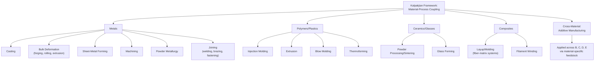

## Kalpakjian Materials-and-Process-Family Framework Overview

### Overview

The Kalpakjian framework, developed by Serope Kalpakjian (later editions co-authored with Steven Schmid) in *Manufacturing Engineering and Technology* and *Manufacturing Processes for Engineering Materials*, represents a third major pedagogical classification tradition alongside DIN 8580 (cohesion-based) and Groover (processing-versus-assembly). Where Groover organizes primarily by production-system function, Kalpakjian organizes primarily around the **relationship between material category and process family**, treating material selection and process selection as tightly coupled, co-determined decisions rather than as independently classifiable dimensions. This material-first orientation is Kalpakjian's most distinctive structural contribution to this chapter's comparative survey.

### The Material-Process Coupling Principle

**Key Points**

- Kalpakjian's texts are structured so that major process families are presented **in direct association with the material categories they are most applicable to** — metals, plastics/polymers, ceramics/glasses, and composites each receive process-family treatment calibrated to that material's characteristic behavior (e.g., metals emphasize casting/forming/machining; polymers emphasize molding and extrusion; ceramics emphasize powder processing and sintering; composites emphasize layup and molding techniques specific to fiber-matrix systems).
- This differs structurally from DIN 8580 (material-agnostic, cohesion-based) and Groover (material-agnostic, production-function-based) in that Kalpakjian does not present a single unified process tree intended to apply uniformly across all materials; instead, the taxonomy is **conditioned on material class**, reflecting the practical reality that process selection in industry is rarely made independent of material choice.
- [Inference] This material-conditioned structure makes Kalpakjian's framework arguably the most directly useful of the three surveyed frameworks for process *selection* decisions in engineering practice, since it foregrounds the material-process compatibility question rather than requiring a separate cross-referencing step against a material-agnostic taxonomy — though this comes at some cost to the taxonomic elegance and mutual exclusivity that DIN 8580's single-axis structure provides.

### Core Process-Family Categories

Despite the material-conditioned presentation, Kalpakjian's texts do converge on a recognizable set of high-level process families, broadly consistent with — but independently derived from — the families found in DIN 8580 and Groover:

| Kalpakjian Family | Core Definition | Primary Associated Materials |
| --- | --- | --- |
| **Casting Processes** | Solidification of molten or liquid material within a mold cavity | Metals (primarily), some polymers, some ceramics |
| **Bulk Deformation Processes** | Shaping via plastic deformation of a substantial mass of material (forging, rolling, extrusion, drawing) | Metals |
| **Sheet-Metal Forming Processes** | Shaping via plastic deformation of thin sheet stock (bending, deep drawing, stamping) | Metals |
| **Material Removal (Machining) Processes** | Conventional and nontraditional machining | Metals, engineering plastics, ceramics (with process-specific adaptations) |
| **Polymer Processing** | Injection molding, extrusion, blow molding, thermoforming | Plastics/polymers |
| **Powder Processing** | Powder metallurgy, ceramic powder processing, sintering | Metals (powder metallurgy), ceramics |
| **Joining Processes** | Welding, brazing, soldering, adhesive bonding, mechanical fastening | Metals primarily, with polymer- and composite-specific joining techniques treated separately |
| **Rapid Prototyping / Additive Manufacturing** | Layer-based fabrication processes | Cross-material (metals, polymers, ceramics, composites) — treated as a distinct, materials-spanning family in later editions |

**Key Points**

- Kalpakjian's later editions (reflecting the post-2012 ASTM F2792 standardization discussed earlier in this chapter) treat **additive manufacturing/rapid prototyping as its own dedicated process family**, notably positioned as **cross-material** — a structural choice that stands in contrast to Groover's approach (folding AM sub-processes into existing solidification/particulate categories by feedstock state) and closer in spirit to ISO/ASTM 52900's treatment of AM as an independent framework, though Kalpakjian's treatment remains at the level of a single textbook chapter/family rather than a seven-category mechanism-based subdivision.
- The explicit inclusion of **ceramics and composites** as first-class material categories with their own associated process families is a point of distinction from Groover's framework, which — while not excluding non-metals — is comparatively metals-and-machining-centered in its canonical examples. [Inference] This broader material scope plausibly reflects Kalpakjian's textbook target audience spanning a wider range of materials engineering contexts, rather than a purely production-systems-engineering audience.

### Structural Diagram: Kalpakjian's Material-Conditioned Process Tree

### Comparison Across All Three Frameworks Surveyed in This Chapter

| Dimension | DIN 8580 | Groover | Kalpakjian |
| --- | --- | --- | --- |
| Primary classifying axis | Change in material cohesion | Processing vs. assembly function | Material category, with process families conditioned on it |
| Structure type | Single unified tree, material-agnostic | Single unified tree, material-agnostic | Multiple material-conditioned trees |
| AM treatment | Not formally revised; interpretive Urformen fit | Folded into existing shaping subcategories by feedstock state | Distinct cross-material process family |
| Strongest analytical use case | Rigorous, comprehensive process taxonomy independent of application | Production system organization and planning | Material-process selection decisions in design/engineering |
| Joining granularity | High (six DIN 8593 subgroups) | Low (two subcategories) | Moderate (single family, with material-specific joining variants noted separately, e.g., composite joining) |
| Non-metal material coverage | Present but not organizationally foregrounded | Present but comparatively metals-centered in canonical examples | Foregrounded — ceramics and composites are first-class categories |

**Key Points**

- [Inference] The three frameworks surveyed in this chapter are not competing attempts at the same taxonomic goal but reflect different primary use cases: DIN 8580 optimizes for **taxonomic rigor and mutual exclusivity**, Groover optimizes for **production-system pedagogy**, and Kalpakjian optimizes for **material-informed process selection**. A practitioner's choice of which framework to reference in practice plausibly depends on which of these three tasks (formal classification, production planning, or design-stage material/process selection) is primary — though this is an interpretive synthesis rather than a claim explicitly made by any of the three source standards/textbooks themselves.

### Example: Classifying a Carbon-Fiber Composite Aircraft Bracket

Under Kalpakjian's framework, a carbon-fiber-reinforced polymer bracket produced via autoclave layup is classified straightforwardly under the **Composites** material category, within the **layup/molding** process family — the material category directly determines which process family chapter is consulted. Under Groover's framework, the same part is less directly classifiable: layup is not one of Groover's four canonical shaping sub-families (solidification/particulate/deformation/removal) in the way it applies to isotropic materials, since composite layup involves simultaneous material creation (resin/fiber consolidation) and shaping, requiring Groover's user to reason by analogy rather than direct lookup. Under DIN 8580, the same process would most plausibly be classified under **Urformen** (cohesion created from formless constituent materials — fiber and resin — into a solid laminate), again requiring interpretive extension rather than a direct named category. This example illustrates a genuine strength of Kalpakjian's material-conditioned structure for materials that do not map cleanly onto isotropic-metal-derived process logic.

### Limitations of the Kalpakjian Framework

**Key Points**

- The material-conditioned structure, while practically useful for material-process selection, **sacrifices the mutual exclusivity and single-axis rigor** that DIN 8580 provides — the same underlying physical mechanism (e.g., powder consolidation) appears in multiple places across the metals, ceramics, and cross-material AM sections, rather than being classified once under a single unambiguous category.
- Because process families are presented per-material-category, cross-material comparison of process *mechanism* (as opposed to material applicability) requires the reader to synthesize across multiple chapters — a task DIN 8580's cohesion-based single tree and ISO/ASTM 52900's mechanism-based AM taxonomy handle more directly within their respective scopes.
- [Unverified] The precise boundary Kalpakjian's most recent editions draw between "rapid prototyping" and "additive manufacturing" terminology, and the extent to which the seven-category ISO/ASTM 52900 schema has been fully integrated into the textbook's process-family structure versus retained at a coarser single-family level, was not confirmed against the latest published edition at the time of this content's generation.

**Related Topics**

- Material-process compatibility matrices as a design-stage selection tool
- Comparative process mechanism mapping across material-conditioned and material-agnostic taxonomies
- Composite manufacturing process classification (layup, filament winding, resin transfer molding)
- Ceramic powder processing and its taxonomic relationship to metal powder metallurgy
- Synthesis: choosing a classification framework based on task (taxonomy, production planning, or material/process selection)