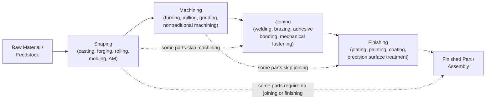

## DeGarmo Shaping-Machining-Joining-Finishing Framework Overview

### Overview

The DeGarmo framework originates from E. Paul DeGarmo's *Materials and Processes in Manufacturing*, a text lineage now continued under the authorship of J.T. Black and Ronald Kohser through many editions. It represents a fourth pedagogical tradition in this chapter's comparative survey, distinguished by its explicit **four-stage process-flow structure**: shaping, machining, joining, and finishing. Unlike Kalpakjian's material-conditioned organization or Groover's function-based binary, DeGarmo's framework is organized around the **typical sequential order in which a part passes through manufacturing operations** — from initial geometry creation through final surface/property refinement — making it structurally closer to a production-workflow model than a purely mechanism-based or material-based taxonomy.

### The Sequential-Stage Organizing Principle

**Key Points**

- DeGarmo's four stages are not strictly mutually exclusive categories in the DIN 8580 sense; rather, they represent a **typical manufacturing sequence** a part may pass through, with the understanding that not every part requires all four stages and that some processes (e.g., certain joining operations) may occur at multiple points in a real production sequence rather than only at the "joining stage."
- This sequential framing is DeGarmo's most distinctive structural contribution relative to the other three frameworks surveyed in this chapter: DIN 8580 organizes by cohesion-change mechanism (atemporal), Groover by production function (processing vs. assembly, largely atemporal), and Kalpakjian by material category (also largely atemporal) — DeGarmo alone foregrounds **process sequence and part lifecycle position** as the primary organizing logic.
- [Inference] This sequential orientation plausibly reflects DeGarmo/Black/Kohser's textbook emphasis on manufacturing process *planning* (i.e., how a process engineer sequences operations to produce a finished part) rather than on taxonomic classification for its own sake — making it, alongside Groover, one of the more production-practice-oriented frameworks in this chapter, though oriented toward sequence rather than departmental function.

### The Four Stages

| Stage | Definition | Representative Processes |
| --- | --- | --- |
| **Shaping** | Establishes the primary/near-final geometry of the part from raw or semi-processed material | Casting, forging, rolling, extrusion, powder metallurgy, molding, additive manufacturing (in later editions) |
| **Machining** | Refines geometry via material removal, typically to achieve tighter tolerances or features not achievable by the shaping process alone | Turning, milling, drilling, grinding, and nontraditional machining (EDM, laser cutting, electrochemical machining) |
| **Joining** | Combines the shaped/machined part with other components into a more complex assembly | Welding, brazing, soldering, adhesive bonding, mechanical fastening |
| **Finishing** | Improves surface properties, appearance, corrosion resistance, or final dimensional precision, typically as the last stage before the part enters service | Grinding/polishing (as a finishing operation), plating, painting, heat treatment (in some editions), coating |

**Key Points**

- The **Shaping** stage in DeGarmo's framework corresponds most closely to DIN 8580's Urformen plus Umformen combined (both primary shaping and forming/deformation are treated as accomplishing the same sequential function — establishing initial geometry) and to Kalpakjian's casting/bulk-deformation/sheet-forming families combined.
- The **Machining** stage is treated as sequentially distinct from Shaping (a refinement step) rather than as a co-equal parallel category, which is a notable structural difference from DIN 8580 (where Trennen is a co-equal main group to Urformen/Umformen) and from Groover (where material removal is one of four parallel shaping sub-families rather than a distinct sequential stage after shaping).
- **Finishing** as an explicit fourth stage — encompassing surface treatment, coating, and (in some editions) heat treatment — has partial overlap with DIN 8580's Beschichten and Stoffeigenschaftändern groups, but DeGarmo's version is explicitly positioned as the *last* step in a typical process sequence rather than as an independently classifiable mechanism, again reflecting the sequential (versus mechanism-based) organizing logic.
- Note that **machining** appears twice conceptually in DeGarmo-family texts: as its own sequential stage (post-shaping refinement) and, within the "Finishing" stage, certain precision/surface-refinement machining operations (e.g., grinding, honing, lapping) are sometimes discussed under finishing rather than under the machining stage proper — reflecting the loosely sequential (rather than strictly partitioned) nature of the framework.

### Structural Diagram: DeGarmo's Sequential Process Flow

### Treatment of Additive Manufacturing

**Key Points**

- Later editions of DeGarmo-lineage texts (reflecting the post-2012 ASTM F2792/ISO 52900 standardization discussed earlier in this chapter) position **additive manufacturing within the Shaping stage**, treating it as an alternative geometry-establishing method alongside casting, forging, and molding — consistent with the sequential logic, since AM (like casting) typically establishes near-final part geometry as the first substantive manufacturing step.
- [Inference] This placement is structurally similar to how Groover folds AM into existing shaping subcategories by feedstock state, and contrasts with ISO/ASTM 52900's independent-framework treatment and with the Kalpakjian later-edition treatment of AM as a distinct cross-material family — suggesting that among the four pedagogical frameworks surveyed in this chapter, DeGarmo and Groover both favor **absorbing AM into existing category logic** (sequential-stage or feedstock-based, respectively), while Kalpakjian and ISO/ASTM both favor **treating AM as structurally distinct**, though for different reasons (material-spanning applicability vs. mechanism-based rigor).
- AM parts requiring post-build machining (common for tight-tolerance metal AM parts) illustrate the sequential logic directly: the AM build step is classified under Shaping, and subsequent CNC finishing of critical features is classified under the separate Machining stage — a natural fit for DeGarmo's sequential model, though this same scenario (hybrid AM/subtractive processing) was noted in this chapter's earlier trends material as a case straining machine-level and job-level classification more broadly.

### Comparison Across All Four Frameworks Surveyed in This Chapter

| Dimension | DIN 8580 | Groover | Kalpakjian | DeGarmo |
| --- | --- | --- | --- | --- |
| Primary organizing axis | Change in material cohesion | Processing vs. assembly function | Material category | Sequential process-flow stage |
| Temporal/sequential emphasis | None (atemporal) | Minimal (functional, not sequential) | None (atemporal) | Central — stages reflect typical part lifecycle order |
| Machining's structural position | Co-equal main group (Trennen) | Sub-family within Shaping Processes | Sub-family within material-specific process families | Distinct second stage, sequentially after Shaping |
| AM treatment | Not formally revised; interpretive Urformen fit | Folded into existing shaping sub-families by feedstock state | Distinct cross-material process family | Folded into Shaping stage (sequential first step) |
| Finishing/coating treatment | Distinct co-equal main group (Beschichten) | Minor branch (Surface Processing Operations) | Discussed per-material, not foregrounded | Distinct fourth sequential stage |
| Best-suited task | Rigorous, mechanism-based taxonomy | Production system organization | Material-informed process selection | Process sequence planning |

### Example: Classifying a Forged-and-Plated Steel Automotive Component

Under DeGarmo's framework, a forged steel component that is subsequently machined for tolerance, welded to a bracket subassembly, and finally zinc-plated for corrosion resistance maps cleanly onto all four sequential stages in order: **Shaping** (forging) → **Machining** (tolerance finishing) → **Joining** (welding to bracket) → **Finishing** (zinc plating). This direct sequential mapping is a genuine strength of DeGarmo's framework for process-planning purposes — a process engineer can use the four-stage structure directly as a checklist for sequencing operations. Under DIN 8580, the same part sequence would be classified as **Umformen** (forging) → **Trennen** (machining) → **Fügen** (welding) → **Beschichten** (plating) — structurally parallel in this case, since DeGarmo's sequential stages happen to align closely with DIN's mechanism-based groups for this conventional metal-part example. The alignment is less clean for materials or processes (e.g., composite layup, AM) where shaping and property-establishment are simultaneous rather than sequential, as noted in the Kalpakjian section's composite bracket example.

### Limitations of the DeGarmo Framework

**Key Points**

- The **sequential model assumes a roughly linear part lifecycle** (shape → machine → join → finish), which maps well onto conventional discrete-part metal manufacturing but less naturally onto processes where these stages are interleaved or simultaneous — hybrid manufacturing systems (additive + subtractive on one platform, discussed in this chapter's earlier trends material) and composite layup processes (where shaping and joining of fiber/matrix constituents occur simultaneously) both strain the strict sequential ordering.
- Because the framework is sequence-based rather than mechanism-based, it does not provide the same **mutual exclusivity guarantee** that DIN 8580's cohesion-based logic does — a single process (e.g., certain coating processes that also add measurable geometry, or hybrid AM/machining cycles) may reasonably be discussed under more than one stage depending on edition and context.
- [Unverified] The precise treatment of heat treatment (property-changing without shape change) as belonging to the Finishing stage versus being discussed as a quasi-independent topic varies somewhat across editions of the DeGarmo-lineage texts; readers requiring precise citation should verify placement against the specific edition referenced.

**Related Topics**

- Sequential process planning and its relationship to production routing/process sheets
- Comparative placement of heat treatment across DIN 8580 (co-equal group), Groover (property-enhancing processes), and DeGarmo (finishing stage)
- Hybrid manufacturing's challenge to strictly sequential shaping-then-machining models
- Nontraditional machining processes within DeGarmo's machining stage
- Synthesis across all four frameworks: choosing between cohesion-based, function-based, material-based, and sequence-based classification for a given engineering task