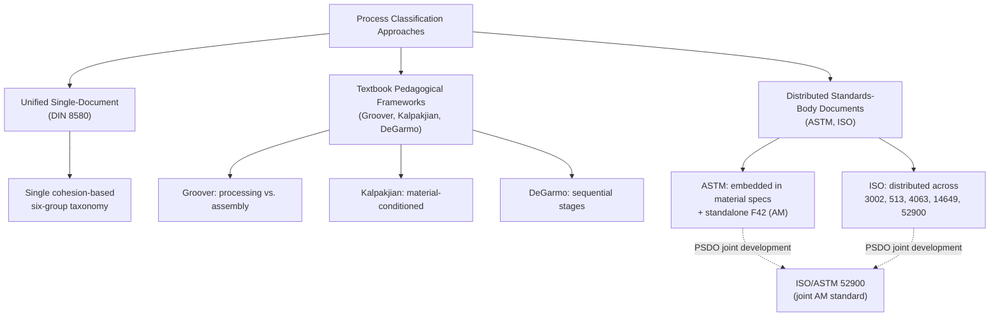

## ASTM and ISO Process-Family Standards Overview

### Overview

This section closes the chapter's comparative survey by examining ASTM and ISO as institutional standards bodies in their own right — distinct from the pedagogical textbook frameworks (DeGarmo, Groover, Kalpakjian) and the national standard (DIN 8580) covered previously. Where the textbook frameworks organize processes for teaching and selection purposes, ASTM and ISO produce **normative, legally referenceable classification standards** used in contracts, certification, procurement specifications, and regulatory compliance. This section surveys their process-family standards holistically, building on the AM-specific convergence history (ASTM F2792 → ISO/ASTM 52900) already covered earlier in this chapter, and extending to their broader (non-AM) process classification work.

### Institutional Character: ASTM vs. ISO

**Key Points**

- **ASTM International** (originally the American Society for Testing and Materials) is a US-based, industry-consensus standards developer operating through open technical committees; its standards are voluntary unless incorporated by reference into regulation or contract.
- **ISO** (International Organization for Standardization) is a federation of national standards bodies producing internationally negotiated standards through member-country technical committees; ISO standards likewise carry no automatic legal force but are frequently referenced in international trade agreements and cross-border certification regimes.
- Both bodies produce standards covering **terminology/classification**, **test methods**, and **specifications** — process-family classification standards specifically fall under the terminology/classification category, distinguishing them from the test-method and material-specification standards that make up a larger share of both organizations' overall output.
- As established earlier in this chapter, the **PSDO (Partner Standards Developing Organization) agreement** between ASTM Committee F42 and ISO Technical Committee 261 (signed 2011) enables joint publication under the dual "ISO/ASTM" prefix, which is now the dominant model for new AM standards specifically — though this joint-publication model is not universally applied across all ASTM/ISO manufacturing standards outside AM.

### ASTM Process Classification Standards (Non-AM)

| Standard Family | Scope | Relevance to Process Classification |
| --- | --- | --- |
| **ASTM E promotional/terminology standards** | General engineering terminology | Provides baseline definitions referenced across multiple process-specific standards |
| **ASTM A/B series (metals)** | Material specifications organized partly by production process (e.g., hot-rolled vs. cold-rolled steel designations) | Embeds process classification implicitly within material specification numbering |
| **ASTM F42 (Additive Manufacturing)** | AM terminology, test methods, design guidelines | Covered extensively in this chapter's earlier historical section |
| **ASTM B series (nonferrous metals)** | Nonferrous material and process specifications | Similar implicit process classification via specification structure |

**Key Points**

- A notable structural feature of ASTM's approach outside the AM-specific F42 committee is that **process classification is often embedded within material specification standards** rather than published as a standalone process taxonomy document — this is a meaningfully different institutional approach from DIN 8580's dedicated, standalone process-classification standard, and reflects ASTM's broader organizational structure being organized around material/industry-sector committees rather than a single unified process-taxonomy committee.
- [Inference] This embedded-rather-than-standalone approach plausibly explains why ASTM did not have a comprehensive general-purpose manufacturing process taxonomy comparable to DIN 8580 prior to the AM-specific F42 effort — the AM classification crisis (covered earlier in this chapter) arguably prompted ASTM's first venture into standalone, general-purpose process-family classification specifically because AM could not be adequately embedded within any existing material-specification standard's implicit process categories.

### ISO Process Classification Standards (Non-AM)

| Standard | Scope | Relevance to Process Classification |
| --- | --- | --- |
| **ISO 3002 series** | Basic quantities in cutting and grinding | Machining process terminology and geometric definitions |
| **ISO 513** | Classification of hard cutting materials (carbides, ceramics, etc.) by application group | Tool material classification cross-referenced against machining process type |
| **ISO 4063** | Welding and allied processes — nomenclature and reference numbers | Unified numeric classification system for joining processes, cross-referenced against AWS codes |
| **ISO 14649 (STEP-NC)** | Data model for computerized numerical control — process data representation | Digital representation standard for machining processes, referenced in this chapter's earlier trends discussion |
| **ISO/ASTM 52900 series** | Additive manufacturing terminology and principles | Covered extensively earlier in this chapter |

**Key Points**

- **ISO 4063** is a particularly notable case of standalone process classification for a specific family (joining/welding): it assigns unified reference numbers to welding and allied processes internationally, functioning similarly in spirit to how ISO/ASTM 52900 assigns seven defined categories to AM processes, but for the joining domain and pre-dating the AM standardization effort by decades (ISO 4063's numbering system traces back to earlier 20th-century welding classification work, later revised and internationalized).
- **ISO 513**'s classification of cutting tool materials by application group (P, M, K, N, S, H groups for different workpiece material types) is a process-adjacent classification — it classifies tooling rather than the machining process itself, but functions as a de facto process-family cross-reference since tool group selection is tightly coupled to which machining process and workpiece material combination is being performed.
- Unlike DIN 8580's single comprehensive standard or DeGarmo/Groover/Kalpakjian's single-textbook frameworks, **ISO's process classification coverage is distributed across multiple independent standards** (3002, 513, 4063, 14649, 52900, etc.), each addressing a specific process family or classification dimension rather than a unified cross-process taxonomy — structurally, this most resembles ASTM's embedded/distributed approach rather than DIN's unified single-document approach.

### Structural Comparison: Standards-Body Approaches vs. Textbook Frameworks

### Legal and Regulatory Weight: A Key Differentiator from Textbook Frameworks

**Key Points**

- Unlike DIN 8580, Groover, Kalpakjian, or DeGarmo — all primarily educational/reference frameworks — **ASTM and ISO standards are frequently incorporated by reference into procurement contracts, aerospace/medical certification requirements, and (in some jurisdictions) building codes**, giving their process classifications direct legal and commercial consequence beyond taxonomic accuracy.
- This is the practical reason the AM classification convergence effort (ASTM F2792 → ISO/ASTM 52900, covered earlier in this chapter) mattered beyond academic tidiness: a manufacturer's ability to cite a single, internationally recognized process category in certification paperwork (as illustrated in this chapter's earlier convergence example involving aerospace laser powder bed fusion qualification) has direct cost and regulatory-compliance implications that a textbook taxonomy choice does not carry.
- [Inference] This legal-referenceability distinction is arguably the most important practical difference between the ASTM/ISO standards-body category and the three textbook frameworks surveyed earlier in this chapter — a practitioner choosing among Groover, Kalpakjian, and DeGarmo for a course or internal reference document faces essentially no compliance consequence, whereas choosing which standard to cite in a certification document (ASTM vs. ISO vs. a national equivalent) can carry direct regulatory and contractual weight, particularly prior to full convergence in a given process family.

### Example: Cross-Referencing a Machining Operation Across All Systems Surveyed in This Chapter

A precision-ground titanium aerospace component can be classified as follows across every system covered in this chapter: **DIN 8580** — Trennen (specifically, machining with geometrically undefined cutting edge, per DIN 8589, since grinding uses statistically distributed abrasive grain geometry); **Groover** — Processing Operation → Shaping → Material Removal Processes (nontraditional/conventional machining sub-family); **Kalpakjian** — Metals → Machining Processes family; **DeGarmo** — Machining stage (or, if the grinding is a final precision/surface step, potentially discussed under Finishing depending on edition); **ISO 3002/ISO 513** — classified by cutting/grinding geometric parameters and cross-referenced against an appropriate tool-material application group; and, if any portion of the component was produced via powder bed fusion prior to finish grinding, **ISO/ASTM 52900** would classify that upstream step as Powder Bed Fusion, with the subsequent grinding falling outside AM classification entirely and back into the conventional machining standards. This composite example illustrates the chapter's central comparative finding: the same physical part can require reference to multiple, philosophically distinct classification systems depending on the specific regulatory, educational, or engineering task at hand.

### Synthesis: Why No Single System Surveyed in This Chapter Is Universally Sufficient

**Key Points**

- DIN 8580 offers **taxonomic rigor** but limited direct guidance for material selection or process-sequence planning.
- Groover offers **production-system clarity** but coarser granularity in joining and less natural accommodation of hybrid/simultaneous processes.
- Kalpakjian offers **material-informed selection guidance** but sacrifices single-axis mutual exclusivity.
- DeGarmo offers **sequential process-planning utility** but strains under non-linear or simultaneous process combinations (hybrid manufacturing, composite layup).
- ASTM and ISO offer **legally referenceable, internationally recognized classification** for specific process families (most comprehensively for AM via ISO/ASTM 52900, more unevenly elsewhere via distributed standards), but do not provide a single unified cross-process taxonomy comparable to DIN 8580's comprehensiveness.
- [Inference] Taken together, the chapter's comparative survey suggests that practitioners in industry frequently need working familiarity with more than one of these systems simultaneously — a mechanism-based reference (DIN 8580) for rigorous classification, a material-conditioned reference (Kalpakjian) for design-stage selection, and the relevant ASTM/ISO standard for any certification or regulatory context — rather than any single system serving as a universal replacement for the others.

**Related Topics**

- ISO 4063 unified welding process reference numbering in comparative detail
- ISO 513 cutting tool material classification and its relationship to machining process selection
- Legal and contractual incorporation-by-reference of ASTM/ISO standards in procurement and certification
- STEP-NC (ISO 14649) as a bridge between process classification and digital manufacturing data standards
- Full cross-system classification exercise: selecting the appropriate taxonomy for a given engineering task (education, production planning, material selection, or regulatory certification)