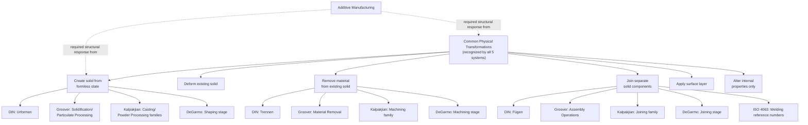

## Points of Agreement Across Classification Systems

### Overview

Having surveyed five major classification systems in this chapter — DIN 8580 (cohesion-based), Groover (processing-versus-assembly), Kalpakjian (material-conditioned), DeGarmo (sequential-stage), and the ASTM/ISO standards family (institutional, legally referenceable) — this section synthesizes the substantive points of convergence across them. Despite differing organizing axes, all five systems recognize a common physical reality: manufacturing processes fall into a small number of recurring functional categories, and the disagreements documented earlier in this chapter are almost entirely disagreements about **organizing axis and granularity**, not about **which physical transformations exist**.

### Agreement 1: A Core Set of Physical Transformations Is Universally Recognized

**Key Points**

- Every system surveyed in this chapter independently recognizes the same underlying set of physical transformations, even when the labels and groupings differ: (1) creating a solid part from a formless/liquid/powder state, (2) plastically deforming an existing solid, (3) removing material from an existing solid, (4) joining separate solid components, (5) applying a surface layer/coating, and (6) altering internal material properties without changing macroscopic shape.
- This is most explicit in DIN 8580's six main groups (Urformen, Umformen, Trennen, Fügen, Beschichten, Stoffeigenschaftändern), but the same six transformations reappear, differently packaged, throughout: Groover's four shaping sub-families plus two assembly sub-categories collectively cover the same ground; Kalpakjian's per-material process families (casting, deformation, machining, joining) reduce to the same transformations conditioned by material; DeGarmo's four sequential stages (shaping, machining, joining, finishing) map the same transformations onto a temporal axis.
- [Inference] The consistent re-emergence of essentially the same six transformation types across five independently developed systems — one German national standard, three separately authored American textbooks, and two international standards bodies — suggests these categories reflect a genuine underlying physical structure of manufacturing (grounded in solid mechanics, thermodynamics of phase change, and surface science) rather than an arbitrary pedagogical convention specific to any one tradition.

### Agreement 2: Casting/Primary-Shaping and Machining Are Never Conflated

**Key Points**

- Every system draws a firm boundary between processes that **create** initial geometry from a formless state and processes that **remove** material from an already-solid body — DIN 8580 (Urformen vs. Trennen), Groover (solidification/particulate processing vs. material removal, both under Shaping Processes), Kalpakjian (casting family vs. machining family), and DeGarmo (Shaping stage vs. Machining stage, sequentially adjacent but distinct) all preserve this distinction without exception.
- This agreement holds even though the systems disagree sharply on *where the boundary sits relative to other categories* — e.g., whether machining is a co-equal main group (DIN), a sub-family of Shaping (Groover), a material-specific family (Kalpakjian), or a distinct sequential stage (DeGarmo).

### Agreement 3: Joining/Assembly Is Consistently Treated as Categorically Distinct from Single-Workpiece Shaping

**Key Points**

- All five systems separate processes that act on a single workpart (shaping, machining, property change) from processes that combine multiple discrete components (joining/assembly), even though the granularity of this joining category varies enormously — from DIN 8593's six detailed subgroups, to ISO 4063's dedicated welding reference-numbering system, to Groover's coarser two-way permanent/mechanical split.
- [Inference] This near-universal single-workpart-vs-multi-component boundary plausibly reflects that joining introduces a genuinely different set of engineering concerns (interfacial mechanics, dissimilar-material compatibility, joint inspection/NDT) than single-workpiece shaping or machining does — a distinction robust enough that no system surveyed in this chapter collapses it, even DeGarmo's otherwise fluid sequential model.

### Agreement 4: Additive Manufacturing Required a Structural Response from Every System

**Key Points**

- As documented across this chapter's historical and comparative sections, every single system surveyed — DIN 8580, Groover, Kalpakjian, DeGarmo, and the ASTM/ISO standards themselves — required some explicit accommodation for additive manufacturing once it matured past early "rapid prototyping" framing, even though the accommodation strategy differed sharply: independent seventh main-group-equivalent framework (ISO/ASTM 52900), interpretive extension of an existing group (DIN 8580's Urformen), absorption into existing feedstock-conditioned sub-families (Groover), a new cross-material family (Kalpakjian), or absorption into an existing sequential stage (DeGarmo's Shaping).
- This convergent pressure — regardless of the differing resolution — is itself a point of agreement: **no system surveyed in this chapter treats AM as adequately covered by its pre-existing categories without modification.** This corroborates the AM classification crisis documented in this chapter's opening historical section as a genuine, cross-framework taxonomic event rather than an artifact specific to any single tradition's structure.

### Agreement 5: Machining's Sub-Distinction by Cutting-Edge Geometry Is Widely (Though Not Universally Explicit) Recognized

**Key Points**

- DIN 8589's explicit split of machining into geometrically defined cutting-edge processes (turning, milling, drilling) versus geometrically undefined cutting-edge processes (grinding, honing, lapping) is the most explicit statement of this distinction, but the same underlying physical difference — precisely defined single/multi-point cutting tools versus statistically distributed abrasive grains — is implicitly present in how Groover, Kalpakjian, and DeGarmo all separate "conventional machining" from "abrasive processes" in their process listings, even where they do not name the geometric-definiteness criterion explicitly as DIN does.
- [Inference] This suggests the geometrically-defined-vs-undefined distinction is a physically real and widely recognized sub-classification within machining, even in systems (like Groover and Kalpakjian) that do not organizationally foreground it as a first-order split the way DIN 8580 does.

### Convergence Diagram: The Common Core Beneath Five Systems

### Agreement 6: All Systems Distinguish Property-Change-Only Processes from Shape-Change Processes

**Key Points**

- DIN 8580 (Stoffeigenschaftändern as a co-equal main group), Groover (Property-Enhancing Processes as a distinct processing sub-category), Kalpakjian (heat treatment discussed per material category but consistently separated from shape-defining processes), and DeGarmo (heat treatment typically folded into or adjacent to the Finishing stage) all agree that a process changing only internal material properties (hardness, microstructure) without deliberately changing geometry is categorically distinct from shaping/machining/joining processes — even though only DIN elevates this to full co-equal main-group status while the others treat it with comparatively lower structural prominence.

### Why the Agreements Matter More Than the Disagreements for Practical Classification

**Key Points**

- [Inference] Because all five systems agree on the underlying physical transformation set (Agreement 1) and on the major category boundaries (Agreements 2, 3, 6), a practitioner moving between systems — e.g., translating a DIN 8580-classified process into Kalpakjian's material-conditioned language for a design review, or into ASTM/ISO terminology for a certification document — is almost always performing a **relabeling and regrouping exercise**, not resolving a genuine disagreement about what the process physically does. This is a materially different (and more tractable) translation problem than would exist if the systems disagreed about the underlying physical transformations themselves.
- The one genuine exception to this relabeling-only characterization, per this chapter's earlier sections, is **additive manufacturing's classification boundary questions** (Agreement 4) and the **emerging multi-axis pressures** discussed in the chapter's trends section (hybrid manufacturing, digital-thread classification, sustainability-based grouping) — these represent areas where the systems' agreement is only on the *need* for a structural response, not yet on a converged resolution, distinguishing them from the settled conventional-process agreements documented in this section.

**Related Topics**

- Building a cross-system translation table for a specific process (practical exercise)
- The AM classification response as a natural experiment in comparative taxonomy structure
- Distinguishing genuine classificatory disagreement from mere terminological relabeling
- Which agreements are physically grounded (transformation-based) versus institutionally contingent (standards-body scope decisions)
- Areas of unresolved disagreement carried forward into the next chapter's process-selection methodology