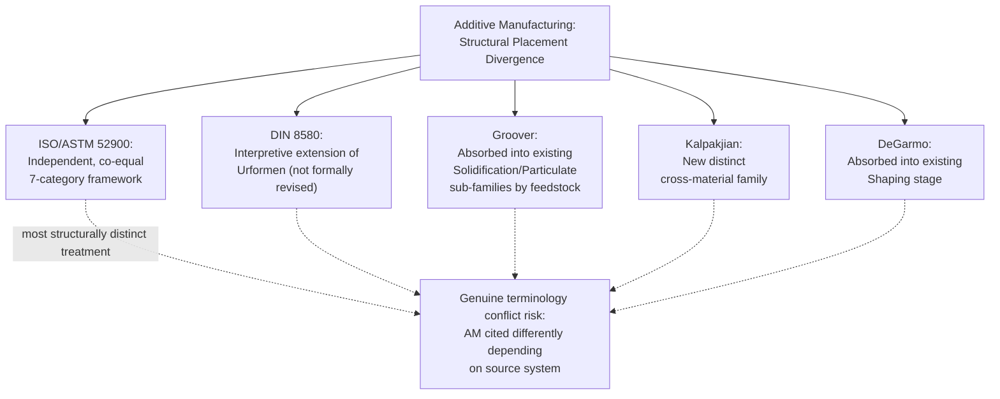

## Points of Divergence and Terminology Conflicts

### Overview

Where the prior section catalogued the substantive agreements across the five systems surveyed in this chapter, this section documents where they genuinely diverge — in organizing axis, category boundaries, granularity, and terminology. These divergences are not merely cosmetic: they produce real translation friction when a process must be cited across systems (e.g., in a certification document referencing one standard while an internal design guide uses another), and several of the terminology conflicts documented here have caused documented confusion in practice, particularly around additive manufacturing terminology prior to full ASTM/ISO convergence.

### Divergence 1: The Primary Organizing Axis Itself

**Key Points**

- The single deepest divergence across this chapter's five systems is not any individual category boundary but the **choice of organizing axis**: DIN 8580 organizes by change in material cohesion (a physically abstract, mechanism-based axis); Groover organizes by production function (processing vs. assembly); Kalpakjian organizes by material category (metals, polymers, ceramics, composites); DeGarmo organizes by sequential process-flow position; and ASTM/ISO organize opportunistically, by whatever scope a given committee's mandate covers (AM terminology, welding reference numbers, cutting tool classification, etc., as distributed standards rather than a single axis).
- Because these axes are **orthogonal** rather than merely differently-labeled versions of the same axis, no simple one-to-one mapping exists between, say, a DIN 8580 group and a DeGarmo stage — a single DIN 8580 group (e.g., Trennen) can appear at different points across DeGarmo's sequence (machining stage, but also some finishing-stage abrasive operations), and a single DeGarmo stage (Shaping) spans two DIN 8580 groups (Urformen and Umformen). This many-to-many mapping, rather than clean equivalence, is the direct practical consequence of the axis divergence.

### Divergence 2: Where Machining Sits Structurally

| System | Machining's Structural Position |
| --- | --- |
| DIN 8580 | Co-equal main group (Trennen), parallel to Urformen, Umformen, Fügen, Beschichten, Stoffeigenschaftändern |
| Groover | Sub-family within Shaping Processes (one of four: solidification/particulate/deformation/removal) |
| Kalpakjian | A material-specific process family, discussed per applicable material category |
| DeGarmo | A distinct sequential stage, positioned after Shaping and before Joining |
| ISO 3002/513 | Not a "family" per se — addressed via geometric/terminology and tool-classification standards rather than a category assignment |

**Key Points**

- This table makes explicit a divergence only implicitly noted in the prior agreements section: while all systems agree machining is *categorically distinct* from shaping (Agreement 2, prior section), they disagree substantially on machining's **structural rank** — co-equal top-level group (DIN) versus subordinate sub-family (Groover, Kalpakjian) versus sequential stage (DeGarmo). A practitioner asking "is machining a top-level category?" receives a genuinely different answer depending on which system is consulted, not merely a different label for the same rank.

### Divergence 3: Granularity of the Joining/Assembly Category

**Key Points**

- Joining granularity varies from DIN 8593's six explicit subgroups (joining by primary shaping, by forming, by filling, by pressing-in, by welding, by adhesive bonding) down to Groover's coarse two-way split (permanent joining vs. mechanical assembly) — a roughly threefold difference in category count for ostensibly the same process family.
- ISO 4063 introduces yet another granularity dimension specific to welding alone: a detailed numeric reference-number system with dozens of distinct welding and allied-process codes, far exceeding the granularity of any single textbook framework's joining treatment, because ISO 4063's scope is narrower (welding specifically, not joining broadly) but deeper within that scope.
- [Inference] This granularity divergence is not simply "some systems are more detailed than others" in a uniform sense — DIN 8580 is comparatively coarse on AM (interpretive Urformen fit only) but comparatively fine-grained on joining (six DIN 8593 subgroups) and on machining sub-distinctions (geometrically defined vs. undefined cutting edges per DIN 8589), while ISO/ASTM 52900 is extremely fine-grained on AM specifically (seven defined mechanism-based categories) but does not address joining or machining granularity at all, being scoped exclusively to AM. Granularity divergence is therefore domain-specific to each system's historical development priorities, not a general "more detailed vs. less detailed" ranking.

### Divergence 4: Additive Manufacturing's Structural Placement

Building directly on Agreement 4 from the prior section (all systems required *some* structural response to AM), this divergence catalogs how differently that response was resolved:

**Key Points**

- This divergence is the single most practically consequential one surveyed in this chapter, because it means the **same physical AM process can be correctly classified in entirely different structural positions** depending on which system a given document or conversation is using — a genuine, not merely cosmetic, translation hazard, unlike most of the other divergences in this section which primarily involve relabeling.

### Divergence 5: Terminology Conflicts — The "Rapid Prototyping" Problem

**Key Points**

- As documented in this chapter's opening historical section, the term **"rapid prototyping"** was the dominant industry and academic label for AM throughout the 1990s and much of the 2000s, but the term itself proposes a *purpose-based* classification (prototyping) rather than a *mechanism-based* one — creating a terminology conflict once AM processes began being used for functional end-use parts rather than prototypes, since "rapid prototyping" no longer accurately described the application even where the underlying process was identical.
- "Solid freeform fabrication" and "layered manufacturing," proposed as alternative terms in the mid-1990s academic literature, each implicitly proposed different classificatory emphases (geometric freedom vs. build strategy respectively) that never achieved the same convergence "layered manufacturing" implies a closer conceptual link to DeGarmo's sequential Shaping-stage placement, while "solid freeform fabrication" implies a closer conceptual link to the geometric-capability emphasis found in some Kalpakjian-style material/capability framing — though neither term achieved lasting standardization before ASTM F2792/ISO 52900 settled on "additive manufacturing" as the standard term.
- [Unverified] The degree to which "3D printing" (the most common lay/consumer term) is treated as synonymous with, or as a narrower subset of, "additive manufacturing" varies across sources — some standards documents and industry commentary treat "3D printing" as informally synonymous with AM broadly, while others (including some ASTM/ISO-adjacent commentary) restrict "3D printing" to lower-cost, less industrially rigorous processes (e.g., desktop material extrusion) as distinct from "additive manufacturing" as an industrial-grade term — this terminological boundary is not fully standardized across all sources surveyed for this chapter.

### Divergence 6: Welding's Categorical Status — Top-Level vs. Subordinate

**Key Points**

- DIN 8580 nests welding within Fügen (Joining) as one of six subgroups (per DIN 8593) — welding is explicitly *not* a top-level category in DIN's structure.
- By contrast, some Anglo-American industrial and professional contexts (notably American Welding Society practice, and informal industry usage) frequently treat "welding" as an implicit peer category to "casting," "machining," and "forming" — a flatter, four-or-five-way top-level split in which welding stands alongside the other major process families rather than being subordinated within a broader joining category.
- [Inference] This divergence is arguably as much a **cultural/institutional convention difference** (German engineering-standard tradition vs. American industrial-practice tradition) as it is a principled taxonomic disagreement, since the underlying physical process (welding) and its relationship to other joining methods (brazing, soldering, adhesive bonding) is not genuinely disputed by either tradition — only its structural rank within the broader taxonomy differs.

### Divergence 7: Heat Treatment's Categorical Status

| System | Heat Treatment's Structural Position |
| --- | --- |
| DIN 8580 | Co-equal main group (Stoffeigenschaftändern) |
| Groover | Sub-category within Processing Operations (Property-Enhancing Processes) |
| Kalpakjian | Discussed per material category, not elevated to independent top-level status |
| DeGarmo | Typically folded into or adjacent to the Finishing stage (edition-dependent) |

**Key Points**

- This mirrors Divergence 2's pattern (machining) exactly: all systems agree heat treatment is categorically distinct from shape-changing processes (per Agreement 6, prior section), but only DIN 8580 elevates it to full co-equal main-group rank; every other system surveyed subordinates it to a lower structural tier, though the specific subordinate placement (processing sub-category, per-material discussion, or finishing-stage inclusion) differs across Groover, Kalpakjian, and DeGarmo respectively.

### Practical Consequence: A Translation Hazard Example

A process engineer citing "additive manufacturing, powder bed fusion category" in an ISO/ASTM 52900-referencing certification document, then discussing the same process with a colleague using DeGarmo's textbook framework internally, is technically discussing the same physical process (laser or electron-beam powder consolidation) but under genuinely different structural claims: the ISO/ASTM document asserts AM as an independent, co-equal seventh-family framework, while the DeGarmo-trained colleague's mental model places the same process within the "Shaping" stage alongside casting and forging. [Inference] Neither framing is incorrect within its own system, but a reader unaware of this chapter's divergence catalog might mistakenly interpret DeGarmo's Shaping-stage placement as a claim that AM is "less distinct" or "less standardized" than ISO/ASTM 52900 implies — an inference the divergence itself does not actually support, since the disagreement is structural/organizational rather than a disagreement about AM's technical maturity or standardization status.

### Summary Table: Divergence vs. Agreement Status by Category

| Category | Agreement Status (from prior section) | Divergence Documented Here |
| --- | --- | --- |
| Existence of core transformation types | Agreed | — |
| Casting/shaping vs. machining distinction | Agreed | Machining's structural *rank* varies (Divergence 2) |
| Joining as categorically distinct | Agreed | Granularity varies sixfold to twofold (Divergence 3) |
| AM requires structural response | Agreed | Resolution strategy varies completely (Divergence 4) |
| Property-change-only processes distinct | Agreed | Structural rank varies (Divergence 7) |
| — | Not agreed | Primary organizing axis itself (Divergence 1) |
| — | Not agreed | Welding's top-level vs. subordinate status (Divergence 6) |
| — | Not agreed | AM terminology pre-2012 (rapid prototyping vs. SFF vs. layered mfg) (Divergence 5) |

**Related Topics**

- Building a formal cross-system mapping table for machining sub-categories
- Resolving terminology conflicts in cross-organizational technical documentation
- The cultural/institutional origins of German vs. American process taxonomy conventions
- "3D printing" vs. "additive manufacturing" terminology boundary in current industry usage
- Practical guidance for citing process classifications in multi-standard certification contexts