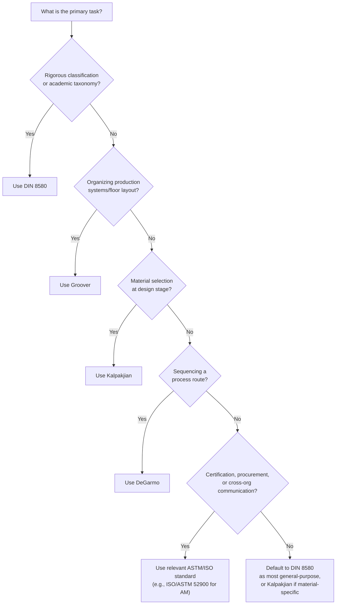

## Choosing a Classification Lens for a Given Purpose

### Overview

This section closes the chapter by converting the comparative analysis of the prior sections — agreements, divergences, and terminology conflicts across DIN 8580, Groover, Kalpakjian, DeGarmo, and the ASTM/ISO standards — into a practical decision framework. Rather than treating "which classification system is correct" as a resolvable question, this section treats it as a **purpose-relative decision**: each system was shown in the prior sections to optimize for a different task, and selecting a lens means matching the system's native strength to the task at hand rather than seeking a single universally superior taxonomy.

### The Core Decision Variable: What Is the Classification For?

**Key Points**

- The five systems surveyed in this chapter differ primarily in **organizing axis** (Divergence 1, prior section), and organizing axis correlates directly with the task each system serves best: DIN 8580's cohesion-based axis serves rigorous taxonomic analysis; Groover's function-based axis serves production-system organization; Kalpakjian's material-based axis serves design-stage material/process selection; DeGarmo's sequential axis serves process-route planning; and the ASTM/ISO standards serve legally referenceable, cross-organizational communication.
- [Inference] Because these axes are genuinely orthogonal rather than competing attempts at the same goal (as established in the divergence section), the practical decision is closer to selecting the right tool from a toolbox than adjudicating between competing truth-claims — a position this section adopts explicitly as its organizing premise.

### Decision Framework by Task Type

| Task | Recommended Lens | Rationale |
| --- | --- | --- |
| Formal process taxonomy / academic classification | **DIN 8580** | Single-axis, mutually exclusive, mechanism-based rigor; most defensible for systematic classification exercises |
| Organizing a factory floor / production system | **Groover** | Processing-vs-assembly split maps directly onto department/line organization |
| Material selection at the design stage | **Kalpakjian** | Material-conditioned structure directly answers "what processes suit this material" |
| Sequencing a process route / process planning | **DeGarmo** | Sequential shaping→machining→joining→finishing structure mirrors actual production routing |
| Certification, procurement, or regulatory documentation | **ASTM / ISO (relevant standard)** | Legally referenceable; required or expected by regulatory/contractual context |
| Cross-organizational or international communication | **ISO/ASTM joint standards where available (e.g., 52900 for AM)** | Reduces translation risk documented in the prior divergence section's certification example |
| Teaching manufacturing processes to students | **Any, matched to course objective** | Production-systems courses favor Groover; materials-science-oriented courses favor Kalpakjian; process-engineering courses favor DeGarmo |

### Decision Diagram

### Worked Example: A Single Part Analyzed Through Four Lenses for Four Different Purposes

Consider a titanium alloy bracket that is produced via laser powder bed fusion, finish-machined for critical bore tolerances, and heat-treated for stress relief, intended for an aerospace assembly.

**Key Points**

- **For an aerospace certification document**, the correct lens is **ISO/ASTM 52900**: the build step must be cited precisely as "Powder Bed Fusion," since certification bodies expect this specific, internationally recognized terminology — as established in this chapter's earlier convergence section, using a pre-2012 term like "rapid prototyping" or an ambiguous national-standard equivalent would introduce the exact translation risk documented there.
- **For an internal process routing sheet**, the correct lens is **DeGarmo**: the sequence — Shaping (PBF build) → Machining (bore finishing) → Finishing (stress-relief heat treatment, edition-dependent placement) — maps directly onto how a process planner would sequence work orders and department handoffs.
- **For a design review evaluating whether titanium was the right material choice**, the correct lens is **Kalpakjian**: the material-conditioned framing directly surfaces the question "what processes are compatible with titanium alloys," rather than requiring the reviewer to reason from a material-agnostic taxonomy toward material-specific process compatibility.
- **For a formal academic or training classification exercise** (e.g., categorizing this part's manufacturing route for a manufacturing engineering course), the correct lens is **DIN 8580**: Urformen (interpretive AM fit) → Trennen (machining) → Stoffeigenschaftändern (heat treatment), providing the most taxonomically rigorous and mutually exclusive classification of the three physically distinct operations involved.
- [Inference] This worked example illustrates the chapter's central synthesis finding directly: the same physical part and process route does not have one "correct" classification — it has (at least) four correct classifications, each valid within its own system and appropriate to a different task, consistent with the purpose-relative framing this section adopts.

### When Multiple Lenses Are Needed Simultaneously

**Key Points**

- In practice, a single engineering project frequently requires **more than one lens concurrently** rather than a single choice — the worked example above uses four different lenses for four different documents describing the same physical part, and all four are simultaneously "correct" and in active use on a real aerospace program.
- [Inference] This suggests that fluency across multiple classification systems — rather than allegiance to a single "best" system — is the more realistic professional competency this chapter's comparative survey points toward, particularly for engineers working across the design, production-planning, and regulatory-compliance functions of a single project, where each function has historically gravitated toward a different one of the systems surveyed in this chapter.

### Cautions When Switching Lenses

**Key Points**

- As documented in the prior divergence section's translation-hazard example, switching lenses on the same process (e.g., from ISO/ASTM 52900's "Powder Bed Fusion, independent framework" framing to DeGarmo's "Shaping stage, sequentially alongside casting" framing) can create a **false impression of disagreement about technical maturity or standardization** where the actual disagreement is purely structural/organizational — readers and writers moving between systems should be explicit about which lens is in use, particularly in cross-functional documentation where readers may not share the same classification background.
- When no clear task-driven default applies (the "Default" branch in the decision diagram above), this chapter's synthesis suggests **DIN 8580** as the most defensible general-purpose fallback, given its comprehensiveness and single-axis rigor established across the chapter — though Kalpakjian is noted as a reasonable alternative default specifically when the classification's primary audience needs material-process compatibility reasoning rather than pure taxonomic rigor.

**Related Topics**

- Building a personal or organizational cross-system reference table for frequently-classified processes
- Multi-lens documentation practices for cross-functional engineering programs
- Recognizing structural (organizational) disagreement versus substantive (technical) disagreement when switching lenses
- Applying this chapter's decision framework to non-AM process classification scenarios
- Transitioning from classification systems (this chapter) to process selection methodology (next chapter)