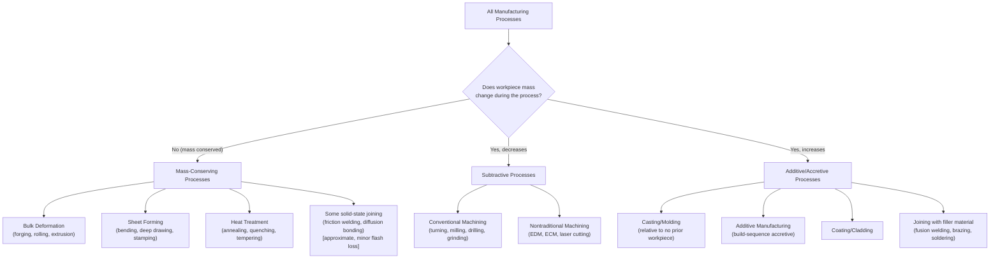

## Mass-Conserving Processes Defined

### Overview

This section opens a new chapter shifting the classificatory lens from the comparative standards-and-framework survey of the prior chapter to a first-principles physical criterion: whether a process conserves the mass of the workpiece. Mass conservation is a fundamentally different classifying axis from any surveyed previously — orthogonal to DIN 8580's cohesion-change logic, Groover's processing/assembly split, Kalpakjian's material conditioning, and DeGarmo's sequential staging — and it produces a binary partition of essentially all manufacturing processes into mass-conserving and non-mass-conserving categories, forming the organizing spine for this new chapter.

### Defining Criterion

**Key Points**

- A **mass-conserving process** is one in which the mass of the workpiece at the end of the operation equals the mass of the workpiece at the start of the operation (within measurement tolerance, excluding negligible effects such as minor oxidation scaling in hot forming or minor material transfer at a joint interface).
- This criterion is independent of geometry change: a mass-conserving process may leave the part's shape completely unchanged (e.g., most heat treatment operations) or may dramatically alter its shape (e.g., forging, rolling, deep drawing) — the defining test is mass, not geometric similarity.
- Mass conservation is also independent of **material cohesion change** (DIN 8580's organizing axis) — a mass-conserving process may involve no cohesion change (bending a sheet), an increase in cohesion (a solid-state joining process where no filler material is added, such as friction welding of two like-sized parts, though even here some flash material is typically expelled, illustrating that few processes are perfectly mass-conserving in strict practice), or, in edge cases, small local cohesion changes without appreciable net mass transfer.

### The Two-Way Partition

| Category | Mass Relationship | Representative Processes |
| --- | --- | --- |
| **Mass-Conserving** | Final mass ≈ initial mass; material is redistributed, not added or removed | Forging, rolling, extrusion, deep drawing, bending, most heat treatment |
| **Non-Mass-Conserving (Subtractive)** | Final mass < initial mass; material is removed | Turning, milling, drilling, grinding, EDM, chemical/electrochemical machining |
| **Non-Mass-Conserving (Additive/Accretive)** | Final mass > initial mass (relative to a starting workpiece, where applicable) | Casting (relative to no prior solid workpiece), additive manufacturing, coating, cladding, most joining processes involving filler material |

**Key Points**

- This three-way outcome (conserving, subtractive, additive/accretive) is a **cleaner and more physically fundamental binary-plus split** than any single axis used by the frameworks surveyed in the prior chapter, precisely because it asks only one narrow physical question (does total mass change, and in which direction) rather than bundling multiple considerations (mechanism, sequence, material, function) into a single classifying axis as DIN 8580, Groover, Kalpakjian, and DeGarmo each do in their own ways.
- [Inference] Because mass conservation is measurable and unambiguous (unlike, for example, DIN 8580's more interpretively flexible cohesion-change criterion, which required extended discussion in the prior chapter to resolve AM's classificatory placement), this axis is arguably better suited as a foundational, low-level physical criterion underlying the higher-level pedagogical and institutional taxonomies surveyed previously, rather than as a competing replacement for them.

### Mass-Conserving Processes in Detail

**Key Points**

- The paradigm mass-conserving processes are the **bulk and sheet deformation processes**: forging, rolling, extrusion, wire drawing, deep drawing, bending, and related forming operations. In all of these, the workpiece's volume (and, assuming negligible density change, mass) remains constant while its shape is redistributed through plastic deformation.
- **Heat treatment processes** (annealing, quenching, tempering, case hardening, normalizing) are mass-conserving in the strict sense that no material is added or removed — these processes alter internal microstructure, hardness, or residual stress state without any intended mass transfer, corresponding closely to DIN 8580's Stoffeigenschaftändern group and to the property-enhancing categories identified across the frameworks surveyed in the prior chapter.
- Certain **solid-state joining processes without filler material** (e.g., friction welding, diffusion bonding, cold pressure welding between like-sized workpieces) approach mass conservation, though in practice most produce some expelled flash or interface material loss, meaning they are more accurately described as **approximately** mass-conserving rather than strictly so — an important practical caveat distinguishing idealized classification from measured production reality.
- [Inference] Bulk and sheet forming processes' mass-conserving character is directly connected to a key engineering advantage frequently cited in manufacturing literature: because no material is removed as scrap, forming processes tend to exhibit higher material utilization efficiency than subtractive machining of the same nominal part geometry — though the magnitude of this advantage is process- and geometry-dependent and is not itself a universal guarantee, since forming processes can produce their own material losses through flash, trim scrap, or sprue/runner systems in related casting-adjacent processes.

### Boundary Cases and Ambiguities

**Key Points**

- **Machining operations that also apply coatings or platings within the same production cycle** (rare, but occurring in some combined finishing operations) blur the mass-conserving boundary at a process-sequence level even though each individual sub-operation remains cleanly classifiable — this mirrors the hybrid-manufacturing granularity problem discussed in the prior chapter's trends section, where the unit of classification (operation vs. job) affects which category applies.
- **Net-shape and near-net-shape processes** (e.g., precision forging, investment casting) are sometimes discussed in manufacturing literature specifically because they minimize the non-mass-conserving finishing operations (machining) that would otherwise follow a mass-conserving primary shaping step — the mass-conserving/non-conserving distinction is thus directly relevant to a recognized manufacturing engineering objective (minimizing secondary machining) rather than being a purely abstract classificatory exercise.
- **Additive manufacturing's mass relationship** is more nuanced than a simple "non-mass-conserving, additive direction" label suggests: relative to the finished part's own build sequence, AM is unambiguously accretive (mass increases from zero as material is deposited), but relative to *material utilization efficiency*, AM is frequently cited (per the trends discussion in the prior chapter's sustainability section) as producing *less waste* than subtractive machining of an equivalent part from bulk stock — meaning the mass-conserving/non-conserving axis, applied at the level of the **starting-workpiece-to-finished-part transformation**, does not by itself capture the *overall material efficiency* comparison across different manufacturing routes; that comparison requires accounting for total material drawn into the process (including scrap, machining swarf, or unused powder) rather than only the net mass change of the identifiable workpiece.

### Diagram: Mass-Conservation Partition of Manufacturing Processes

### Relationship to the Prior Chapter's Frameworks

**Key Points**

- Mass conservation cuts **across** every framework surveyed in the previous chapter rather than mapping cleanly onto any single one of their category structures — DIN 8580's Umformen (forming) group is essentially coextensive with mass-conserving processes, but DIN's Urformen group spans both accretive processes (casting, from no prior workpiece) and, per the prior chapter's interpretive discussion, AM (also accretive), meaning mass-conservation status does not align one-to-one with any single DIN main group boundary.
- Similarly, Groover's four shaping sub-families (solidification, particulate, deformation, removal) split cleanly along mass-conservation lines only for two of the four: deformation processes are mass-conserving, removal processes are subtractive, but solidification and particulate processing are both accretive relative to a starting workpiece (or non-applicable, since these often begin from a fully formless/liquid/powder state rather than a pre-existing "workpiece" whose mass could be compared).
- [Inference] This partial, non-isomorphic overlap between the mass-conservation axis and the prior chapter's organizing axes reinforces this chapter's premise: physical/mechanistic axes such as mass conservation represent a genuinely independent classificatory dimension, valuable precisely because it does not simply restate any single system covered previously, and can therefore serve as a cross-cutting analytical tool applicable regardless of which pedagogical or institutional framework a given engineering context uses.

**Related Topics**

- Material utilization efficiency and scrap/waste comparison across mass-conserving and non-conserving process routes
- Near-net-shape and net-shape processes as a design strategy to minimize non-mass-conserving finishing operations
- The mass-conservation status of joining processes with and without filler material
- Volume conservation versus mass conservation in processes involving density change (e.g., sintering, powder consolidation)
- Connecting mass-conservation classification to the sustainability/circularity trends discussed in the prior chapter