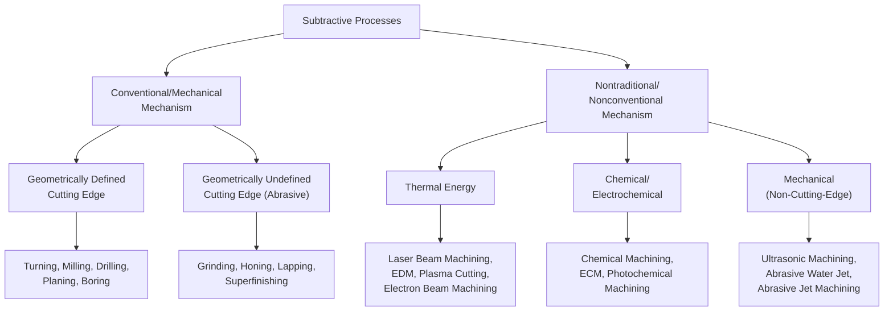

## Mass-Reducing and Subtractive Processes Defined

### Overview

Continuing this chapter's mass-conservation axis from the prior section, this section defines the second branch of the three-way partition introduced there: **subtractive (mass-reducing) processes** — those in which final workpiece mass is strictly less than initial mass, the deficit having been physically removed as scrap, chips, swarf, or vaporized/dissolved material. This category corresponds most directly to DIN 8580's Trennen (Separating) group and to the "Material Removal Processes" sub-family found across the frameworks surveyed in the prior chapter, but this section examines it through the specific physical lens of the material-removal mechanism itself, rather than through any single prior framework's organizational structure.

### Defining Criterion

**Key Points**

- A **subtractive process** removes material from an existing solid workpiece, reducing its mass and typically its volume, in order to achieve a target geometry, surface condition, or internal feature not present (or not sufficiently precise) in the starting stock.
- This criterion presupposes an **already-solid starting workpiece** — subtractive processes act on stock that already possesses the material cohesion DIN 8580's Urformen group establishes; subtractive processes therefore never create cohesion, only reduce it locally (to separate the removed material from the retained workpiece) or eliminate it entirely (full separation/parting).
- The removed material may leave the system as discrete chips (conventional machining), fine particulate/dust (grinding, abrasive processes), dissolved ions (electrochemical machining), vaporized/ablated material (laser cutting, EDM), or as a separated solid piece (parting, blanking, though blanking is sometimes classified as a shearing/forming-adjacent operation depending on the framework, illustrating a boundary case discussed further below).

### Primary Mechanism-Based Sub-Classification

**Key Points**

- Subtractive processes are most commonly sub-classified, consistent with DIN 8589's distinction (introduced in the prior chapter's DIN 8580 section), by **cutting-edge geometric definiteness**: processes using a tool with a precisely known cutting-edge geometry (geometrically defined) versus processes using an abrasive medium with statistically distributed, non-precisely-known cutting-edge geometry (geometrically undefined).
- A second, independent sub-classification axis distinguishes **conventional (mechanical) machining** — material removal via direct mechanical shear/cutting action — from **nontraditional (nonconventional) machining** — material removal via thermal, chemical, electrochemical, or other non-mechanical energy mechanisms.
- These two axes (geometric definiteness; mechanical vs. nontraditional) are **orthogonal to each other**, producing a genuine two-dimensional sub-classification space for subtractive processes rather than a single linear hierarchy — most conventional machining processes have geometrically defined cutting edges, but the intersection is not total (abrasive processes, which are geometrically undefined, are still mechanical/conventional in mechanism, while most nontraditional processes have no discrete "cutting edge" concept at all, making the geometric-definiteness axis not strictly applicable to them).

### Sub-Classification Table

| Category | Cutting-Edge Geometry | Mechanism | Representative Processes |
| --- | --- | --- | --- |
| **Single/Multi-Point Machining** | Geometrically defined | Mechanical | Turning, milling, drilling, planing, shaping (machine tool sense), boring |
| **Abrasive Machining** | Geometrically undefined | Mechanical | Grinding, honing, lapping, superfinishing, abrasive belt machining |
| **Thermal Nontraditional** | Not applicable | Thermal/energy-based | Laser beam machining, electrical discharge machining (EDM), plasma arc cutting, electron beam machining |
| **Chemical/Electrochemical Nontraditional** | Not applicable | Chemical/electrochemical | Chemical machining (milling), electrochemical machining (ECM), photochemical machining |
| **Mechanical Nontraditional (Energy-Based, Non-Cutting-Edge)** | Not applicable | Mechanical, non-cutting-edge | Ultrasonic machining, abrasive water jet cutting, abrasive jet machining |

**Key Points**

- This table's five-way sub-classification is more granular than any single framework surveyed in the prior chapter presents machining — DIN 8589 addresses the geometric-definiteness axis explicitly but does not organize nontraditional machining by energy mechanism with equal prominence; Groover, Kalpakjian, and DeGarmo each discuss nontraditional/nonconventional machining as a named category but generally with less mechanism-level sub-division than presented here.
- [Inference] The mechanism-based sub-classification of nontraditional processes (thermal / chemical-electrochemical / mechanical-non-cutting-edge) is useful specifically because it predicts process capability characteristics that the cutting-edge-geometry axis does not address — for instance, whether a process can machine electrically non-conductive materials (ruling out EDM and ECM), whether it induces significant heat-affected zones (ruling in laser/EDM concerns, ruling out ECM and most abrasive water jet applications), and whether it can achieve very fine surface finishes on hard materials (favoring abrasive and some chemical processes over conventional cutting-edge machining).

### Diagram: Two-Axis Sub-Classification of Subtractive Processes

### Mass-Removal Characteristics Across Sub-Categories

**Key Points**

- **Conventional machining** typically removes material in discrete, relatively large chip volumes per unit time, giving high material removal rates but comparatively coarser achievable tolerances and surface finishes than abrasive or several nontraditional processes, though this generalization admits substantial variation by specific process and machine capability.
- **Abrasive processes** remove material in very fine particulate form, generally at lower removal rates than conventional machining but achieving substantially finer surface finishes and tighter dimensional tolerances — this is the physical basis for their common role as a **finishing** step following conventional machining, a sequential relationship explicitly reflected in DeGarmo's framework (covered in the prior chapter), where some abrasive operations are discussed under the Finishing stage rather than the Machining stage.
- **Nontraditional processes** vary enormously in removal rate and mechanism-specific characteristics: EDM and ECM are often selected specifically for hard, electrically conductive materials or complex internal geometries unreachable by cutting-tool access; laser and abrasive water jet cutting are frequently selected for their non-contact nature (avoiding mechanical stress on delicate or thin-walled parts); chemical machining is frequently selected for very shallow, wide-area material removal (e.g., chem-milling aircraft skin panels) where mechanical processes would be impractical at scale.

### Boundary Cases

**Key Points**

- **Blanking, piercing, and shearing** (sheet metal separation processes) present a genuine boundary case: they physically separate material (satisfying the mass-reducing/subtractive criterion at the level of the retained workpiece, since the blank is a distinct, smaller-mass piece than the original sheet) but are mechanistically closer to a controlled fracture/shear-forming action than to the chip-forming or erosive mechanisms characteristic of the subtractive processes discussed above — several frameworks in the prior chapter (notably DIN 8589, and Groover's shearing discussion) classify these operations partly under separating/machining and partly under forming-adjacent sheet-metal-process discussions, reflecting genuine cross-framework disagreement on this boundary case consistent with the divergence patterns catalogued in the prior chapter.
- **Chemical etching used for decorative or marking purposes** (removing negligible mass for surface pattern rather than functional geometry) is technically subtractive by the strict mass-criterion but is sometimes discussed under surface treatment/finishing topics rather than material removal topics in some frameworks, illustrating that the mass-conservation axis, while physically unambiguous, does not always align with how practitioners intuitively categorize a process by its primary *purpose* (functional shaping vs. surface/cosmetic treatment).
- [Unverified] The precise classification of hybrid separation techniques such as **abrasive water jet cutting used for through-cutting (full separation) versus abrasive water jet used for controlled-depth surface texturing** may be treated differently across specific standards or references depending on whether the operation is framed primarily as a cutting (subtractive, full-separation) or surface-modification (subtractive, partial-depth) process; this distinction was not resolved against a single authoritative source for this section and may warrant verification against the specific process documentation relevant to a given application.

### Relationship to the Prior Chapter's Frameworks

**Key Points**

- This section's five-way mechanism-based sub-classification (single/multi-point, abrasive, thermal, chemical/electrochemical, mechanical-non-cutting-edge) sits **beneath** DIN 8580's Trennen main group as a more granular elaboration consistent with — and extending — DIN 8589's geometric-definiteness distinction, rather than proposing a competing top-level classification.
- Relative to Groover's single "Material Removal Processes" sub-family and Kalpakjian's per-material machining family, this section's sub-classification provides considerably more mechanism-level granularity, consistent with this new chapter's stated purpose of examining physical mechanism rather than pedagogical/institutional organization as the primary lens.
- [Inference] Because subtractive processes are, per the mass-conservation criterion established in the prior section, unambiguously and universally mass-reducing (setting aside the negligible-mass boundary cases noted above), this category is one of the most physically clear-cut of the three partitions introduced in the prior section — considerably less prone to the interpretive ambiguity that characterized additive manufacturing's placement within the cohesion-based and sequential frameworks surveyed in the prior chapter.

**Related Topics**

- Material removal rate as a process-selection criterion across conventional and nontraditional machining
- Heat-affected zone characteristics across thermal nontraditional processes
- Electrical conductivity requirements for EDM and ECM process applicability
- Blanking/shearing as a boundary case between subtractive and forming process classification
- Surface finish and tolerance capability comparison across the five subtractive sub-categories