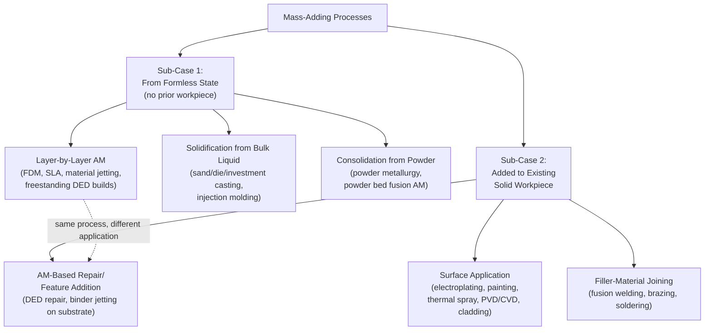

## Mass-Adding and Additive Processes Defined

### Overview

This section completes the three-way mass-conservation partition established at this chapter's opening, defining the third branch: **mass-adding (accretive) processes** — those in which final part mass exceeds the mass of any identifiable starting workpiece, the surplus having been introduced from an external feedstock (liquid, powder, wire, filament, sheet, or vapor). This category is the most internally diverse of the three partitions, spanning casting, additive manufacturing, coating/cladding, and filler-material joining — processes that DIN 8580 and the other frameworks surveyed in the prior chapter distribute across as many as four different main groups (Urformen, Fügen, Beschichten, and the AM-specific ISO/ASTM 52900 framework), unified here purely by their shared mass-direction characteristic.

### Defining Criterion

**Key Points**

- A **mass-adding process** introduces material from an external source such that the mass of the finished part or feature exceeds the mass of whatever solid workpiece (if any) existed immediately prior to the operation.
- Unlike the subtractive category (prior section), which presupposes an already-solid starting workpiece, mass-adding processes fall into two structurally distinct sub-cases: (1) processes that create a solid part **from a fully formless state** with no prior workpiece to compare against (casting, AM builds from raw feedstock), where "mass added" is measured relative to zero rather than relative to a pre-existing solid; and (2) processes that add material **to an existing solid workpiece** (coating, cladding, filler-material joining, AM used for repair/feature-addition on an existing part), where mass gain is measured directly against that workpiece's pre-operation mass.
- [Inference] This two-sub-case structure is a meaningful internal distinction within the mass-adding category not present within the mass-conserving or subtractive categories (both of which uniformly presuppose or act upon a single pre-existing workpiece), and it is the direct source of the classificatory ambiguity noted in the prior chapter's AM discussion — sub-case (1) processes (bulk AM builds, casting) more naturally parallel DIN 8580's Urformen logic (create cohesion from nothing), while sub-case (2) processes (AM-based repair, cladding, filler welding) more naturally parallel DIN 8580's Beschichten or Fügen logic (add material to an existing body).

### Primary Sub-Classification by Feedstock Delivery Mechanism

| Sub-Category | Feedstock State | Representative Processes | Mass-Adding Sub-Case |
| --- | --- | --- | --- |
| **Solidification from Bulk Liquid** | Molten/liquid material poured or forced into a cavity | Sand casting, die casting, investment casting, injection molding | (1) — from formless state |
| **Consolidation from Powder/Particulate** | Loose powder or granulate, consolidated in place or layer-by-layer | Powder metallurgy/sintering, powder bed fusion AM, binder jetting AM | (1) — from formless state, or (2) if applied to an existing substrate |
| **Layer-by-Layer Deposition (Non-Powder-Bed AM)** | Filament, wire, resin, or jetted material, deposited progressively | Material extrusion (FDM), vat photopolymerization (SLA/DLP), material jetting, directed energy deposition | (1) or (2), depending on whether building freestanding or onto a substrate |
| **Surface Application to an Existing Substrate** | Liquid, vapor, molten spray, or electrochemical deposit applied to an existing solid | Electroplating, painting, thermal spraying, PVD/CVD, cladding | (2) — added to existing workpiece |
| **Filler-Material Joining** | Molten or semi-molten filler material introduced at a joint interface | Fusion welding (with filler rod/wire), brazing, soldering | (2) — added to existing workpieces, joining them simultaneously |

**Key Points**

- This table deliberately groups **casting and additive manufacturing together** under the "from formless state" mass-adding logic (sub-case 1), a grouping that DIN 8580 achieves only through the interpretive Urformen extension discussed in the prior chapter, and that ISO/ASTM 52900 explicitly rejects in favor of treating AM as an independent framework — this section's mass-based lens therefore produces a genuinely different grouping decision than either of those two systems, illustrating this new chapter's premise that physical/mechanistic axes can cut across prior frameworks' category boundaries rather than merely restating them.
- **Directed Energy Deposition (DED)** is explicitly flagged in the table as spanning both mass-adding sub-cases, consistent with the prior chapter's observation (in the AM emergence section) that DED sits at a genuine boundary between additive manufacturing and cladding/welding-adjacent processes — DED used for freestanding part builds is sub-case (1), while DED used for repair or feature-addition on an existing part is sub-case (2), and the same physical process/machine can be used for either application depending on the job.

### Diagram: Mass-Adding Process Sub-Classification

### Mass-Adding Characteristics and Engineering Implications

**Key Points**

- **Material utilization efficiency** is frequently cited as a comparative advantage of several mass-adding processes relative to subtractive alternatives for equivalent final geometry, since ideally only the material that becomes part of the finished component (plus process-specific losses such as sprues/runners in casting, or support structures and overspray in AM/coating) is consumed — though, as noted in the prior chapter's sustainability trends discussion, this advantage is highly process- and geometry-dependent and should not be treated as a universal rule; casting with extensive gating systems or AM with substantial support structures can offset much of this theoretical efficiency advantage.
- **Sub-case (1) processes** (casting, freestanding AM builds) generally afford the greatest **geometric design freedom**, since there is no pre-existing solid constraining the achievable shape — this is a key reason both casting and AM are frequently discussed together in design-for-manufacturing literature despite their otherwise significant differences in solidification mechanism, cooling rate, and achievable microstructure.
- **Sub-case (2) processes** (coating, cladding, filler joining, repair-oriented AM) are inherently constrained by the pre-existing substrate's geometry and material compatibility — adhesion mechanics, thermal expansion mismatch, and interfacial metallurgy (for metal-on-metal applications) become central engineering concerns not present in sub-case (1) processes, since sub-case (2) always involves a genuine interface between old and new material that must be engineered for adequate bond strength.

### Boundary Cases

**Key Points**

- **Binder jetting** presents a nuanced boundary case within the mass-adding category: the initial build (powder plus binder) is mass-adding relative to no prior workpiece (sub-case 1), but the process frequently requires a subsequent **infiltration or sintering densification step** that may itself involve further mass change (infiltration adds mass from a secondary infiltrant material; sintering-only densification is approximately mass-conserving at the macro level while significantly changing part volume/density) — illustrating that a single named AM process category (per ISO/ASTM 52900's seven-category schema, covered in the prior chapter) can span multiple mass-conservation states across its full process chain, not just a single one.
- **Cladding versus repair-oriented AM** (both sub-case 2, surface/feature addition to an existing substrate) are sometimes discussed as essentially the same underlying physical process under different application-driven names — cladding typically implies a broad, relatively thin protective or functional surface layer (e.g., corrosion-resistant weld overlay), while repair-oriented DED implies localized, often thicker feature restoration (e.g., rebuilding a worn turbine blade tip) — [Inference] this naming distinction is more application/purpose-driven than mechanism-driven, consistent with the pattern noted in the prior chapter's terminology-conflict section regarding how process names sometimes encode intended use rather than a genuinely distinct physical mechanism.
- **Vapor deposition processes (PVD/CVD)** used for very thin functional coatings (nanometers to micrometers) add negligible measurable mass in absolute terms, yet are unambiguously classified as mass-adding by direction (mass increases, however slightly) rather than by magnitude — reinforcing that this chapter's mass-conservation axis is a directional/binary criterion, not a magnitude-threshold criterion, a distinction that matters when comparing very-low-mass-addition processes (thin-film coating) against very-high-mass-addition processes (large-scale casting) under the same categorical umbrella.

### Relationship to the Prior Chapter's Frameworks

**Key Points**

- This section's mass-adding category is the **most fragmented across the prior chapter's frameworks** of the three partitions in this chapter: DIN 8580 splits it across Urformen (casting, AM per interpretive extension), Fügen (filler-material joining), and Beschichten (coating/cladding); ISO/ASTM 52900 addresses only the AM subset with high granularity while remaining silent on casting, coating, and joining; Groover splits it across Shaping Processes (solidification, particulate) and Assembly Operations (permanent joining); Kalpakjian splits it across material-specific casting, joining, and (for later editions) the dedicated cross-material AM family; DeGarmo splits it across the Shaping stage (casting, AM) and Joining stage (filler-material processes) and, for coating, the Finishing stage.
- [Inference] This fragmentation is a direct illustration of this chapter's organizing premise: the mass-conservation axis, precisely because it asks a single narrow physical question independent of mechanism, sequence, material, or institutional scope, draws category boundaries that **cross-cut** every framework surveyed in the prior chapter rather than aligning with any of them — the mass-adding category unifies casting, AM, coating, and filler-joining specifically because they share a directional mass characteristic that none of the prior frameworks used as a primary organizing criterion, even though several of them (DIN 8580 most explicitly) implicitly track a closely related concept via cohesion-change direction.

**Related Topics**

- Design-for-manufacturing implications of geometric freedom in sub-case (1) versus substrate-constrained sub-case (2) processes
- Binder jetting's multi-stage mass-conservation profile across build, infiltration, and sintering steps
- Interfacial metallurgy and bond strength engineering in cladding and repair-oriented AM
- Sprue, runner, and support-structure material losses as a qualifier to material-efficiency claims
- Synthesizing the three-way mass-conservation partition (conserving, subtractive, additive) into a unified process-selection heuristic