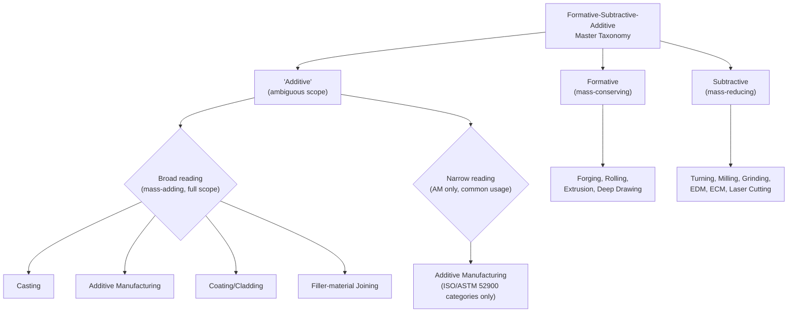

## Formative, Subtractive, and Additive as a Master Taxonomy

### Overview

This section synthesizes the chapter's mass-conservation partition (mass-conserving, mass-reducing, mass-adding, covered in the three prior sections) into its most widely encountered pedagogical expression: the **formative–subtractive–additive** three-way master taxonomy. This tripartite scheme is arguably the single most commonly cited high-level manufacturing process classification in contemporary engineering education and industry communication, particularly since the rise of additive manufacturing made "subtractive vs. additive" a common shorthand distinction. This section formalizes its relationship to the mass-conservation criterion and to the frameworks surveyed in the prior chapter.

### The Three-Way Master Taxonomy Defined

| Master Category | Mass-Conservation Correspondence | Core Mechanism | Representative Processes |
| --- | --- | --- | --- |
| **Formative (Forming)** | Mass-conserving | Plastic deformation redistributes existing material; no material added or removed | Forging, rolling, extrusion, deep drawing, bending, stamping |
| **Subtractive** | Mass-reducing | Material removed from a solid workpiece via mechanical, thermal, or chemical mechanisms | Turning, milling, drilling, grinding, EDM, laser cutting, ECM |
| **Additive** | Mass-adding | Material introduced from an external feedstock, building up the part | Casting, additive manufacturing (all seven ISO/ASTM 52900 categories), and — in broader usage — coating and filler-material joining |

**Key Points**

- This three-way taxonomy maps **almost, but not perfectly**, onto the mass-conservation partition established across this chapter's prior three sections: Formative corresponds cleanly to mass-conserving; Subtractive corresponds cleanly to mass-reducing; Additive corresponds to mass-adding, but with an important scope caveat addressed below.
- [Inference] The near-universal popularity of this specific three-way framing — considerably more common in casual industry and educational usage than the six-group DIN 8580 structure or any of the four textbook frameworks surveyed in the prior chapter — plausibly reflects both its mnemonic simplicity (three terms, easily contrasted) and its direct historical association with the additive-manufacturing-versus-conventional-manufacturing framing that became prominent following the AM standardization efforts covered earlier in this material, where "subtractive vs. additive" became a natural, widely adopted contrastive pair even before "formative" was consistently added as the third term to complete the set.

### The Scope Caveat: What "Additive" Means in the Master Taxonomy Versus the Mass-Adding Category

**Key Points**

- In casual and much pedagogical usage, the term **"Additive"** within this three-way master taxonomy is frequently used **narrowly**, referring specifically to layer-based additive manufacturing processes (the ISO/ASTM 52900 seven categories), rather than broadly to the entire mass-adding category defined in this chapter's prior section (which also includes casting, coating, and filler-material joining).
- This creates a genuine terminological ambiguity worth flagging explicitly: under the **broad** (mass-conservation-consistent) reading, "Additive" in this master taxonomy would include casting, coating, and welding alongside AM; under the **narrow** (common-usage) reading, "Additive" refers to AM alone, with casting typically folded into "Formative" in casual usage (despite casting being mass-adding, not mass-conserving, by the strict criterion) and welding/coating often left unaddressed by the three-way scheme entirely or treated as falling outside it.
- [Inference] This narrow, AM-specific usage of "Additive" is almost certainly a product of the taxonomy's historical popularization *alongside* AM's rise (as noted above) rather than a scheme independently derived from first-principles mass-conservation logic — meaning the master taxonomy, despite superficially appearing to be a physically grounded formative/subtractive/additive trichotomy, is in its most common popular usage actually a **hybrid** of the mass-conservation logic (for Formative and Subtractive) and an application-specific, historically contingent category (narrow "Additive" = AM only) rather than a fully consistent single-axis scheme. This section flags this inconsistency explicitly because it is a common source of confusion when the master taxonomy is applied casually without acknowledging which reading of "Additive" is in use.

### Diagram: The Master Taxonomy and Its Scope Ambiguity

### Reconciling the Master Taxonomy with the Prior Chapter's Frameworks

**Key Points**

- The master taxonomy's **Formative** category corresponds most directly to DIN 8580's Umformen and to Groover's/Kalpakjian's/DeGarmo's respective deformation-process families — this correspondence is clean and essentially uncontested across all systems surveyed.
- The master taxonomy's **Subtractive** category corresponds directly to DIN 8580's Trennen, to Groover's Material Removal Processes, to Kalpakjian's Machining family, and to DeGarmo's Machining stage — again, essentially clean correspondence, consistent with the physically unambiguous character of the subtractive category noted in the prior section.
- The master taxonomy's **Additive** category (under either the broad or narrow reading) is where the correspondence breaks down: under the broad reading, it spans DIN 8580's Urformen, Fügen, and Beschichten simultaneously (as established in the prior section's mass-adding discussion); under the narrow reading, it corresponds only to the AM-specific portion of DIN's interpretive Urformen extension and to ISO/ASTM 52900 directly, leaving casting (Urformen), coating (Beschichten), and filler joining (Fügen) unaddressed by the three-way scheme's "additive" label even though they share the same mass-direction characteristic.
- [Inference] This means the master taxonomy, despite its popularity and apparent simplicity, is **not a strict superset-simplification** of the mass-conservation partition established earlier in this chapter — it is better understood as the mass-conservation partition with its additive branch **narrowed by common usage** to emphasize the specific process family (AM) that made the three-way contrast culturally salient, rather than as a taxonomically complete restatement of all mass-adding processes.

### Practical Implications of the Scope Ambiguity

**Key Points**

- When encountering the phrase "formative, subtractive, and additive manufacturing" in industry or educational material, the specific intended scope of "additive" should be inferred from context: a discussion explicitly contrasting AM against conventional processes (a common framing following the AM emergence and standardization history covered earlier in this material) is almost certainly using the **narrow** reading; a discussion attempting genuine first-principles mass-conservation classification (as this chapter does) should use the **broad** reading for internal consistency.
- [Inference] Because the narrow reading is overwhelmingly more common in casual industry usage, a reader or writer using the master taxonomy without qualification should generally assume the narrow (AM-only) reading will be the audience's default interpretation, and should explicitly flag when using the broad reading to avoid the exact kind of translation ambiguity catalogued in the prior chapter's terminology-conflict section (Divergence 5, regarding "rapid prototyping" and related AM terminology confusion).
- This chapter's own prior three sections (mass-conserving, mass-reducing, mass-adding processes) deliberately use the **broad, physically consistent reading** throughout, and this section's master-taxonomy discussion should be understood as describing how that broad, physically grounded partition is **popularly narrowed** in common usage — not as evidence that the broad reading is incorrect or that this chapter's own terminology has been inconsistent.

### Example: Applying Both Readings to a Single Manufacturing Scenario

A manufacturer producing an aluminum housing might describe their process portfolio as spanning "formative, subtractive, and additive" methods: **die casting** (housing body), **CNC machining** (finish features), and **selective laser sintering** (a rapid-prototype variant produced before tooling commitment). Under the **narrow reading**, this description implicitly classifies die casting as neither purely formative nor purely additive (it is often loosely grouped with "formative" in casual usage despite being mass-adding), machining as subtractive (correctly and unambiguously), and SLS as additive (correctly, under either reading). Under the **broad reading**, die casting would be correctly reclassified as additive (mass-adding, sub-case 1, per the prior section), leaving "formative" in this scenario without a representative process at all unless a genuine deformation step (e.g., a stamped bracket) is also part of the product. [Inference] This example illustrates that the narrow reading's casual folding of casting into "formative" is a **misapplication relative to the strict mass-conservation criterion** this chapter established — a specific, identifiable inconsistency worth flagging for readers applying the master taxonomy rigorously rather than colloquially.

### Summary: The Master Taxonomy's Place in This Chapter's Framework

**Key Points**

- The formative–subtractive–additive master taxonomy is best understood as a **popularized, partially narrowed derivative** of the strict three-way mass-conservation partition this chapter establishes, valuable for its mnemonic simplicity and widespread recognition but requiring the scope caveat documented in this section for rigorous or cross-disciplinary use.
- For contexts requiring the physically precise, internally consistent version, this chapter's own mass-conserving/mass-reducing/mass-adding terminology (prior three sections) should be preferred; for contexts where audience familiarity and communicative efficiency are prioritized over strict physical precision, the formative-subtractive-additive master taxonomy (narrow reading) remains the more broadly recognized framing, consistent with the purpose-relative lens-selection approach established in the prior chapter's closing section.

**Related Topics**

- Resolving the formative/subtractive/additive ambiguity in cross-disciplinary technical writing
- Casting's classificatory position across the mass-conservation partition and the popular master taxonomy
- The historical role of AM standardization in popularizing the three-way master taxonomy
- Coating and filler-joining as "orphaned" categories under the narrow master-taxonomy reading
- Transitioning to process-selection methodology using the master taxonomy as a first-pass filter