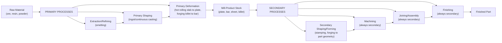

## Primary Versus Secondary Manufacturing Process Distinction

### Overview

This section introduces a classificatory axis orthogonal to both the mass-conservation partition (formative/subtractive/additive, covered in the prior sections) and the institutional/pedagogical frameworks surveyed in the earlier chapter: the distinction between **primary** and **secondary** manufacturing processes. Where mass-conservation asks "does mass change, and in which direction," the primary/secondary distinction asks a fundamentally different question — "does this process establish the workpiece's basic form from raw material, or does it refine a form that already exists?" This is a role-based (functional-sequence) axis, related to but distinct from DeGarmo's sequential-stage framework covered in the prior chapter.

### Defining Criterion

**Key Points**

- A **primary manufacturing process** converts raw material (ore, ingot, billet, resin pellet, powder feedstock) into a basic workable stock form or an initial near-final geometry — it establishes the fundamental starting condition from which further manufacturing proceeds.
- A **secondary manufacturing process** takes an already-processed stock form or primary-process output and further shapes, refines, joins, or finishes it into the final part geometry and condition.
- This is fundamentally a **role-in-sequence** distinction rather than a mechanism-based one (contrast with the mass-conservation axis) or a material-based one (contrast with Kalpakjian's framework) — the same physical mechanism can appear as either primary or secondary depending on what stage of the overall material-to-part journey it occupies in a given production sequence.

### Primary Processes: Establishing Raw Stock and Initial Form

| Primary Process Category | Function | Representative Examples |
| --- | --- | --- |
| **Metal Extraction/Refining** | Converts ore into usable base metal | Smelting, refining (often considered "primary" in the broadest sense, upstream of manufacturing proper) |
| **Primary Shaping from Melt/Powder** | Converts refined material into basic stock or near-final geometry | Ingot casting, continuous casting, powder atomization (feedstock production) |
| **Primary Deformation Processing** | Converts cast ingots/billets into workable mill-product stock forms | Primary hot rolling (slab/bloom to plate/sheet/bar), primary forging (cogging/blooming) |
| **Primary Polymer Processing** | Converts raw resin into pellet or sheet stock | Polymerization, initial extrusion into pellet form |

**Key Points**

- The term "primary" in this section's usage spans a **broader scope** than any single process family discussed in the mass-conservation sections — it includes primary shaping (which is mass-adding, per the prior section's sub-case 1) and primary deformation (which is mass-conserving) as equally valid instances of "primary," since the primary/secondary axis classifies by **sequence role**, not by mass direction.
- [Inference] This cross-cutting relationship to the mass-conservation axis (a primary process can be either mass-conserving or mass-adding, depending on which specific operation is meant) is itself evidence that primary/secondary is a genuinely orthogonal classificatory dimension, consistent with this chapter's broader pattern of introducing physically/functionally distinct axes rather than restating the same partition under new names.
- The primary/secondary boundary is sometimes drawn even further upstream than manufacturing proper — **metal extraction and refining** (smelting iron ore into pig iron, for instance) is sometimes classified as "primary processing" in a metallurgical or materials-science sense that precedes what manufacturing engineering texts typically consider the start of the manufacturing process chain; this section notes that usage but focuses primarily on the manufacturing-engineering sense of primary (raw/refined material to basic stock or initial geometry) rather than the upstream metallurgical-extraction sense.

### Secondary Processes: Refining Toward Final Part Geometry

| Secondary Process Category | Function | Representative Examples |
| --- | --- | --- |
| **Secondary Shaping/Forming** | Converts mill-product stock into part-specific geometry | Forging (part-specific, using billet stock), sheet metal stamping, deep drawing, extrusion of final profiles |
| **Machining** | Refines geometry/tolerance from a near-net or stock form | Turning, milling, drilling, grinding (essentially always secondary, since it presupposes an existing workpiece per the subtractive category defined earlier in this chapter) |
| **Joining/Assembly** | Combines multiple secondary-processed (or primary) components | Welding, brazing, mechanical fastening |
| **Finishing** | Final surface/property refinement | Plating, painting, heat treatment, polishing |

**Key Points**

- **Machining is essentially always classified as secondary** under this distinction, since by definition (per the subtractive-processes section earlier in this chapter) it presupposes an already-solid workpiece to remove material from — there is no meaningful "primary machining" category analogous to primary casting or primary rolling, making machining one of the cleaner unambiguous cases in this classification.
- **Joining and finishing operations are likewise essentially always secondary**, since they by definition act on already-existing discrete parts or already-shaped components — this parallels the observation made in the prior chapter's agreements section that joining/assembly is consistently treated as categorically distinct from single-workpiece shaping across all systems surveyed, here reinforced by the primary/secondary sequence logic specifically.
- **Casting and forming/deformation are the two mass-conservation categories that can be either primary or secondary** depending on context, which is the source of most of the genuine classificatory nuance in this distinction: primary casting (ingot casting) establishes basic stock; secondary casting (investment casting a specific near-net-shape part) produces final or near-final part geometry directly; primary rolling (slab to plate) establishes mill-product stock; secondary forming (stamping that plate into a final part shape) produces the finished component geometry.

### Diagram: Primary/Secondary Process Sequence

### Boundary Cases and Nuances

**Key Points**

- **Near-net-shape and net-shape primary processes** (e.g., investment casting, precision forging) deliberately blur the primary/secondary boundary by design: their explicit engineering purpose is to produce a part close enough to final geometry that little or no secondary machining is required — meaning a single process instance can simultaneously perform what would traditionally be considered both a primary function (establishing form from raw/molten material) and much of what secondary processes typically accomplish (achieving near-final geometry), directly connecting to this chapter's earlier observation (in the mass-conserving processes section) that net-shape processes are valued specifically for minimizing subsequent non-mass-conserving finishing operations.
- **Additive manufacturing occupies an unusual position** in this distinction: an AM build is unambiguously primary in the sense that it establishes part geometry directly from raw feedstock (powder, resin, filament) with no intervening mill-product stock stage — in this respect, AM structurally resembles net-shape/near-net-shape primary casting more than it resembles conventional multi-stage primary-then-secondary metal processing routes. [Inference] This positions AM as, in some sense, collapsing the traditional primary/secondary distinction for a given part into a single primary-equivalent step, followed only by whatever secondary finishing (machining, heat treatment) the application requires — a structural parallel worth noting given this chapter's repeated observation that AM tends to resist clean placement within taxonomies developed before its emergence.
- **Recycled/reprocessed material feedstocks** introduce a further nuance: material recycled from scrap (e.g., machining swarf remelted into new ingot stock) re-enters the primary process chain at the extraction/refining or primary-shaping stage even though it originated from a secondary (machining) operation elsewhere in the material lifecycle — illustrating that "primary" and "secondary" describe a role within a *specific* production sequence rather than an immutable property of a material or process in the abstract.

### Relationship to Frameworks Surveyed Previously

**Key Points**

- This primary/secondary distinction bears a structural resemblance to DeGarmo's sequential-stage framework (covered in the prior chapter) in that both are organized around process **order**, but the two are not equivalent: DeGarmo's four stages (Shaping, Machining, Joining, Finishing) describe the sequence a **single part** typically passes through during its own manufacture, whereas primary/secondary describes the broader **material supply chain** distinction between converting raw material into workable stock versus converting that stock into a specific finished part — DeGarmo's "Shaping" stage, for instance, can itself be either a primary process (if performed directly on raw/molten material to near-final geometry) or a secondary process (if performed on already-existing mill-product stock), meaning the two axes are related but not interchangeable.
- [Inference] Because primary/secondary and DeGarmo's sequential staging both involve an ordering logic but classify by different scopes (material supply chain vs. single-part production route), a complete process-planning description of a real manufacturing operation often benefits from applying both axes together — identifying whether a given operation is primary or secondary within the broader material supply chain, and separately, which DeGarmo-style stage (shaping/machining/joining/finishing) it represents within the specific part's own production sequence.

### Example: Tracing an Automotive Crankshaft Through Both Axes

Raw steel ore is smelted and refined (**primary**, extraction/refining), continuously cast into billet form (**primary**, primary shaping — also mass-adding per this chapter's earlier partition), then hot-forged into a basic bar stock profile (**primary**, primary deformation — mass-conserving). This bar stock is then die-forged into the specific crankshaft rough geometry (**secondary**, secondary shaping/forming — also mass-conserving, illustrating that primary and secondary deformation processes share identical mass-conservation status despite occupying different sequence roles). The rough forging is then CNC-machined to final journal and bearing surface tolerances (**secondary**, machining — mass-reducing), and finally induction-hardened at critical wear surfaces (**secondary**, finishing/property-change — mass-conserving). This single-part trace illustrates both that primary and secondary processes can share identical mass-conservation status (the two forging steps) and that the primary/secondary axis provides genuine additional classificatory information beyond mass-conservation alone — the two forging operations are physically similar in mechanism but occupy structurally different roles in the overall material-to-part journey.

**Related Topics**

- Net-shape and near-net-shape processes as a design strategy bridging primary and secondary process roles
- Material recycling and its re-entry point into the primary process chain
- Comparing the primary/secondary axis to DeGarmo's sequential-stage framework in combined process-planning documentation
- Additive manufacturing's collapse of the traditional primary-then-secondary metal processing route
- Mill-product stock forms (plate, bar, sheet, billet) as the primary/secondary boundary artifact