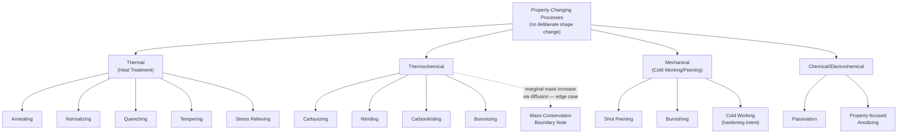

## Property-Changing Processes Without Shape Change

### Overview

This section examines the category of manufacturing processes that alter a workpiece's internal properties — microstructure, hardness, residual stress state, or grain structure — without deliberately changing its macroscopic geometry. This category corresponds to DIN 8580's Stoffeigenschaftändern main group and to the "property-enhancing processes" sub-category identified across the frameworks surveyed earlier, but this section examines it through this chapter's physical-mechanism lens, connecting it explicitly to the mass-conservation and primary/secondary axes established in the prior sections.

### Defining Criterion

**Key Points**

- A **property-changing process** deliberately alters one or more internal material properties of a workpiece — hardness, strength, ductility, grain size, phase composition, residual stress distribution — through thermal, mechanical, or chemical means, while intentionally leaving the part's macroscopic geometry unchanged (within normal dimensional tolerances; minor dimensional changes such as quench distortion or slight scale formation are typically treated as unintended side effects rather than the process's purpose).
- This criterion places property-changing processes firmly within the **mass-conserving** category established earlier in this chapter (no material is added or removed as a deliberate function of the process, though minor surface oxidation/scaling in some thermal processes represents a small, generally undesired mass change) and firmly within the **secondary process** category established in the prior section (property-changing processes always act on an already-shaped workpiece; there is no "primary" analog, since raw material by definition has not yet been given the specific geometry whose properties would be subsequently modified).
- The defining distinction from **shape-changing mass-conserving processes** (forging, rolling, bending — covered in this chapter's mass-conserving section) is that property-changing processes deliberately hold geometry constant while modifying internal state, whereas formative processes deliberately modify geometry while (in most engineering analyses) treating internal-property change as a secondary consequence rather than the primary objective.

### Major Sub-Categories by Mechanism

| Sub-Category | Mechanism | Representative Processes |
| --- | --- | --- |
| **Thermal (Heat Treatment)** | Controlled heating and cooling cycles altering phase composition and microstructure | Annealing, normalizing, quenching, tempering, stress relieving |
| **Thermochemical** | Diffusion of chemical elements into the surface combined with thermal cycling | Case hardening (carburizing, nitriding, carbonitriding), boronizing |
| **Mechanical (Cold Working / Strain Hardening)** | Plastic deformation at a scale too small to be considered a shape-change process, inducing strain hardening | Shot peening, burnishing, cold rolling used specifically for surface hardening rather than gross shape change |
| **Chemical/Electrochemical Property Modification** | Controlled chemical reaction altering surface composition or structure | Passivation, certain anodizing treatments (when property change, e.g., corrosion resistance, is the primary intent rather than coating buildup) |

**Key Points**

- **Thermal heat treatment** is the paradigm and most extensively documented sub-category: annealing softens and relieves internal stress by heating to a specific temperature range and cooling slowly; quenching rapidly cools from an elevated temperature to achieve a hardened phase structure (e.g., martensite formation in steel); tempering follows quenching with a controlled reheat to reduce brittleness while retaining much of the hardness gain; normalizing refines grain structure via air cooling from an elevated temperature, typically producing more uniform properties than the as-cast or as-forged condition.
- **Thermochemical processes** (case hardening variants) occupy a genuinely interesting boundary position relative to this chapter's mass-conservation axis: they involve the **diffusion of additional chemical elements** (carbon in carburizing, nitrogen in nitriding) into the workpiece's surface region, meaning a small mass increase does technically occur — however, because this mass addition is at the level of individual diffusing atoms rather than a deposited bulk layer, and because the process's primary engineering purpose is a localized property change (surface hardness) rather than geometric or bulk-mass alteration, thermochemical processes are conventionally still grouped with property-changing (mass-conserving-in-practice) processes rather than with the mass-adding coating category — [Inference] this represents a genuine edge case where the strict mass-conservation criterion established earlier in this chapter would technically classify thermochemical processes as marginally mass-adding, while conventional engineering practice classifies them by primary intent (property change) rather than by strict mass-direction, illustrating a tension between rigorous physical classification and practical/conventional categorization that this chapter has noted in other boundary cases as well (e.g., blanking/shearing in the subtractive-processes section).
- **Mechanical property-changing processes** (shot peening, burnishing) introduce compressive residual stress at the surface through controlled, localized plastic deformation — importantly, this deformation is deliberately kept small enough and localized enough that it does not constitute a "shape-changing" forming operation in the sense discussed in this chapter's mass-conserving processes section, even though the underlying physical mechanism (plastic deformation) is identical in kind, if not in scale and intent, to bulk forming operations like forging.

### Diagram: Property-Changing Process Sub-Classification

### Relationship to Mass-Conservation and Primary/Secondary Axes

**Key Points**

- Property-changing processes occupy a distinctive position at the intersection of this chapter's two organizing axes: they are (with the thermochemical edge case noted above) essentially uniformly **mass-conserving**, and they are essentially uniformly **secondary** (per the prior section's criterion, since they always act on an already-shaped workpiece).
- This dual uniformity distinguishes property-changing processes from every other category surveyed in this chapter: subtractive processes are uniformly mass-reducing but can theoretically occur at various points in a sequence (though typically secondary); mass-adding processes span both primary and secondary sub-cases (per the mass-adding section's two-sub-case structure); formative (mass-conserving, shape-changing) processes span both primary and secondary roles (per the prior section's crankshaft example, tracing primary and secondary forging operations); but property-changing processes are consistently both mass-conserving AND secondary, with no primary-process analog and no meaningful mass-adding sub-variant (setting aside the thermochemical edge case).
- [Inference] This consistent double-classification (always mass-conserving, always secondary) may explain why property-changing processes, despite DIN 8580 elevating them to full co-equal main-group status (Stoffeigenschaftändern), receive comparatively less structural prominence in several of the other frameworks surveyed in the prior chapter (Groover's minor "Property-Enhancing Processes" sub-category, Kalpakjian's per-material discussion without independent top-level status, DeGarmo's edition-dependent folding into the Finishing stage) — a process category that is always secondary and never geometrically transformative may be perceived by textbook authors as less central to "process selection" decision-making (which frequently centers on achieving target geometry) than the shape-defining and material-removal categories that dominate most process-selection literature, even though property-changing processes are frequently critical to a part's final functional performance.

### Practical Engineering Significance

**Key Points**

- Despite receiving comparatively less structural prominence across several frameworks (as noted above), property-changing processes are frequently **functionally essential** to a part meeting its final performance requirements — a correctly machined and geometrically toleranced steel component that has not received appropriate heat treatment may be entirely unsuitable for its intended service (e.g., a gear tooth without case hardening, or a structural component without stress relief following welding, where residual stresses from the welding process itself are specifically addressed by a subsequent property-changing operation).
- **Sequencing property-changing processes correctly relative to machining** is a frequently significant practical consideration: hardening a part before final machining can make the material difficult or impossible to machine economically (motivating "machine-then-harden" sequences for many hardened steel components), while hardening after machining risks quench distortion affecting the already-achieved tolerances (motivating specific process-planning strategies such as leaving machining stock for a final light finishing pass after heat treatment, or using distortion-minimizing quenching techniques) — this sequencing consideration directly connects property-changing processes to the primary/secondary and sequential-staging discussions from this chapter and the prior chapter (DeGarmo's framework specifically), since the *order* in which property-changing and machining operations occur is often as engineering-critical as the individual operations themselves.

### Example: Heat Treatment Sequencing in a Hardened Steel Shaft

A steel shaft requiring both close dimensional tolerances and high surface hardness at bearing journals illustrates the sequencing consideration directly: the shaft is typically machined close to final dimensions in its softer, pre-hardened (annealed or normalized) condition, since machining hardened steel is considerably more difficult and tool-wear-intensive; it is then case-hardened (a thermochemical property-changing process) at the specific journal locations requiring wear resistance; and finally, a light finish-grinding pass (a subtractive, secondary process, using abrasive machining per this chapter's earlier subtractive-processes section) removes the small dimensional changes introduced by the hardening process's thermal cycle, achieving final tolerance. This sequence — rough machine → property-change (harden) → finish machine — is a canonical illustration of how a property-changing process is deliberately interleaved with, rather than simply appended after, machining operations in real production sequences, refining the simpler shape-then-machine-then-property-change ordering that a purely linear DeGarmo-style sequential model might initially suggest.

**Related Topics**

- Quench distortion and its implications for process sequencing around heat treatment
- The thermochemical mass-conservation edge case and its treatment across different classification traditions
- Residual stress management via stress relieving following welding or machining operations
- Shot peening and surface compressive stress engineering for fatigue-life improvement
- Comparing property-changing processes' structural prominence across DIN 8580 and the textbook frameworks surveyed in the prior chapter