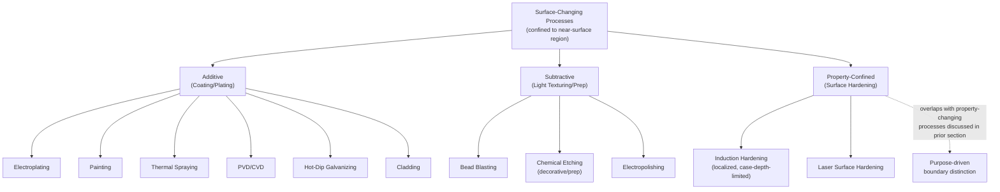

## Surface-Changing Processes Without Bulk Shape Change

### Overview

This section examines processes that modify a workpiece's surface — composition, texture, or applied layer — while leaving the bulk geometry and bulk internal properties substantially unaltered. This category corresponds to DIN 8580's Beschichten main group and overlaps partially with the mass-adding category's "Surface Application" sub-classification established earlier in this chapter, but is treated here as its own distinct topic because surface-changing processes span both the mass-adding and mass-conserving partitions — a genuinely mixed classificatory position that distinguishes this category from the property-changing processes examined in the prior section, which were shown there to be almost uniformly mass-conserving.

### Defining Criterion

**Key Points**

- A **surface-changing process** deliberately modifies the outermost region of a workpiece — through material addition (coating, cladding, plating), material removal at negligible bulk-mass scale (surface texturing via light etching or blasting), or surface-confined property alteration — without deliberately altering the part's overall bulk geometry or bulk internal microstructure.
- This category **overlaps with, but is not identical to**, the "Surface Application to an Existing Substrate" sub-classification introduced in this chapter's mass-adding section: that earlier discussion focused specifically on mass-adding surface processes (electroplating, painting, thermal spraying, PVD/CVD, cladding); this section additionally captures surface-changing processes that are **not** mass-adding — specifically, light abrasive or chemical surface treatments that remove negligible material for texturing or preparation purposes rather than adding a layer.
- The unifying criterion is therefore **spatial confinement to the surface region**, independent of mass direction — distinguishing this category from the property-changing processes discussed in the prior section, which act (in the case of most heat treatment) throughout the bulk of the material or a substantial cross-section, versus surface-changing processes, which are deliberately confined to a thin near-surface region.

### The Mixed Mass-Direction Character of This Category

| Sub-Type | Mass Direction | Representative Processes |
| --- | --- | --- |
| **Additive Surface Treatment (Coating)** | Mass-adding | Electroplating, painting, thermal spraying, PVD/CVD, cladding, hot-dip galvanizing |
| **Subtractive Surface Treatment (Light Texturing/Prep)** | Mass-reducing (negligible bulk effect) | Light bead blasting, chemical surface etching (decorative/prep), electropolishing |
| **Surface-Confined Property Modification** | Mass-conserving (or negligible thermochemical mass gain) | Localized induction hardening (surface-only, as distinct from through-hardening), some laser surface treatments |

**Key Points**

- This table's three-way sub-division makes explicit what distinguishes surface-changing processes from every other category examined in this chapter so far: this is the **first category whose members span all three mass-direction outcomes** (adding, reducing, and conserving) established in this chapter's opening sections, whereas formative processes were uniformly mass-conserving, subtractive processes were uniformly mass-reducing, and property-changing processes (prior section) were essentially uniformly mass-conserving.
- [Inference] This mixed character is a direct consequence of the category's defining criterion being **spatial** (confined to the surface) rather than **directional** (a specific mass-change direction) — surface-changing processes are unified by *where* they act on the workpiece, not by *how* they change its mass, making this the first genuinely cross-cutting category relative to the mass-conservation axis established at this chapter's outset, in a stronger sense than even the mass-adding category's internal sub-case diversity (covered earlier), since mass-adding processes were at least uniformly directional even while spanning two structural sub-cases.
- The **Surface-Confined Property Modification** sub-type (localized/case-depth-limited induction hardening, laser surface hardening) overlaps directly with the thermochemical processes discussed in the prior section's property-changing material — this overlap is intentional and reflects a genuine ambiguity in whether a given surface-hardening process is better classified as a "property-changing process" (prior section's emphasis) or a "surface-changing process" (this section's emphasis); [Inference] the distinguishing consideration is typically whether the process's engineering purpose is framed around bulk-adjacent property modification at a specified case depth (favoring the property-changing framing) or around surface condition/texture/appearance more broadly (favoring the surface-changing framing) — a purpose-driven rather than mechanism-driven distinction, consistent with similar purpose-driven boundary ambiguities noted elsewhere in this chapter (e.g., cladding versus repair-oriented AM in the mass-adding section).

### Diagram: Surface-Changing Process Sub-Classification by Mass Direction

### Major Sub-Category Detail: Additive Surface Treatments

**Key Points**

- **Electroplating** deposits a metallic layer via electrochemical reduction, commonly used for corrosion resistance (zinc, chromium plating), wear resistance (hard chrome), or decorative/functional finish (nickel, gold plating for electrical contacts).
- **Thermal spraying** (flame spray, plasma spray, HVOF — high-velocity oxy-fuel) propels molten or semi-molten particles onto a substrate, building a mechanically bonded (rather than metallurgically fused, in most conventional thermal spray variants) coating layer, commonly used for wear-resistant or thermal-barrier coatings in demanding applications such as turbine components.
- **PVD (physical vapor deposition) and CVD (chemical vapor deposition)** produce very thin (typically sub-micron to few-micron) functional coatings via vapor-phase deposition mechanisms, widely used for cutting tool coatings (titanium nitride and related hard coatings) and for decorative/functional thin films in electronics and optics.
- **Cladding**, as noted in this chapter's mass-adding section, sits at a boundary between coating (broad, relatively thin functional layer) and the mass-adding joining/repair category — its inclusion here as a surface-changing process reflects its shared spatial-confinement characteristic with the other coating processes in this sub-category, even while its underlying deposition mechanism (often the same DED or arc-welding-based processes discussed in this chapter's mass-adding section) is shared with processes discussed there under a different organizing emphasis.

### Major Sub-Category Detail: Subtractive Surface Treatments

**Key Points**

- **Bead blasting and similar abrasive blast processes** remove a negligible bulk mass of material while producing a specific surface texture (matte finish, controlled roughness for subsequent coating adhesion, or cosmetic uniformity) — the mass removed is typically orders of magnitude smaller than in conventional subtractive machining (covered in this chapter's subtractive-processes section), reflecting this sub-category's texture/preparation purpose rather than a geometry-defining purpose.
- **Electropolishing** uses controlled electrochemical dissolution to selectively remove microscopic surface asperities, producing a smoother, often more corrosion-resistant surface — mechanistically related to electrochemical machining (ECM, discussed in this chapter's subtractive-processes section) but applied at a vastly smaller material-removal scale and with a surface-quality rather than geometry-defining objective.
- [Inference] The shared mechanism between these light subtractive surface treatments and the bulk subtractive processes discussed earlier in this chapter (blasting relates to abrasive machining; electropolishing relates to ECM) illustrates that the surface-changing category is not defined by a mechanistically distinct set of physical principles from the bulk mass-conservation categories established earlier — rather, it represents the **same underlying mechanisms applied at a different spatial scale and with a different engineering objective** (surface condition rather than bulk geometry), reinforcing this section's earlier point that the surface-changing category's defining criterion is spatial/purpose-based rather than mechanism-based.

### Relationship to Frameworks Surveyed in the Prior Chapter

**Key Points**

- This section's category corresponds most directly to DIN 8580's **Beschichten** main group, though DIN's group definition (per the prior chapter's DIN 8580 section) is specifically framed around applying a layer of formless material to a substrate — meaning DIN's Beschichten does not natively include this section's subtractive surface-treatment sub-type (bead blasting, electropolishing), which would more likely fall under DIN's Trennen (as a light material-removal process) despite sharing this section's surface-confinement characteristic with genuine coating processes.
- Groover's **Surface Processing Operations** sub-category (within Processing Operations, alongside Shaping and Property-Enhancing) is structurally the closest match among the frameworks surveyed in the prior chapter to this section's full scope, since Groover's category is explicitly defined broadly enough to include cleaning, surface treatment, and coating together — though Groover's treatment, as noted in the prior chapter's Groover section, receives comparatively minor structural prominence relative to the Shaping Processes sub-category.
- [Inference] This section's broader, mass-direction-spanning definition of "surface-changing" (encompassing additive, subtractive, and property-confined sub-types under a single spatial criterion) is a genuinely novel synthesis relative to any single framework surveyed in the prior chapter — no prior system examined in this material organizes surface treatments primarily by their shared spatial confinement while explicitly acknowledging their divergent mass-direction characteristics; this reflects the present chapter's broader methodological approach of applying physically grounded, cross-cutting criteria (mass conservation, primary/secondary role, spatial confinement) rather than adopting any single pre-existing framework's category boundaries wholesale.

### Example: A Multi-Treatment Automotive Fastener

A steel bolt intended for automotive underbody use illustrates this category's internal diversity directly: the bolt is first **bead blasted** (subtractive surface treatment, negligible mass loss, preparing surface roughness for subsequent coating adhesion), then **zinc electroplated** (additive surface treatment, corrosion protection), and finally may receive a **localized induction-hardened** thread region if high fatigue resistance is required at the load-bearing threads (property-confined surface treatment). All three operations act exclusively on the bolt's surface region, leave its bulk geometry and bulk core microstructure essentially unchanged, and — per this section's central finding — span all three mass-direction categories established at this chapter's outset, despite being grouped together here under the single unifying criterion of surface confinement.

**Related Topics**

- Coating adhesion mechanics and the role of surface preparation (blasting, etching) prior to deposition
- PVD/CVD thin-film coatings for cutting tool wear resistance
- The boundary between surface-confined property modification and bulk heat treatment (case depth as a distinguishing parameter)
- Cladding's dual classification under mass-adding (joining/repair) and surface-changing (coating) categories
- Corrosion-resistant coating selection (electroplating, hot-dip galvanizing, thermal spray) by service environment