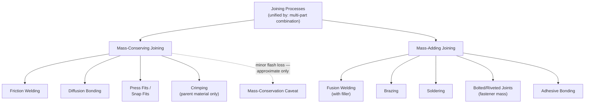

## Joining as a Multi-Part Category

### Overview

This section examines joining — the combination of two or more discrete workpieces into a single assembly — as a category unified by its **multi-part** character rather than by a single mass-conservation status. This is a necessary correction to a common simplification: joining is sometimes loosely characterized as "mass-conserving" by analogy to forming, but this chapter's own mass-adding section already established that filler-material joining processes (fusion welding, brazing, soldering) are mass-adding, not mass-conserving. This section treats joining rigorously, showing it spans two mass-conservation categories, unified instead by the multi-part criterion first noted in the prior chapter's agreements section.

### Defining Criterion: Multi-Part, Not Mass-Conserving

**Key Points**

- A **joining process** combines two or more previously separate, independently existing solid components into a single connected assembly, corresponding to DIN 8580's Fügen main group and to the joining/assembly categories identified across every framework surveyed in the prior chapter's comparative sections.
- The **unifying criterion is multiplicity of starting parts**, not mass direction: unlike the property-changing category (prior sections, essentially uniformly mass-conserving) or the subtractive category (uniformly mass-reducing), joining processes span both mass-conserving and mass-adding outcomes depending on whether filler material is introduced at the joint.
- This directly extends the mass-adding section's finding: filler-material joining (fusion welding, brazing, soldering) was classified there as mass-adding sub-case 2 (material added to existing workpieces); this section adds the complementary observation that filler-free joining (friction welding, diffusion bonding, many forms of mechanical fastening without a separate fastener component) is mass-conserving — the two together mean joining, as a category, cannot be assigned a single mass-conservation status without loss of accuracy.

### Sub-Classification by Mass Conservation Status

| Joining Sub-Type | Mass Status | Representative Processes |
| --- | --- | --- |
| **Filler-Material Joining** | Mass-adding | Fusion welding (with filler rod/wire), brazing, soldering |
| **Filler-Free Fusion/Solid-State Joining** | Approximately mass-conserving (minor flash loss) | Friction welding, diffusion bonding, cold pressure welding, some autogenous (filler-free) fusion welding |
| **Mechanical Joining Without Added Fastener** | Mass-conserving | Press fits, snap fits, crimping (of the parent parts themselves), certain forms of interference fitting |
| **Mechanical Joining With Added Fastener** | Mass-adding (fastener mass) | Bolted/screwed joints, riveting |
| **Adhesive Bonding** | Mass-adding (adhesive mass) | Structural and non-structural adhesive joints |

**Key Points**

- This five-way table refines the two-way mass distinction into practical joining sub-types, showing that even within "mechanical joining" — often treated as a single category by frameworks like Groover (per the prior chapter's Groover section) — mass status diverges depending on whether the mechanism itself introduces new mass (a bolt, a rivet, an adhesive layer) or merely reconfigures the existing parts' geometry to interlock them (a press fit, a crimped joint using only the parent material).
- [Inference] This finding is consistent with — and extends — the prior chapter's Divergence 3 (granularity of the joining/assembly category varies sixfold across systems): the mass-conservation sub-analysis presented here shows that even a single system's joining category, however granular, typically does not organize its subgroups along the mass-conservation axis at all (DIN 8593's six subgroups, for instance, organize by joining mechanism — primary shaping, forming, filling, pressing-in, welding, adhesive bonding — not by whether mass is added), meaning this section's mass-based cross-cut produces a genuinely different sub-grouping than any single joining taxonomy examined previously in this material.

### Diagram: Joining's Mass-Conservation Divergence

### Why "Mass-Conserving" Is an Inaccurate General Label for Joining

**Key Points**

- The intuitive analogy sometimes drawn between joining and forming — both are neither purely additive like casting/AM nor purely subtractive like machining, so both might casually be assumed "mass-conserving" — breaks down on closer inspection specifically because **forming acts on a single workpiece** (mass conservation is trivially satisfied, since there is only one mass to track and no external material enters), whereas **joining, by definition, brings together multiple starting masses**, and whether a *net* additional mass (beyond the sum of the joined parts) enters the system depends entirely on whether a filler, fastener, or adhesive is used.
- [Inference] This distinction matters because "mass-conserving" implies a specific, verifiable physical claim (final mass equals initial mass, per this chapter's opening definition), and applying that label to joining as a whole would misrepresent a majority of common industrial joining processes — fusion welding, brazing, soldering, bolting, riveting, and adhesive bonding (arguably the five most commonly encountered joining methods in general manufacturing) are all mass-adding, while only the comparatively less common filler-free and fastener-free methods (friction welding, diffusion bonding, press/snap fits) are mass-conserving.
- This section's correction is therefore not a minor terminological quibble but a substantive accuracy issue: characterizing joining as "mass-conserving" would contradict this chapter's own mass-adding section (which explicitly and correctly classified filler-material joining as mass-adding) and would misdescribe the physical reality of the most common joining processes encountered in practice.

### The Genuine Unifying Characteristic: Multi-Part Combination

**Key Points**

- Because mass conservation does not unify joining, the category's actual unifying characteristic — consistent with the prior chapter's Agreement 3 (joining/assembly consistently treated as categorically distinct from single-workpiece shaping across all systems surveyed) — is the **multi-part** criterion: joining processes are defined by combining two or more previously independent workpieces, a structural criterion entirely orthogonal to mass direction.
- This multi-part criterion connects directly to the **primary/secondary distinction** established earlier in this chapter: joining processes were noted there as "essentially always secondary," since they by definition require pre-existing discrete parts to combine — this remains true regardless of a given joining process's mass-conservation status, reinforcing that the multi-part/secondary characterization is the more robust and consistent classificatory anchor for this category than mass direction is.
- [Inference] The combination of "always secondary" (per the primary/secondary section) and "mixed mass-conservation status" (this section) together suggest that joining is best understood within this chapter's overall framework as a category defined primarily by its **structural role** (combining discrete parts, always downstream in a production sequence) rather than by any single physical-mechanism criterion (mass direction) — distinguishing it from subtractive processes (unified by mass direction) and more closely paralleling the primary/secondary axis's role-based logic than the mass-conservation axis's direction-based logic.

### Interfacial Engineering as a Cross-Cutting Concern Independent of Mass Status

**Key Points**

- Regardless of mass-conservation sub-type, all joining processes share a common engineering concern absent from single-workpiece processes: the **interface** between the joined parts must be engineered for adequate mechanical strength, and frequently for corrosion resistance, thermal performance, or electrical conductivity depending on application — this concern applies identically to mass-adding fusion welding and to mass-conserving friction welding, reinforcing that mass status, while a valid and useful classificatory dimension (per this chapter's methodology), does not correlate with the engineering concerns that most directly drive joining process selection in practice.
- [Inference] This suggests that for practical joining-process-selection purposes, criteria such as dissimilar-material compatibility, joint accessibility, required joint strength, and thermal input control are likely more directly decision-relevant than the mass-conservation status examined in this section — the mass-conservation lens remains valuable for this chapter's taxonomic purposes (demonstrating that joining cross-cuts the chapter's primary organizing axis) but should not be mistaken for a practical process-selection heuristic in its own right.

### Example: Contrasting Two Joining Methods for the Same Application

Consider joining two steel brackets: **MIG welding with filler wire** adds measurable mass at the joint (weld bead material, mass-adding, per this section's classification), while **friction stir welding** of the same two brackets (a solid-state, filler-free process) produces a joint through plasticized material mixing at the interface without introducing external filler mass (mass-conserving, modulo minor flash expulsion). Both processes satisfy the multi-part criterion identically — two previously separate brackets become one assembly — and both are equally "secondary" per this chapter's primary/secondary axis, illustrating directly that the choice between these two real joining methods is not meaningfully informed by their differing mass-conservation status, but rather by the interfacial engineering, material compatibility, and process-capability considerations noted above.

**Related Topics**

- Filler-free versus filler-material joining process selection criteria
- DIN 8593's six-subgroup joining taxonomy compared against this section's mass-based cross-cut
- Interfacial mechanics and joint strength engineering across dissimilar joining mechanisms
- Correcting common simplifications in cross-cutting process taxonomy (the forming/joining mass-conservation analogy)
- Revisiting the prior chapter's Agreement 3 and Divergence 3 in light of this section's mass-conservation sub-analysis