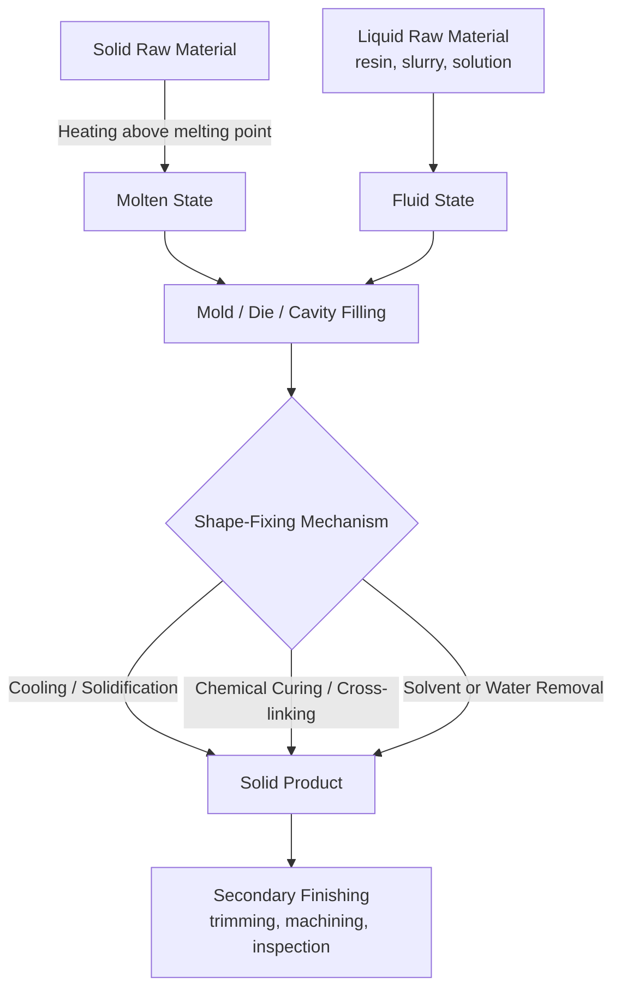

## Liquid and Molten Starting-Material Processes

### Definition and Scope

Liquid and molten starting-material processes are a category within the classification of manufacturing processes by the physical state of the input material. In this classification scheme, a raw material that begins the process as a liquid (at or near room temperature) or as a molten substance (a solid converted to liquid via heating, typically above its melting point) is transformed into a solid, semi-solid, or shaped finished product. This stands in contrast to solid-starting-material processes (machining, forging, powder metallurgy) and gas-starting-material processes (chemical vapor deposition, gas carburizing).

The defining characteristic is that the material exhibits fluid behavior (no fixed shape, conforms to a container or mold, flows under gravity or applied pressure) at the point where it is introduced into the primary shaping operation. The transformation from liquid/molten to solid state (solidification, curing, or polymerization) is typically the mechanism by which the final shape is fixed.

### Key Points

- **Two sub-categories exist**: (1) processes starting from an inherently liquid material at ambient or moderate temperature (e.g., resins, slurries, solutions), and (2) processes starting from a material that is solid at room temperature but is melted (rendered molten) before processing (e.g., metals, glass, thermoplastics).
- **Shape generation mechanism**: shape is almost always imparted by a mold, die, or cavity that constrains the fluid, followed by a phase change (solidification, gelation, or cross-linking) that locks in the geometry.
- **Net-shape or near-net-shape capability**: because liquids conform precisely to cavity geometry, these processes are well-suited to producing complex internal and external geometries in a single step, often reducing or eliminating secondary machining.
- **Volumetric shrinkage**: nearly all liquid/molten processes exhibit shrinkage during solidification (thermal contraction plus, in some cases, phase-change density differences), which must be compensated for in mold/die design.
- **Process control variables**: temperature (melt/pour temperature, mold temperature), viscosity, fluidity/flowability, cooling/curing rate, and pressure (gravity, centrifugal, or applied) dominate process control.

### Major Process Families

#### 1. Metal Casting (Molten Starting Material)

Metal casting converts a solid metal into a molten state via furnace melting, then pours or forces the molten metal into a mold cavity where it solidifies into the desired shape.

**Sub-classifications by mold type:**

- **Expendable-mold casting**: the mold is destroyed to remove the casting.
  - Sand casting
  - Investment casting (lost-wax process)
  - Shell mold casting
  - Plaster mold casting
  - Lost-foam casting (evaporative pattern casting)
- **Permanent-mold casting**: the mold is reused for many cycles.
  - Gravity permanent mold casting
  - Die casting (high-pressure and low-pressure)
  - Centrifugal casting
  - Continuous casting (for semi-finished shapes such as billets, slabs, and strands)

**Example (Sand Casting Sequence):**

1. Pattern creation (wood, metal, or polymer, oversized for shrinkage allowance)
2. Mold preparation by packing sand around the pattern in a flask
3. Pattern removal, leaving a cavity
4. Core placement (if internal features are required)
5. Pouring molten metal at superheat temperature into the cavity via a gating system
6. Solidification and cooling
7. Shakeout, gating/riser removal, and finishing

**Example (Die Casting Parameters):**

Typical aluminum die casting: melt temperature around 660–710°C (aluminum alloys), injection pressures ranging from roughly 10–200 MPa depending on machine type (hot-chamber vs. cold-chamber), and cycle times often under a minute for small components. [Inference: exact pressures and cycle times vary substantially by alloy, part geometry, and machine specification, and should be confirmed against equipment/process datasheets.]

#### 2. Glass Forming (Molten Starting Material)

Glass is heated above its softening/working point (a viscous liquid rather than a sharply defined melting point, since glass is an amorphous, non-crystalline solid) and shaped while in a viscous, flowable state.

- **Blow molding** (glass bottles, containers)
- **Float glass process** (flat glass sheet formed by floating molten glass on a bed of molten tin)
- **Press molding** (glass tableware, lenses)
- **Fiber drawing** (glass fiber and fiber-optic cable manufacture)

**Float Glass Process Overview:**

Molten glass (~1000°C) flows continuously from a furnace onto a bath of molten tin (~600–1000°C along the bath length), where it spreads and levels under gravity and surface tension to form a flat sheet of uniform thickness before being cooled (annealed) and cut.

#### 3. Polymer Processing from Liquid/Molten Resins

- **Thermoplastic melt processes** (polymer pellets melted via heat and shear, then shaped):
  - Injection molding
  - Extrusion (profile, sheet, film, pipe)
  - Blow molding (extrusion blow molding, injection blow molding)
  - Rotational molding
- **Liquid thermoset/reactive polymer processes** (liquid resin cured via chemical cross-linking, not simple cooling):
  - Reaction injection molding (RIM)
  - Liquid resin casting (epoxy, polyurethane casting)
  - Resin transfer molding (RTM) and vacuum-assisted resin transfer molding (VARTM) for composites
  - Potting and encapsulation (electronics)

**Example (Injection Molding Cycle):**

1. Solid polymer pellets fed into a heated barrel
2. Screw rotation melts and homogenizes the polymer via heat and mechanical shear
3. Molten polymer injected under high pressure (commonly 35–140 MPa depending on material and part) into a closed, cooled mold
4. Packing/holding pressure applied to compensate for shrinkage during cooling
5. Cooling until the part is rigid enough to eject
6. Mold opens, part ejected

#### 4. Metal Powder-from-Melt and Additive Processes

- **Atomization** (gas or water atomization of molten metal streams to produce metal powders for powder metallurgy or additive manufacturing feedstock)
- **Metal additive manufacturing with molten feedstock**: directed energy deposition (DED) using wire feedstock melted by laser, electron beam, or arc; certain binder-free processes melt metal wire or powder layer by layer.

#### 5. Ceramic and Cement-Based Processes (Liquid/Slurry Starting Material)

- **Slip casting** (ceramic slurry poured into a porous plaster mold that absorbs water, leaving a solid shell)
- **Tape casting** (ceramic slurry cast into thin sheets for electronic substrates)
- **Concrete casting** (cementitious slurry poured into formwork and cured via hydration reaction)

#### 6. Chemical and Composite Liquid Processes

- **Fiber spinning from solution or melt** (synthetic textile fibers: melt spinning for nylon/polyester, wet/dry spinning for solution-based polymers such as acrylics)
- **Electroplating and electroforming** (metal deposited from an ionic solution onto a substrate, technically a liquid-to-solid transformation via electrochemical reduction)
- **Composite layup with liquid resin systems** (wet layup, prepreg curing, pultrusion)

**Example (Pultrusion):**

Continuous fiber reinforcement is pulled through a liquid resin bath, then through a heated die where the resin cures (cross-links) as the composite is continuously drawn (pulled) through, producing constant-cross-section profiles such as structural beams and rods.

### Process Comparison Table

| Process Family | Starting State | Shape-Fixing Mechanism | Typical Products |
| --- | --- | --- | --- |
| Sand/Investment Casting | Molten metal | Solidification (freezing) | Engine blocks, turbine blades |
| Die Casting | Molten metal | Rapid solidification under pressure | Automotive housings, brackets |
| Glass Blow/Float | Molten/viscous glass | Cooling below working point | Bottles, flat glass sheet |
| Injection Molding | Molten thermoplastic | Cooling below glass transition/melt temp | Consumer product housings |
| RIM/Resin Casting | Liquid reactive resin | Chemical cross-linking (curing) | Automotive panels, encapsulated electronics |
| Slip Casting | Ceramic slurry | Water absorption/drying | Sanitaryware, art ceramics |
| Concrete Casting | Cementitious slurry | Hydration reaction | Structural elements, precast panels |
| Fiber Spinning | Molten/solution polymer | Cooling or solvent removal | Textile and industrial fibers |

### Process Flow Diagram

### Governing Physical Principles

**Fluidity and viscosity:**

$$\eta = \frac{\tau}{\dot{\gamma}}$$

where $\eta$ is dynamic viscosity, $\tau$ is shear stress, and $\dot{\gamma}$ is shear rate. Lower viscosity generally improves mold-filling capability (fluidity) but can also increase the tendency for defects such as flash or porosity from turbulent flow.

**Solidification shrinkage** is commonly expressed as a linear or volumetric shrinkage allowance built into pattern/mold dimensions:

$$S = \frac{L_{mold} - L_{casting}}{L_{mold}} \times 100\%$$

where $S$ is the shrinkage percentage, $L_{mold}$ is the mold cavity dimension, and $L_{casting}$ is the final cooled casting dimension. Typical linear shrinkage allowances for common casting alloys range roughly from 1% to 2.5%, though this is alloy- and geometry-dependent. [Unverified: precise shrinkage values should be confirmed against alloy-specific casting handbooks, as they vary with section thickness and cooling rate.]

**Solidification time** for casting processes is frequently estimated using Chvorinov's Rule:

$$t = B\left(\frac{V}{A}\right)^n$$

where $t$ is solidification time, $V$ is casting volume, $A$ is the mold-casting interface surface area, $B$ is a mold constant dependent on mold material and metal properties, and $n$ is typically taken as 2.

### Advantages and Limitations

**Advantages:**

- Complex geometries (including internal passages via cores) achievable in a single forming step
- Good dimensional repeatability once process parameters are established, particularly in permanent-mold and injection processes
- Efficient material utilization compared to subtractive (machining-from-solid) methods
- Scalable from single-piece prototypes (investment casting, resin casting) to mass production (die casting, injection molding)

**Limitations:**

- Shrinkage, porosity (gas or shrinkage porosity), and warpage are inherent risks requiring careful process and mold design
- High energy input required to reach and maintain melt temperatures (particularly for metals and glass)
- Mold/die/tooling costs can be substantial, especially for permanent-mold and high-pressure processes, affecting economic viability at low production volumes
- Cycle times may be limited by heat transfer (cooling) rates, which do not always scale favorably with part thickness

### Related Topics

- Solidification and phase transformation theory in casting
- Gating and riser design for casting defect prevention
- Mold and die materials selection (sand, plaster, tool steel, tungsten alloys)
- Classification by shaping mechanism (casting vs. forming vs. joining vs. material removal)
- Classification by solid starting-material processes (bulk deformation, machining)
- Classification by powder and particulate starting-material processes
- Defect analysis in castings (porosity, hot tears, misruns, cold shuts)
- Rheology of polymer melts and non-Newtonian flow behavior
- Curing kinetics of thermosetting resins
- Additive manufacturing processes using molten/liquid feedstock (DED, vat photopolymerization)