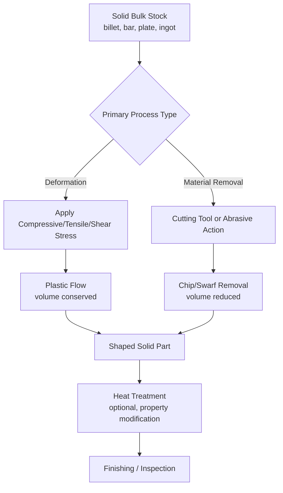

## Solid Bulk Starting-Material Processes

### Definition and Scope

Solid bulk starting-material processes are a category within the classification of manufacturing processes by the physical state of the input material. Here, the raw material enters the process as a coherent solid mass (bar, billet, ingot, sheet, block, or rod) rather than as a liquid, powder, or discrete particulate. The material retains its solid, continuous (bulk) form throughout processing; shape change is achieved through plastic deformation, material removal, or a combination of both, rather than through phase change (melting/solidification) or consolidation of discrete particles.

This distinguishes the category from:

- **Liquid/molten starting-material processes** (casting, molding), where shape is fixed via solidification of a fluid
- **Powder/particulate starting-material processes** (powder metallurgy, sintering, ceramic powder pressing), where shape is fixed by consolidating discrete particles
- **Gas/vapor-phase starting-material processes** (CVD, gas carburizing), where material is built up or modified from a gaseous phase

The defining feature is that the workpiece is a single, continuous solid body of definite volume and shape before, during, and (in deformation processes) after operation—only its geometry and internal microstructure change, not its fundamental physical state.

### Key Points

- **Two principal shape-change mechanisms** dominate this category: (1) bulk plastic deformation, where material is forced to flow into a new shape while remaining solid, and (2) material removal (subtractive machining), where excess solid material is progressively cut away to reveal the desired geometry.
- **No melting occurs** (except incidentally at highly localized microstructural scales in some thermomechanical or welding-adjacent operations); the bulk material remains below its melting point throughout primary shaping.
- **Volume conservation** is a hallmark of pure deformation processes: in forging, rolling, extrusion, and drawing, the workpiece volume is conserved (constant) while cross-sectional shape and length change, in contrast to machining, where volume is deliberately reduced by removing chips/swarf.
- **Strain hardening and microstructural effects**: because the material remains solid and undergoes significant plastic strain, grain flow, work hardening, and residual stresses are characteristic outcomes that influence mechanical properties (often beneficially, e.g., improved fatigue strength from favorable grain flow in forgings).
- **Starting stock forms**: ingots, billets, blooms, slabs, bars, rods, wire, sheet, plate, and pre-shaped blanks are the typical bulk solid feedstocks.

### Major Process Families

#### 1. Bulk Deformation Processes

These processes reshape solid metal by applying stresses (compressive, tensile, or shear) that exceed the yield strength, causing plastic flow without loss of volume.

- **Forging**: compressive deformation between dies (open-die, closed-die/impression-die, upset forging)
- **Rolling**: compressive deformation between rotating rolls (flat rolling, shape rolling, ring rolling)
- **Extrusion**: material forced through a die orifice under compressive force (direct/forward, indirect/backward, hydrostatic)
- **Wire and rod drawing**: material pulled through a converging die under tensile force to reduce cross-section
- **Sheet metal forming**: bending, deep drawing, stretch forming, roll forming (starting from sheet stock, a bulk solid in planar form)

**Sub-classification by working temperature:**

- **Hot working**: performed above the material's recrystallization temperature; lower forming forces, higher ductility, but reduced dimensional precision and surface finish
- **Cold working**: performed below recrystallization temperature (often near room temperature); higher forming forces required, but superior surface finish, dimensional accuracy, and strength via strain hardening
- **Warm working**: intermediate temperature range, balancing force requirements against material ductility and finish

**Example (Closed-Die Forging Sequence):**

1. Billet heated to forging temperature (hot forging) or used at ambient temperature (cold forging)
2. Billet placed in the lower die half
3. Upper die descends, compressing the billet to fill the die cavity
4. Excess material (flash) extruded into a flash gutter around the cavity periphery
5. Part removed and flash trimmed in a secondary operation
6. Optional heat treatment to restore or refine mechanical properties

**Example (Direct Extrusion Parameters):**

Aluminum extrusion typically performed at billet temperatures of roughly 400–500°C with ram pressures dependent on alloy and extrusion ratio; extrusion ratio (starting cross-sectional area divided by final cross-sectional area) commonly ranges from about 10:1 to 100:1 for aluminum alloys. [Inference: exact temperature and pressure ranges depend on alloy composition, billet diameter, and press capability, and should be confirmed against process-specific references.]

#### 2. Material Removal (Subtractive/Machining) Processes

Machining processes remove unwanted solid material from a bulk workpiece (bar, plate, casting, or forging blank) using a cutting tool or abrasive action to achieve the final geometry and surface finish.

- **Turning** (lathe operations, producing rotationally symmetric parts)
- **Milling** (peripheral and face milling, producing flat and contoured surfaces, slots, pockets)
- **Drilling, boring, and reaming** (hole-making operations)
- **Planing and shaping** (linear cutting motion for flat surfaces)
- **Broaching** (multi-tooth tool progressively removing material in a single pass)
- **Grinding and abrasive machining** (fine material removal via bonded or coated abrasives)
- **Non-traditional machining**: electrical discharge machining (EDM), electrochemical machining (ECM), laser beam machining, water jet cutting

**Example (CNC Milling Sequence):**

1. Bulk stock (bar or plate) secured in a fixture/vise on the machine table
2. CNC program executes toolpaths generated from a CAD/CAM model
3. Rotating cutting tool removes material in successive passes, forming pockets, slots, and contours
4. Coolant/lubricant applied to manage heat and chip evacuation
5. In-process or post-process inspection (coordinate measuring machine, calipers, gauges)
6. Deburring and final finishing

#### 3. Powder-Free Solid-State Joining (Bulk-to-Bulk)

Certain joining processes operate entirely on solid bulk material without melting, and are sometimes included in this classification because both starting materials remain solid bulk stock throughout:

- **Friction welding and friction stir welding**
- **Diffusion bonding**
- **Cold welding / roll bonding**
- **Ultrasonic welding** (for metals and thermoplastics in solid sheet/bulk form)

**Example (Friction Stir Welding):**

A rotating, non-consumable tool with a shoulder and profiled pin is plunged into the abutting edges of two solid workpieces (commonly aluminum alloys) and traversed along the joint line; frictional heat plasticizes (but does not melt) the material, which is mechanically stirred and forged together by the tool's rotation and traverse, producing a solid-state weld.

#### 4. Bulk Heat Treatment (Property Modification of Solid Bulk Stock)

While not a shape-generating process, heat treatment is frequently classified alongside bulk solid-material processes because it operates on solid bulk stock (bars, forgings, castings) without changing gross shape, only microstructure and properties:

- Annealing, normalizing
- Quenching and tempering
- Case hardening (carburizing, nitriding, induction/flame hardening) — note this involves diffusion of species into the solid surface, distinguishing it from bulk gas-phase processes since the substrate itself remains solid bulk throughout

### Process Comparison Table

| Process Family | Deformation/Removal Type | Volume Change | Typical Products |
| --- | --- | --- | --- |
| Forging | Bulk compressive deformation | Conserved | Crankshafts, connecting rods, gears |
| Rolling | Bulk compressive deformation | Conserved | Sheet, plate, structural shapes, rail |
| Extrusion | Bulk compressive/shear deformation | Conserved | Window frames, tubing, structural profiles |
| Wire Drawing | Bulk tensile deformation | Conserved | Wire, rod, small-diameter tubing |
| Turning/Milling | Material removal | Reduced (chips removed) | Shafts, brackets, precision components |
| Grinding | Abrasive material removal | Reduced (minimal) | Precision finished surfaces, bearings |
| Friction Stir Welding | Solid-state joining | Conserved (localized plasticization) | Aerospace panels, shipbuilding plates |

### Process Flow Diagram

### Governing Physical Principles

**Volume constancy in deformation processes:**

$$V_{initial} = V_{final}$$

which for a simple length/cross-section relationship (as in extrusion or drawing) gives:

$$A_0 L_0 = A_f L_f$$

where $A_0$ and $L_0$ are the initial cross-sectional area and length, and $A_f$ and $L_f$ are the final cross-sectional area and length.

**True strain in bulk deformation** is commonly expressed as:

$$\varepsilon = \ln\left(\frac{A_0}{A_f}\right)$$

**Flow stress** during plastic deformation, often modeled using a power-law (Hollomon) relationship for strain hardening:

$$\sigma = K \varepsilon^{n}$$

where $\sigma$ is flow stress, $K$ is the strength coefficient, $\varepsilon$ is true strain, and $n$ is the strain-hardening exponent, both material-dependent constants determined experimentally.

**Material removal rate (MRR) in machining**, a key productivity metric:

$$MRR = v \times f \times d$$

where $v$ is cutting speed, $f$ is feed rate, and $d$ is depth of cut. [Inference: this formulation applies to standard turning/milling operations; exact formulas vary somewhat by operation type (turning vs. milling vs. drilling).]

### Advantages and Limitations

**Advantages:**

- Deformation processes generally improve mechanical properties (grain refinement, favorable grain flow, strain hardening) compared to cast or machined-only parts
- Machining achieves tight dimensional tolerances and fine surface finishes not typically attainable directly from casting or deformation alone
- Wide range of achievable geometries: deformation processes excel at bulk shape generation and cross-sectional profiles; machining excels at precision features, holes, and complex 3D contours
- Mature, well-characterized processes with extensive design data (forgeability charts, machinability ratings, tool life data) supporting reliable process planning

**Limitations:**

- Deformation processes often require high forces/tonnage, translating to substantial equipment and tooling (die) costs, particularly for large parts or hard-to-form alloys
- Machining is inherently wasteful of material, generating scrap in the form of chips, which impacts material efficiency and cost for expensive alloys (titanium, nickel superalloys)
- Deformation processes can introduce residual stresses and anisotropic properties that require attention in design (directionally dependent strength/ductility)
- Tool wear, thermal effects, and chatter/vibration in machining can limit achievable precision and productivity without careful process parameter selection

### Related Topics

- Metal forming mechanics and slab/upper-bound analysis methods
- Machinability and cutting tool material selection (HSS, carbide, ceramic, CBN, diamond)
- Classification by liquid and molten starting-material processes
- Classification by powder and particulate starting-material processes
- Sheet metal formability and forming limit diagrams (FLD)
- Residual stress formation and mitigation in forged and machined components
- Cutting fluid selection and thermal management in machining
- Near-net-shape forging and its role in reducing downstream machining
- Solid-state additive and joining processes (friction stir processing, cold spray)
- Surface integrity and its relationship to fatigue performance in machined vs. formed parts