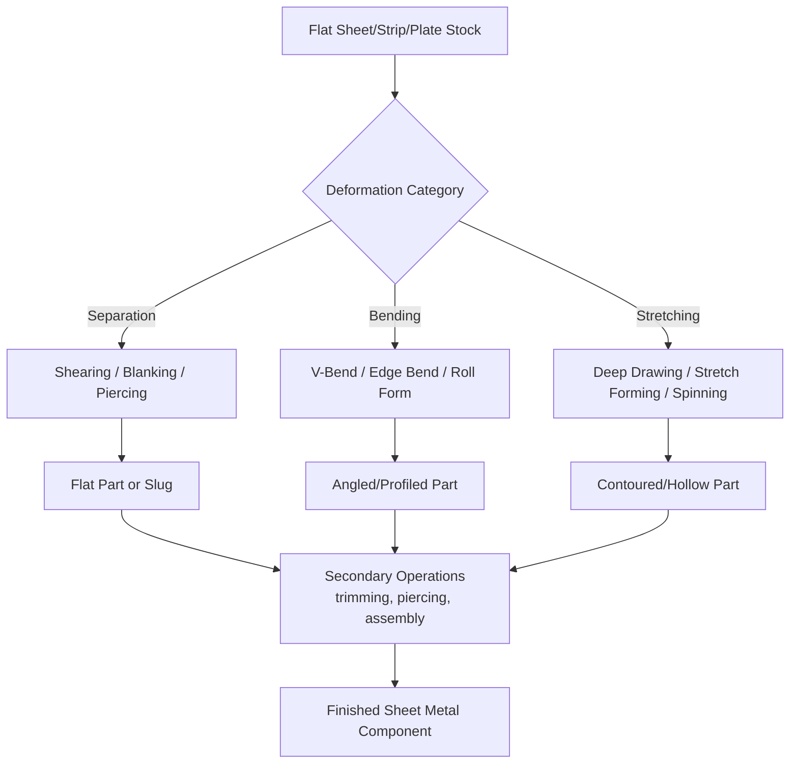

## Solid Sheet, Strip, and Plate Starting-Material Processes

### Definition and Scope

Solid sheet, strip, and plate starting-material processes are a subcategory within the classification of manufacturing processes by state of starting material, distinguished from general bulk solid processes by the specific geometry of the input stock: material with a large surface area relative to a comparatively small, uniform thickness. This flat-rolled or flat-stock geometry fundamentally shapes which forming mechanisms are applicable and which are not.

Standard thickness-based distinctions (industry convention, not universal law):

- **Foil**: typically below 0.15 mm
- **Sheet**: typically 0.15 mm to 6 mm
- **Plate**: typically above 6 mm

[Unverified: exact thickness boundaries vary by industry standard, material type, and national convention (e.g., ASTM vs. other standards); figures given are representative rather than fixed.]

The processes in this category operate on material that is already in flat, rolled form (itself a product of bulk deformation via rolling) and further shape it—predominantly through bending, stretching, shearing, and drawing—without the material passing through a molten or powder state at any point.

### Key Points

- **Deformation dominated by bending and stretching**, in contrast to bulk forming's dominant compressive upsetting: sheet metal processes primarily exploit the material's thin cross-section to achieve shape change through localized bending moments, in-plane stretching, and through-thickness shear (cutting/shearing), with far less bulk compressive flow than forging or extrusion.
- **Constant thickness assumption**: many sheet forming analyses assume thickness remains approximately constant (plane-stress conditions), an idealization that breaks down under severe stretching where localized thinning and necking can occur.
- **High surface-area-to-volume ratio** implies fast heat transfer, meaning most sheet metal forming is performed cold (at room temperature) except for specific alloys or extreme-formability applications requiring hot or warm stamping.
- **Tooling costs are typically high (dies, punches, stamping presses)** but per-part cycle times are very short, making the category strongly suited to high-volume production (automotive body panels, appliance housings, beverage cans).
- **Springback** is a defining and often problematic characteristic: because sheet forming operates via elastic-plastic bending, the material partially recovers elastically after the forming load is removed, requiring compensation in die design.

### Major Process Families

#### 1. Shearing Processes (Separating Operations)

Shearing uses a punch and die to apply a shearing force that exceeds the material's shear strength, separating material along a defined line without significant plastic deformation of the retained part.

- **Blanking**: cutting out a finished flat part (the punched-out slug is the product)
- **Piercing/punching**: cutting a hole (the punched-out slug is scrap; the surrounding sheet is the product)
- **Trimming**: removing excess material from the periphery of a formed part
- **Shearing (straight-line cutting)**: cutting sheet or plate along a straight line, typically to size stock
- **Notching, lancing, and slitting**: variants for partial cuts, tabs, or continuous strip separation

**Example (Blanking Clearance Calculation):**

Die clearance, the gap between punch and die, is a critical parameter controlling cut edge quality:

$$c = a \times t$$

where $c$ is the clearance per side, $t$ is material thickness, and $a$ is a clearance allowance factor (typically 0.03 to 0.10, material-dependent). Insufficient clearance produces secondary shearing and a rough edge; excessive clearance produces excessive burr and a tapered edge.

#### 2. Bending Processes

Bending applies a moment about an axis, causing plastic deformation concentrated at a bend line while the flat regions on either side remain largely undeformed.

- **V-bending** (simple bend using a V-shaped die)
- **Edge/wipe bending** (bending against a die edge with a pressure pad)
- **Roll bending** (progressive bending via rotating rolls, used for large-radius curves and cylinders)
- **Roll forming** (continuous progressive bending through a series of roll stations to produce long constant-cross-section profiles)
- **Hemming and seaming** (folding an edge back onto itself, common in automotive panel joining)

**Example (V-Bending Sequence):**

1. Flat sheet blank positioned over a V-shaped die
2. Punch descends, forcing the sheet into the die cavity
3. Material bends plastically at the punch tip, following the die angle
4. Punch retracts; the part springs back elastically by a predictable angular amount
5. Die/punch angle is often overbent to compensate for anticipated springback

**Minimum bend radius** is governed by material ductility, typically expressed as a multiple of thickness (e.g., $r_{min} = t$ for moderately ductile steels), below which surface cracking on the outer bend fiber becomes likely. [Inference: minimum bend radius is alloy- and temper-specific; values should be confirmed against material datasheets for the specific grade in use.]

#### 3. Deep Drawing and Stretch Forming (Stretching-Dominated Processes)

- **Deep drawing**: a flat blank is drawn into a die cavity by a punch, forming a cup-shaped or box-shaped part with a height often exceeding its diameter/width; material flows radially inward from the flange region
- **Stretch forming**: sheet is clamped at its edges and stretched over a form block, thinning the material via biaxial tension without significant material flow into the die
- **Ironing**: a secondary operation that reduces and uniformizes wall thickness of a drawn cup by forcing it through a die with a smaller clearance than the cup wall thickness (common in beverage can manufacture)
- **Hydroforming**: fluid pressure (rather than a rigid punch) forms the sheet against a die cavity, well suited to complex, smooth-contoured shapes

**Example (Deep Drawing Parameter — Drawing Ratio):**

$$DR = \frac{D_0}{D_p}$$

where $D_0$ is the initial blank diameter and $D_p$ is the punch diameter. A drawing ratio exceeding roughly 2.0–2.2 in a single draw typically risks wrinkling in the flange or tearing at the punch radius, often necessitating multiple draw stages (redrawing) for deep parts. [Inference: the specific limiting drawing ratio depends on material formability, blank-holder force, lubrication, and die geometry.]

#### 4. Stamping and Progressive Die Operations

Stamping is the umbrella term combining shearing, bending, and drawing operations, typically executed in a mechanical or hydraulic press. Progressive dies perform multiple operations (piercing, bending, drawing) in sequence as continuous strip stock advances through successive stations in a single press stroke.

**Example (Progressive Die Strip Layout):**

1. Station 1: pilot holes pierced for strip location
2. Station 2: primary blanking of part outline features
3. Station 3: bending operation forms flanges
4. Station 4: additional piercing for functional holes
5. Station 5: final part separation (cutoff) from the strip carrier

#### 5. Specialized Sheet Forming Processes

- **Incremental sheet forming (ISF)**: a single-point or two-point forming tool progressively deforms sheet metal locally, layer by layer, following a CNC toolpath—useful for low-volume/prototype parts without dedicated dies
- **Explosive forming and electromagnetic forming**: high-energy-rate forming methods using explosive charge or magnetic pulse force to form sheet against a die, suited to large or hard-to-form parts
- **Spinning (metal spinning)**: a rotating flat blank is progressively formed over a rotating mandrel using a roller or tool, producing axisymmetric hollow parts (cones, hemispheres)
- **Superplastic forming**: certain fine-grained alloys (e.g., specific titanium and aluminum alloys) exhibit extremely high elongation at elevated temperature and slow strain rate, enabling forming of complex shapes using gas pressure against a die

### Process Comparison Table

| Process | Primary Deformation Mode | Thickness Change | Typical Products |
| --- | --- | --- | --- |
| Blanking/Piercing | Shear (separation) | None (separation only) | Flat blanks, gaskets, washers |
| V-Bending/Edge Bending | Bending | Minimal (localized thinning at bend) | Brackets, enclosures, flanges |
| Roll Forming | Progressive bending | Minimal | Structural channels, rails, trim |
| Deep Drawing | Drawing (radial flow) | Approximately constant (ideal) | Cups, sinks, fuel tanks, cans |
| Stretch Forming | Biaxial stretching | Reduced (thinning) | Aircraft skin panels, large curved panels |
| Ironing | Wall thinning | Significantly reduced | Beverage cans, thin-wall cups |
| Metal Spinning | Localized shear/bending | Approximately constant to reduced | Cones, cylindrical vessels, cookware |

### Process Flow Diagram

### Governing Physical Principles

**Bend allowance** (developed flat-pattern length for a bend), commonly using the K-factor method:

$$BA = \theta \times \left(\frac{\pi}{180}\right) \times \left(r + K \times t\right)$$

where $BA$ is bend allowance, $\theta$ is bend angle in degrees, $r$ is inside bend radius, $t$ is material thickness, and $K$ is the K-factor (representing the location of the neutral axis relative to thickness, typically between 0.33 and 0.50 depending on material and $r/t$ ratio).

**Springback ratio**, a simplified relationship for elastic recovery after bending:

$$\frac{R_i}{R_f} = 4\left(\frac{R_i \sigma_y}{E t}\right)^3 - 3\left(\frac{R_i \sigma_y}{E t}\right) + 1$$

where $R_i$ is the bend radius before springback (die radius), $R_f$ is the final radius after springback, $\sigma_y$ is yield strength, $E$ is elastic modulus, and $t$ is thickness. [Inference: this is one common formulation among several springback prediction models used in practice; finite element simulation is frequently used for complex geometries where closed-form models are insufficient.]

**Limiting Drawing Ratio (LDR)** relates to formability assessment via the plastic strain ratio (Lankford coefficient, $r$-value), where higher average $r$-values generally correlate with improved deep-drawability.

### Advantages and Limitations

**Advantages:**

- Extremely well suited to high-volume production with very short cycle times once tooling is developed (stamping presses can produce parts in fractions of a second)
- High material utilization achievable through nested blank layouts on coil stock, minimizing scrap
- Excellent surface finish directly from the forming operation, often eliminating the need for secondary finishing
- Wide design flexibility: combining shearing, bending, and drawing in progressive or transfer dies allows complex parts to be produced in a single automated press line

**Limitations:**

- Tooling (dies) is expensive and specific to a part geometry, making the category economically unfavorable for low-volume or highly customized production (mitigated somewhat by incremental sheet forming for prototypes)
- Formability is constrained by the material's ductility and strain-hardening behavior; exceeding the forming limit diagram (FLD) boundary produces localized necking or tearing
- Springback introduces dimensional variability that requires either iterative die compensation or closed-loop process control
- Thickness is largely fixed by the input stock (except in ironing/thinning-type operations), limiting design freedom compared to bulk forming or casting where thickness can vary more freely across a part

### Related Topics

- Forming limit diagrams (FLD) and formability assessment
- Progressive die and transfer die design principles
- Springback compensation strategies in stamping die design
- Classification by solid bulk starting-material processes
- Roll forming line design and tooling sequence planning
- Sheet metal joining processes (spot welding, clinching, self-piercing rivets)
- Tailor-welded blanks and tailored sheet stock in automotive stamping
- Finite element simulation (FEA) in sheet metal forming process design
- Lubrication and friction management in deep drawing operations
- Superplastic forming and diffusion bonding combined processes (SPF/DB) in aerospace manufacturing