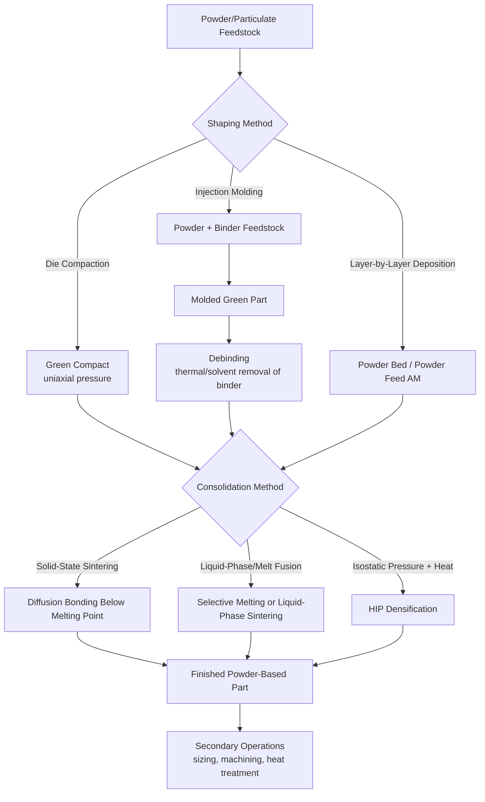

## Particulate and Powder Starting-Material Processes

### Definition and Scope

Particulate and powder starting-material processes are a category within the classification of manufacturing processes by state of starting material, in which the raw feedstock consists of discrete solid particles (powder) rather than a continuous liquid, molten mass, or bulk solid body. Individual particles, ranging from sub-micron to several hundred micrometers in size, are consolidated—through mechanical compaction, thermal bonding, chemical binding, or a combination thereof—into a coherent solid part with defined geometry.

This category is distinguished from:

- **Liquid/molten starting-material processes**, where shape is fixed by solidification of a continuous fluid
- **Solid bulk starting-material processes**, where a single continuous solid body is deformed or machined
- **Gas-phase starting-material processes**, where material is deposited atom-by-atom or molecule-by-molecule from a vapor

The defining mechanism is **consolidation of discrete particles into a bonded, coherent mass**, most commonly achieved through the sequence of compaction (pressing particles into a green, unbonded or weakly bonded shape) followed by sintering (thermal treatment below the material's melting point that bonds particles via solid-state or liquid-phase diffusion mechanisms).

### Key Points

- **Two-stage process structure is typical**: (1) shaping/compaction, which establishes green (as-formed) geometry and density, and (2) sintering or curing, which bonds particles together and develops final mechanical properties. Some processes combine these stages (e.g., hot pressing, spark plasma sintering).
- **Porosity is a defining characteristic**: unlike casting or wrought processes, powder-based parts typically retain some residual porosity (ranging from a few percent to over 30%, depending on process and intent), which can be engineered intentionally (self-lubricating bearings, filters) or minimized through process optimization (hot isostatic pressing, full-density PM).
- **Near-net-shape capability**: powder processes can produce complex geometries close to final dimensions with minimal machining, offering significant material efficiency advantages, particularly valuable for expensive or hard-to-machine materials (titanium, superalloys, tungsten carbide).
- **Applicable across material classes**: this category spans powder metallurgy (metals), ceramic powder processing, and is foundational to most metal and polymer additive manufacturing (3D printing) processes, which build parts from powder or particulate feedstock layer by layer.
- **Particle characteristics govern processability**: particle size distribution, morphology (spherical vs. irregular), flowability, and apparent/tap density directly influence compaction behavior, sintering response, and final part properties.

### Major Process Families

#### 1. Powder Metallurgy (PM) — Conventional Press-and-Sinter

The classical and highest-volume powder process route for metals.

- **Powder production**: atomization (gas, water, or centrifugal), reduction, or electrolytic methods generate metal powder feedstock
- **Blending/mixing**: powder blended with lubricants (e.g., zinc stearate) and alloying additions
- **Compaction**: powder pressed in a rigid die under uniaxial pressure to form a "green" compact
- **Sintering**: green compact heated in a controlled atmosphere furnace to a temperature typically 70–90% of the material's absolute melting point, bonding particles via solid-state diffusion
- **Secondary operations**: sizing, coining, infiltration, heat treatment, machining of features not achievable in the die

**Example (Press-and-Sinter Sequence):**

1. Metal powder (e.g., iron-based) blended with graphite and lubricant
2. Powder gravity-fed into a rigid die cavity
3. Upper and lower punches compress the powder under high uniaxial pressure (commonly on the order of 400–800 MPa for ferrous PM parts)
4. Green compact ejected, possessing sufficient handling strength but low density (typically 80–90% of theoretical density)
5. Sintering at elevated temperature (below melting point) in a protective atmosphere (endothermic gas, nitrogen-hydrogen, or vacuum)
6. Particles bond via diffusion, reducing porosity and developing mechanical strength

[Inference: exact compaction pressures and sintering temperatures vary substantially by alloy system and target density; figures given are representative of common ferrous PM practice.]

#### 2. Advanced Powder Consolidation Processes

Processes that combine pressure and heat simultaneously, or use alternative consolidation mechanisms, to achieve higher density or properties not attainable via conventional press-and-sinter.

- **Hot isostatic pressing (HIP)**: powder (often encapsulated) or a pre-sintered part is subjected to simultaneous high temperature and isostatic (uniform, all-directional) gas pressure, achieving near-full density and eliminating internal porosity
- **Hot pressing**: uniaxial pressure and heat applied simultaneously in a die, common for ceramics and hard-to-sinter materials
- **Spark plasma sintering (SPS) / field-assisted sintering technique (FAST)**: pulsed electric current passed through powder under pressure, enabling rapid heating and short sintering cycles with reduced grain growth
- **Metal injection molding (MIM)**: fine metal powder mixed with a polymer binder, injection molded to shape (similar to plastic injection molding), then debound (binder removed) and sintered to final density
- **Powder rolling**: powder fed between rolls to produce a green strip, subsequently sintered—used for continuous sheet/strip production

**Example (MIM Process Sequence):**

1. Fine metal powder (typically under 20 micrometers) mixed with a thermoplastic/wax binder system to form a feedstock
2. Feedstock injection molded into the desired shape using conventional injection molding equipment
3. Debinding: binder removed via thermal, solvent, or catalytic methods, leaving a fragile "brown" part
4. Sintering: brown part heated to consolidate the metal powder, causing significant shrinkage (commonly 15–20% linear) as porosity is eliminated
5. Optional secondary operations (sizing, heat treatment, surface finishing)

#### 3. Ceramic Powder Processing

Analogous consolidation principles applied to ceramic powders, which typically require higher sintering temperatures and different forming methods due to lower green strength and different flow behavior compared to metal powders.

- **Dry pressing** (uniaxial die pressing, similar to metal PM compaction)
- **Isostatic pressing** (cold isostatic pressing, CIP, for green shaping; hot isostatic pressing for densification)
- **Slip casting** (technically a liquid-slurry route, but frequently grouped with ceramic particulate processing given its powder-suspension origin)
- **Tape casting and extrusion of ceramic pastes**
- **Reaction bonding and liquid-phase sintering**

#### 4. Powder-Bed and Powder-Feed Additive Manufacturing

Modern additive manufacturing technologies that build parts directly from powder feedstock, layer by layer, represent a significant and rapidly evolving extension of particulate starting-material processing.

- **Powder bed fusion (PBF)**: a thin layer of powder is spread across a build platform, and an energy source (laser or electron beam) selectively fuses powder particles according to a cross-sectional slice of the part geometry; the platform lowers, a new powder layer is spread, and the process repeats
  - Selective laser sintering (SLS) — polymers
  - Selective laser melting (SLM) / Direct metal laser sintering (DMLS) — metals
  - Electron beam melting (EBM) — metals, performed in vacuum
- **Binder jetting**: a liquid binding agent is selectively deposited onto a powder bed layer by layer, forming a green part that is subsequently sintered (for metals/ceramics) or cured (for sand molds/cores)
- **Directed energy deposition with powder feedstock**: powder is fed directly into a melt pool created by a laser, electron beam, or plasma arc, and deposited layer by layer, often used for repair and large-scale metal builds

**Example (Laser Powder Bed Fusion Sequence):**

1. CAD model sliced into thin cross-sectional layers (commonly 20–100 micrometers thick)
2. Recoater blade or roller spreads a uniform powder layer across the build platform
3. Laser selectively scans and melts powder according to the current layer's cross-section, fusing it to the layer below
4. Build platform lowers by one layer thickness
5. Process repeats until the full part is built
6. Part removed, unfused powder recovered/recycled, and post-processing applied (stress relief, HIP, support removal, surface finishing)

[Inference: exact layer thicknesses, scan strategies, and process parameters are highly machine- and material-specific; manufacturer documentation should be consulted for production settings.]

### Process Comparison Table

| Process | Consolidation Mechanism | Typical Density Achieved | Typical Products |
| --- | --- | --- | --- |
| Press-and-Sinter PM | Uniaxial compaction + solid-state sintering | 80–95% theoretical | Gears, bushings, structural automotive parts |
| Hot Isostatic Pressing | Simultaneous heat + isostatic pressure | Near 100% theoretical | Aerospace castings (defect healing), superalloy parts |
| Metal Injection Molding | Injection molding + debind + sinter | 95–99% theoretical | Small complex geometry parts (medical, firearms, electronics) |
| Ceramic Dry Pressing | Uniaxial compaction + high-temp sintering | Varies (85–99%) | Cutting inserts, technical ceramics, electrical insulators |
| Laser Powder Bed Fusion | Selective laser melting, layer by layer | Near 100% (process-dependent) | Aerospace brackets, medical implants, tooling inserts |
| Binder Jetting | Binder deposition + post-process sintering | Requires post-sinter densification | Sand casting cores/molds, metal prototypes |

### Process Flow Diagram

### Governing Physical Principles

**Green density** after compaction, a function of applied pressure and powder characteristics, is often described qualitatively via compaction curves relating density to pressure, since closed-form analytical models are limited in accuracy for real, irregular powder systems.

**Sintering driving force** is fundamentally the reduction of total surface energy of the particle system:

$$\Delta G = \gamma \Delta A$$

where $\Delta G$ is the change in Gibbs free energy (driving densification), $\gamma$ is surface energy per unit area, and $\Delta A$ is the reduction in total particle surface area as necks form and pores shrink between particles.

**Sintering shrinkage** (linear) relates green and sintered dimensions:

$$S_{linear} = \frac{L_{green} - L_{sintered}}{L_{green}} \times 100\%$$

**Homologous temperature**, the ratio commonly used to describe sintering temperature relative to melting point:

$$T_H = \frac{T_{sinter}}{T_{melt}}$$

where both temperatures are expressed in absolute units (Kelvin); typical solid-state sintering is conducted at $T_H$ values of roughly 0.7 to 0.9. [Unverified: precise sintering temperature ratios vary by material system, atmosphere, and desired final properties; specific alloy/ceramic sintering schedules should be confirmed against material-specific process data.]

### Advantages and Limitations

**Advantages:**

- Excellent material utilization and near-net-shape capability, minimizing machining waste—particularly valuable for expensive or difficult-to-machine materials
- Enables production of materials and compositions difficult or impossible to achieve via melting/casting routes (e.g., refractory metals with very high melting points, cemented carbides, certain metal matrix composites)
- Engineered porosity can be exploited functionally (self-lubricating bearings, filters, biomedical implants promoting bone ingrowth)
- Powder bed additive manufacturing enables highly complex internal geometries (lattices, conformal cooling channels) unattainable via conventional subtractive or bulk forming methods

**Limitations:**

- Residual porosity, when unintended, can reduce mechanical properties (fatigue strength, ductility, fracture toughness) compared to fully dense wrought or cast material, though HIP and advanced sintering can largely mitigate this
- Powder handling introduces safety considerations, including combustible dust hazards for fine reactive metal powders (aluminum, titanium) and respiratory hazards requiring appropriate handling protocols
- Tooling costs for die compaction can be significant for complex geometries, similar to other die-based processes
- Additive manufacturing powder-bed processes typically have slower build rates and higher per-part costs compared to high-volume conventional processes, generally favoring low-volume, high-complexity, or high-value applications

### Related Topics

- Classification by liquid and molten starting-material processes
- Classification by solid bulk starting-material processes
- Powder characterization techniques (particle size distribution, flowability, apparent density)
- Sintering mechanisms and atmosphere control in furnace processing
- Hot isostatic pressing (HIP) cycle design and defect healing
- Metal additive manufacturing qualification and post-processing (stress relief, HIP, machining)
- Powder production methods (gas atomization, water atomization, plasma spheroidization)
- Combustible dust safety and powder handling protocols
- Cemented carbide and hard metal manufacturing via liquid-phase sintering
- Binder jetting for sand mold and core production in foundry applications