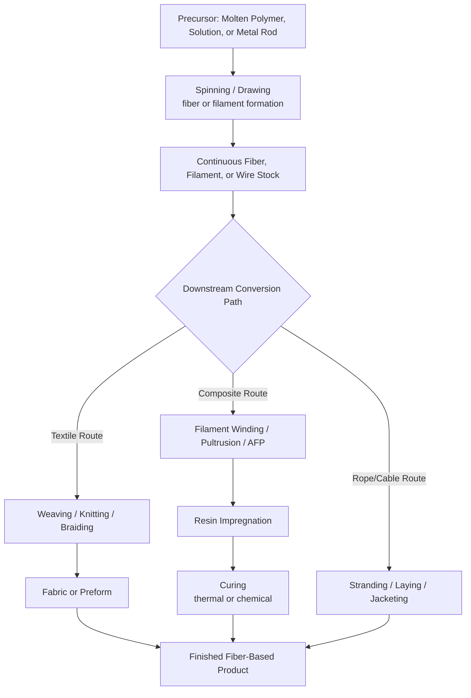

## Fiber, Filament, and Continuous-Strand Starting-Material Processes

### Definition and Scope

Fiber, filament, and continuous-strand starting-material processes are a category within the classification of manufacturing processes by state of starting material, in which the raw feedstock takes the form of a slender, continuous (or very high aspect ratio) solid strand—fiber, filament, tow, yarn, or wire—rather than a bulk solid, liquid, or powder. The starting material's defining geometric characteristic is a very high length-to-cross-sectional-area ratio, typically produced continuously (spun, drawn, or extruded) rather than discretely shaped.

This category overlaps functionally with several other classifications (the fiber itself may originate from a melt-spinning or solution-spinning process, placing fiber *production* within liquid/molten categories), but is distinguished here by processes that take an **already-formed continuous strand as their starting input** and convert it into an intermediate or finished product through winding, weaving, braiding, consolidation, or bundling operations, rather than through bulk deformation, machining, or powder consolidation.

Two conceptual sub-scopes are commonly recognized:

1. **Fiber/filament formation processes**: converting a bulk or liquid precursor into continuous strand form (spinning processes)
2. **Fiber/filament conversion and consolidation processes**: taking continuous strand as input and producing textiles, composite structures, ropes, or wound components

### Key Points

- **Continuity is the defining geometric trait**: unlike sheet (2D, finite width/length) or bulk (3D, compact) stock, fiber/filament stock is fundamentally one-dimensional in character, wound onto spools, bobbins, or creels for handling and further processing.
- **Two broad material origins**: natural fibers (cotton, wool, flax, silk) with inherent, non-engineered geometry, and synthetic/manufactured filaments (polymer, glass, carbon, metal wire) produced via controlled spinning, drawing, or wire-forming processes.
- **Mechanical property anisotropy** is a hallmark outcome: fiber-based products (especially fiber-reinforced composites and woven/braided structures) exhibit direction-dependent strength and stiffness governed by fiber orientation, in contrast to the more isotropic behavior typical of bulk cast or wrought materials.
- **High strength-to-weight ratio achievable**: continuous fiber processing, particularly for advanced fibers (carbon, aramid, high-performance glass), enables composite structures with specific strength and stiffness exceeding many bulk metallic alternatives.
- **Downstream processes span multiple industries**: textiles/apparel, industrial ropes and cables, fiber-reinforced polymer composites, filter media, and electrical/optical fiber all originate from this starting-material category, though the classification here emphasizes structural and industrial (rather than purely textile/apparel) applications.

### Major Process Families

#### 1. Fiber and Filament Formation (Spinning) Processes

These processes convert a liquid, molten, or dissolved precursor into a continuous solid strand—technically a liquid/molten-to-solid transformation, but included here because the *output* defines the starting material for downstream fiber-conversion processes.

- **Melt spinning**: thermoplastic polymer (nylon, polyester, polypropylene) melted and extruded through fine die orifices (spinnerets), then solidified by cooling as it is drawn away
- **Wet spinning**: polymer dissolved in solvent, extruded into a coagulation bath where the solvent is removed and the fiber solidifies (e.g., certain acrylics, rayon)
- **Dry spinning**: polymer dissolved in a volatile solvent, extruded into a heated chamber where the solvent evaporates, leaving the solid fiber
- **Glass fiber drawing**: molten glass drawn through platinum-alloy bushings (fine orifices) and rapidly cooled to form continuous glass filaments, subsequently gathered into strands
- **Carbon fiber production**: precursor fiber (commonly polyacrylonitrile, PAN) subjected to oxidation stabilization followed by carbonization (pyrolysis in an inert atmosphere at high temperature), converting the organic precursor into a carbon filament
- **Wire drawing**: solid metal rod progressively reduced in diameter by pulling through a series of converging dies (technically a bulk-solid deformation process, but the output—continuous wire—serves as feedstock for many strand-based downstream processes)

**Example (Melt Spinning Sequence):**

1. Polymer pellets melted in an extruder
2. Molten polymer forced through a spinneret containing hundreds to thousands of small orifices
3. Emerging filaments cooled and solidified in a quench air stream
4. Filaments drawn (stretched) to align polymer chains and increase tensile strength/orientation
5. Filaments gathered into a multifilament yarn and wound onto a bobbin

**Example (Carbon Fiber Production Sequence):**

1. PAN precursor fiber tow fed continuously through an oxidation oven (approximately 200–300°C in air), converting the linear polymer into a thermally stable ladder structure
2. Stabilized fiber passed through carbonization furnaces (progressively increasing temperature, commonly up to roughly 1000–1500°C, in an inert nitrogen atmosphere), driving off non-carbon elements and leaving a predominantly carbon filament structure
3. Optional graphitization at higher temperatures (above 2000°C) for higher-modulus fiber grades
4. Surface treatment (oxidation) and sizing application to improve resin compatibility and handling
5. Fiber wound onto spools as continuous tow

[Inference: specific temperature profiles and processing times for carbon fiber production are proprietary and vary by manufacturer and target fiber grade; figures given represent generally documented industry ranges.]

#### 2. Textile Conversion Processes

Processes that convert continuous filament or staple fiber into structured textile forms.

- **Weaving**: interlacing warp (lengthwise) and weft (crosswise) yarns at right angles on a loom to form a woven fabric
- **Braiding**: interlacing three or more yarn strands diagonally to form a tubular or flat braided structure, commonly used for reinforcement sleeving and composite preforms
- **Knitting**: interlooping yarn to form a fabric, offering greater elasticity/drapability than weaving
- **Nonwoven fabric formation**: fibers bonded directly (mechanically, thermally, or chemically) without weaving/knitting, e.g., spunbond, meltblown, needle-punched nonwovens
- **Twisting/plying**: combining multiple filaments or yarns via twisting to increase strength, bulk, or achieve specific yarn characteristics (common in rope and cordage manufacture)

**Example (Braiding for Composite Preforms):**

Multiple fiber tows (commonly carbon or glass) are fed from a circular arrangement of bobbin carriers that rotate and interweave around a central mandrel or axis, producing a continuous tubular or over-braided reinforcement structure directly conforming to the mandrel geometry—used to produce composite preforms for subsequent resin infusion (e.g., driveshafts, pressure vessels).

#### 3. Continuous Fiber-Reinforced Composite Consolidation Processes

Processes that combine continuous fiber/filament stock with a polymer matrix to produce structural composite components, representing one of the most significant industrial applications of this starting-material category.

- **Filament winding**: continuous fiber tow, pre-impregnated with resin (wet winding) or pre-impregnated separately (prepreg winding), is wound under controlled tension onto a rotating mandrel following a precise geometric pattern, then cured
- **Pultrusion**: continuous fiber reinforcement pulled through a resin bath and then through a heated forming die, where the resin cures as the profile is continuously drawn, producing constant-cross-section structural shapes
- **Automated fiber placement (AFP) / automated tape laying (ATL)**: robotic systems lay continuous prepreg tow or tape onto a mold surface following programmed paths, building up laminate layers for large composite structures (aerospace fuselage/wing skins)
- **Prepreg layup and autoclave curing**: continuous fiber tape or fabric pre-impregnated with partially cured resin is manually or automatically laid onto a tool, then cured under heat and pressure in an autoclave

**Example (Filament Winding Sequence):**

1. Continuous fiber tow (glass or carbon) drawn from creels through a resin bath (wet winding) or fed as pre-impregnated tow
2. Fiber wound onto a rotating mandrel under controlled tension, with the winding head traversing along the mandrel axis according to a programmed winding angle pattern
3. Multiple layers built up at varying winding angles to achieve the desired directional strength properties
4. Wound part cured (thermally, often in an oven or autoclave)
5. Mandrel removed (collapsible, soluble, or extracted), yielding the finished hollow composite structure

**Winding angle relationship** (a key design parameter governing hoop vs. axial strength balance in filament-wound pressure vessels):

$$\alpha = \arcsin\left(\frac{r}{R}\right)$$

where $\alpha$ is the winding angle relative to the mandrel axis, $r$ is the polar opening radius, and $R$ is the mandrel (cylinder) radius, derived from the geodesic path requirement for stable fiber placement on a dome-ended mandrel. [Inference: this represents the idealized geodesic winding relationship; actual winding patterns in practice may incorporate non-geodesic paths with friction-assisted stability, depending on winding machine capability and design requirements.]

#### 4. Rope, Cable, and Cordage Manufacturing

- **Stranding**: individual wires or fiber yarns twisted together to form a strand, then multiple strands twisted together to form rope or cable
- **Wire rope construction**: steel wires formed into strands around a core, then strands laid around a central core to form the finished rope, characterized by construction notation (e.g., 6x19, 6x36 indicating strands and wires per strand)
- **Cable armoring and jacketing**: continuous strand (electrical or optical) processes involving extrusion of insulation/jacketing over a conductor or fiber core

### Process Comparison Table

| Process | Input Form | Consolidation Mechanism | Typical Products |
| --- | --- | --- | --- |
| Melt/Wet/Dry Spinning | Molten or dissolved polymer | Solidification/coagulation | Textile fiber, industrial filament |
| Weaving/Braiding | Continuous yarn/tow | Mechanical interlacing | Fabric, sleeving, composite preforms |
| Filament Winding | Resin-impregnated tow | Thermal/chemical resin cure | Pressure vessels, driveshafts, pipes |
| Pultrusion | Fiber tow + liquid resin | Continuous cure through heated die | Structural profiles, rebar, ladder rails |
| Automated Fiber Placement | Prepreg tow/tape | Layup + autoclave or out-of-autoclave cure | Aircraft wing/fuselage skins |
| Wire Rope Stranding | Continuous metal wire | Mechanical twisting/laying | Cranes, elevators, suspension cables |

### Process Flow Diagram

### Governing Physical Principles

**Fiber draw ratio** (governing molecular/crystalline orientation and resulting tensile strength in spun fibers):

$$DR = \frac{v_{takeup}}{v_{extrusion}}$$

where $v_{takeup}$ is the fiber take-up (winding) velocity and $v_{extrusion}$ is the velocity at the spinneret exit; higher draw ratios generally increase molecular orientation and tensile strength up to a material-specific limit.

**Rule of mixtures** for estimating longitudinal composite stiffness from constituent fiber and matrix properties in unidirectional continuous fiber composites:

$$E_c = E_f V_f + E_m V_m$$

where $E_c$ is composite longitudinal modulus, $E_f$ and $E_m$ are fiber and matrix moduli respectively, and $V_f$ and $V_m$ are fiber and matrix volume fractions ($V_f + V_m = 1$, assuming negligible void content). This is a standard, well-established micromechanics relationship for aligned continuous fiber composites under longitudinal loading.

**Fiber volume fraction**, a key composite quality metric:

$$V_f = \frac{V_{fiber}}{V_{fiber} + V_{matrix} + V_{void}}$$

Higher fiber volume fractions generally correlate with improved mechanical properties, up to a practical maximum (typically around 60–70% for well-consolidated processes such as filament winding and AFP) beyond which resin impregnation quality and void content become problematic. [Unverified: practical maximum fiber volume fractions vary by process, fiber architecture, and manufacturer capability.]

### Advantages and Limitations

**Advantages:**

- Enables production of highly directional, tailored mechanical properties by controlling fiber orientation and architecture, allowing structures optimized for specific load paths
- Continuous processes (pultrusion, filament winding, wire drawing) offer high production rates and excellent process automation potential
- Exceptional specific strength and stiffness achievable with advanced fibers (carbon, aramid), enabling significant weight reduction versus metallic alternatives in aerospace, automotive, and sporting goods applications
- Design flexibility in combining fiber types, orientations, and matrix systems to meet multi-functional requirements (strength, stiffness, thermal, electrical properties)

**Limitations:**

- Anisotropic properties require careful, often complex design analysis; off-axis strength is frequently significantly lower than along-fiber-direction strength
- Composite consolidation processes can be labor- and capital-intensive (autoclave curing, precision winding/placement equipment), impacting per-part cost relative to some bulk metal processes
- Void content, fiber misalignment, and resin-rich/resin-starved regions represent process-inherent defect risks requiring quality control (ultrasonic inspection, X-ray/CT)
- Recycling and end-of-life processing of fiber-reinforced composites (particularly thermoset matrix systems) remains more complex than for many bulk metallic or thermoplastic materials [Inference: recyclability challenges and available recycling technologies are an active area of development and vary by matrix/fiber system]

### Related Topics

- Classification by liquid and molten starting-material processes (fiber spinning origin)
- Composite laminate theory and classical lamination theory (CLT)
- Micromechanics of fiber-reinforced composites (rule of mixtures, Halpin-Tsai equations)
- Autoclave and out-of-autoclave composite curing methods
- Nondestructive testing of composite structures (ultrasonic C-scan, X-ray CT)
- Textile preform architectures for composite reinforcement (2D/3D weaving, braiding)
- Wire rope design standards and failure analysis
- Carbon fiber precursor chemistry and processing (PAN vs. pitch-based fibers)
- Recycling and circular economy approaches for fiber-reinforced composites
- Optical fiber manufacturing (a specialized continuous-strand process for telecommunications)