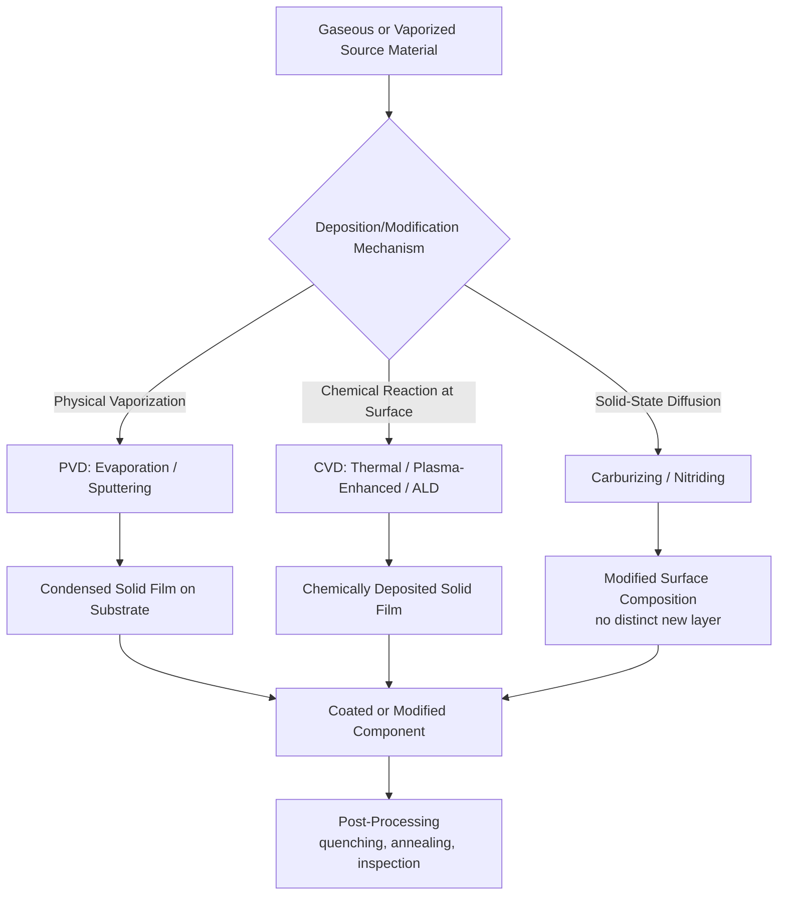

## Vapor and Gas-Phase Starting-Material Processes

### Definition and Scope

Vapor and gas-phase starting-material processes are a category within the classification of manufacturing processes by state of starting material, in which the primary reactant or source material is introduced and processed in the gaseous or vapor state, and the finished solid product is built up, modified, or coated through condensation, reaction, or diffusion of species from that gas phase. This stands apart from liquid/molten, solid bulk, and powder/particulate categories in that the starting material has no fixed volume or shape at all—it fills and flows through the processing chamber/reactor, and the solid product forms via a phase transition or chemical reaction occurring at or near a solid substrate surface.

The defining mechanism is **gas-to-solid transformation**, occurring through one or more of the following pathways:

- **Physical condensation**: a vaporized solid or liquid source condenses directly onto a cooler substrate surface
- **Chemical reaction/decomposition**: gaseous precursor molecules react at or near a heated substrate surface, depositing a solid reaction product while releasing gaseous byproducts
- **Diffusion into a solid substrate**: gaseous species diffuse into the surface of an existing solid substrate, modifying its composition/properties without depositing a distinct new layer (e.g., surface hardening treatments)

### Key Points

- **Atomic/molecular-scale material addition or modification**: unlike bulk, sheet, or powder processes that manipulate macroscopic quantities of material, gas-phase processes typically build or modify material one atomic or molecular layer at a time, enabling extremely fine control of thickness, composition, and microstructure (down to nanometer-scale precision in advanced processes).
- **Two broad sub-categories**: (1) deposition processes, which add a new layer of material onto a substrate surface, and (2) diffusion/modification processes, which alter the composition of an existing solid substrate's surface region without necessarily adding a macroscopically distinct layer.
- **Vacuum or controlled-atmosphere environments are typical**: many gas-phase processes require vacuum chambers (to control mean free path, reduce contamination, and enable directional deposition) or carefully controlled reactive/inert gas atmospheres (to control reaction stoichiometry and prevent unwanted oxidation).
- **Applicable across virtually all material classes**: metals, ceramics, semiconductors, and polymers can all be deposited or modified via gas-phase routes, making this category foundational to semiconductor fabrication, optical coatings, wear-resistant tool coatings, and corrosion protection.
- **Deposition rate and uniformity govern process economics**: gas-phase processes are generally slower (often measured in nanometers to micrometers per hour or per minute) than bulk, casting, or powder consolidation processes, making them best suited to thin films, coatings, and surface treatments rather than bulk part fabrication—though notable exceptions exist (chemical vapor infiltration for bulk composite fabrication, epitaxial bulk crystal growth).

### Major Process Families

#### 1. Physical Vapor Deposition (PVD)

PVD processes generate a vapor of the source (coating) material through physical means (heating, bombardment) and transport it through a vacuum or low-pressure environment to condense on the substrate, without a chemical reaction being the primary deposition mechanism (though reactive PVD variants introduce a reactive gas).

- **Thermal evaporation**: source material heated (resistively, or via electron beam) in a vacuum chamber until it vaporizes; vapor travels in a straight line (line-of-sight) and condenses on the cooler substrate
- **Sputtering**: energetic ions (typically argon, generated in a plasma) bombard a solid target, ejecting (sputtering) target atoms that travel to and condense on the substrate; magnetron sputtering uses magnetic fields to confine and intensify the plasma near the target, improving deposition rate
- **Cathodic arc deposition**: an electric arc vaporizes target material at a small, highly energetic cathode spot, producing a highly ionized vapor plume
- **Reactive PVD**: a reactive gas (nitrogen, oxygen, or a hydrocarbon) is introduced during evaporation or sputtering, reacting with the vaporized metal to deposit a compound coating (e.g., titanium nitride, TiN, from titanium sputtering in a nitrogen atmosphere)

**Example (Sputtering Sequence):**

1. Vacuum chamber evacuated to a base pressure (commonly on the order of $10^{-6}$ to $10^{-8}$ torr) to minimize contamination
2. Inert process gas (typically argon) backfilled to a working pressure (commonly millitorr range)
3. High voltage applied between target (cathode) and chamber, ionizing the argon gas into a plasma
4. Energetic argon ions accelerate toward and bombard the target, ejecting target atoms via momentum transfer
5. Ejected atoms travel across the chamber and condense on the substrate, building up a thin film
6. Film thickness controlled by deposition time, power, and target-substrate distance

[Inference: specific pressure ranges and deposition rates vary substantially by equipment configuration, target material, and desired film properties; figures given represent commonly documented ranges for research and industrial sputtering systems.]

#### 2. Chemical Vapor Deposition (CVD)

CVD processes introduce gaseous chemical precursors into a reaction chamber, where they react or decompose at or near a heated substrate surface, depositing a solid film while releasing volatile byproducts that are exhausted from the chamber.

- **Atmospheric pressure CVD (APCVD)**: performed near atmospheric pressure, generally offering high deposition rates but comparatively less film uniformity control
- **Low-pressure CVD (LPCVD)**: performed at reduced pressure, improving film uniformity and step coverage over complex substrate geometries, common in semiconductor processing
- **Plasma-enhanced CVD (PECVD)**: a plasma is used to enhance precursor reactivity, allowing deposition at lower substrate temperatures than thermal CVD alone would require
- **Metal-organic CVD (MOCVD)**: uses metal-organic compound precursors, widely used for compound semiconductor and LED epitaxial layer growth
- **Atomic layer deposition (ALD)**: a specialized, self-limiting CVD variant in which precursor gases are introduced sequentially (rather than simultaneously), with each precursor reacting only until the surface is fully saturated, depositing one atomic layer per reaction cycle—offering exceptional thickness control and conformality on complex 3D geometries

**Example (Thermal CVD Sequence — Silicon Deposition):**

1. Substrate (e.g., silicon wafer) placed in a heated reaction chamber
2. Gaseous precursor (e.g., silane, $SiH_4$) introduced into the chamber along with carrier gas
3. At the heated substrate surface, the precursor decomposes thermally: $SiH_4 \rightarrow Si + 2H_2$
4. Solid silicon deposits on the substrate surface; hydrogen gas byproduct is exhausted
5. Deposition continues until target film thickness is achieved, controlled by precursor flow rate, chamber pressure, substrate temperature, and time

**Example (Atomic Layer Deposition Cycle):**

1. Precursor A pulsed into the chamber, chemisorbing onto the substrate surface until saturation (self-limiting reaction, excess precursor does not react further)
2. Purge step removes excess unreacted precursor A and gaseous byproducts
3. Precursor B pulsed into the chamber, reacting with the chemisorbed surface layer from precursor A to complete one monolayer (or sub-monolayer) of the target film
4. Second purge step removes excess precursor B and byproducts
5. Cycle repeated (commonly tens to thousands of times) to build the desired film thickness, with thickness controlled precisely by cycle count rather than time/rate alone

#### 3. Gas-Phase Diffusion and Surface Modification Processes

These processes use a gas-phase source to diffuse a modifying species into the surface region of an existing solid substrate, altering composition and properties without depositing a macroscopically distinct new layer.

- **Gas carburizing**: a carbon-rich gas atmosphere (e.g., methane or propane-derived) diffuses carbon into the surface of low-carbon steel at elevated temperature (commonly 850–950°C), increasing surface carbon content to enable subsequent hardening (quenching) for wear-resistant, fatigue-resistant surfaces over a tough core
- **Gas nitriding**: ammonia gas dissociates at the heated steel surface (commonly 500–550°C), diffusing nitrogen into the surface to form hard nitride compounds without requiring subsequent quenching
- **Carbonitriding**: combines carbon and nitrogen diffusion from a gas atmosphere containing both carbon-bearing and nitrogen-bearing gases
- **Ion implantation**: a distinct but related technique in which ionized species are accelerated and physically embedded into a substrate surface using an electric field (technically a beam process rather than a diffusion-driven gas process, but commonly grouped with surface modification techniques given its similar functional outcome)

**Example (Gas Carburizing Sequence):**

1. Low-carbon steel parts loaded into a furnace with a controlled carburizing atmosphere (endothermic gas enriched with natural gas or propane)
2. Furnace heated to austenitizing temperature (commonly 850–950°C), at which carbon solubility in the steel's crystal structure (austenite) is significantly higher than at room temperature
3. Carbon from the gas atmosphere diffuses into the steel surface, following Fick's laws of diffusion, establishing a carbon concentration gradient from the surface inward
4. Parts held at temperature for a duration calculated to achieve the desired case depth
5. Parts quenched (directly or after reheating) to transform the now carbon-enriched surface layer into hard martensite, while the low-carbon core remains comparatively soft and tough

**Case depth** (a key design parameter in carburizing/nitriding) is commonly estimated using a diffusion-based relationship derived from Fick's second law:

$$x \approx K\sqrt{Dt}$$

where $x$ is approximate case depth, $D$ is the temperature-dependent diffusion coefficient of the diffusing species in the substrate material, $t$ is time at temperature, and $K$ is a proportionality constant related to the target concentration threshold defining the case boundary. [Inference: this is a simplified approximation; precise case depth prediction in industrial practice typically relies on empirical process charts or numerical diffusion simulation calibrated to the specific steel grade and furnace atmosphere.]

#### 4. Bulk and Specialty Gas-Phase Processes

- **Epitaxial crystal growth**: CVD-based growth of a single-crystal layer that maintains crystallographic registry with the underlying substrate, foundational to semiconductor device fabrication (e.g., silicon epitaxy, gallium nitride/gallium arsenide compound semiconductor growth)
- **Chemical vapor infiltration (CVI)**: gaseous precursor infiltrates and deposits within a porous fiber preform (rather than only on an external surface), used to produce ceramic matrix composites (e.g., carbon-carbon and silicon carbide-silicon carbide composites for aerospace and brake applications)
- **Vapor deposition of diamond and diamond-like carbon (DLC) coatings**: CVD-grown diamond films for cutting tool coatings and thermal management applications
- **Thermal spray processes** (plasma spray, HVOF): while the feedstock is typically powder or wire, the material is melted/heated and propelled as a stream of molten or semi-molten droplets in a gas/plasma jet; sometimes discussed alongside gas-phase processes due to the gas-jet-driven transport mechanism, though the deposition mechanism (droplet impact and splat solidification) differs fundamentally from true vapor condensation

### Process Comparison Table

| Process | Mechanism | Typical Deposition/Diffusion Rate | Typical Applications |
| --- | --- | --- | --- |
| Thermal Evaporation (PVD) | Physical vaporization + condensation | Moderate (nm/s range) | Optical coatings, reflective films |
| Sputtering (PVD) | Ion bombardment + condensation | Moderate (nm/min to nm/s) | Hard coatings, semiconductor metallization |
| Thermal CVD | Gas-phase chemical reaction at surface | Moderate to high (process-dependent) | Semiconductor films, wear coatings |
| Atomic Layer Deposition | Sequential self-limiting surface reactions | Very low (sub-nm/cycle) but highly conformal | Advanced semiconductor gate dielectrics, barrier layers |
| Gas Carburizing | Solid-state diffusion from gas atmosphere | Case depth in mm over hours | Gears, shafts, bearing races |
| Gas Nitriding | Solid-state diffusion from gas atmosphere | Shallow case depth over many hours | Tool steel components, precision gears |

### Process Flow Diagram

### Governing Physical Principles

**Deposition rate in evaporation-type PVD**, related to source vapor pressure and geometric factors (simplified line-of-sight model):

$$R \propto \frac{P_v}{\sqrt{M T}} \times \frac{\cos\theta_1 \cos\theta_2}{r^2}$$

where $P_v$ is the source vapor pressure at the evaporation temperature, $M$ is molar mass, $T$ is absolute temperature, $\theta_1$ and $\theta_2$ are angles relating source and substrate orientation, and $r$ is source-to-substrate distance—illustrating why line-of-sight PVD processes are sensitive to chamber geometry and substrate positioning.

**Fick's first law of diffusion**, governing steady-state diffusive flux in carburizing, nitriding, and related surface modification processes:

$$J = -D\frac{\partial C}{\partial x}$$

where $J$ is diffusive flux, $D$ is the diffusion coefficient, and $\partial C/\partial x$ is the concentration gradient. The temperature dependence of $D$ typically follows an Arrhenius relationship:

$$D = D_0 \exp\left(\frac{-Q}{RT}\right)$$

where $D_0$ is a pre-exponential factor, $Q$ is activation energy for diffusion, $R$ is the gas constant, and $T$ is absolute temperature—explaining why case-hardening processes are highly sensitive to processing temperature.

**Mean free path** in vacuum-based PVD processes, governing whether vaporized atoms travel in straight, collision-free paths (line-of-sight deposition) or undergo scattering collisions (as in sputtering at higher working pressures):

$$\lambda = \frac{k_B T}{\sqrt{2}\pi d^2 P}$$

where $\lambda$ is mean free path, $k_B$ is Boltzmann's constant, $T$ is absolute temperature, $d$ is molecular diameter, and $P$ is gas pressure.

### Advantages and Limitations

**Advantages:**

- Enables extremely precise control of film thickness and composition, down to atomic-layer precision in ALD, unattainable by any bulk, sheet, or powder process
- Excellent conformal coverage achievable (particularly CVD and ALD) over complex 3D geometries, including high-aspect-ratio features critical to modern semiconductor devices
- Surface modification processes (carburizing, nitriding) allow independent optimization of surface properties (hardness, wear resistance) and bulk properties (toughness, core strength) within a single component
- Applicable to a vast range of materials and material combinations, including depositing materials that cannot be easily processed via melting or powder routes (certain refractory compounds, semiconductor heterostructures)

**Limitations:**

- Generally low deposition rates relative to bulk material processes, restricting economical application primarily to thin films, coatings, and surface treatments rather than bulk part fabrication
- Vacuum and controlled-atmosphere equipment requirements (chambers, pumps, precursor handling/safety systems) impose significant capital cost and operational complexity
- Many CVD precursors are toxic, pyrophoric, or corrosive, requiring stringent gas handling, containment, and abatement systems
- Process control requires tight management of multiple interdependent variables (temperature, pressure, gas flow, plasma power), and defects (pinholes, stress-induced film cracking, non-uniformity) can be sensitive to small process deviations

### Related Topics

- Semiconductor thin-film fabrication and photolithography integration
- Thermochemical surface hardening treatments (carburizing, nitriding, carbonitriding) and case depth design
- Thermal spray coating processes (plasma spray, HVOF, cold spray) and their relationship to gas-phase transport
- Vacuum technology and pumping systems for PVD/CVD equipment
- Classification by liquid and molten starting-material processes
- Classification by solid bulk and powder starting-material processes
- Plasma physics fundamentals relevant to sputtering and PECVD
- Chemical vapor infiltration for ceramic matrix composite fabrication
- Diffusion coefficient determination and Arrhenius kinetics in materials processing
- Coating adhesion testing and failure mechanisms (delamination, spallation)