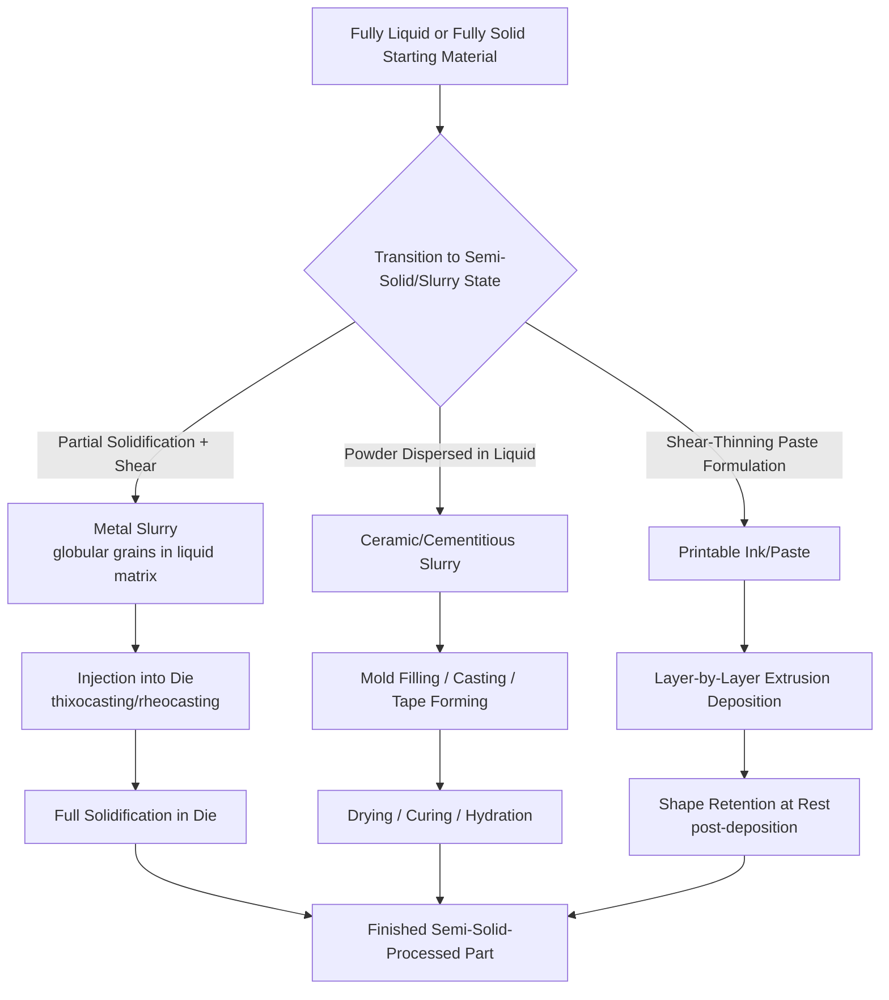

## Semi-Solid and Slurry Starting-Material States

### Definition and Scope

Semi-solid and slurry starting-material states form a category within the classification of manufacturing processes by state of starting material, occupying a distinct physical regime between fully liquid/molten and fully solid states. The material exists as a **two-phase mixture**—a suspension of solid particles or a partially solidified solid fraction distributed within a continuous liquid matrix—exhibiting rheological behavior that is neither purely liquid (freely flowing, no yield stress) nor purely solid (rigid, no flow under applied stress).

This category is distinguished from adjacent classifications as follows:

- **Liquid/molten processes**: the material is fully liquid, with viscosity dominated by the liquid phase alone
- **Solid bulk processes**: the material is fully solid, with deformation governed by classical plasticity
- **Powder/particulate processes**: discrete dry particles with no continuous liquid binding phase (though slurries technically contain particulates suspended in liquid, the presence of a continuous liquid carrier phase distinguishes slurry processing from dry powder processing)

The defining physical characteristic is a **solid fraction** (the proportion of solid phase, by volume, within the overall material) that is neither 0% (fully liquid) nor 100% (fully solid), typically ranging from roughly 10% to 60% solid fraction depending on the specific process, combined with **non-Newtonian, often thixotropic rheology**—viscosity that decreases under applied shear and may partially recover at rest.

### Key Points

- **Thixotropic behavior is central to most semi-solid metal processes**: when subjected to shear (stirring, agitation), the semi-solid slurry exhibits reduced apparent viscosity and can flow like a thick liquid; at rest, the microstructure partially reforms and the material behaves more like a soft solid, a property deliberately engineered through controlled solidification structure (globular rather than dendritic grains).
- **Reduced solidification shrinkage and porosity** relative to fully liquid casting is a major process driver: because a substantial fraction of the material is already solid when it enters the die/mold, volumetric shrinkage during final solidification is smaller, often yielding castings with lower porosity and improved mechanical properties.
- **Lower processing temperatures** than conventional casting: because the material is already partially solid, semi-solid processing occurs at temperatures below the fully liquid temperature (liquidus), reducing thermal shock to tooling/dies, extending die life, and reducing energy input compared to processing a fully molten melt.
- **Slurry-based processes span multiple material domains**: beyond semi-solid metal forming, slurry states are fundamental to ceramic processing (slip casting, tape casting), cementitious materials (concrete, mortar), and certain composite/additive manufacturing feedstocks (vat photopolymerization resins loaded with ceramic or metal particles, direct ink writing pastes).
- **Rheology control is the primary process variable**: unlike fully liquid processes (governed mainly by viscosity and fluidity) or fully solid processes (governed by flow stress and strain hardening), semi-solid/slurry processes require careful control of solid fraction, particle/grain morphology, shear history, and yield stress to achieve consistent, predictable flow behavior.

### Major Process Families

#### 1. Semi-Solid Metal (SSM) Forming

Semi-solid metal processing exploits the thixotropic behavior of metal alloys (most commonly aluminum, and to a lesser extent magnesium alloys) processed at a temperature between the solidus and liquidus, where the microstructure consists of rounded (globular) primary solid grains suspended in a liquid matrix, rather than the interconnected dendritic structure typical of conventional as-cast metal.

- **Thixocasting**: pre-formed semi-solid billets (produced separately with the required globular microstructure) are reheated to the semi-solid temperature range and then injected into a die, similar in machine configuration to die casting
- **Rheocasting**: the semi-solid slurry is generated directly from fully liquid metal immediately prior to shaping (via controlled cooling with agitation, or specialized slurry-generation techniques), eliminating the need for pre-formed billet stock
- **Thixomolding**: primarily associated with magnesium alloy processing, feeding magnesium chips/granules into a heated barrel (similar to injection molding machinery) where they are converted to a semi-solid slurry via mechanical shearing and controlled heating, then injected into a die

**Example (Rheocasting Sequence — Simplified):**

1. Molten metal alloy cooled from a fully liquid state while subjected to vigorous stirring, mechanical agitation, or specialized nucleation-promoting treatment (e.g., electromagnetic stirring, or introduction of a cooling slope/channel)
2. Controlled cooling and shear promote formation of fine, globular (rather than dendritic) primary solid grains, suspended within remaining liquid metal
3. The resulting thixotropic slurry, at the target solid fraction (commonly 30–50%), is transferred to a shot sleeve
4. Slurry injected into a die cavity under pressure, similar to high-pressure die casting, but at lower velocities to preserve the globular structure and minimize turbulence/air entrapment
5. Part solidifies fully within the die and is ejected

[Inference: exact solid fraction targets and processing temperatures are alloy-specific and process-variant-specific; figures given represent commonly cited ranges in semi-solid processing literature.]

**Example (Thixocasting Sequence):**

1. Specially processed billet stock (produced with a globular, non-dendritic as-cast structure via prior electromagnetic stirring or other grain-refining technique during initial casting) is sectioned into slugs
2. Slug reheated (often via induction heating) to the target semi-solid temperature range, converting a controlled fraction of the billet to liquid while retaining a globular solid skeleton
3. Semi-solid slug transferred to the shot sleeve of a modified die-casting machine
4. Slug injected into the die cavity under controlled pressure and velocity
5. Part solidifies and is ejected, exhibiting reduced porosity and improved mechanical properties relative to conventional die casting of the same alloy

#### 2. Ceramic and Refractory Slurry Processes

Slurry states are foundational to shaping ceramic and refractory materials, where fine powder is suspended in a liquid carrier (commonly water, with organic binders and dispersants) to enable flow-based shaping methods.

- **Slip casting**: ceramic slurry ("slip") is poured into a porous mold (traditionally plaster of Paris); capillary action draws liquid from the slurry into the porous mold wall, depositing a layer of solid ceramic particles against the mold surface; excess slip is drained (drain casting) or the process continued until the cavity is filled (solid casting)
- **Tape casting (doctor blade process)**: ceramic slurry is spread into a thin, uniform layer on a moving carrier film using a precision blade (doctor blade), then dried to form a flexible "green tape," widely used for multilayer ceramic capacitors and substrates
- **Gel casting**: ceramic slurry containing a monomer/polymer system is cast into a mold and then gelled in situ via a chemical polymerization reaction, producing a strong, uniform green body
- **Freeze casting (ice templating)**: aqueous ceramic slurry is directionally frozen, with ice crystals excluding ceramic particles and forming a templated porous structure after the ice is sublimated (freeze-dried) and the green body sintered

**Example (Slip Casting Sequence):**

1. Ceramic powder dispersed in water with deflocculant (dispersant) additions to control slurry viscosity and prevent particle agglomeration
2. Slurry poured into a porous plaster mold cavity
3. Capillary suction from the plaster mold draws water from the slurry adjacent to the mold wall, depositing a consolidated ceramic layer
4. For hollow (drain-cast) parts, excess slip is poured out once the desired wall thickness has built up; for solid parts, the mold remains filled until fully consolidated
5. Cast part dried, removed from the mold, and subsequently fired (sintered) to achieve final density and strength

#### 3. Cementitious and Construction Material Slurries

- **Concrete casting**: a slurry of cement, water, and aggregate (sand, gravel) is poured or pumped into formwork, where it undergoes a chemical hydration reaction, progressively transitioning from a fluid/plastic slurry state to a rigid solid
- **Grouting**: fluid cementitious or resin-based slurries injected into voids, cracks, or annular spaces to provide structural bonding or sealing
- **Shotcrete/gunite**: cementitious slurry pneumatically sprayed onto a surface, combining slurry-state material delivery with a spray-application shaping method

**Concrete slump**, a standard workability/consistency measure for fresh concrete slurry, is assessed via the slump test (ASTM C143 / equivalent standards), measuring the vertical settlement of a standard conical sample after mold removal—higher slump values indicate more fluid, less viscous slurry consistency.

#### 4. Slurry-Based Additive Manufacturing and Advanced Materials Processing

- **Direct ink writing (DIW) / robocasting**: a shear-thinning paste or slurry (ceramic, metal, or composite particle-loaded) is extruded through a nozzle and deposited layer by layer, relying on the slurry's rheological transition from flowable (under shear, in the nozzle) to shape-retaining (at rest, after deposition) to build 3D structures without a mold
- **Vat photopolymerization with particle-loaded resins**: liquid photopolymer resin loaded with ceramic or metal powder (forming a particle-laden slurry) is selectively cured layer by layer using light (stereolithography, digital light processing), followed by binder burnout and sintering to produce dense ceramic or metal parts
- **Slurry-based binder jetting variants**: certain advanced binder jetting processes use a slurry (rather than dry powder bed) as the base material layer, improving achievable packing density

**Example (Direct Ink Writing Rheological Requirement):**

The ink/paste must exhibit shear-thinning (pseudoplastic) behavior—low viscosity under the high shear rate experienced while passing through the extrusion nozzle, but rapid viscosity recovery (high apparent viscosity, sufficient yield stress) immediately after deposition to retain the printed filament shape and support subsequent layers without slumping or collapse.

### Process Comparison Table

| Process | Solid Phase Type | Liquid/Continuous Phase | Typical Products |
| --- | --- | --- | --- |
| Rheocasting/Thixocasting | Globular primary metal grains | Remaining liquid metal | Automotive suspension/structural components |
| Slip Casting | Ceramic particles | Water + dispersant | Sanitaryware, technical ceramics, art pottery |
| Tape Casting | Ceramic particles | Solvent + organic binder | Multilayer capacitors, ceramic substrates |
| Concrete Casting | Cement + aggregate | Water (hydration reaction) | Structural elements, precast panels |
| Direct Ink Writing | Ceramic/metal particles | Polymer binder/carrier paste | Lattice structures, bio-scaffolds, electronics |

### Process Flow Diagram

### Governing Physical Principles

**Solid fraction** as a function of temperature between solidus and liquidus, often approximated using the Scheil equation or lever rule for simplified binary alloy systems:

$$f_s = \frac{T_L - T}{T_L - T_S}$$

(simplified lever-rule approximation) where $f_s$ is solid fraction, $T$ is the current temperature, $T_L$ is liquidus temperature, and $T_S$ is solidus temperature. [Inference: this simplified lever-rule relationship assumes equilibrium solidification and complete diffusion; actual industrial alloys often deviate from this idealization, and Scheil-type non-equilibrium models or empirical solid-fraction curves are frequently used in practice.]

**Thixotropic (shear-thinning) rheological behavior** is commonly described using a power-law (Ostwald-de Waele) model:

$$\tau = K\dot{\gamma}^n$$

where $\tau$ is shear stress, $\dot{\gamma}$ is shear rate, $K$ is the consistency index, and $n$ is the flow behavior index; for shear-thinning (pseudoplastic) materials characteristic of semi-solid slurries and printable pastes, $n < 1$.

**Bingham plastic model**, frequently applied to cementitious slurries and certain ceramic slips exhibiting a yield stress before flow initiates:

$$\tau = \tau_0 + \mu_p \dot{\gamma}$$

where $\tau_0$ is the yield stress (minimum stress required to initiate flow) and $\mu_p$ is the plastic viscosity.

### Advantages and Limitations

**Advantages:**

- Reduced solidification shrinkage porosity and improved mechanical properties (compared to fully liquid casting of the same alloy) due to the pre-existing solid fraction limiting the volume of material undergoing final liquid-to-solid transformation
- Lower processing temperatures reduce thermal shock to dies/molds, potentially extending tooling life and reducing energy consumption relative to conventional casting of the same material
- Laminar, controlled die/mold filling (in semi-solid metal forming) reduces turbulence-related defects such as air entrapment and oxide inclusion compared to high-velocity liquid die casting
- Slurry-based ceramic and additive processes enable high solids loading and complex net-shape green body formation not readily achievable via dry powder pressing alone, particularly for thin, flat, or intricately shaped parts

**Limitations:**

- Precise control of solid fraction, temperature, and shear history is critical and process-sensitive; deviations can lead to inconsistent flow behavior, incomplete die filling, or segregation between solid and liquid phases
- Specialized feedstock preparation (globular-structure billets for thixocasting, deflocculated slurries for slip casting) adds process steps and cost compared to conventional fully liquid or fully solid processing routes
- Drying and binder/solvent removal steps in ceramic and slurry-based additive processes introduce shrinkage and potential cracking risks that must be carefully managed through controlled drying schedules
- Equipment for semi-solid metal processing (specialized reheating furnaces, modified die-casting machinery) represents a more specialized capital investment compared to conventional casting equipment [Inference: relative cost-effectiveness depends heavily on production volume, part complexity, and alloy system, and should be evaluated against conventional process alternatives for a specific application]

### Related Topics

- Classification by liquid and molten starting-material processes
- Classification by particulate and powder starting-material processes
- Thixotropy and rheological characterization methods (rotational viscometry, rheometry)
- Solidification microstructure control (globular vs. dendritic grain morphology)
- Slip rheology and deflocculation in ceramic processing
- Green body drying and shrinkage management in ceramic manufacturing
- Concrete mix design and hydration kinetics
- Direct ink writing and robocasting for advanced ceramics and bioprinting
- Scheil solidification modeling and non-equilibrium phase transformation
- Semi-solid metal forming equipment and die design considerations