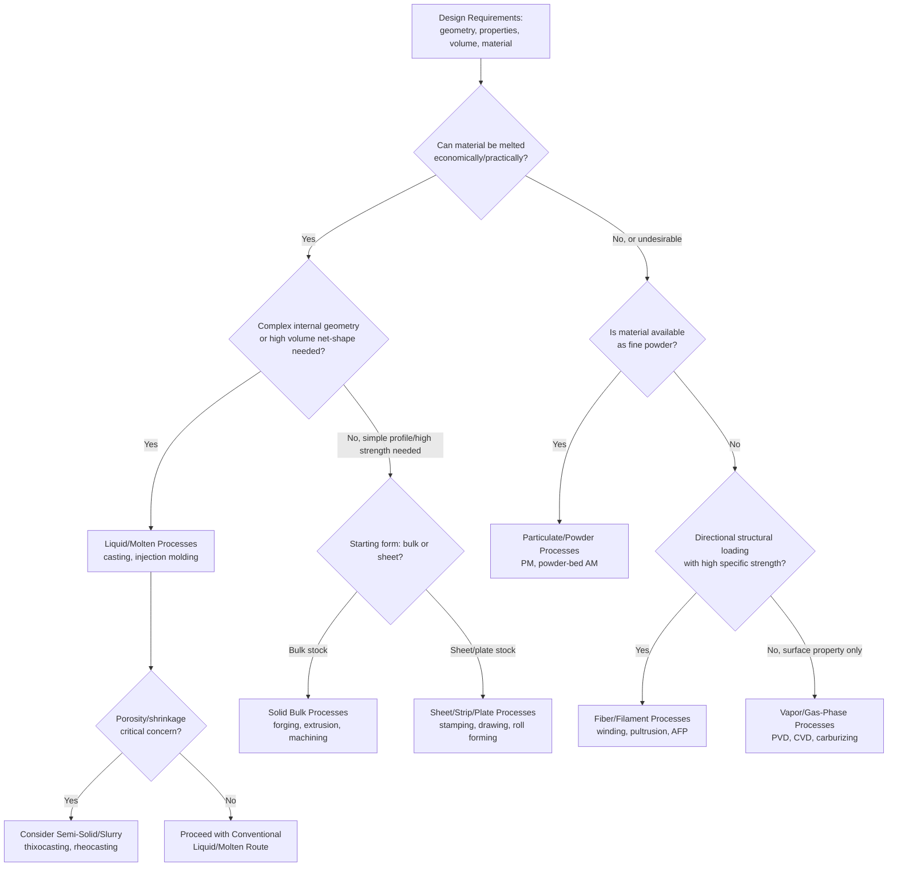

## Linking Starting-Material State to Process-Family Choice

### Definition and Scope

This topic synthesizes the classification framework covered across liquid/molten, solid bulk, sheet/strip/plate, particulate/powder, fiber/filament, vapor/gas-phase, and semi-solid/slurry starting-material states into a unified decision framework. It addresses how the physical state of the input material fundamentally constrains, enables, and directs the selection of an appropriate manufacturing process family for a given design, material system, and production context.

The underlying premise is that **starting-material state is not an incidental classification detail but a primary engineering decision variable**: it determines which shape-generation mechanisms are physically available (solidification, plastic deformation, material removal, particle consolidation, strand assembly, vapor condensation/diffusion), and therefore constrains the achievable geometry, achievable properties, economic viability at a given production volume, and the secondary processing steps required to reach a finished part.

### Key Points

- **Starting-material state determines the available shape-fixing mechanism**: liquid/molten states fix shape via solidification/curing; solid bulk states fix shape via deformation or removal (already solid, no phase change); powder states fix shape via particle consolidation (compaction plus sintering/bonding); fiber/filament states fix shape via strand assembly (weaving, winding, bonding); vapor/gas states fix shape via condensation or diffusion; semi-solid/slurry states fix shape via a combination mechanism (partial solidification, hydration, or drying).
- **Material state and material class are interdependent but distinct axes**: the same base material (e.g., aluminum, or a given polymer) can often be processed starting from multiple different states (molten for casting, solid bar for machining, powder for PM/additive manufacturing), meaning the process-family decision is not dictated by material alone but by the combination of material, required geometry, and production context.
- **Geometric complexity and starting-material state are strongly linked**: fluid-based starting states (liquid, molten, powder-with-binder, gas-phase deposition) generally offer greater freedom for complex internal and external geometry in a single step, while solid bulk states generally require multiple sequential operations (deformation plus machining) to achieve equivalent complexity.
- **Production volume economics vary systematically by starting-material state**: processes starting from liquid/molten or powder states (casting, injection molding, PM press-and-sinter) typically carry high tooling cost but low per-part cost, favoring high volumes; processes starting from solid bulk stock via machining typically carry lower tooling cost but higher per-part cost/time, favoring low-to-medium volumes or high-complexity/low-volume parts; sheet-based stamping processes sit similarly to casting/molding in favoring high volume once dies are developed.
- **Property outcomes differ systematically by starting state**: deformation-based bulk processes (forging, rolling) generally produce favorable, directionally-oriented microstructures beneficial to fatigue and toughness; casting/molten-state processes produce more isotropic but potentially porosity-affected microstructures; powder-based processes produce microstructures with characteristic (and sometimes engineered) porosity; fiber-based processes produce inherently anisotropic, direction-dependent properties.

### Decision Framework: Matching State to Process Family

#### Step 1 — Material and Melting/Processing Behavior

The first constraint is often whether the material *can* practically be melted, is available as powder, or must remain solid. Materials with very high melting points (tungsten, certain refractory ceramics) are frequently processed via powder/particulate routes precisely because melting is impractical; conversely, materials that decompose rather than melt (certain thermosets, some ceramics) cannot use molten-state processes at all and instead rely on reactive/curing liquid-state routes or solid-state processing.

#### Step 2 — Geometric Complexity and Feature Requirements

- Complex internal passages, thin walls, or intricate 3D geometry in a single step → favors **liquid/molten** (investment casting, injection molding) or **powder-bed additive** (vapor/particulate) routes
- Constant cross-section, elongated profiles → favors **solid bulk deformation** (extrusion, rolling, pultrusion from fiber/resin) or **wire drawing**
- Thin-walled, large-surface-area, relatively simple 3D curvature → favors **sheet/strip/plate** forming (stamping, drawing, hydroforming)
- High precision, tight tolerances, low-to-moderate geometric complexity from a pre-existing blank → favors **solid bulk machining**
- Directionally loaded structural members requiring high specific strength/stiffness → favors **fiber/filament**-based composite processes
- Thin films, surface coatings, or surface property modification only (no bulk shape change) → favors **vapor/gas-phase** processes
- Near-net-shape casting with reduced porosity/shrinkage relative to conventional casting → favors **semi-solid/slurry** processes

#### Step 3 — Production Volume and Tooling Economics

| Starting-Material State | Typical Tooling Cost | Typical Per-Part Cost/Cycle Time | Volume Sweet Spot |
| --- | --- | --- | --- |
| Liquid/Molten (die casting, injection molding) | High | Low | High volume |
| Liquid/Molten (sand/investment casting) | Low-Moderate | Moderate-High | Low-Moderate volume |
| Solid Bulk (machining) | Low | Moderate-High | Low-Moderate volume, high complexity |
| Solid Bulk (forging, extrusion) | High | Low-Moderate | Moderate-High volume |
| Sheet/Strip/Plate (stamping) | High | Very Low | High volume |
| Particulate/Powder (PM press-sinter) | High | Low | High volume, moderate complexity |
| Particulate/Powder (powder-bed AM) | Very Low (no dedicated tooling) | High | Low volume, high complexity |
| Fiber/Filament (filament winding, pultrusion) | Moderate-High | Moderate | Moderate volume, structural applications |
| Vapor/Gas-Phase | High (equipment) | Low per unit area, but process is slow | Thin films/coatings regardless of volume |
| Semi-Solid/Slurry | Moderate-High | Low-Moderate | Moderate-High volume |

[Inference: relative cost positioning is directional and illustrative; actual tooling and per-part costs depend heavily on part size, material, precision requirements, and regional labor/energy costs, and should be validated against quotations for a specific application.]

#### Step 4 — Required Mechanical/Functional Properties

- Fatigue-critical, structurally loaded components (crankshafts, aircraft structural fittings) → favors **solid bulk deformation** (forging) due to favorable grain flow, often followed by machining for final features
- Components requiring isotropic properties and complex shape with moderate property requirements → favors **liquid/molten casting**
- Wear-resistant surfaces on tough substrates → favors **vapor/gas-phase diffusion** (carburizing, nitriding) or **PVD/CVD coatings**
- Lightweight, high-stiffness structural members with directional loading → favors **fiber/filament** composite processes
- Engineered porosity (filters, self-lubricating bearings) → favors **particulate/powder** processes
- Reduced porosity/improved properties versus conventional casting at moderate complexity → favors **semi-solid/slurry** metal forming

### Cross-Category Comparison Table

| Starting State | Shape-Fixing Mechanism | Primary Geometric Strength | Primary Property Characteristic |
| --- | --- | --- | --- |
| Liquid/Molten | Solidification/curing | Complex internal/external geometry, net shape | Isotropic; porosity risk |
| Solid Bulk (deformation) | Plastic flow, volume conserved | Elongated/constant cross-section profiles | Favorable grain flow, strain hardening |
| Solid Bulk (machining) | Material removal | Precision features, tight tolerances | Governed by starting stock properties |
| Sheet/Strip/Plate | Bending, stretching, shearing | Thin-walled, large-surface-area shapes | Approximately constant thickness, directional formability |
| Particulate/Powder | Particle consolidation (compaction + sinter) | Near-net-shape, complex 3D (esp. AM) | Characteristic/engineered porosity |
| Fiber/Filament | Strand assembly + matrix bonding | Elongated, directionally loaded structures | Strongly anisotropic |
| Vapor/Gas-Phase | Condensation or diffusion | Thin films, surface layers only | Atomic-scale precision, surface-localized |
| Semi-Solid/Slurry | Partial solidification/hydration/drying | Near-net-shape with reduced shrinkage defects | Intermediate between cast and wrought |

### Decision Flow Diagram

### Worked Example: Selecting a Process Family for an Automotive Component

**Component requirement**: a structural aluminum suspension arm requiring high fatigue strength, moderate geometric complexity, and production volume of approximately 100,000 units/year.

**Applying the framework:**

1. Material (aluminum alloy) can be readily melted — liquid/molten routes are physically available
2. Fatigue-critical structural application → favors solid bulk deformation (forging) over casting, due to superior grain flow and fatigue performance
3. High production volume (100,000/year) → favors a process with high tooling cost but low per-part cost, consistent with closed-die forging
4. Moderate geometric complexity → achievable via closed-die forging with subsequent machining of precision features (bushings bores, fastener holes)

**Resulting process family selection**: solid bulk deformation (closed-die hot forging) as the primary shape-generating process, followed by solid bulk machining for precision features — illustrating how fatigue-critical structural requirements can override the geometric-complexity advantages that might otherwise favor a liquid/molten (casting) route.

**Alternative context**: if the same component instead prioritized minimum cost at lower volume (10,000 units/year) with less severe fatigue requirements, a liquid/molten route (permanent mold or die casting) might be favored instead, illustrating how production volume and property criticality jointly shift the optimal starting-material-state selection, not material alone.

### Common Selection Pitfalls

- **Defaulting to a familiar process family without reassessing state-appropriateness**: selecting casting for a part later found to require forging-level fatigue performance, or vice versa, selecting forging for low-volume, geometrically simple parts where casting or machining would be more economical
- **Underestimating secondary processing requirements**: solid bulk machining from bar stock may appear simpler than casting but can require substantially more material removal (and associated cost/waste) if the starting stock geometry is poorly matched to final part geometry
- **Overlooking property anisotropy consequences**: selecting a fiber/filament or heavily deformed bulk process without fully accounting for the resulting directional property variation in structural analysis
- **Ignoring porosity sensitivity in liquid/molten selection**: choosing conventional sand or die casting for a pressure-critical or fatigue-critical application where semi-solid processing or forging would better address porosity-related property degradation

### Advantages and Limitations of the Framework

**Advantages:**

- Provides a systematic, first-principles starting point for process selection before detailed process-specific analysis, reducing the risk of overlooking viable alternative starting-material states
- Clarifies the fundamental trade-offs (geometry vs. properties vs. volume economics) that any specific process-family choice must resolve
- Applicable across material classes (metals, ceramics, polymers, composites), since the state-based logic is rooted in physical mechanism rather than material-specific rules alone

**Limitations:**

- Real-world process selection involves numerous additional factors beyond starting-material state alone (supply chain, existing equipment/capability, regional cost structures, regulatory/certification requirements) that this framework does not capture
- Boundaries between categories are not always sharp (e.g., semi-solid processing deliberately straddles liquid/molten and solid bulk categories; MIM straddles powder and liquid/molten-like molding behavior), requiring judgment in edge cases
- Emerging and hybrid processes (e.g., additive manufacturing combining powder-bed and directed-energy approaches, or hybrid casting-forging routes) increasingly blur traditional state-based boundaries, requiring the framework to be applied flexibly rather than as a rigid taxonomy

### Related Topics

- Classification by liquid and molten starting-material processes
- Classification by solid bulk starting-material processes
- Classification by solid sheet, strip, and plate starting-material processes
- Classification by particulate and powder starting-material processes
- Classification by fiber, filament, and continuous-strand starting-material processes
- Classification by vapor and gas-phase starting-material processes
- Classification by semi-solid and slurry starting-material states
- Design for manufacturability (DFM) principles across process families
- Process capability and tolerance comparison across manufacturing categories
- Hybrid and emerging manufacturing processes that combine multiple starting-material states (e.g., hybrid additive-subtractive manufacturing)