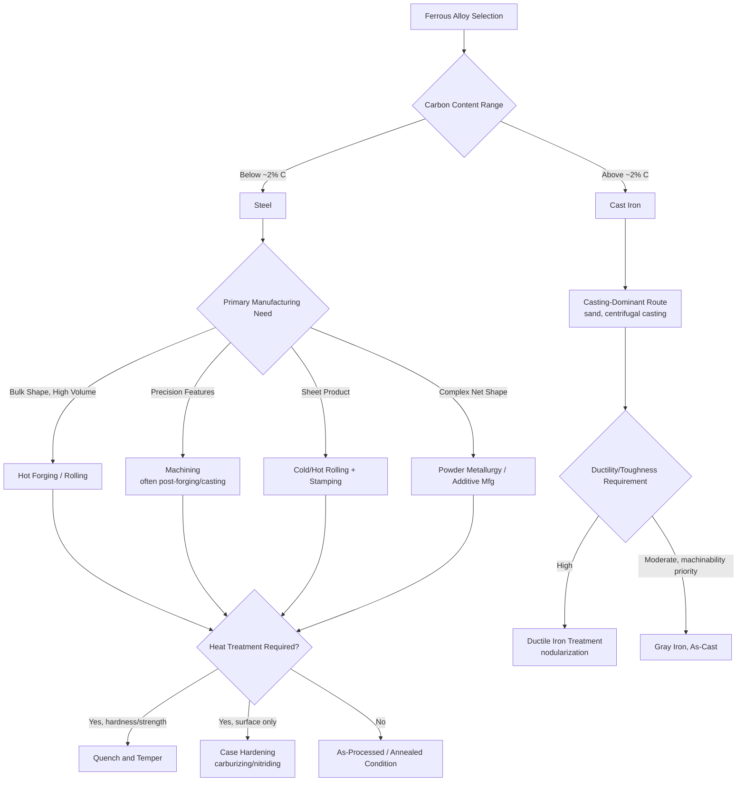

## Ferrous Metal Process Classification

### Definition and Scope

Ferrous metal process classification organizes manufacturing processes according to their applicability to iron-based (ferrous) alloys—primarily steels and cast irons, along with specialty ferrous alloys such as wrought iron and iron-based superalloys. Ferrous metals are defined by iron ($Fe$) as the primary constituent element, typically alloyed with carbon and other elements (manganese, chromium, nickel, molybdenum, silicon) to achieve specific mechanical, physical, and chemical properties.

This classification is material-system-centric rather than starting-material-state-centric: it groups processes by their suitability to the ferrous family's characteristic metallurgical behavior—principally the iron-carbon phase relationship, allotropic transformations (the ability of iron to exist in different crystal structures at different temperatures), and the resulting heat-treatability that distinguishes ferrous alloys from most non-ferrous metal systems.

### Key Points

- **The iron-carbon system governs nearly all ferrous processing decisions**: carbon content fundamentally determines whether an alloy is classified as steel (typically up to about 2.0–2.1% carbon) or cast iron (typically above roughly 2.0% carbon, commonly 2–4%), and carbon content strongly influences hardenability, weldability, machinability, and castability.
- **Allotropic transformation enables heat treatment**: iron's ability to transform between body-centered cubic (ferrite, stable at lower temperatures) and face-centered cubic (austenite, stable at higher temperatures) crystal structures allows a wide range of heat treatments (annealing, normalizing, quenching and tempering) to tailor properties—a capability largely unique to ferrous alloys among common structural metals and a primary reason ferrous processing is treated as a distinct classification.
- **Ferrous alloys span an exceptionally wide processing range**: from high-ductility, easily formed low-carbon steels to hard, brittle high-carbon and cast iron compositions, meaning process family suitability (casting, forging, machining, welding) varies dramatically within the ferrous category itself, more so than for many non-ferrous systems.
- **Ferrous metals dominate structural and high-volume manufacturing** due to relatively low cost, high strength-to-cost ratio, and mature, well-characterized processing technology, making ferrous process classification foundational to mechanical, civil, and manufacturing engineering practice.
- **Sub-classification by alloy family is typically layered on top of process-family classification**: within ferrous metals, further distinctions (plain carbon steel, alloy steel, stainless steel, tool steel, gray/ductile/white cast iron) each carry characteristic processing constraints and preferences that refine the general ferrous classification.

### Ferrous Alloy Sub-Classification

#### 1. Steels (Iron-Carbon Alloys, Carbon Generally Below ~2%)

- **Plain carbon steels**: classified by carbon content—low-carbon/mild steel (up to ~0.3% C, highly formable and weldable, limited hardenability), medium-carbon steel (~0.3–0.6% C, balance of strength and ductility, commonly heat-treated), high-carbon steel (~0.6–1.0%+ C, high hardness and wear resistance, reduced ductility and weldability)
- **Alloy steels**: plain carbon steel with deliberate additions (chromium, nickel, molybdenum, vanadium) to enhance hardenability, strength, toughness, or corrosion/wear resistance
- **Stainless steels**: chromium content generally at or above 10.5% forms a passive chromium oxide surface layer providing corrosion resistance; further sub-classified by microstructure—austenitic, ferritic, martensitic, duplex, and precipitation-hardening grades, each with distinct processing behavior (notably, austenitic grades are generally non-heat-treatable by quench-hardening but readily work-harden, while martensitic grades are quench-hardenable)
- **Tool steels**: high-carbon, often highly alloyed steels engineered for hardness, wear resistance, and dimensional stability in cutting tools, dies, and molds

#### 2. Cast Irons (Iron-Carbon Alloys, Carbon Generally Above ~2%)

- **Gray cast iron**: carbon present largely as graphite flakes, providing good machinability, vibration damping, and castability, but comparatively low tensile ductility
- **Ductile (nodular) cast iron**: graphite present as spheroidal nodules (achieved via magnesium or cerium treatment of the melt), providing substantially improved ductility and toughness relative to gray iron while retaining good castability
- **White cast iron**: carbon present as cementite (iron carbide) rather than graphite, producing very high hardness and wear resistance but extreme brittleness, primarily used where surface wear resistance dominates over toughness requirements
- **Malleable cast iron**: white cast iron subjected to a specific heat treatment converting cementite to graphite clusters (temper carbon), improving ductility relative to as-cast white iron

### Process Family Applicability by Category

#### 1. Casting Processes for Ferrous Metals

Ferrous casting is among the most technically demanding casting categories due to high melting temperatures (steel: approximately 1370–1540°C depending on composition; cast iron: approximately 1150–1250°C) and the associated challenges of mold material selection, gas evolution, and shrinkage control.

- **Sand casting**: the dominant process for ferrous castings across nearly all volumes, from single prototypes to moderate-high production, owing to sand's refractory capability (tolerating steel's high pouring temperatures) and relatively low cost
- **Investment casting**: applied to ferrous alloys (particularly stainless and tool steels) where complex geometry and good surface finish are required, though ceramic shell investment materials must accommodate the higher pouring temperatures relative to non-ferrous investment casting
- **Centrifugal casting**: widely used for ferrous pipe, cylinder liners, and rings, exploiting centrifugal force to achieve directional solidification and reduced porosity
- **Continuous casting**: the dominant process for producing semi-finished steel shapes (slabs, blooms, billets) at the primary steelmaking stage, feeding downstream rolling operations
- Ferrous die casting is comparatively rare relative to non-ferrous (aluminum, zinc) die casting, owing to the severe thermal demands steel's high melting point places on die materials; where practiced, it requires specialized refractory die materials and shorter die life. [Inference: ferrous die casting exists in specialized/niche applications but is not a mainstream production route compared to sand or investment casting for ferrous alloys.]

#### 2. Bulk Deformation Processes for Ferrous Metals

- **Hot forging**: extensively used for ferrous alloys, exploiting the substantial reduction in flow stress and increase in ductility above the recrystallization temperature (commonly performed in the austenite phase region, roughly 1000–1250°C for steels), producing components such as crankshafts, connecting rods, and gears with favorable grain flow
- **Rolling**: fundamental to ferrous processing at essentially all stages—hot rolling of continuously cast slabs/blooms into plate, sheet, and structural shapes, followed frequently by cold rolling for improved surface finish, dimensional precision, and strength via strain hardening
- **Extrusion**: less commonly applied to ferrous alloys than to non-ferrous metals (aluminum, copper) due to steel's high flow stress and the resulting demands on extrusion press capacity and die material (die materials must withstand extreme pressure and temperature); hot extrusion of steel does exist for specific tube and specialty shape applications but is comparatively less prevalent
- **Wire drawing**: extensively applied to steel, producing everything from fine spring wire to large structural cable wire, typically requiring intermediate annealing (patenting for high-carbon steel wire) between drawing passes to restore ductility

**Ferrous-specific consideration — hot working temperature range**: because ferrous alloys undergo allotropic transformation, hot forging and rolling are typically performed above the upper critical temperature (fully austenitic phase field) to maximize ductility and minimize flow stress, with careful attention to finishing temperature to control final grain size and avoid undesirable phase transformation effects during deformation.

#### 3. Machining Processes for Ferrous Metals

Ferrous alloys represent the most extensively characterized material system in machining technology, with well-developed machinability ratings, tool material selection guidance, and cutting parameter databases.

- Machinability varies dramatically across the ferrous family: low-carbon steels can exhibit gummy chip formation and built-up edge tendencies requiring specific tool geometries; high-carbon and alloy steels generally machine with more favorable chip formation but require higher cutting forces and greater tool wear resistance; free-machining steels (leaded, resulfurized grades) are specifically alloyed to improve machinability via controlled inclusion content
- Cast irons (particularly gray iron) are generally noted for favorable machinability due to graphite's lubricating/chip-breaking effect, despite their brittleness in tensile loading
- Hardened steels (post-heat-treatment) often require specialized approaches—hard turning with cubic boron nitride (CBN) tooling, or grinding—rather than conventional machining, due to high hardness exceeding the capability of standard high-speed steel or carbide tooling in some cases

#### 4. Heat Treatment Processes (A Ferrous-Metal-Central Category)

Heat treatment is disproportionately significant to ferrous metal processing relative to most other material systems, owing to the iron-carbon allotropic transformation enabling a uniquely wide range of achievable microstructures and properties from a single composition.

- **Annealing**: heating to the austenite region followed by slow cooling, softening the material, relieving internal stresses, and improving machinability/formability
- **Normalizing**: similar to annealing but with air cooling (faster than furnace cooling), producing a more refined, uniform grain structure
- **Quenching and tempering**: rapid cooling (quenching, typically in water, oil, or polymer solution) from the austenite region to form martensite (a hard, supersaturated, non-equilibrium phase), followed by tempering (reheating to an intermediate temperature) to reduce brittleness while retaining substantial hardness—the foundation of most structural and tool steel heat treatment
- **Case hardening (carburizing, nitriding, carbonitriding)**: gas-phase or solid-phase diffusion treatments producing a hard, wear-resistant surface layer over a tough core, as detailed under vapor/gas-phase starting-material processes
- **Austempering and martempering**: specialized quenching/holding treatments producing bainitic or stress-relieved martensitic microstructures with improved toughness relative to conventional quench-and-temper for certain applications

**Example (Quench-and-Temper Sequence for Medium-Carbon Steel):**

1. Component heated to the austenitizing temperature (typically 815–870°C for medium-carbon steel, above the upper critical temperature $A_3$)
2. Held at temperature to achieve a homogeneous austenite microstructure
3. Rapidly quenched (water, oil, or polymer quenchant selected based on required cooling rate and distortion/cracking risk) to transform austenite to martensite
4. Tempered by reheating to an intermediate temperature (commonly 150–650°C, selected based on desired hardness-toughness balance) and holding, then cooling
5. Resulting microstructure (tempered martensite) provides a controlled combination of strength, hardness, and toughness

[Inference: specific austenitizing and tempering temperatures are alloy-composition-dependent and should be confirmed against standard heat treatment references or datasheets for the specific steel grade.]

#### 5. Welding and Joining Processes for Ferrous Metals

Ferrous metals, particularly steels, are the most extensively welded material system, supported by mature process technology and standards (AWS, ASME).

- **Arc welding processes** (shielded metal arc, gas metal arc/MIG, gas tungsten arc/TIG, flux-cored arc, submerged arc) are all extensively applied to steel, with process selection driven by joint thickness, position, production volume, and required quality
- **Resistance welding** (spot, seam) is extensively used for sheet steel assembly, particularly in automotive body manufacturing
- **Weldability varies systematically with carbon and alloy content**: low-carbon steels generally exhibit excellent weldability; increasing carbon and alloy content increases hardenability, raising the risk of hard, brittle martensite formation in the heat-affected zone (HAZ) and associated cold cracking, often necessitating preheat, controlled interpass temperature, and post-weld heat treatment for medium/high-carbon and alloy steels
- **Carbon equivalent (CE) formulas** are commonly used to estimate weldability/preheat requirements from chemical composition, such as the widely referenced formula:

$$CE = C + \frac{Mn}{6} + \frac{Cr + Mo + V}{5} + \frac{Ni + Cu}{15}$$

where element symbols represent weight percent composition; higher CE values generally indicate increased hardenability and cracking risk, prompting greater preheat/control requirements. [Inference: multiple carbon equivalent formulas exist (IIW, Ito-Bessyo, and others) suited to different steel types and welding processes; the specific formula and threshold values should be selected based on the applicable welding code or standard.]

#### 6. Powder Metallurgy and Additive Manufacturing of Ferrous Alloys

- Iron and steel powders (atomized) are extensively used in conventional press-and-sinter powder metallurgy, producing high-volume structural components (gears, bushings, connecting rods) with good dimensional control and material efficiency
- Ferrous alloys (various steel grades, including tool steels and stainless steels) are well-established feedstocks for laser powder bed fusion and other metal additive manufacturing processes, supporting tooling inserts, complex brackets, and repair applications

### Process Applicability Summary Table

| Process Family | Applicability to Ferrous Metals | Key Ferrous-Specific Consideration |
| --- | --- | --- |
| Sand/Investment Casting | Excellent, dominant ferrous casting route | High pouring temperature demands refractory mold materials |
| Die Casting | Limited/niche | Extreme thermal demand on die materials at steel melting temperatures |
| Hot Forging | Excellent, widely used | Performed in austenite phase region for optimal ductility |
| Rolling | Excellent, foundational process | Hot rolling from continuous cast stock; cold rolling for finish/strength |
| Machining | Excellent, most-characterized material system | Machinability varies significantly with carbon/alloy content |
| Quench-and-Temper Heat Treatment | Central, largely unique capability | Enabled by iron's allotropic (austenite-martensite) transformation |
| Case Hardening | Excellent, widely used | Carburizing exploits carbon solubility difference in austenite vs. ferrite |
| Arc/Resistance Welding | Excellent, most-welded material system | Weldability decreases with increasing carbon equivalent |
| Powder Metallurgy | Excellent, high-volume established route | Iron/steel powder is among the most common PM feedstocks |

### Process Selection Flow Diagram

### Advantages and Limitations of the Ferrous Classification

**Advantages:**

- Ferrous alloys offer an exceptionally broad achievable property range from a relatively narrow cost band, owing to heat treatment flexibility unmatched by most non-ferrous systems
- Mature, extensively documented process technology across nearly every manufacturing category (casting, forming, machining, welding, powder metallurgy) reduces process development risk
- Strong standardization (SAE/AISI steel designations, ASTM specifications) supports reliable material selection and process parameter transfer across the industry

**Limitations:**

- Corrosion susceptibility (except in stainless/alloyed grades) requires additional protective processing (coating, plating, painting) not needed for some non-ferrous systems (aluminum, titanium, certain stainless grades)
- Relatively high density compared to aluminum, magnesium, and titanium alloys can be a limiting factor in weight-sensitive applications, despite favorable strength-to-cost ratio
- Weldability and machinability can vary substantially across the ferrous family, requiring careful alloy-specific process parameter selection rather than a single universal ferrous approach
- High melting temperatures (relative to most non-ferrous metals) increase energy consumption and tooling/refractory demands in casting and hot-working processes

### Related Topics

- Non-ferrous metal process classification (aluminum, copper, titanium, magnesium alloy systems)
- Iron-carbon phase diagram and its role in ferrous heat treatment design
- Steel designation systems (AISI/SAE, UNS) and alloy selection
- Cast iron microstructure control (graphite morphology and its property effects)
- Carbon equivalent formulas and weldability assessment
- Hardenability and Jominy end-quench testing
- Classification by solid bulk starting-material processes (forging, rolling applied to steel)
- Classification by liquid and molten starting-material processes (ferrous casting)
- Classification by vapor and gas-phase starting-material processes (carburizing, nitriding)
- Corrosion protection methods for ferrous components (galvanizing, plating, painting)